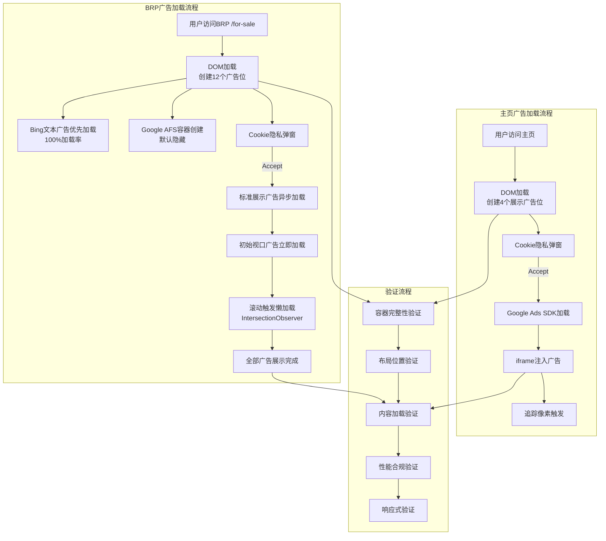
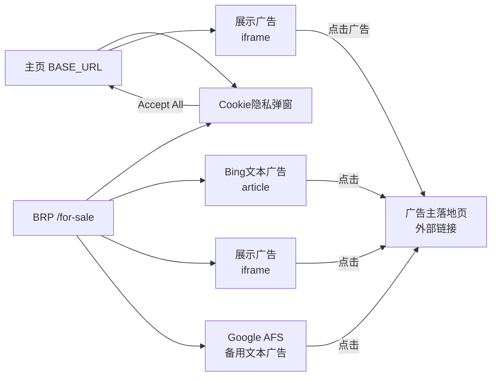
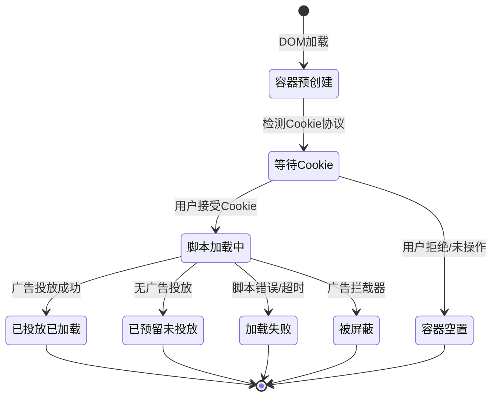

# 3PA广告业务域 - 业务全景

## 1. 业务定位
3PA（Third Party Ads）广告业务域是 Gumtree 平台的核心收入模块之一，通过在网站页面嵌入第三方展示广告实现广告变现。

**业务价值**：
- 为**平台**提供持续的广告收入来源，支撑网站运营
- 为**广告主**提供精准的广告投放渠道，触达 Gumtree 高质量用户群体
- 为**用户**在不影响核心浏览体验的前提下展示相关广告内容

**目标用户**：
- **网站访客/用户**：被动接收广告展示
- **广告系统（Google Ads 等）**：第三方广告 SDK，向页面广告位注入内容

## 2. 业务范围

### 2.1 功能覆盖

| 功能模块 | 说明 | 核心能力 |
|---------|------|---------|
| 广告位容器管理 | 页面预留广告位容器 | 主页 4 个 + BRP 12 个，唯一 ID，统一数据标记 |
| 广告内容加载 | 异步加载第三方广告 | iframe 注入、图片加载、不阻塞主内容 |
| Bing 搜索文本广告 | BRP 页面文本广告 | article 结构、100% 加载率、fallback 机制 |
| Google AFS 文本广告 | BRP 页面备用文本广告 | syndicatedsearch.goog、与 Bing 互斥 |
| 追踪与统计 | 广告曝光和行为追踪 | pixel 容器、1x1 透明图片 |
| 懒加载 | 滚动触发广告加载 | BRP 中间/底部广告按需加载（IntersectionObserver） |
| 响应式适配 | 不同设备的广告布局 | 桌面端/平板端/移动端自适应 |
| Cookie 合规 | 遵守隐私法规 | Cookie 接受后才加载展示广告 |
| 防御性设计 | 广告失败不影响核心体验 | 广告拦截器兼容、加载超时处理、fallback 备用 |

### 2.2 地域覆盖
- **UK 站**：https://www.gumtree.com/ （Production）
- **7 个环境**：prod / staging / zoidberg / bixi / gaga / unicorn / taro

### 2.3 用户角色

| 角色 | 权限 | 说明 |
|-----|------|------|
| 网站访客 | 浏览页面、接收广告展示 | 被动角色，无需登录 |
| 广告系统 | 向广告位注入内容 | Google Ads、Bing Ads、Google AFS、srvb1.com 等多平台 |
| 运维/QA | 验证广告位完整性和性能 | 多环境测试，自动化脚本 |

## 3. 业务流程全景图

## 4. 核心业务流程概览

### 4.1 主页广告位验证流程
**业务目标**：验证主页 4 个 3PA 广告位的容器完整性、内容加载、布局正确性和性能合规性。

**核心步骤**：
1. 访问主页，验证 4 个广告位容器全部存在（ad-slot class, data-display-ad 属性）
2. 验证所有容器 ID 唯一性
3. 验证顶部广告位布局（位置 top≈106px、全屏宽度、高度≈271px、可见性）
4. 验证右侧广告位、追踪像素、备用横幅状态
5. 接受 Cookie 隐私协议（广告加载前置条件）
6. 验证广告内容加载（iframe 存在性、尺寸符合 IAB 标准）
7. 验证广告交互性和尺寸合规
8. 验证性能（页面 <5s、广告 <10s、不阻塞主内容）
9. 验证控制台错误不影响核心功能
10. 验证响应式布局（桌面/平板/移动端）

**关键观测点**：
- ✅ 4 个广告位容器全部存在且属性正确
- ✅ 顶部广告位位于导航栏下方，全屏宽度，高度固定
- ✅ Cookie 接受后 iframe 成功加载（尺寸 970x250）
- ✅ 广告加载不阻塞主内容（搜索框、列表正常展示）
- ✅ 控制台错误为广告相关，不影响核心功能
- ⚠️ 右侧广告位当前未投放，待投放时段验证

**详细流程文档**：[主页广告位验证业务流程](./主页广告位验证业务流程.md)

### 4.2 BRP 页面广告位验证流程
**业务目标**：验证 BRP（浏览结果页）12 个广告位的容器完整性、Bing 文本广告加载、标准展示广告布局、Google AFS 备用机制、懒加载行为和性能合规性。

**核心步骤**：
1. 访问 BRP 页面（`/for-sale`），验证 9 个标准广告位容器全部存在
2. 验证所有容器属性（ad-slot class, data-display-ad, ID 唯一）
3. 验证右侧 4 个广告位垂直对齐（x=1166.5px, width=300px, 间距 24px）
4. 验证中间 2 个广告位水平对齐（x=390.5px, width=728px）
5. 验证 Bing 顶部搜索文本广告（728x180, article 结构, 100% 加载率）
6. 验证 Bing 底部搜索文本广告（728x400）和 fallback 机制
7. 验证 Google AFS 容器存在但隐藏（text-ads-slot, display:none）
8. 验证 AFS 与 Bing 互斥（不同时展示）
9. 接受 Cookie 后验证标准广告位内容加载
10. 验证 middle1 含 srvb1.com 第三方脚本
11. 模拟滚动验证懒加载行为（IntersectionObserver）
12. 统计所有广告位加载状态

**关键观测点**：
- ✅ 9 个标准广告位容器 + 2 个 Bing 广告位 + 1 个 AFS 广告位全部存在
- ✅ Bing 文本广告 100% 加载率，位于首个列表项之前
- ✅ AFS 与 Bing 互斥，默认隐藏
- ✅ 右侧 4 个广告位完美垂直对齐，中间 2 个水平对齐
- ✅ middle1 包含 srvb1.com 脚本
- ⚠️ 标准广告位当前大部分未投放，待投放时段验证
- ⚠️ AFS 激活条件待确认

**详细流程文档**：[BRP页面广告位验证业务流程](./BRP页面广告位验证业务流程.md)

---

## 5. 页面拓扑关系

### 5.1 页面入口矩阵

| 页面 | 入口1 | 入口2 | 广告位数 |
|-----|------|------|---------|
| 主页（含广告位） | 直接访问 URL | 导航栏点击 Logo | 4 个标准展示广告 |
| BRP 浏览结果页 | 导航到 /for-sale | 分类导航 | 9 标准 + 2 Bing + 1 AFS |
| Cookie 隐私弹窗 | 首次访问自动弹出 | - | - |

### 5.2 页面跳转流程图

### 5.3 页面关系详解

#### 主页 → Cookie 隐私弹窗
- **入口**：首次访问主页时自动弹出
- **目标**：获取用户 Cookie 使用同意
- **参数**：无
- **权限**：所有用户
- **流程**：弹窗覆盖在页面上方 → 点击 "Accept All" → 弹窗关闭 → 广告脚本开始加载

#### 主页广告位 → 广告主落地页
- **入口**：用户点击广告 iframe 内的内容
- **目标**：跳转至广告主外部页面
- **参数**：广告追踪参数（由 Google Ads 管理）
- **数据**：触发广告点击计费

#### BRP → Cookie 隐私弹窗
- **入口**：首次访问 BRP 页面时自动弹出
- **流程**：接受后标准展示广告开始加载（Bing 文本广告不受 Cookie 限制）

#### BRP 广告位 → 广告主落地页
- **入口**：用户点击 Bing 文本广告链接 / 展示广告 iframe / AFS 文本广告
- **目标**：跳转至广告主外部页面
- **数据**：触发广告点击计费（Google / Bing / AFS 各自追踪）

## 6. 业务数据流转

### 6.1 广告位状态流转

### 6.2 用户操作与数据变化

| 操作 | 数据变化 | 前台展示变化 | 涉及页面 |
|-----|---------|------------|---------|
| 访问主页 | DOM 创建 4 个广告位容器 | 页面展示，广告位预留空间 | 主页 |
| 访问 BRP | DOM 创建 12 个广告位容器 | 页面展示，列表+广告混排 | BRP |
| Bing 广告加载 | Bing 文本广告即时注入 | article 文本广告展示 | BRP |
| 接受 Cookie | Cookie 偏好设置写入 | 弹窗关闭，展示广告脚本开始加载 | 主页/BRP |
| 广告加载完成 | iframe 注入容器内 | 广告创意内容展示（图片/富媒体） | 主页/BRP |
| 滚动页面 | IntersectionObserver 触发 | 中间/底部广告位懒加载 | BRP |
| 广告曝光 | 追踪像素触发 | 无可视变化 | pixel-container |
| 切换视口 | 响应式样式生效 | 广告位布局调整/隐藏 | 主页/BRP |
| 广告被拦截 | 容器可能被移除 | 广告位消失，主内容不受影响 | 主页/BRP |

### 6.3 关键业务数据

#### 广告位容器信息

| 字段 | 类型 | 必填 | 说明 |
|-----|------|-----|------|
| container_id | String | 是 | 广告位容器唯一 ID（如 `top_takeover-container`） |
| inner_id | String | 是 | 内层注入目标 ID（如 `top_takeover`） |
| class | String | 是 | 固定值 `ad-slot` |
| data-display-ad | String | 是 | 固定值 `true` |
| position_x | Number | 是 | 容器 X 坐标 |
| position_y | Number | 是 | 容器 Y 坐标 |
| width | Number | 是 | 容器宽度（px） |
| height | Number | 是 | 容器高度（px） |

#### iframe 广告内容信息

| 字段 | 类型 | 必填 | 说明 |
|-----|------|-----|------|
| iframe_id | String | 否 | Google Ads iframe ID（如 `google_ads_iframe_/5144/desktop/home/top_0`） |
| iframe_name | String | 否 | 与 iframe_id 相同 |
| iframe_src | String | 否 | 可能为空字符串（动态加载特性） |
| iframe_width | Number | 否 | iframe 宽度（如 970px） |
| iframe_height | Number | 否 | iframe 高度（如 250px） |
| visible | Boolean | 否 | 是否可见 |

## 7. 关键业务规则索引

### 7.1 广告位结构相关
- [主页广告位规则.md - 广告位配置规则](../../业务规则库/3PA广告模块/主页广告位规则.md#31-广告位配置规则)
- [BRP页面广告位规则.md - BRP广告位配置规则](../../业务规则库/3PA广告模块/BRP页面广告位规则.md#31-brp-广告位配置规则)

### 7.2 尺寸与布局相关
- [主页广告位规则.md - 广告位尺寸规则](../../业务规则库/3PA广告模块/主页广告位规则.md#32-广告位尺寸规则)
- [BRP页面广告位规则.md - 广告位布局规则](../../业务规则库/3PA广告模块/BRP页面广告位规则.md#32-广告位布局规则)
- [主页广告位规则.md - 响应式布局规则](../../业务规则库/3PA广告模块/主页广告位规则.md#36-响应式布局规则)
- [主页广告位规则.md - IAB 标准广告尺寸参考](../../业务规则库/3PA广告模块/主页广告位规则.md#38-iab-标准广告尺寸参考)

### 7.3 加载与性能相关
- [主页广告位规则.md - Cookie 隐私前置规则](../../业务规则库/3PA广告模块/主页广告位规则.md#34-cookie-隐私前置规则)
- [主页广告位规则.md - 性能约束规则](../../业务规则库/3PA广告模块/主页广告位规则.md#35-性能约束规则)
- [BRP页面广告位规则.md - 懒加载规则](../../业务规则库/3PA广告模块/BRP页面广告位规则.md#35-懒加载规则)

### 7.4 Bing / Google AFS 相关
- [BRP页面广告位规则.md - Bing搜索文本广告规则](../../业务规则库/3PA广告模块/BRP页面广告位规则.md#33-bing-搜索文本广告规则)
- [BRP页面广告位规则.md - Google AFS文本广告规则](../../业务规则库/3PA广告模块/BRP页面广告位规则.md#34-google-afs-文本广告规则)

### 7.5 多环境相关
- [主页广告位规则.md - 多环境规则](../../业务规则库/3PA广告模块/主页广告位规则.md#37-多环境规则)

## 8. 业务FAQ

### Q1: 主页有几个广告位？
**A**: 4 个：顶部横幅（top_takeover）、右侧侧边栏（homeSideAd）、备用横幅（homeBanner）、追踪像素（pixel）。

### Q2: 为什么广告位容器存在但没有广告内容？
**A**: 这是"已预留未投放"状态。广告位容器在页面加载时即创建（预留机制），即使无广告投放也保持容器存在，尺寸为 0，不影响页面布局。

### Q3: 用户不接受 Cookie 协议会怎样？
**A**: 广告脚本不会加载，广告位容器存在但无内容。这是 GDPR/UK-GDPR 合规要求，用户必须同意 Cookie 使用后才能投放个性化广告。

### Q4: 广告加载失败会影响网站正常使用吗？
**A**: 不会。广告使用异步加载（async/defer），加载失败不阻塞主内容展示。搜索、浏览、导航等核心功能均不受影响。

### Q5: 控制台出现错误信息是否正常？
**A**: 正常。典型情况约 7 errors + 2 warnings，主要是广告脚本加载失败（ERR_FAILED）和第三方监控脚本错误（sentry.js），不影响页面核心功能。

### Q6: 如何判断广告位是否符合行业标准？
**A**: 对照 IAB 标准广告尺寸：顶部 970x250（Large Leaderboard）或 728x90（Leaderboard），右侧 300x250（Medium Rectangle）、300x600（Half Page）、336x280（Large Rectangle）。

### Q7: 测试环境和生产环境有什么区别？
**A**: Production 有实际广告投放，Staging 有测试广告，其他测试环境可能无广告。所有环境的广告位容器结构应保持一致。建议在 Staging 完成完整测试后再部署到 Production。

### Q8: 广告拦截器会影响什么？
**A**: 广告拦截器可能移除或隐藏广告位容器，但页面主内容正常展示，不出现大片空白，核心功能不受影响。

### Q9: 右侧广告位为什么经常是空的？
**A**: 右侧广告位（homeSideAd）的投放频率低于顶部广告位，受广告预算、时段、地域等因素影响。未投放时容器存在但尺寸为 0。

### Q10: 哪些用例可以自动化？
**A**: 大部分用例可自动化：容器存在性（TC-001/006/010）、布局验证（TC-002/003）、数据属性（TC-013/014）、内容加载（TC-021~026）、响应式（TC-017/018）。难以自动化的场景：广告内容审核、点击行为测试。

### Q11: BRP 页面有多少个广告位？
**A**: 12 个：9 个标准展示广告位（ad-slot）+ 2 个 Bing 搜索文本广告位 + 1 个 Google AFS 文本广告位（隐藏备用）。

### Q12: Bing 广告和 Google AFS 有什么关系？
**A**: 互斥关系。Bing 文本广告在 BRP 页面优先加载（100% 加载率），Google AFS 作为备用方案默认隐藏。当 Bing 加载失败或特定 A/B 测试条件下，AFS 可能激活。两者不会同时展示。

### Q13: BRP 页面为什么需要懒加载？
**A**: BRP 页面有 12 个广告位，如果全部同时加载会严重影响页面性能。采用 IntersectionObserver 实现懒加载，初始视口内广告立即加载，中间和底部广告在用户滚动到相应区域时才触发加载，减少不必要的网络请求。

### Q14: srvb1.com 脚本是什么？
**A**: srvb1.com 是一个第三方广告平台，其脚本嵌入在 BRP 页面的 middle1（integratedMpu）广告位中，具有唯一 UID 标识和 `data-moa-script="true"` 属性，用于投放嵌入式广告。

## 9. 业务指标（可选）

### 9.1 核心指标
- **广告填充率**：待补充（广告投放成功率）
- **广告加载成功率**：待补充
- **广告曝光量**：待补充

### 9.2 漏斗指标
- **广告展示漏斗**：页面加载 → Cookie 接受 → 广告脚本加载 → iframe 注入 → 广告展示 → 曝光追踪

## 10. 已知问题与风险

### 10.1 产品待确认问题
1. 右侧广告位（homeSideAd）投放策略和启用条件待确认
2. 备用横幅（homeBanner）启用条件和使用场景待确认
3. 移动端和平板端的广告位布局具体规则待产品确认
4. 广告拦截器场景下是否需要检测和提示用户
5. Google AFS 激活条件不明确（Bing 失败？A/B 测试？特定类别？）
6. BRP 标准广告位大部分未投放，实际投放时段和策略待运营确认
7. Bing 广告单元数量是否会根据时段/地域动态变化
8. `bing-text-ad-1` ID 在顶部和底部重复出现，选择器需注意

### 10.2 技术风险
- 广告投放依赖 Google Ads、Bing Ads、srvb1.com 等多个第三方服务，可能因外部故障影响投放
- Cookie 隐私法规变化（GDPR/UK-GDPR）可能影响广告加载机制
- 不同浏览器和设备的广告展示可能存在差异
- BRP 12 个广告位可能影响页面加载性能（已通过懒加载和异步加载缓解）
- Bing 和 AFS 切换逻辑复杂，测试覆盖困难

### 10.3 测试过程中发现的问题
- 主页：控制台存在 7 errors + 2 warnings（广告和第三方脚本错误），属于已知可接受问题
- 主页：右侧广告位在测试期间持续未投放，无法验证实际展示效果
- BRP：控制台存在 CORS 错误（nexx360.io）和 ERR_FAILED，不影响核心功能
- BRP：标准广告位大部分未投放（仅 middle1 有 srvb1.com 脚本），待投放时段验证

## 11. 变更历史

| 日期 | 版本 | 变更内容 | 变更人 |
|------|------|---------|--------|
| 2026-04-16 | v1.1 | 新增 BRP 页面广告位内容：12 个广告位、Bing/AFS 规则、懒加载流程 | AI Assistant |
| 2026-04-16 | v1.0 | 初始版本：基于 Gumtree-3PA-Homepage 26个测试用例生成业务全景文档 | AI Assistant |
