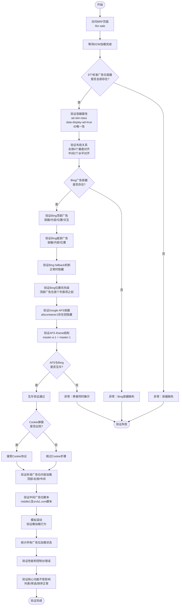

# BRP页面广告位验证业务流程

> **业务目标**：验证 Gumtree BRP（浏览结果页）12 个广告位的容器完整性、Bing 文本广告加载、标准展示广告布局、Google AFS 备用机制、懒加载行为和性能合规性，确保广告系统正常运行且不影响列表浏览核心体验。

---

## 1. 完整流程图

---

## 2. 详细步骤与观测点

### 步骤1：标准广告位容器完整性验证
**页面位置**：BRP 页面 DOM

**操作**：
1. 访问 `${BASE_URL}/for-sale`
2. 查询所有 `.ad-slot` 元素
3. 验证 9 个标准广告位容器全部存在

**观测点**：
- ✅ 9 个标准广告位容器全部存在于 DOM 中
- ✅ 所有容器包含 `ad-slot` class 和 `data-display-ad="true"` 属性
- ✅ 所有容器 ID 唯一，无重复
- ✅ 每个容器包含正确的子元素（内层 div 无 `-container` 后缀）
- ✅ middle1（integratedMpu）包含 srvb1.com 脚本标签和内层 div（2 个子元素）

**验证方法**：
- `document.querySelectorAll('.ad-slot[data-display-ad="true"]').length === 9`
- 逐一检查 9 个容器 ID

**关联规则**：[BRP页面广告位规则.md - BRP 广告位配置规则](../../业务规则库/3PA广告模块/BRP页面广告位规则.md#31-brp-广告位配置规则)

---

### 步骤2：广告位布局关系验证
**页面位置**：BRP 页面右侧区域 + 列表中间

**操作**：
1. 获取右侧 4 个广告位（rSkyT/T2/B/B2）的坐标
2. 获取中间 2 个广告位（integratedMpu/Listing）的坐标
3. 验证对齐关系和间距

**观测点**：
- ✅ 右侧 4 个广告位 X 坐标相同（≈1166.5px），完美垂直对齐
- ✅ rSkyT 与 rSkyT2 间距 24px；rSkyB 与 rSkyB2 间距 24px
- ✅ 右侧所有广告位宽度 300px
- ✅ 中间 2 个广告位 X 坐标相同（≈390.5px），水平对齐
- ✅ middle1 与 middle2 间距 ≈2052px
- ✅ 中间广告位宽度 728px

**验证方法**：
- 使用 `getBoundingClientRect()` 获取每个广告位精确坐标并对比

**关联规则**：[BRP页面广告位规则.md - 广告位布局规则](../../业务规则库/3PA广告模块/BRP页面广告位规则.md#32-广告位布局规则)

---

### 步骤3：Bing 顶部搜索广告验证
**页面位置**：列表顶部区域（y≈590px）

**操作**：
1. 检查 `bing-top-slot-wrapper` 容器存在性
2. 验证 Bing 顶部广告内容（article 文本广告单元）
3. 检查位置、尺寸和交互性

**观测点**：
- ✅ `bing-top-slot-wrapper` 存在，尺寸 728x180px
- ✅ 包含至少 1 个 `<article id="bing-text-ad-1">` 广告单元
- ✅ 广告单元包含标题（`<a>`）、描述文本、显示 URL、目标链接
- ✅ 广告单元可见（height > 0），当前 140px
- ✅ 位于首个列表项（y=794）之前约 204px，用户优先看到
- ✅ 每个广告单元包含 2+ 可点击链接

**验证方法**：
- 检查容器和 article 元素的 `getBoundingClientRect()`
- 统计链接数量

**关联规则**：[BRP页面广告位规则.md - Bing 搜索文本广告规则](../../业务规则库/3PA广告模块/BRP页面广告位规则.md#33-bing-搜索文本广告规则)

---

### 步骤4：Bing 底部搜索广告验证
**页面位置**：列表底部区域（y≈7564px）

**操作**：
1. 滚动到页面底部
2. 检查 `bing-bottom-slot-wrapper` 容器
3. 验证内容和 fallback 状态

**观测点**：
- ✅ `bing-bottom-slot-wrapper` 存在，尺寸 728x400px
- ✅ 包含至少 1 个文本广告单元，已正常展示
- ✅ `bing-top-fallback` 和 `bing-bottom-fallback` 存在但隐藏（height=0）
- ✅ Bing 广告整体统计：2 个广告位、2 个广告单元、加载率 100%

**验证方法**：
- 检查 fallback 元素的 visible 和 height 属性

**关联规则**：[BRP页面广告位规则.md - Bing 搜索文本广告规则](../../业务规则库/3PA广告模块/BRP页面广告位规则.md#33-bing-搜索文本广告规则)

---

### 步骤5：Google AFS 文本广告验证
**页面位置**：DOM 中（隐藏状态）

**操作**：
1. 检查 `afscontainer1` 容器存在性
2. 验证容器类名为 `text-ads-slot`
3. 检查 iframe 结构（master-a-1 + master-1）
4. 验证与 Bing 广告的互斥性

**观测点**：
- ✅ `afscontainer1` 存在，class 为 `text-ads-slot`
- ✅ 默认状态 `display: none`（隐藏）
- ✅ 包含 2 个 iframe：`master-a-1` 和 `master-1`
- ✅ iframe src 指向 `syndicatedsearch.goog/afs/ads`
- ✅ 与 Bing 广告互斥：Bing 展示时 AFS 隐藏，`bothVisible === false`
- ⚠️ 激活条件待确认（可能：Bing 失败/A/B 测试/特定类别）

**验证方法**：
- 同时检查 `bingAdsVisible` 和 `afsVisible` 状态

**关联规则**：[BRP页面广告位规则.md - Google AFS 文本广告规则](../../业务规则库/3PA广告模块/BRP页面广告位规则.md#34-google-afs-文本广告规则)

---

### 步骤6：标准广告位内容加载验证
**页面位置**：各标准广告位

**操作**：
1. 接受 Cookie 隐私协议（如有弹窗）
2. 等待 3-5 秒让广告加载
3. 依次检查 7 个主要标准广告位的内容（iframe/script/img）
4. 验证 middle1 的 srvb1.com 脚本标签

**观测点**：
- ✅ middle1（integratedMpu）包含 srvb1.com 脚本（`data-moa-script="true"`）
- ⚠️ 其他标准广告位当前未投放（高度为 0），待投放时段验证
- ✅ 有内容的广告位：iframe 尺寸符合 IAB 标准，不超出容器范围
- ✅ 最小尺寸验证：width > 100px, height > 50px

**验证方法**：
- 检查每个容器的 innerHTML 长度、iframe/script/img 子元素

**关联规则**：[BRP页面广告位规则.md - 第三方广告脚本规则](../../业务规则库/3PA广告模块/BRP页面广告位规则.md#36-第三方广告脚本规则)

---

### 步骤7：懒加载行为验证
**页面位置**：全页面滚动

**操作**：
1. 初始视口（不滚动）：记录已加载广告位
2. 滚动到页面中间（y≈3000）：等待 2 秒，检查 middle 广告位
3. 滚动到页面底部：等待 2 秒，检查底部广告位

**观测点**：
- ⚠️ 初始视口：tBanner/rSkyT/rSkyT2/Bing 顶部应立即加载
- ⚠️ 滚动到中间：integratedMpu/integratedListing 开始加载（IntersectionObserver）
- ⚠️ 滚动到底部：rSkyB/rSkyB2/Bing 底部区域加载
- ✅ 确保用户看到的区域广告已加载

**验证方法**：
- `window.scrollTo(0, 3000)` + `waitForTimeout(2000)` 模拟滚动

**关联规则**：[BRP页面广告位规则.md - 懒加载规则](../../业务规则库/3PA广告模块/BRP页面广告位规则.md#35-懒加载规则)

---

### 步骤8：广告位加载状态统计
**页面位置**：全页面

**操作**：
1. 滚动整个页面（从顶到底）
2. 等待 10-15 秒让所有广告有机会加载
3. 统计 9 个标准广告位 + 2 个 Bing 广告位的加载状态

**观测点**：
- ✅ 标准广告位总数：9 个
- ✅ Bing 广告位：2 个，加载率 100%
- ✅ middle1 有脚本内容（srvb1.com）
- ⚠️ 标准广告位实际加载率受投放策略影响，当前约 0%
- ✅ 统计数据可用于监控广告系统健康度

**验证方法**：
- 遍历所有广告位，检查 exists/hasContent/hasIframe/hasScript/height/width

**关联规则**：[BRP页面广告位规则.md - BRP 页面特有业务约束](../../业务规则库/3PA广告模块/BRP页面广告位规则.md#37-brp-页面特有业务约束)

---

### 步骤9：性能与控制台验证
**页面位置**：浏览器控制台

**操作**：
1. 检查控制台错误信息
2. 验证核心功能不受影响

**观测点**：
- ✅ 控制台可能存在 CORS 错误（nexx360.io）、ERR_FAILED 等
- ✅ 约 7 errors + 2 warnings，属于正常现象
- ✅ 列表展示正常，筛选/排序功能不受影响
- ✅ 广告加载不阻塞列表内容展示

**验证方法**：
- 检查页面核心元素可见性和交互性

**关联规则**：[主页广告位规则.md - 性能约束规则](../../业务规则库/3PA广告模块/主页广告位规则.md#35-性能约束规则)

---

### 步骤10：响应式布局验证
**页面位置**：不同视口尺寸

**操作**：
1. 移动端（375x667）：检查广告位布局
2. 平板端（768x1024）：检查广告位布局

**观测点**：
- ⚠️ 移动端：顶部横幅可能调整为 320x50 或隐藏；右侧广告位全部隐藏或移至底部
- ⚠️ 平板端：顶部横幅尺寸适配；右侧广告位可能隐藏
- ✅ 各视口下核心功能（列表、筛选、排序）正常

**验证方法**：
- Playwright 设置不同视口尺寸

**关联规则**：[主页广告位规则.md - 响应式布局规则](../../业务规则库/3PA广告模块/主页广告位规则.md#36-响应式布局规则)

---

## 3. 流程完整性验证清单

- [ ] 9 个标准广告位容器全部存在于 DOM
- [ ] 所有标准容器包含 `ad-slot` class 和 `data-display-ad="true"`
- [ ] 所有容器 ID 唯一，无重复
- [ ] 右侧 4 个广告位完美垂直对齐（x=1166.5px, width=300px, 间距 24px）
- [ ] 中间 2 个广告位水平对齐（x=390.5px, width=728px）
- [ ] `bing-top-slot-wrapper` 存在且内容已加载（728x180px）
- [ ] Bing 顶部广告包含至少 1 个 article 文本广告单元
- [ ] Bing 顶部广告位于首个列表项之前
- [ ] `bing-bottom-slot-wrapper` 存在且内容已加载（728x400px）
- [ ] Bing fallback 元素存在但隐藏
- [ ] Bing 广告加载率 100%
- [ ] `afscontainer1` 存在，class 为 `text-ads-slot`，默认隐藏
- [ ] AFS 包含 master-a-1 和 master-1 两个 iframe
- [ ] AFS 与 Bing 互斥（不同时展示）
- [ ] middle1（integratedMpu）包含 srvb1.com 脚本标签
- [ ] Cookie 接受后标准广告脚本开始加载
- [ ] 初始视口内广告立即加载
- [ ] 滚动后中间和底部广告触发懒加载
- [ ] 控制台错误不影响核心功能（列表/筛选/排序）
- [ ] 广告加载不阻塞列表内容展示

---

## 4. 关联文档

- [3PA广告业务全景](./3PA广告业务全景.md)
- [BRP页面广告位规则.md](../../业务规则库/3PA广告模块/BRP页面广告位规则.md)
- [主页广告位规则.md](../../业务规则库/3PA广告模块/主页广告位规则.md)
- [主页广告位验证业务流程](./主页广告位验证业务流程.md)

---

## 5. 变更历史

| 日期 | 版本 | 变更内容 | 变更人 |
|------|------|---------|--------|
| 2026-04-16 | v1.0 | 初始版本：基于 BRP 3PA 52 个测试用例生成业务流程文档 | AI Assistant |
