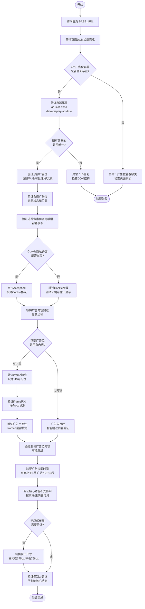

# 主页广告位验证业务流程

> **业务目标**：验证 Gumtree 主页 4 个第三方广告位（3PA）的容器完整性、内容加载、布局正确性和性能合规性，确保广告系统正常运行且不影响核心用户体验。

---

## 1. 完整流程图

---

## 2. 详细步骤与观测点

### 步骤1：广告位容器完整性验证
**页面位置**：主页 DOM

**操作**：
1. 访问 `${BASE_URL}`（根据环境配置选择域名）
2. 等待页面 DOM 加载完成
3. 查询所有 class 包含 `ad-slot` 的元素
4. 逐一检查 4 个广告位容器的存在性

**观测点**：
- ✅ DOM 中存在 `top_takeover-container` 元素
- ✅ DOM 中存在 `homeSideAd-container` 元素
- ✅ DOM 中存在 `homeBanner-container` 元素
- ✅ DOM 中存在 `pixel-container` 元素
- ✅ 共 4 个广告位容器，数量正确
- ✅ 所有容器包含 `ad-slot` class
- ✅ 所有容器包含 `data-display-ad="true"` 属性
- ✅ 所有容器 ID 唯一，无重复
- ❌ 容器缺失时检查页面模板和部署版本

**验证方法**：
- `document.querySelectorAll('.ad-slot[data-display-ad="true"]').length === 4`
- 检查每个容器 ID 的唯一性

**关联规则**：[主页广告位规则.md - 广告位配置规则](../../业务规则库/3PA广告模块/主页广告位规则.md#31-广告位配置规则)

---

### 步骤2：顶部广告位布局验证
**页面位置**：主页顶部，导航栏下方

**操作**：
1. 获取 `top_takeover-container` 的 `getBoundingClientRect()` 信息
2. 检查位置坐标（top、left、width、height）
3. 检查 CSS display 和 visibility 属性
4. 检查子元素结构

**观测点**：
- ✅ top 坐标约为 106px（导航栏下方）
- ✅ left 坐标为 0（左对齐）
- ✅ width 约为视口宽度（全屏宽度，如 1523px）
- ✅ height 为 271px（固定高度）
- ✅ display 不为 `none`，visibility 不为 `hidden`
- ✅ 广告位在初始视口内可见（不需滚动）
- ✅ 包含一个子 div，ID 为 `top_takeover`（无 `-container` 后缀）
- ✅ 容器结构：`

`

**验证方法**：
- 使用 `getBoundingClientRect()` 获取精确坐标
- 检查 CSS 计算样式

**关联规则**：[主页广告位规则.md - 广告位尺寸规则](../../业务规则库/3PA广告模块/主页广告位规则.md#32-广告位尺寸规则)

---

### 步骤3：右侧和其他广告位验证
**页面位置**：主页右侧区域 / 页面内嵌

**操作**：
1. 获取 `homeSideAd-container` 的位置和尺寸信息
2. 获取 `pixel-container` 的尺寸信息
3. 获取 `homeBanner-container` 的状态

**观测点**：
- ✅ 右侧广告位位置约 x=1120px, y=393px（主内容区右侧）
- ✅ 右侧广告位未投放时：容器存在，尺寸为 0，display 不为 none
- ✅ 右侧广告位子元素：`

`
- ✅ 追踪像素高度为 0，宽度 1350px，不占用可视空间
- ✅ 追踪像素子元素：`

`
- ✅ 备用横幅当前未使用，尺寸为 0
- ⚠️ 右侧广告位投放时：尺寸应为 300x250 / 300x600 / 336x280（待投放时验证）

**验证方法**：
- 检查每个容器的 `getBoundingClientRect()` 信息
- 检查 `innerHTML` 结构

**关联规则**：[主页广告位规则.md - 广告位状态枚举规则](../../业务规则库/3PA广告模块/主页广告位规则.md#33-广告位状态枚举规则)

---

### 步骤4：接受 Cookie 隐私协议
**页面位置**：Cookie 隐私弹窗

**操作**：
1. 检测 Cookie 隐私弹窗是否出现
2. 如果出现，点击 "Accept All" 按钮
3. 等待弹窗关闭

**观测点**：
- ✅ Production 和 Staging 环境弹窗出现
- ✅ 点击 "Accept All" 后弹窗关闭
- ⚠️ 测试环境（zoidberg, bixi 等）可能不显示弹窗
- ✅ 接受 Cookie 后广告脚本开始加载

**验证方法**：
- 检测弹窗元素可见性
- 点击后确认弹窗消失

**关联规则**：[主页广告位规则.md - Cookie 隐私前置规则](../../业务规则库/3PA广告模块/主页广告位规则.md#34-cookie-隐私前置规则)

---

### 步骤5：广告内容加载验证
**页面位置**：顶部广告位内部

**操作**：
1. 等待广告内容加载（最多 10 秒）
2. 检查 `top_takeover` 内是否有 iframe 或图片
3. 获取 iframe 详细信息（src、尺寸、ID、name、可见性）
4. 如果无内容（未投放），用例智能跳过

**观测点**：
- ✅ 广告位内包含至少 1 个 iframe
- ✅ iframe 尺寸 > 0（如 970x250px）
- ✅ iframe 处于可见状态（visible: true）
- ✅ iframe ID 格式如 `google_ads_iframe_/5144/desktop/home/top_0`
- ✅ iframe src 可能为空字符串（Google Ads 动态加载特性）
- ⚠️ 广告未投放时：用例自动跳过（pytest.skip）
- ❌ iframe 存在但尺寸为 0 时为异常状态

**验证方法**：
- `document.getElementById('top_takeover').querySelectorAll('iframe, img')`
- 获取 iframe 的 `getBoundingClientRect()`

**关联规则**：[主页广告位规则.md - IAB 标准广告尺寸参考](../../业务规则库/3PA广告模块/主页广告位规则.md#38-iab-标准广告尺寸参考)

---

### 步骤6：广告尺寸与交互性验证
**页面位置**：顶部广告位 iframe 内

**操作**：
1. 获取容器尺寸和 iframe 尺寸，对比验证
2. 检查 iframe 尺寸是否符合 IAB 标准
3. 检查广告位内的可交互元素（iframe、a、button、[onclick]）

**观测点**：
- ✅ iframe 尺寸接近容器尺寸（允许 ±10px 误差）
- ✅ iframe 内容不超出容器范围：`iframe_width <= container_width + 10`
- ✅ 最小尺寸：width > 100px, height > 50px
- ✅ 符合 IAB 标准尺寸（970x250 / 728x90 等）
- ✅ 广告是可交互的（iframe 本身即可交互）
- ⚠️ 不实际点击广告（避免触发计费）

**验证方法**：
- 对比容器和 iframe 的 `getBoundingClientRect()` 数据
- 检查可交互元素数量

**关联规则**：[主页广告位规则.md - 广告位尺寸规则](../../业务规则库/3PA广告模块/主页广告位规则.md#32-广告位尺寸规则)

---

### 步骤7：性能与控制台验证
**页面位置**：浏览器性能监控 / 控制台

**操作**：
1. 记录页面加载时间（含 Cookie 操作）
2. 记录广告加载完成时间
3. 验证核心功能可用性（搜索框、主内容可见）
4. 检查控制台错误信息

**观测点**：
- ✅ 页面加载时间 < 5 秒
- ✅ 广告加载时间 < 10 秒
- ✅ 广告加载不阻塞主内容显示
- ✅ 即使广告加载失败/超时，搜索框和主内容仍可见
- ✅ 控制台可能存在广告相关错误（ERR_FAILED、sentry.js TypeError）
- ✅ 控制台错误不影响页面核心功能
- ⚠️ 典型错误：约 7 errors + 2 warnings，属于正常现象

**验证方法**：
- 使用 Python `time` 模块记录加载时间
- 检查页面核心元素可见性

**关联规则**：[主页广告位规则.md - 性能约束规则](../../业务规则库/3PA广告模块/主页广告位规则.md#35-性能约束规则)

---

### 步骤8：响应式布局验证
**页面位置**：不同视口尺寸下的主页

**操作**：
1. 设置视口为移动端尺寸（375x667，iPhone SE）
2. 访问主页，检查广告位展示状态
3. 设置视口为平板尺寸（768x1024，iPad）
4. 访问主页，检查广告位布局

**观测点**：
- ⚠️ 移动端（375px）：顶部广告位可能调整尺寸或隐藏
- ⚠️ 移动端（375px）：右侧广告位隐藏或移至底部
- ⚠️ 平板端（768px）：顶部广告位展示，尺寸适配
- ⚠️ 平板端（768px）：右侧广告位可能隐藏或调整位置
- ✅ 各视口下页面布局保持良好可用性
- ❌ 不出现大片空白区域或布局错位

**验证方法**：
- 使用 Playwright 设置不同视口尺寸
- 检查各广告位在不同视口下的可见性和位置

**关联规则**：[主页广告位规则.md - 响应式布局规则](../../业务规则库/3PA广告模块/主页广告位规则.md#36-响应式布局规则)

---

## 3. 流程完整性验证清单

- [ ] 4 个广告位容器全部存在于 DOM 中
- [ ] 所有容器包含 `ad-slot` class
- [ ] 所有容器包含 `data-display-ad="true"` 属性
- [ ] 所有容器 ID 唯一，无重复
- [ ] 顶部广告位位置正确（top≈106, left=0）
- [ ] 顶部广告位尺寸正确（全屏宽度，高度≈271px）
- [ ] 顶部广告位可见（display 非 none，visibility 非 hidden）
- [ ] 顶部广告位子元素结构正确（内含 `top_takeover` div）
- [ ] 右侧广告位容器存在，位置在页面右侧（x≈1120px）
- [ ] 追踪像素容器高度为 0，不占用可视空间
- [ ] Cookie 隐私协议接受后广告脚本加载
- [ ] 顶部广告位 iframe 加载成功（有投放时）
- [ ] iframe 尺寸符合 IAB 标准（970x250 等）
- [ ] iframe 内容不超出容器范围
- [ ] 广告包含可交互元素或 iframe
- [ ] 页面加载时间 < 5 秒
- [ ] 广告加载时间 < 10 秒
- [ ] 广告加载不阻塞主内容展示
- [ ] 控制台错误不影响核心功能
- [ ] 移动端/平板端布局适配正常

---

## 4. 关联文档

- [3PA广告业务全景](./3PA广告业务全景.md)
- [主页广告位规则.md](../../业务规则库/3PA广告模块/主页广告位规则.md)

---

## 5. 变更历史

| 日期 | 版本 | 变更内容 | 变更人 |
|------|------|---------|--------|
| 2026-04-16 | v1.0 | 初始版本：基于 Gumtree-3PA-Homepage 26个测试用例生成业务流程文档 | AI Assistant |
