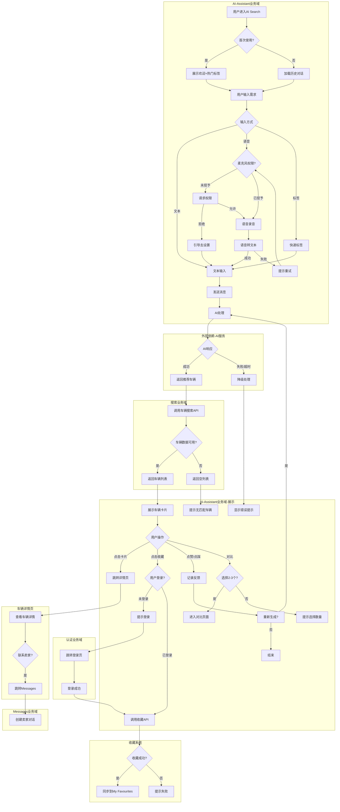
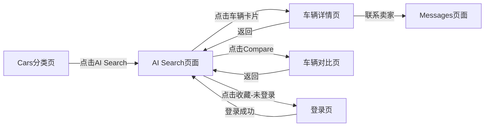
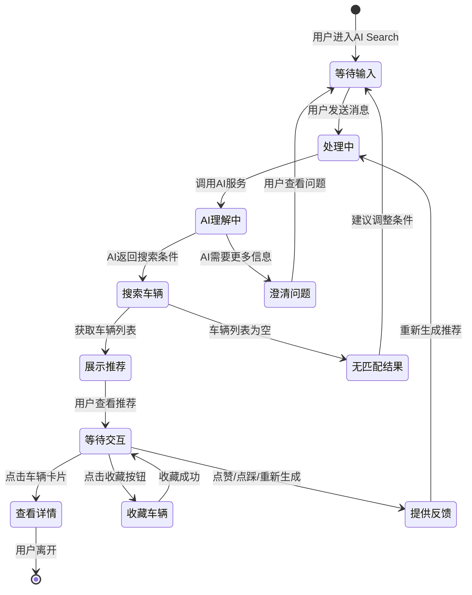

# AI-Assistant业务全景

## 1. 业务定位

### 业务价值
- **降低搜索门槛**: 通过AI对话替代复杂的筛选器,用户无需了解汽车专业术语
- **提升搜索效率**: AI理解用户意图并推荐精准车源,减少用户筛选时间50%以上
- **增强用户体验**: 对话式交互更符合现代用户习惯,提升用户满意度
- **提高转化率**: 精准推荐提升用户找到心仪车辆的概率,预期提升成交转化率15-20%

### 目标用户
- **首次购车者** (40%): 不了解汽车参数,需要AI指导和推荐
- **忙碌用户** (35%): 时间有限,希望快速找到符合需求的车辆
- **对话偏好用户** (15%): 更喜欢聊天式交互而非表单填写
- **其他用户** (10%): 专业买家、价格敏感用户等

---

## 2. 业务范围

### 功能覆盖
- **AI对话搜索**: 支持文本和语音输入,AI理解用户意图并推荐车辆
- **快速标签搜索**: 预设热门搜索条件(价格、里程、燃料类型等)
- **车辆推荐展示**: 横向滑动查看3-10个推荐车辆,支持点击详情、收藏
- **反馈机制**: 点赞/点踩/重新生成,优化后续推荐
- **引导性提问**: AI主动推荐3个可能感兴趣的问题
- **车辆对比**: 选择2-3个车辆进行详细对比

### 地域覆盖
- **当前阶段**: 仅UK市场(Gumtree UK)
- **未来扩展**: 计划扩展到AU、ZA等市场

### 用户角色
- **登录用户**: 完整功能,历史对话持久化,收藏同步
- **游客用户**: 可使用AI搜索,但历史对话不持久化,收藏需先登录

---

## 3. 业务流程全景图

> **要求**：全景图必须**详细展示跨域交互与依赖的逻辑分支**

---

## 4. 核心业务流程概览

### 4.1 AI对话搜索流程

**业务目标**: 通过自然语言对话帮助用户快速找到符合需求的二手车

**核心步骤**:
1. 用户进入AI Search页面 → 展示欢迎消息/历史对话
2. 用户输入搜索需求(文本/语音/标签) → 发送消息
3. AI处理请求 → 理解用户意图 → 生成搜索条件
4. 调用搜索业务域API → 获取匹配车辆列表
5. 展示车辆卡片 → 用户查看/交互

**关键观测点**:
- ✅ AI响应时间P95≤3秒
- ✅ 推荐车辆数量3-10个
- ✅ 车辆数据完整性(标题、价格、图片)
- ❌ AI理解错误率<5%

**详细流程文档**: [AI对话搜索业务流程](./AI对话搜索业务流程.md)

---

### 4.2 车辆推荐展示流程

**业务目标**: 以卡片形式展示推荐车辆,支持快速浏览和交互

**核心步骤**:
1. 接收AI推荐的车辆列表 → 渲染车辆卡片
2. 用户横向滑动查看更多车辆
3. 用户点击卡片 → 跳转详情页
4. 用户点击收藏 → 收藏车辆(需登录)
5. 用户选择对比 → 进入对比页面(2-3个车辆)

**关键观测点**:
- ✅ 卡片加载时间≤2秒
- ✅ 横向滑动流畅无卡顿
- ✅ 收藏同步到My Favourites
- ❌ 点击跳转失败

**详细流程文档**: [车辆推荐展示业务流程](./车辆推荐展示业务流程.md)

---

### 4.3 反馈循环流程

**业务目标**: 收集用户反馈,优化AI推荐质量

**核心步骤**:
1. 用户查看推荐车辆 → 提供反馈(点赞/点踩/重新生成)
2. 点赞 → 静默记录,优化用户画像
3. 点踩 → 询问原因 → 立即重新生成推荐
4. 重新生成 → 基于反馈调整搜索条件 → 返回新推荐

**关键观测点**:
- ✅ 反馈数据成功上报
- ✅ 重新生成响应时间≤3秒
- ✅ 点踩后推荐质量改善
- ❌ 反馈上报失败

**详细流程文档**: 包含在[AI对话搜索业务流程](./AI对话搜索业务流程.md)中

---

## 5. 页面拓扑关系

### 5.1 页面入口矩阵

| 页面 | 入口1 | 入口2 | 入口3 |
|------|-------|-------|-------|
| AI Search页面 | Cars分类页 → "AI Search"入口 | 首页搜索框 → "试试AI搜索"(可选) | 车辆列表页 → "AI帮你找车"(可选) |
| 车辆详情页 | AI Search页面 → 点击车辆卡片 | - | - |
| 车辆对比页 | AI Search页面 → Compare功能 → 选择2-3个车辆 | - | - |
| Messages页面 | 车辆详情页 → "联系卖家" | - | - |
| 登录页 | AI Search页面 → 点击收藏(未登录) | - | - |

### 5.2 页面跳转流程图

### 5.3 页面关系详解

#### Cars分类页 → AI Search页面
- **入口**: Cars分类页顶部或底部"AI Search"按钮
- **目标**: 引导用户尝试AI搜索功能
- **参数**: 无,直接进入AI Search主页

#### AI Search页面 → 车辆详情页
- **入口**: 点击推荐的车辆卡片
- **目标**: 查看车辆完整信息
- **参数**: vehicle_id (车辆唯一标识)
- **示例URL**: `/cars/vehicle/12345`

#### AI Search页面 → 车辆对比页
- **入口**: 点击"Compare vehicles"按钮 → 选择2-3个车辆 → 点击"对比"
- **目标**: 并排对比多个车辆的参数
- **参数**: vehicle_ids (车辆ID数组,逗号分隔)
- **示例URL**: `/cars/compare?ids=12345,67890,11111`

#### AI Search页面 → 登录页(未登录用户收藏)
- **入口**: 点击车辆卡片的收藏按钮(用户未登录)
- **目标**: 引导用户登录以使用收藏功能
- **参数**: redirect_url (登录成功后返回AI Search页面)
- **示例URL**: `/login?redirect=/ai-search`

---

## 6. 业务数据流转

### 6.1 状态流转图

### 6.2 用户操作与数据变化

| 操作 | 数据变化 | 前台展示变化 | 涉及页面 |
|------|---------|-------------|---------|
| 用户发送消息 | 新增conversation_message记录 | 对话区域新增消息气泡 | AI Search页面 |
| AI返回推荐 | 新增ai_response记录,关联推荐车辆列表 | 展示车辆卡片列表 | AI Search页面 |
| 用户点赞 | 新增feedback记录(type=thumbs_up) | 点赞按钮高亮 | AI Search页面 |
| 用户点踩 | 新增feedback记录(type=thumbs_down,含原因) | 点踩按钮高亮,弹窗询问原因 | AI Search页面 |
| 用户收藏车辆 | 新增favourite记录,关联user_id和vehicle_id | 收藏按钮变为红色实心 | AI Search页面 |
| 用户取消收藏 | 删除favourite记录 | 收藏按钮变为灰色空心 | AI Search页面 |
| 用户选择对比 | 临时存储selected_vehicles数组(前端) | 车辆卡片显示勾选框 | AI Search页面 |
| 用户点击车辆卡片 | 无数据变化 | 跳转到车辆详情页 | 详情页 |

### 6.3 关键业务数据

| 字段 | 类型 | 必填 | 说明 |
|------|------|------|------|
| session_id | UUID | ✅ | 会话唯一标识,关联历史对话 |
| user_id | String | ❌ | 登录用户ID,游客为空 |
| guest_id | String | ❌ | 游客设备指纹 |
| message_text | String | ✅ | 用户输入的消息文本(1-500字符) |
| ai_response_text | String | ✅ | AI回复的文本内容 |
| recommended_vehicles | Array | ❌ | 推荐的车辆ID列表(3-10个) |
| feedback_type | Enum | ❌ | 反馈类型(thumbs_up/thumbs_down/regenerate) |
| feedback_reason | String | ❌ | 点踩原因(仅点踩时必填) |
| vehicle_id | String | ✅ | 车辆唯一标识 |
| vehicle_title | String | ✅ | 车辆标题(如"2015 Volkswagen Golf") |
| vehicle_price | Number | ✅ | 车辆价格(英镑) |
| vehicle_year | Number | ✅ | 车辆年份 |
| vehicle_mileage | Number | ✅ | 车辆里程(英里) |
| vehicle_image_url | String | ✅ | 车辆主图URL |
| is_promoted | Boolean | ✅ | 是否为推广车辆 |

---

## 7. 关键业务规则索引

详细业务规则请查看: [二手车AI搜索助手规则](../../业务规则库/AI-Assistant模块/二手车AI搜索助手规则.md)

**核心规则摘要**:
- **输入规则**: 文本≤500字符,语音≤60秒,标签≤10个
- **响应时间**: AI响应P95≤3秒,图片加载P95≤2秒
- **推荐数量**: 3-10个车辆
- **对比限制**: 2-3个车辆
- **权限规则**: 麦克风权限,登录用户vs游客功能差异
- **数据保留**: 历史对话保留30天

---

## 8. 业务FAQ

### Q1: 游客用户可以使用AI搜索吗?
**A**: 可以。游客用户可以使用完整的AI搜索功能,但历史对话不会持久化。收藏车辆需要先登录。

### Q2: AI推荐的车辆数量为什么限制在3-10个?
**A**: 基于用户体验考虑:
- 少于3个: 用户选择不足,可能无法满足需求
- 多于10个: 信息过载,用户难以决策

### Q3: 语音输入时长为什么限制在60秒?
**A**: 基于实际使用场景分析:
- 大部分用户在30秒内可以描述完需求
- 60秒是合理的上限,再长则用户体验下降
- 技术限制:语音文件过大会影响上传和识别速度

### Q4: 为什么点踩后需要询问原因?
**A**: 收集用户反馈对AI优化至关重要:
- 了解推荐不符合需求的具体原因(价格、车况、车型等)
- 基于原因立即调整推荐策略,提升用户满意度
- 点赞则静默记录,不打断用户体验

### Q5: AI响应超时10秒的依据是什么?
**A**: 基于用户体验和技术平衡:
- 用户期望AI快速响应(理想≤3秒)
- 10秒是用户耐心的上限,超过则认为系统异常
- 技术上,AI处理复杂需求可能需要5-8秒

### Q6: 车辆对比为什么限制2-3个?
**A**: 基于对比有效性:
- 最少2个:保证对比有意义
- 最多3个:避免用户眼花缭乱,难以决策
- 参考竞品:大部分车辆网站对比限制为2-3个

### Q7: 历史对话保留30天的依据?
**A**: 平衡存储成本和用户体验:
- 大部分用户在30天内会完成购车决策
- 超过30天的对话参考价值降低
- 降低数据存储成本

### Q8: 如果AI推荐的车辆已下架怎么办?
**A**: 系统会定时同步车辆状态:
- 推荐前过滤已下架车辆
- 用户点击时再次校验,若已下架则提示"该车辆已下架"
- 建议用户查看其他推荐车辆

---

## 9. 业务指标(可选)

### 核心指标

| 指标名称 | 定义 | 目标值 | 当前值 | 说明 |
|---------|------|-------|-------|------|
| AI搜索使用率 | 使用AI搜索的用户数 / Cars分类页UV | 15% | - | 衡量功能渗透率 |
| AI推荐准确率 | 用户点击推荐车辆数 / 推荐车辆总数 | 25% | - | 衡量推荐质量 |
| 点赞率 | 点赞次数 / AI响应次数 | 30% | - | 衡量用户满意度 |
| 点踩率 | 点踩次数 / AI响应次数 | <10% | - | 衡量推荐不符合率 |
| AI响应时间P95 | 95%的AI请求响应时间 | ≤3秒 | - | 衡量性能 |
| 对话完成率 | 完成购车意向的对话数 / 总对话数 | 40% | - | 衡量转化效果 |

---

## 10. 已知问题与风险

详细问题列表请查看: [二手车AI搜索助手规则 - 已知问题](../../业务规则库/AI-Assistant模块/二手车AI搜索助手规则.md#6-已知问题)

**高优先级问题**:
1. **游客模式功能限制不明确** - 需产品确认游客是否可使用AI搜索
2. **AI理解错误率高** - 边界词汇和模糊需求的推荐准确性待优化
3. **推荐车辆已下架** - 需建立实时同步机制,避免推荐已售车辆
4. **跨域数据一致性** - 收藏同步、价格一致性需严格验证

**技术风险**:
- AI服务响应时间波动大,可能超过3秒SLA
- 语音识别在噪音环境下准确率低(<80%)
- 并发请求过多可能导致服务降级

---

## 11. 变更历史

| 日期 | 版本 | 变更内容 | 变更人 |
|------|------|---------|--------|
| 2026-04-29 | v1.0 | 初始版本,定义AI-Assistant业务全景 | QA Agent |
| - | - | - | - |
