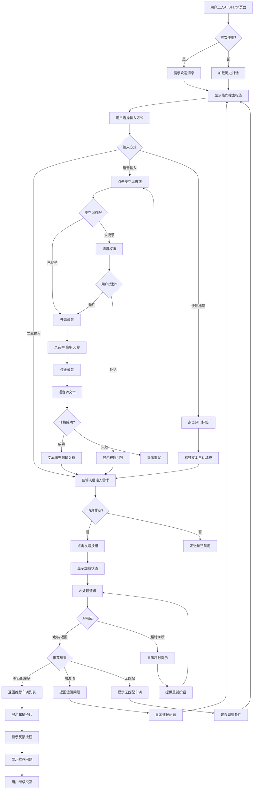

# AI对话搜索业务流程

> **业务目标**：通过自然语言对话帮助用户快速找到符合需求的二手车

---

## 1. 完整流程图

> **要求**：专注于AI对话搜索域内的详细步骤,不包含跨域交互的复杂逻辑分支(跨域逻辑统一在业务全景文档中展示)。

---

## 2. 详细步骤与观测点

### 步骤1：进入AI Search页面

**页面位置**: Cars分类 → AI Search入口

**操作流程**:
1. 用户从Cars分类页点击"AI Search"入口
2. 系统加载AI Search页面
3. 检查用户是否首次使用(通过session或用户ID)

**观测点**:
- ✅ P0: 页面在2秒内完成加载
- ✅ P0: 页面显示顶部导航栏,标题为"AI Search"
- ✅ P0: 页面显示输入框和麦克风按钮
- ✅ P1: 首次使用显示欢迎消息和功能介绍
- ✅ P1: 非首次使用显示历史对话(最近5条)
- ❌ 负向: 页面加载失败显示错误页

**验证方法**:
- 自动化: 检查页面DOM元素存在性
- 手工: 观察页面加载时间和UI展示

**关联规则**: [INPUT-001, INPUT-002](../../业务规则库/AI-Assistant模块/二手车AI搜索助手规则.md#31-输入规则)

---

### 步骤2：文本输入搜索需求

**页面位置**: AI Search页面 → 底部输入框

**操作流程**:
1. 用户点击输入框,弹起键盘
2. 用户输入搜索需求文本(如"我想要5000英镑以下的车")
3. 系统实时统计字符数(最多500字符)
4. 用户点击发送按钮

**观测点**:
- ✅ P0: 输入框获得焦点,光标闪烁
- ✅ P0: 字符数实时显示"XX/500"
- ✅ P0: 超过500字符时禁止继续输入或截断
- ✅ P0: 空消息或纯空格时发送按钮禁用
- ✅ P1: 输入框高度自适应(多行文本)
- ❌ 负向: 输入501字符时显示错误提示

**验证方法**:
- 自动化: 输入边界值(0, 1, 500, 501字符)并检查按钮状态
- 手工: 测试输入框交互流畅度

**关联规则**: [INPUT-001, INPUT-002, VAL-001](../../业务规则库/AI-Assistant模块/二手车AI搜索助手规则.md#31-输入规则)

---

### 步骤3：语音输入搜索需求

**页面位置**: AI Search页面 → 麦克风按钮

**操作流程**:
1. 用户点击麦克风按钮
2. 系统检查麦克风权限
   - 首次使用: 弹出权限请求对话框
   - 权限被拒: 显示引导提示
   - 权限已授予: 直接开始录音
3. 录音中显示波纹动画和时长
4. 60秒后自动停止或用户主动停止
5. 语音转文本(2秒内完成)
6. 转换后的文本填充到输入框

**观测点**:
- ✅ P0: 权限请求对话框文案清晰说明用途
- ✅ P0: 录音时麦克风按钮显示波纹动画
- ✅ P0: 录音时长实时显示"XX秒"
- ✅ P0: 60秒时自动停止并提示"录音时长已达上限"
- ✅ P0: 语音转文本在2秒内完成
- ✅ P1: 转换后的文本可编辑
- ✅ P1: 权限被拒后显示"去设置"按钮
- ❌ 负向: 转换失败显示"语音识别失败,请重试"

**验证方法**:
- 手工: 真实设备测试语音录音和识别
- 自动化: 模拟权限授予/拒绝场景

**关联规则**: [INPUT-003, INPUT-004, PERM-001](../../业务规则库/AI-Assistant模块/二手车AI搜索助手规则.md#31-输入规则)

---

### 步骤4：快速标签搜索

**页面位置**: AI Search页面 → 热门搜索标签区域

**操作流程**:
1. 系统展示3-10个热门搜索标签
2. 用户点击一个或多个标签(最多10个)
3. 标签文本自动填充到输入框
4. 用户可继续编辑或直接发送

**观测点**:
- ✅ P0: 标签显示为Chip样式(圆角矩形,灰色边框)
- ✅ P0: 点击标签后文本填充到输入框
- ✅ P0: 多标签选择时文本拼接(用空格分隔)
- ✅ P1: 选择超过10个标签时显示提示"最多选择10个标签"
- ✅ P1: 互斥标签(如Petrol和Diesel)提示用户
- ❌ 负向: 标签点击无响应

**验证方法**:
- 自动化: 测试单标签、多标签、超过10个标签的场景
- 手工: 观察标签UI和交互流畅度

**关联规则**: [INPUT-004, INPUT-005](../../业务规则库/AI-Assistant模块/二手车AI搜索助手规则.md#31-输入规则)

---

### 步骤5：AI处理请求并返回推荐

**页面位置**: AI Search页面 → 对话区域

**操作流程**:
1. 用户消息显示在对话区域(右对齐,灰色气泡)
2. 系统显示加载状态"AI正在思考..."
3. AI后端处理请求(3秒内)
4. 系统接收AI响应
5. 根据响应类型展示不同内容:
   - 有匹配车辆: 展示车辆卡片列表
   - 需澄清: 展示澄清问题
   - 无匹配: 提示调整条件

**观测点**:
- ✅ P0: 用户消息立即显示(无延迟)
- ✅ P0: 加载状态显示3秒内消失
- ✅ P0: AI响应P95≤3秒
- ✅ P0: AI返回推荐车辆数量在3-10个之间
- ✅ P1: AI消息显示打字机效果(可选)
- ✅ P1: 超过10秒显示超时提示
- ❌ 负向: AI返回0个车辆时显示"暂时没有符合您需求的车辆"

**验证方法**:
- 自动化: 检查AI响应时间和返回数据格式
- 手工: 测试AI理解不同搜索意图的准确性

**关联规则**: [VAL-002, VAL-003, CONS-001, CONS-006](../../业务规则库/AI-Assistant模块/二手车AI搜索助手规则.md#32-校验规则)

---

### 步骤6：用户查看推荐车辆

**页面位置**: AI Search页面 → 车辆卡片区域

**操作流程**:
1. AI返回推荐后,系统展示车辆卡片列表
2. 每屏显示2.5个卡片(暗示更多内容)
3. 用户横向滑动查看更多车辆
4. 用户可以:
   - 点击卡片 → 跳转详情页
   - 点击收藏按钮 → 收藏车辆
   - 滑动到底 → 查看所有推荐

**观测点**:
- ✅ P0: 卡片显示完整信息(图片、标题、价格、年份、里程)
- ✅ P0: 横向滑动流畅无卡顿
- ✅ P0: 图片加载P95≤2秒
- ✅ P0: 点击卡片跳转到详情页
- ✅ P1: 缺失图片显示占位图
- ✅ P1: 滑动到最后一个卡片显示边界反馈
- ❌ 负向: 点击卡片无响应

**验证方法**:
- 自动化: 检查卡片DOM结构和数据绑定
- 手工: 测试滑动流畅度和图片加载速度

**关联规则**: [CONS-001, CONS-007](../../业务规则库/AI-Assistant模块/二手车AI搜索助手规则.md#34-业务约束)

---

### 步骤7：用户提供反馈

**页面位置**: AI Search页面 → 反馈按钮区域

**操作流程**:
1. AI返回推荐后,显示点赞/点踩/重新生成按钮
2. 用户选择操作:
   - 点赞: 静默记录,按钮高亮
   - 点踩: 弹窗询问原因,记录后重新生成
   - 重新生成: 基于相同需求重新推荐

**观测点**:
- ✅ P0: 点赞后按钮变为高亮状态
- ✅ P0: 点踩后弹出原因选择对话框
- ✅ P0: 选择原因并提交后立即重新生成
- ✅ P0: 重新生成显示加载状态
- ✅ P1: 点赞和点踩互斥(后者覆盖前者)
- ✅ P1: 反馈数据成功上报到后端
- ❌ 负向: 点击无响应或反馈上报失败

**验证方法**:
- 自动化: 测试点赞/点踩/重新生成的交互流程
- 手工: 验证反馈数据是否正确记录

**关联规则**: [CONS-005](../../业务规则库/AI-Assistant模块/二手车AI搜索助手规则.md#34-业务约束)

---

## 3. 流程完整性验证清单

- [ ] 用户能成功进入AI Search页面
- [ ] 首次使用显示欢迎消息和热门标签
- [ ] 非首次使用加载历史对话
- [ ] 文本输入长度限制生效(≤500字符)
- [ ] 空消息禁止发送
- [ ] 麦克风权限请求正常
- [ ] 语音录音时长限制生效(≤60秒)
- [ ] 语音转文本在2秒内完成
- [ ] 快速标签点击后正确填充
- [ ] AI在3秒内返回推荐(P95)
- [ ] 推荐车辆数量在3-10个范围内
- [ ] 无匹配车辆时显示友好提示
- [ ] AI超时(>10秒)显示错误提示
- [ ] 车辆卡片显示完整信息
- [ ] 横向滑动流畅
- [ ] 图片在2秒内加载(P95)
- [ ] 点击卡片可跳转详情页
- [ ] 点赞/点踩反馈正常记录
- [ ] 重新生成功能正常工作
- [ ] 网络异常时显示错误提示

---

## 4. 关联文档

- [AI-Assistant业务全景](./AI-Assistant业务全景.md)
- [二手车AI搜索助手规则](../../业务规则库/AI-Assistant模块/二手车AI搜索助手规则.md)
- [车辆推荐展示业务流程](./车辆推荐展示业务流程.md)

---

## 5. 变更历史

| 日期 | 版本 | 变更内容 | 变更人 |
|------|------|---------|--------|
| 2026-04-29 | v1.0 | 初始版本,定义AI对话搜索完整流程 | QA Agent |
| - | - | - | - |
