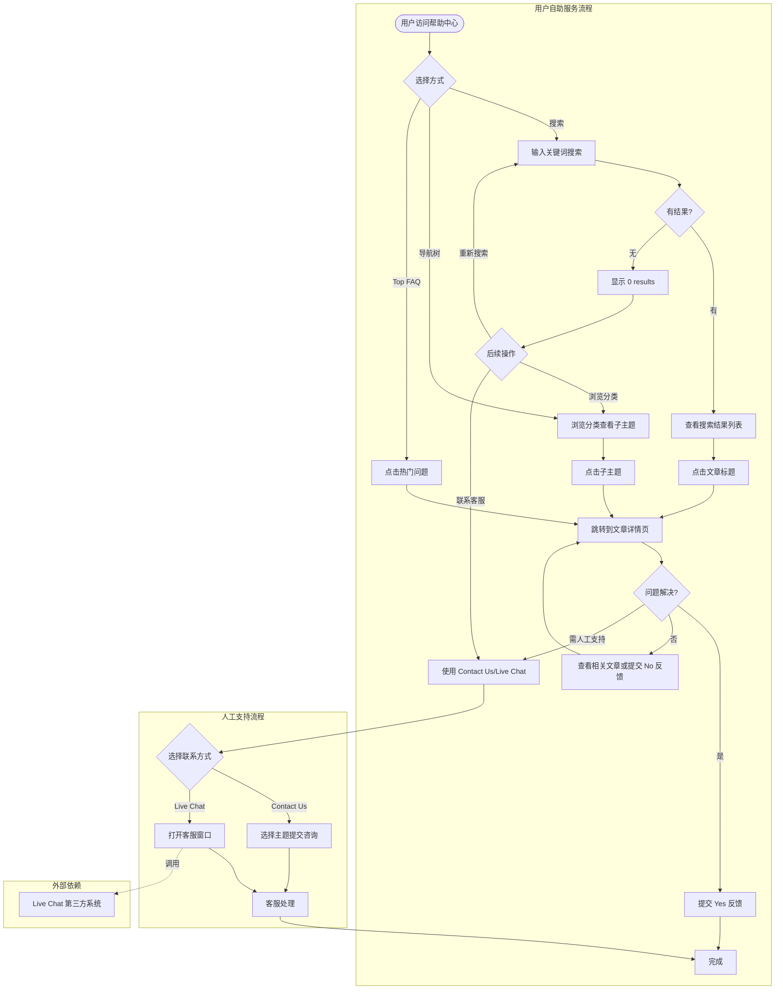
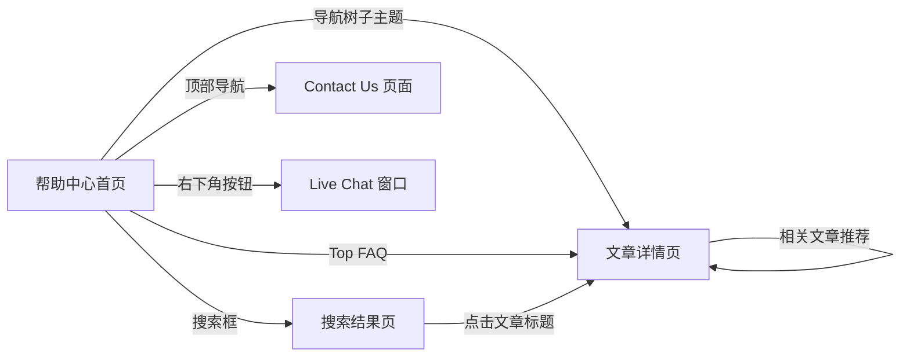

# Help Desk业务域 - 业务全景

## 1. 业务定位

Help Desk 业务域是 Gumtree UK 的自助服务支持平台,为用户提供知识库查询、问题解答、联系客服等服务。

**业务价值**:
- 为用户提供7x24小时自助查询服务,降低客服人工成本
- 通过搜索和导航功能,帮助用户快速找到问题解决方案
- 提供多种联系方式(Contact Us、Live Chat),满足不同用户需求

**目标用户**:
- **访客(未登录)**:可自由访问所有帮助文章,无需登录

## 2. 业务范围

### 2.1 功能覆盖

| 功能模块 | 说明 | 核心能力 |
|---------|------|---------|
| 搜索功能 | 关键词搜索帮助文章 | 支持模糊匹配、防御 SQL 注入和 XSS 攻击 |
| 导航树 | 分类浏览帮助主题 | 支持展开/折叠、多级分类、选中状态高亮 |
| 文章详情页 | 查看完整帮助文章 | 支持平台切换(Web/iOS/Android)、相关文章推荐 |
| 文章反馈 | "Was this article helpful?" | Yes/No 反馈统计,用于改进内容质量 |
| Contact Us | 主题选择和提交咨询 | 下拉框选择主题,展示对应联系方式 |
| Live Chat | 实时客服支持 | 右下角固定按钮,打开客服窗口(依赖第三方系统) |
| Top FAQ | 热门问题快速入口 | 首页展示常见问题链接 |

### 2.2 地域覆盖
- **UK 站**:`help.gumtree.com`,支持英文内容

### 2.3 用户角色

| 角色 | 权限 | 说明 |
|-----|------|------|
| 访客(未登录) | 完整访问 | 无需登录,可自由浏览所有帮助文章和使用搜索功能 |

## 3. 业务流程全景图

## 4. 核心业务流程概览

### 4.1 帮助中心访问与使用流程
**业务目标**:用户通过帮助中心快速找到问题的解决方案,提升自助服务体验。

**核心步骤**:
1. 访问帮助中心首页,加载搜索框、导航树、Top FAQ
2. 用户选择操作:搜索关键词、浏览导航树、点击 Top FAQ
3. 系统根据用户操作展示搜索结果或跳转到文章详情页
4. 用户查看文章内容,可切换平台查看不同指南
5. 用户提交文章反馈或通过 Contact Us/Live Chat 联系客服

**关键观测点**:
- ✅ 页面标题和核心元素(搜索框、导航树)正常显示
- ✅ 搜索功能支持有效关键词、空搜索、特殊字符、防御 SQL 注入和 XSS
- ✅ 导航树支持展开/折叠、子主题跳转、选中状态高亮
- ✅ 文章详情页内容完整、平台切换正常、相关文章推荐显示
- ✅ Contact Us 页面可访问、主题选择正常
- ✅ Live Chat 按钮显示正常

**详细流程文档**:[帮助中心访问与使用业务流程.md](./帮助中心访问与使用业务流程.md)

---

## 5. 页面拓扑关系

### 5.1 页面入口矩阵

| 页面 | 入口1 | 入口2 | 入口3 | 入口4 |
|-----|------|------|------|------|
| 帮助中心首页 | 直接访问 URL | 主站 "Help & Contact" 链接 | - | - |
| 搜索结果页 | 首页搜索框 | - | - | - |
| 文章详情页 | 搜索结果列表 | 导航树子主题 | Top FAQ 链接 | 相关文章推荐 |
| Contact Us 页面 | 顶部导航 "Contact Us" | - | - | - |
| Live Chat 窗口 | 右下角 Live Chat 按钮 | - | - | - |

### 5.2 页面跳转流程图

### 5.3 页面关系详解

#### 帮助中心首页 → 搜索结果页
- **入口**:顶部搜索框输入关键词并提交
- **目标**:`https://help.gumtree.com/s/keysearch?keysearch=<关键词>`
- **权限**:无需登录
- **特点**:显示相关文章的标题和简介列表

#### 帮助中心首页 → 文章详情页
- **入口**:导航树子主题、Top FAQ 链接
- **目标**:`https://help.gumtree.com/s/article?article=<文章标识>`
- **权限**:无需登录
- **特点**:左侧导航树高亮选中该文章

#### 帮助中心首页 → Contact Us 页面
- **入口**:顶部导航 "Contact Us" 链接
- **目标**:`https://help.gumtree.com/s/contact-us`
- **权限**:无需登录
- **特点**:显示主题选择下拉框

#### 帮助中心首页 → Live Chat 窗口
- **入口**:右下角 Live Chat 按钮
- **目标**:打开 Live Chat 窗口或跳转到在线客服页面
- **权限**:无需登录
- **特点**:依赖第三方客服系统,可能受营业时间限制

## 6. 业务数据流转

### 6.1 用户操作与数据变化

| 操作 | 数据变化 | 前台展示变化 | 涉及页面 |
|-----|---------|------------|---------|
| 搜索关键词 | 无 | 跳转到搜索结果页,显示匹配文章列表 | 首页 → 搜索结果页 |
| 展开导航树分类 | 无 | 分类展开,显示子主题列表,展开按钮图标变化 | 首页导航树 |
| 点击子主题 | 无 | 跳转到文章详情页,导航树中该项高亮 | 首页 → 文章详情页 |
| 切换文章平台 | 无 | 文章内容切换到对应平台指南 | 文章详情页 |
| 点击文章反馈 Yes/No | 反馈数据提交 | 显示感谢提示或按钮状态变化 | 文章详情页 |
| 选择 Contact Us 主题 | 无 | 下拉框显示所选主题,可能显示对应联系方式 | Contact Us 页面 |
| 点击 Live Chat 按钮 | 无 | 打开 Live Chat 窗口或提示营业时间 | 帮助中心各页面 |

### 6.2 关键业务数据

#### 搜索参数
| 字段 | 类型 | 必填 | 说明 |
|-----|------|-----|------|
| keysearch | String | 是 | 搜索关键词 |

#### 文章标识参数
| 字段 | 类型 | 必填 | 说明 |
|-----|------|-----|------|
| article | String | 是 | 文章唯一标识 |

## 7. 关键业务规则索引

### 7.1 搜索功能规则
- [帮助中心规则.md - 3.2 校验规则](../../../业务规则库/Help%20Desk模块/帮助中心规则.md#32-校验规则)

### 7.2 导航树交互规则
- [帮助中心规则.md - 3.4 业务约束](../../../业务规则库/Help%20Desk模块/帮助中心规则.md#34-业务约束)

### 7.3 安全防护规则
- [帮助中心规则.md - 3.2 校验规则](../../../业务规则库/Help%20Desk模块/帮助中心规则.md#32-校验规则)
- [帮助中心规则.md - 4. 错误处理](../../../业务规则库/Help%20Desk模块/帮助中心规则.md#4-错误处理)

### 7.4 外部链接安全规则
- [帮助中心规则.md - 3.4 业务约束](../../../业务规则库/Help%20Desk模块/帮助中心规则.md#34-业务约束)

## 8. 业务FAQ

### Q1: 帮助中心需要登录吗?
**A**: 不需要。帮助中心是完全开放的,访客无需登录即可访问所有帮助文章和使用搜索功能。

### Q2: 搜索关键词不存在会显示什么?
**A**: 显示 "0 results: <关键词>" 页面,建议提供后续引导(如相关分类推荐或联系客服入口)。

### Q3: 导航树可以同时展开多个分类吗?
**A**: 取决于产品设计。可能支持同时展开多个分类,或新展开的分类自动折叠之前的分类。

### Q4: 文章详情页的平台切换是什么?
**A**: 部分文章(如 "How to Post an Ad")支持 Web/iOS/Android 平台切换,点击不同平台后,文章内容切换到对应平台的操作指南。

### Q5: Live Chat 功能依赖什么?
**A**: Live Chat 依赖第三方客服系统,点击后可能打开客服窗口、跳转到在线客服页面,或提示营业时间(如果非营业时间)。

### Q6: 帮助中心如何防御 SQL 注入和 XSS 攻击?
**A**: 搜索功能会正确过滤或转义用户输入,SQL 注入尝试不会返回异常数据,XSS 脚本不会被执行,而是显示为普通文本。

### Q7: 访问不存在的文章会发生什么?
**A**: 显示友好的 404 错误页面或"文章不存在"提示,不会显示系统错误信息或堆栈跟踪。

### Q8: 页面刷新后导航树的展开状态会保持吗?
**A**: 取决于产品设计。理想情况下应保持展开状态,或恢复到默认状态(如默认展开某个分类)。

## 9. 业务指标(可选)

### 9.1 核心指标
- **帮助中心 DAU**:待统计
- **搜索使用率**:搜索次数 / 首页访问次数
- **文章查看率**:文章详情页访问次数 / 首页访问次数
- **自助解决率**:点击反馈 "Yes" 次数 / 总反馈次数

### 9.2 漏斗指标
- **用户自助服务漏斗**:访问首页 → 搜索或浏览 → 查看文章 → 提交 Yes 反馈
- **转人工支持漏斗**:访问首页 → 搜索或浏览 → 查看文章 → 使用 Contact Us/Live Chat

## 10. 已知问题与风险

### 10.1 产品待确认问题
1. **空搜索行为**:搜索框为空时点击搜索按钮的预期行为未明确(是阻止提交还是跳转到 0 结果页)
2. **导航树状态保持**:页面刷新后导航树的展开状态是否保持,需明确产品设计
3. **Live Chat 行为**:点击 Live Chat 按钮后的具体行为(打开窗口 vs 跳转页面 vs 提示营业时间)需明确
4. **Safari 兼容性**:需在真实 Safari 环境中补充测试
5. **页面性能指标**:首页加载时间 < 3秒的性能要求需明确并纳入监控

### 10.2 技术风险
- **Live Chat 第三方依赖**:若第三方客服系统不可用,用户无法使用实时客服功能
- **安全防护**:搜索功能若未正确过滤恶意输入,可能存在 SQL 注入或 XSS 攻击风险
- **外部链接钓鱼风险**:外部链接若未添加 `rel="noopener noreferrer"` 属性,可能存在钓鱼攻击风险

### 10.3 测试过程中发现的问题
- 无(本文档基于测试用例归档,实际测试执行后需补充)

## 11. 变更历史

| 日期 | 版本 | 变更内容 | 变更人 |
|-----|------|---------|--------|
| 2026-04-22 | v1.0 | 初始版本,基于 TC_Help_Desk测试用例.md(30条用例)归档 | QA Agent |
