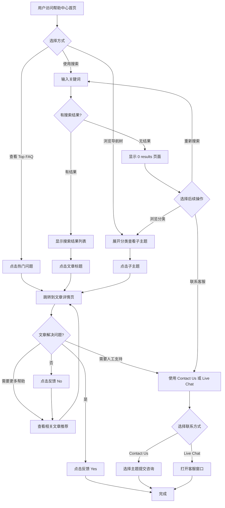

# 帮助中心访问与使用业务流程

> **业务目标**:用户通过帮助中心快速找到问题的解决方案,提升自助服务体验

## 1. 完整流程图

## 2. 详细步骤与观测点

### 步骤1:访问帮助中心首页
- **页面位置**: https://help.gumtree.com/s/
- **操作流程**:
  1. 用户通过主站 "Help & Contact" 链接或直接访问 URL 进入帮助中心
  2. 页面加载,显示搜索框、导航树、Top FAQ 区域
- **观测点**:
  - ✅ P0:页面标题显示正确
  - ✅ P0:顶部搜索框可见并可用
  - ✅ P0:左侧导航树显示完整分类列表
  - ✅ P0:Top FAQ 区域显示热门问题链接
  - ✅ P1:页面布局整齐,无错位或重叠
  - ✅ P1:页面加载时间 < 3秒(正常网络环境)
- **验证方法**: 自动化脚本验证页面元素可见性和文本内容
- **关联规则**: [帮助中心规则.md - 1. 功能概述](../../../业务规则库/Help%20Desk模块/帮助中心规则.md#1-功能概述)

### 步骤2:使用搜索功能
- **页面位置**: 首页顶部搜索框
- **操作流程**:
  1. 用户在搜索框中输入关键词(如 "post ad")
  2. 点击搜索按钮(放大镜图标)
  3. 页面跳转到搜索结果页
- **观测点**:
  - ✅ P0:搜索结果页 URL 包含 `keysearch=<关键词>`
  - ✅ P0:有结果时,显示文章标题和简介列表(结果数 > 0)
  - ✅ P1:无结果时,显示 "0 results: <关键词>"
  - ❌ P1:空搜索提交时,显示必填提示或跳转到 0 结果页
  - ❌ P1:特殊字符搜索时,字符被正确编码,不出现系统错误
  - ❌ P2:超长字符串搜索时,不导致页面卡顿
  - ❌ P0:SQL注入尝试时,不返回异常数据或数据库错误
  - ❌ P0:XSS攻击尝试时,脚本不被执行
- **验证方法**: 自动化脚本测试有效关键词、空搜索、特殊字符、超长字符串、SQL注入、XSS攻击场景
- **关联规则**: [帮助中心规则.md - 3.2 校验规则](../../../业务规则库/Help%20Desk模块/帮助中心规则.md#32-校验规则)

### 步骤3:通过导航树浏览分类
- **页面位置**: 首页左侧导航树
- **操作流程**:
  1. 用户点击分类前的展开按钮或分类名称
  2. 分类展开,显示子主题列表
  3. 用户点击子主题标题
  4. 跳转到对应的文章详情页
- **观测点**:
  - ✅ P0:分类成功展开,显示子主题列表
  - ✅ P0:展开按钮图标变为"折叠"状态
  - ✅ P1:展开/折叠动画流畅无卡顿
  - ✅ P0:点击子主题后,跳转到文章详情页,URL 包含 `article=<文章标识>`
  - ✅ P0:左侧导航树中该子主题显示为选中状态
  - ✅ P1:多个分类可以同时保持展开状态(或新展开自动折叠旧分类)
- **验证方法**: 自动化脚本测试展开/折叠交互、子主题跳转、选中状态
- **关联规则**: [帮助中心规则.md - 3.4 业务约束](../../../业务规则库/Help%20Desk模块/帮助中心规则.md#34-业务约束)

### 步骤4:查看文章详情页
- **页面位置**: 文章详情页
- **操作流程**:
  1. 用户通过搜索结果、导航树或 Top FAQ 进入文章详情页
  2. 页面展示文章标题、内容、平台选择器(如适用)
  3. 用户可切换平台(Web/iOS/Android)查看不同指南
  4. 用户可查看文章底部的相关文章推荐
- **观测点**:
  - ✅ P0:页面标题显示文章标题
  - ✅ P0:文章内容完整展示(标题、正文、注意事项)
  - ✅ P0:左侧导航树高亮选中该文章
  - ✅ P1:底部显示相关文章推荐(至少3篇)
  - ✅ P1:平台选择器(如有)显示 Web/iOS/Android 选项
  - ✅ P1:点击不同平台后,内容切换到对应平台指南
  - ✅ P1:文章内链接可正常跳转,不出现 404 错误
- **验证方法**: 自动化脚本验证文章内容展示、平台切换、相关文章推荐、内链有效性
- **关联规则**: [帮助中心规则.md - 3.4 业务约束](../../../业务规则库/Help%20Desk模块/帮助中心规则.md#34-业务约束)

### 步骤5:提交文章反馈
- **页面位置**: 文章详情页底部
- **操作流程**:
  1. 用户滚动到文章底部
  2. 找到 "Was this article helpful?" 反馈区域
  3. 点击 "Yes" 或 "No" 按钮
  4. 系统提交反馈数据
- **观测点**:
  - ✅ P1:点击后显示感谢提示或按钮状态变化
  - ✅ P1:反馈数据被提交(可通过 Network 面板验证)
  - ✅ P1:不出现页面错误
- **验证方法**: 自动化脚本点击反馈按钮,监听网络请求
- **关联规则**: [帮助中心规则.md - 3.4 业务约束](../../../业务规则库/Help%20Desk模块/帮助中心规则.md#34-业务约束)

### 步骤6:使用 Contact Us 功能
- **页面位置**: Contact Us 页面 (https://help.gumtree.com/s/contact-us)
- **操作流程**:
  1. 用户点击顶部导航栏的 "Contact Us" 链接
  2. 跳转到 Contact Us 页面
  3. 用户点击 "Please Select a Topic" 下拉框
  4. 选择对应的主题选项
  5. 页面显示对应的联系方式或表单字段
- **观测点**:
  - ✅ P0:跳转到 Contact Us 页面,URL 为 `https://help.gumtree.com/s/contact-us`
  - ✅ P0:页面标题显示 "What can we help you with?"
  - ✅ P0:显示主题选择下拉框(combobox)
  - ✅ P1:下拉框展开,显示可选主题列表(至少3个选项)
  - ✅ P1:选中后下拉框显示所选主题
  - ✅ P1:页面可能显示对应的联系方式或表单字段
- **验证方法**: 自动化脚本测试 Contact Us 页面访问和主题选择
- **关联规则**: [帮助中心规则.md - 3.1 输入规则](../../../业务规则库/Help%20Desk模块/帮助中心规则.md#31-输入规则)

### 步骤7:使用 Live Chat 功能
- **页面位置**: 页面右下角 Live Chat 按钮
- **操作流程**:
  1. 用户滚动到页面右下角或页面自动显示 Live Chat 按钮
  2. 用户点击 Live Chat 按钮("Hello, have a question? Let's chat.")
  3. 打开 Live Chat 窗口或跳转到在线客服页面
- **观测点**:
  - ✅ P1:Live Chat 按钮显示在页面右下角
  - ✅ P1:按钮文案清晰可读
  - ✅ P1:按钮有悬浮效果或明显的视觉提示
  - ✅ P1:按钮不被其他元素遮挡
  - ❌ P1:点击后打开 Live Chat 窗口或跳转页面(可能提示营业时间)
- **验证方法**: 自动化脚本验证按钮可见性和样式,人工测试点击行为(依赖第三方系统)
- **关联规则**: [帮助中心规则.md - 5.2 下游依赖](../../../业务规则库/Help%20Desk模块/帮助中心规则.md#52-下游依赖我调用谁)

## 3. 流程完整性验证清单

- [ ] 首页核心元素(搜索框、导航树、Top FAQ)完整展示
- [ ] 搜索功能支持有效关键词、空搜索、特殊字符、超长字符串
- [ ] 搜索功能正确防御 SQL 注入和 XSS 攻击
- [ ] 导航树支持展开/折叠交互,子主题跳转正常
- [ ] 文章详情页内容完整,平台切换(如适用)正常,相关文章推荐显示
- [ ] 文章反馈功能正常提交数据
- [ ] Contact Us 页面可访问,主题选择下拉框正常
- [ ] Live Chat 按钮显示正常(点击行为依赖第三方系统)
- [ ] 页面响应式布局适配移动端和平板端
- [ ] 主流浏览器(Chrome)兼容性正常

## 4. 关联文档

- [Help Desk业务全景](./Help%20Desk业务全景.md)
- [帮助中心规则](../../../业务规则库/Help%20Desk模块/帮助中心规则.md)

## 5. 变更历史

| 日期 | 版本 | 变更内容 | 变更人 |
|-----|------|---------|--------|
| 2026-04-22 | v1.0 | 初始版本,基于 TC_Help_Desk测试用例.md(30条用例)归档 | QA Agent |
