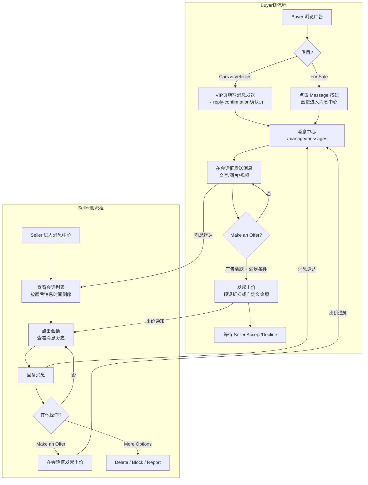
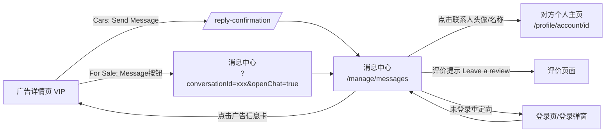
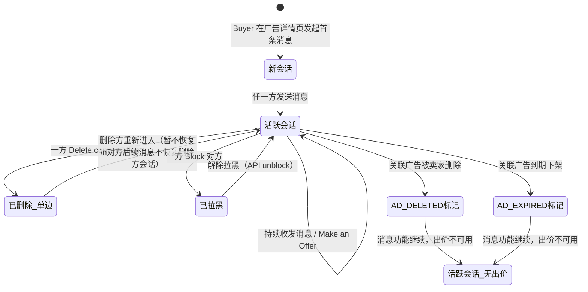

# Message业务域 - 业务全景

## 1. 业务定位

Message业务域是 Gumtree 的核心通信基础设施，为买卖双方提供完整的会话沟通、媒体共享、议价出价和安全管理能力，是促成交易达成的关键链路。

**业务价值**：
- 为 **Seller（卖家）** 提供统一的买家消息管理入口，便于跟进意向买家、回复咨询、主动出价
- 为 **Buyer（买家）** 提供安全便捷的联系卖家、议价沟通通道，降低购买决策门槛

**目标用户**：
- **Seller**：广告发布者，被动接收买家消息，主动回复并管理会话
- **Buyer**：广告浏览者，通过广告详情页主动发起会话，在消息中心持续沟通
- **未登录用户**：仅可浏览广告，点击联系按钮后触发登录流程

---

## 2. 业务范围

### 2.1 功能覆盖

| 功能模块 | 说明 | 核心能力 |
|---------|------|---------|
| 会话列表 | 消息中心左侧列表区 | 会话排序、未读徽章、广告状态角标、懒加载分页 |
| 消息发送 | 文字/图片/视频消息 | 输入校验、媒体上传（最多5张图片/≤5MB视频）、Enter发送 |
| 广告信息卡 | 聊天面板上部 | 显示关联广告缩略图/标题/价格/地点，可点击跳转VIP |
| Make an Offer | 议价功能 | 预设折扣选项（For Sale）/ 自定义金额（Motors），双向出价 |
| More Options | 会话安全管理 | 删除会话（单边）、拉黑用户（单向静默）、举报用户 |
| 未读消息管理 | 未读计数三端同步 | 列表头/顶栏徽章/会话行徽章三端一致，阅读后实时更新 |
| 会话分页 | 左侧列表独立滚动 | 第一页最多30条，容器内滚动触发懒加载 |
| 评价提示 | Buyer 专属 | Buyer 发送5条消息后弹出评价提示（Haven't bought / Leave a review） |
| 邮件通知 | 新消息通知 | 向对方邮箱发送新消息/回复通知（staging环境待确认） |

### 2.2 地域覆盖

- **UK 站**（unicorn.gumtree.io）：主要测试环境，货币单位 £

### 2.3 用户角色

| 角色 | 权限 | 说明 |
|-----|------|------|
| Seller | 查看会话列表、回复消息、发起出价、删除/拉黑/举报 | 被动接收买家消息，无法主动新建会话 |
| Buyer | 发起新会话、发送消息、发起出价（满足条件时）、删除/拉黑/举报 | 通过广告详情页发起会话，同一广告只能有一条会话 |
| 未登录用户 | 无 | 访问消息中心重定向到登录页，发起联系触发登录流程 |

---

## 3. 业务流程全景图

---

## 4. 核心业务流程概览

### 4.1 Buyer 发起会话 → Seller 回复

**业务目标**：支持买家通过广告详情页发起首次联系，实现买卖双方在消息中心内的完整双向沟通

**核心步骤**：
1. Buyer 在广告详情页点击 "Contact Seller" / "Message" 按钮
2. 系统创建会话（Cars类目经 `/reply-confirmation/` 中转；For Sale类目直跳消息中心）
3. Buyer 在会话框发送文字/图片/视频消息
4. Seller 在消息中心会话列表中看到新会话
5. Seller 打开会话查看消息，输入回复并发送
6. 双方消息在会话内按时间排序（己方右侧绿色气泡，对方左侧气泡）

**关键观测点**：
- ✅ 发送成功后页面跳转至 `/manage/messages`（TC001）
- ✅ 同一广告同一 Buyer 重复联系跳转到已有会话（TC003）
- ✅ Seller 能立即在会话列表中看到新会话（TC035）
- ✅ Buyer 只能看到自己参与的会话（TC039）
- ✅ 空输入框时 Send 按钮 disabled，有内容后变绿色 enabled（TC006）
- ✅ Enter 键发送消息（TC038）

**详细流程文档**：[消息中心业务流程.md](./消息中心业务流程.md)

---

### 4.2 Make an Offer（议价出价）

**业务目标**：允许买卖双方在会话框内进行价格协商，通过标准化的出价流程提升成交效率

**核心步骤**：
1. 确认广告活跃状态（非 AD DELETED / AD EXPIRED）
2. Buyer 在 VIP 页（满足正向条件）或会话框内点击 "Make offer"
3. For Sale 类目：出价表单内联展开，选择预设折扣（10%/20%/30%）
4. Motors 类目：自定义输入金额（≥原价60%）
5. 点击 `Offer £XX.XX` 提交，议价消息出现在会话中
6. 对方在会话内点击 Accept 或 Decline 响应

**关键观测点**：
- ✅ Buyer 满足正向条件时 VIP 页 Make offer 可见（TC024b）
- ✅ Seller 查看自己广告时 Make offer 不显示（TC025b）
- ✅ 会话框内出价表单内联展开，预设折扣选项可见（TC026）
- ✅ 提交后会话中显示 `£[0-9]+\.[0-9]+` 格式议价消息（TC025）
- ❌ 广告 AD DELETED/EXPIRED 时 Make offer 不显示（TC028b）
- ❌ 出价低于原价60%时显示校验错误，按钮 disabled（TC027）

**详细流程文档**：[消息中心业务流程.md](./消息中心业务流程.md)

---

### 4.3 More Options（删除/拉黑/举报）

**业务目标**：为买卖双方提供会话安全管理能力，包括单边删除会话、静默拉黑用户、举报违规行为

**核心步骤**：
1. 点击聊天面板右上角 "More options" 按钮，展开下拉菜单
2. 三个操作项：Delete conversation / Block [name] / Report [name]
3. **Delete**：确认弹窗 → 点击 Delete → 会话从己方列表消失（单边删除）
4. **Block**：确认弹窗 → 点击 Block → 被拉黑方消息静默不送达
5. **Report 首次**：选择8个举报原因之一 → 提交 → 成功确认弹窗
6. **Report 重复**：直接弹出已举报提示弹窗 → Cancel 关闭

**关键观测点**：
- ✅ More Options 菜单包含三个正确选项（TC016）
- ✅ Delete 为单边删除：Seller 删后 Buyer 侧会话仍存在（TC018b）
- ✅ Block 静默拉黑：被拉黑方发消息前端成功，Seller 侧收不到（TC040）
- ✅ Report 首次：8个举报原因可见，提交成功后确认弹窗文案正确（TC021、TC023）
- ✅ Report 重复：显示 "Conversation reported" 已举报弹窗（TC021b）
- ⚠️ BUG-001：未选举报原因直接提交，Submit 按钮未被禁用（TC022）

**详细流程文档**：[消息中心业务流程.md](./消息中心业务流程.md)

---

### 4.4 未读消息管理与会话分页

**业务目标**：通过三端同步的未读计数和独立滚动容器分页，确保用户准确掌握消息状态，高效管理大量会话

**核心步骤**：
1. 登录后查看顶栏 Messages 徽章（未读总数）
2. 进入消息中心，查看列表头统计信息和各会话行未读徽章
3. 点击含未读会话，未读数归零，三端同步减少
4. 滚动左侧列表容器触发懒加载，加载更多会话

**关键观测点**：
- ✅ 未读数三端一致：列表头 = 顶栏徽章 = 所有会话行徽章之和（TC008b）
- ✅ 阅读后未读实时减少（TC008c）
- ✅ 未读徽章：绿色背景、圆形（`border-radius >= 10px`）、纯数字（TC008f）
- ✅ 第一页最多30条会话（TC011b）
- ✅ 滚动容器触发懒加载，列表头数字动态更新（TC011c）
- ❌ 浏览器整体滚动不触发翻页（分页-浏览器）

**详细流程文档**：[消息中心业务流程.md](./消息中心业务流程.md)

---

## 5. 页面拓扑关系

### 5.1 页面入口矩阵

| 页面 | 入口1 | 入口2 | 入口3 | 入口4 |
|-----|------|------|------|------|
| 消息中心 `/manage/messages` | 顶部导航 "Messages" 链接 | For Sale类目 VIP页 "Message" 按钮 | Cars类目 `/reply-confirmation/` 页面跳转 | 直接输入 URL |
| 广告详情页 VIP `/p/...` | 消息中心广告信息卡点击 | 搜索结果页点击广告 | 首页广告卡片点击 | - |
| `/reply-confirmation/` | Cars类目 VIP页 "Send Message" 发送后自动跳转 | - | - | - |
| 对方个人主页 `/profile/account/{id}` | 聊天面板右上角联系人头像/名称点击 | - | - | - |
| 评价页面 | 评价提示弹窗 "Leave a review" 按钮 | - | - | - |
| 登录页 / 登录弹窗 | 未登录用户访问 `/manage/messages` | 未登录 Buyer 点击 "Contact Seller" | - | - |

### 5.2 页面跳转流程图

### 5.3 页面关系详解

#### 广告详情页（VIP）→ 消息中心

- **入口**：For Sale 类目点击 "Message" 按钮（`data-q="contact-email"`）；Cars类目经 `/reply-confirmation/` 中转
- **目标**：消息中心 `/manage/messages?conversationId=xxx&openChat=true`
- **参数**：`conversationId`（会话ID）、`openChat=true`（自动打开对话窗口）
- **权限**：需要已登录（未登录触发登录流程）
- **业务规则**：同一 Buyer 对同一广告只创建一条会话，重复点击跳转已有会话

#### 消息中心 → 广告详情页（VIP）

- **入口**：聊天面板上部广告信息卡点击
- **目标**：广告详情页 `/p/...`
- **参数**：广告 slug（URL 含 `/p/`）
- **展示规则**：广告被删除/过期后，广告信息卡仍在聊天面板中显示，但会话列表项显示 AD DELETED/AD EXPIRED 角标

#### Cars类目 → `/reply-confirmation/` → 消息中心

- **入口**：Cars类目 VIP页 "Is this available?" 输入框 + "Send Message" 按钮
- **目标**：先到 `/reply-confirmation/` 确认页，再进入消息中心
- **流程**：Buyer 在 VIP 页填写消息 → 点击发送 → 跳转确认页 → 进入消息中心

#### 消息中心 → 对方个人主页

- **入口**：聊天面板右侧顶部联系人头像/名称点击
- **目标**：`/profile/account/{userId}`

---

## 6. 业务数据流转

### 6.1 会话状态流转

### 6.2 用户操作与数据变化

| 操作 | 数据变化 | 前台展示变化 | 涉及页面 |
|-----|---------|------------|---------|
| Buyer 点击 "Contact Seller" / "Message" | 新建会话记录（conversationId生成） | 跳转消息中心，新会话出现在双方列表顶部 | 广告详情页 → 消息中心 |
| 发送文字/图片/视频消息 | 消息记录写入会话，对方未读数+1 | 己方绿色气泡（右），对方收到后左侧气泡显示；列表预览更新 | 消息中心 |
| 打开含未读会话 | 该会话未读数归零 | 会话行徽章消失，列表头和顶栏未读数同步减少 | 消息中心 |
| Make an Offer 提交 | 出价记录写入会话 | 出价气泡显示在会话中（含 £XX.XX 和 Accept/Decline 按钮） | 消息中心 / 广告详情页 |
| Accept/Decline 出价 | 出价状态更新为已接受/已拒绝 | 双方出价气泡操作按钮变为不可用，显示结果状态 | 消息中心 |
| Delete conversation | 己方会话标记为已删除 | 会话从己方列表消失，对方列表不受影响 | 消息中心 |
| Block 用户 | 拉黑关系写入，消息过滤启用 | 被拉黑方发消息前端成功但不送达；被拉黑方无感知 | 消息中心 |
| Report 用户 | 举报记录写入，标记已举报状态 | 首次：成功确认弹窗；重复：已举报提示弹窗 | 消息中心 |
| 广告被删除/过期 | 会话关联广告状态更新 | 会话列表项出现 AD DELETED/AD EXPIRED 角标；Make offer 按钮消失 | 消息中心 / 广告详情页 |

### 6.3 关键业务数据

#### 会话（Conversation）

| 字段 | 类型 | 必填 | 说明 |
|-----|------|-----|------|
| conversationId | UUID | 是 | 会话唯一标识，写入 URL |
| adId | String | 是 | 关联广告 ID |
| sellerId | String | 是 | 卖家用户 ID |
| buyerId | String | 是 | 买家用户 ID |
| lastMessageAt | DateTime | 是 | 最后消息时间（用于列表排序） |
| unreadCount | Number | 是 | 当前用户的未读消息数 |
| adStatus | Enum | 是 | 广告状态：ACTIVE / DELETED / EXPIRED / SOLD |

#### 消息（Message）

| 字段 | 类型 | 必填 | 说明 |
|-----|------|-----|------|
| messageId | UUID | 是 | 消息唯一标识 |
| conversationId | UUID | 是 | 所属会话 ID |
| senderId | String | 是 | 发送方用户 ID |
| type | Enum | 是 | text / image / video / offer |
| content | String | 否 | 文字内容 |
| mediaUrls | Array | 否 | 图片/视频 URL 列表（最多5张图片，视频≤5MB） |
| offerAmount | Number | 否 | 出价金额（type=offer 时必填） |
| createdAt | DateTime | 是 | 消息创建时间 |

---

## 7. 关键业务规则索引

### 7.1 消息发送相关
- [消息中心规则.md - 3.1 输入规则](../../业务规则库/Message模块/消息中心规则.md#31-输入规则)
- [消息中心规则.md - 3.2 校验规则](../../业务规则库/Message模块/消息中心规则.md#32-校验规则)

### 7.2 权限与访问控制
- [消息中心规则.md - 3.3 权限规则](../../业务规则库/Message模块/消息中心规则.md#33-权限规则)

### 7.3 业务约束（会话/拉黑/删除/出价等）
- [消息中心规则.md - 3.4 业务约束](../../业务规则库/Message模块/消息中心规则.md#34-业务约束)

### 7.4 错误处理与已知缺陷
- [消息中心规则.md - 4. 错误处理](../../业务规则库/Message模块/消息中心规则.md#4-错误处理)
- [消息中心规则.md - 5. 已知问题](../../业务规则库/Message模块/消息中心规则.md#5-已知问题)

---

## 8. 业务FAQ

### Q1: Buyer 对同一广告发起多次联系，会创建多条会话吗？
**A**: 不会。同一 Buyer 对同一广告只能有一条会话。重复点击 "Contact Seller" 或 "Message" 按钮会直接跳转到已有会话，不会创建新会话。

### Q2: Seller 删除会话后，Buyer 还能看到该会话吗？
**A**: 可以。删除操作为**单边删除**，只从 Seller 的会话列表中移除，Buyer 侧的会话不受影响，仍可查看历史消息。Seller 删除后即使 Buyer 发新消息，该会话也不会在 Seller 侧恢复。

### Q3: 被拉黑后，被拉黑方能感知到自己被拉黑了吗？
**A**: 不能。Gumtree 的隐私设计是静默拉黑——被拉黑方前端显示消息发送成功，但消息实际不会送达拉黑方。被拉黑方不收到任何通知，会话历史也仍然可见。

### Q4: 广告过期或被删除后，还能在消息中心继续沟通吗？
**A**: 可以继续发送文字/图片/视频消息。但 Make an Offer（议价出价）功能会随广告下线同步关闭，双方均不可出价。广告信息卡在聊天面板中仍然显示，保留历史商品上下文。

### Q5: 消息中心的会话列表如何分页？
**A**: 采用**懒加载（无限滚动）**模式。第一页默认最多显示30条会话；只有滚动**左侧列表容器本身**才会触发懒加载加载下一批；浏览器整体页面滚动（`window.scrollTo`）不触发翻页。列表头数字 "X Conversations" 随加载动态更新。

### Q6: Make an Offer 在哪些情况下会显示？
**A**: 需区分入口：（1）**广告详情页（VIP）**：仅 Buyer 可见，且需同时满足——Buyer 非 Pro + Seller 有 reply email + 广告在 Motors 类目下且非 Cars Wanted（类目ID≠10301）+ 广告活跃。（2）**消息中心会话框**：买卖双方均可见，仅要求广告处于活跃状态。Seller 查看自己广告的 VIP 页时不显示 Make offer 入口。

### Q7: Make an Offer 的出价下限是多少？
**A**: 出价不得低于广告原价的60%（即最大折扣40% off）。低于该限额时，输入框边框变红，显示错误文案 `Your offer needs to be at least £X.XX (40% off)`，提交按钮变为 disabled。

### Q8: 为什么 Report 表单有时不让重复提交？
**A**: 系统记录用户已举报过的对话，再次打开 Report 时会直接弹出"已举报"状态弹窗（标题：Conversation reported），用户只能点击 Cancel 关闭，无法重复提交举报。测试时需动态判断弹窗场景。

### Q9: 未读消息数在哪几个位置显示？数值必须保持一致吗？
**A**: 共三处：（1）会话列表头部（"X Conversations (Y unread messages)"）；（2）顶部导航栏 Messages 徽章；（3）每条会话列表项右侧的绿色圆形数字徽章。三处数值**必须保持一致**，是严格的业务约束（已实测确认）。

### Q10: 图片/视频上传能否通过 UI 自动化实现？
**A**: 可以。图片和视频上传均可通过 Playwright 的 `page.expect_file_chooser()` API 实现 UI 自动化（原有文档中标注"不可自动化"已过时，已于2026-04-07更正）。

---

## 9. 业务指标（可选）

### 9.1 核心指标
- **消息中心 DAU**：待补充
- **会话创建数/天**：待补充
- **消息发送成功率**：待补充
- **Make an Offer 转化率**：出价发起数 / 会话数

### 9.2 漏斗指标
- **Buyer 联系转化漏斗**：广告详情页浏览 → 点击 "Contact Seller" → 消息发送成功 → Seller 回复
- **Make an Offer 漏斗**：Make offer 入口点击 → 折扣选择/金额输入 → 出价提交 → Accept/Decline

---

## 10. 已知问题与风险

### 10.1 产品待确认问题

| 编号 | 待确认问题 | 影响范围 |
|------|-----------|---------|
| Q6 | 出价被接受/拒绝后，气泡状态如何变化？是否可撤销？ | 买卖双方 |
| Q12 | Buyer 发送消息后是否立即跳转会话详情？还是停留在 reply-confirmation 页面？从该页面是否有链接直达会话？ | Buyer |
| Q13 | 统计信息更新机制（WebSocket实时推送/短轮询/事件驱动？更新延迟？） | 买卖双方 |
| Q14 | 未读消息的判定标准（打开会话即已读？还是需要滚动到消息位置？） | 买卖双方 |
| Q15 | 大数字显示策略：未读数超过99时显示 99+ 还是完整数字？ | 买卖双方 |
| Q16 | 时间戳切换规则：Today / 相对时间（如 "2 days ago"）/ 完整日期（如 "Fri 30th January"）的切换阈值 | 买卖双方 |
| Q17 | 会话列表右侧绿色圆点（无数字）的含义：是新订单状态？在线状态？显示规则？ | Seller |
| Q18 | 同一买家是否可与同一 Seller 有多条会话（截图中 "Arin" 出现4次）？会话唯一性规则？ | 买卖双方 |
| Q19 | 广告无首图时的默认占位图规则：是否根据品类变化？ | 买卖双方 |

### 10.2 技术风险

- **邮件通知未触发**：unicorn staging 环境消息邮件通知未在合理时间内到达（检测窗口10-20分钟未到达），可能原因：staging 环境 SMTP/SES 未配置，或测试账号被屏蔽通知（BUG-002）
- **Mermaid 流程图复杂度**：完整流程图节点较多，建议 Markdown 编辑器中预览验证语法

### 10.3 测试过程中发现的问题

| Bug ID | 描述 | 严重程度 | 相关用例 | 状态 |
|--------|------|---------|---------|------|
| BUG-001 | Report 表单未选择举报原因时 Submit 按钮未被禁用，可直接点击且无任何反馈 | P1 | TC022 | 已知，标记 `@pytest.mark.known_bug` |
| BUG-002 | 消息邮件通知在 unicorn staging 环境中未正常触发（10-20分钟内未到达） | P2（待环境确认） | TC-NOTIFY-01, TC-NOTIFY-02 | 待排查 |

---

## 11. 变更历史

| 日期 | 版本 | 变更内容 | 变更人 |
|-----|------|---------|--------|
| 2026-04-17 | v1.0 | 初始版本，基于 Messages 业务逻辑梳理文档（2026-04-15 升级版）及 Messages-Testcases-20260415.md 生成 | emma.liu |
