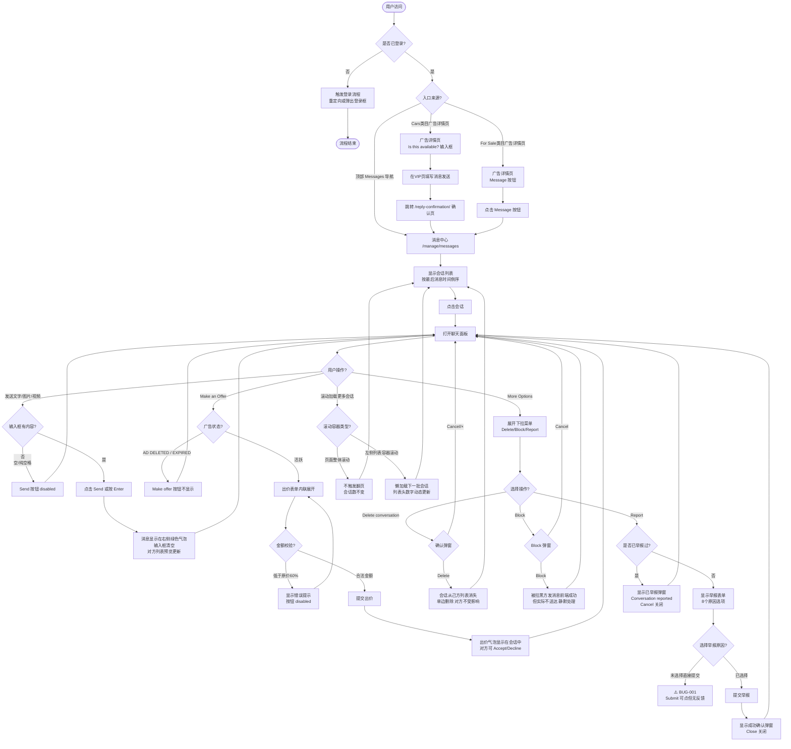

# 消息中心业务流程

> **业务目标**：支持 Gumtree 买卖双方通过消息中心完成从发起沟通、消息收发、议价出价到安全管理（拉黑/举报/删除）的完整通信链路，保障买卖双方的沟通效率与安全

---

## 1. 完整流程图

---

## 2. 详细步骤与观测点

### 步骤1：入口与权限验证

**页面位置**：任意页面（顶部导航） / 广告详情页（VIP）

**操作**：
1. 已登录用户点击顶部导航 "Messages" 进入 `/manage/messages`
2. 或 Buyer 在广告详情页点击 "Contact Seller" / "Message" / "Send Message" 发起会话
3. 未登录用户触发登录流程

**观测点**：
- ✅ 已登录用户成功进入消息中心，URL 为 `/manage/messages`
- ✅ For Sale 类目：点击 "Message" 按钮直接跳转消息中心，URL 含 `conversationId` 和 `openChat=true`
- ✅ Cars & Vehicles 类目：VIP 页提供消息输入框，发送后跳转 `/reply-confirmation/` 确认页，再进入消息中心
- ✅ 同一 Buyer 对同一广告重复点击联系按钮：跳转已有会话，不创建新会话
- ❌ 未登录用户访问 `/manage/messages`：重定向到登录页或弹出登录弹窗（不展示会话内容）
- ❌ 未登录 Buyer 点击 "Contact Seller"：触发登录流程（URL 含 `auth`/`login` 或显示登录按钮）
- ❌ 越权访问他人 conversationId：不展示会话内容，跳转错误页或消息中心首页

**验证方法**：
- 检查 URL 是否包含 `/manage/messages`
- 验证 `[data-q='email-login']` 或 "Continue with email" 可见（未登录场景）
- 检查 conversationId 是否在合法会话 ID 列表内

**关联规则**：[消息中心规则.md - 3.3 权限规则](../../业务规则库/Message模块/消息中心规则.md#33-权限规则)

---

### 步骤2：会话列表展示

**页面位置**：消息中心 `/manage/messages` 左侧列表区

**操作**：
1. 进入消息中心，左侧显示会话列表
2. 查看列表头统计信息（"X Conversations (Y unread messages)"）
3. 查看每条会话项的完整展示元素
4. 滚动左侧列表容器加载更多会话

**观测点**：
- ✅ 会话列表按最后消息时间倒序排列，最近活跃会话在最上方
- ✅ 列表头显示总会话数（如 "12 Conversations"）及未读数（如 "(6 unread messages)"）
- ✅ 每条会话项显示：广告首图缩略图（左侧）、联系人 First Name（粗体）、最后消息预览（截断）、时间戳（Today/日期格式）
- ✅ 有未读消息的会话：右侧显示绿色圆形数字徽章（背景色约 `rgb(92, 241, 0)`，`border-radius >= 10px`，内容为纯数字）
- ✅ 广告已删除的会话：显示 "AD DELETED" 深色角标
- ✅ 广告已过期的会话：显示 "AD EXPIRED" 深色角标
- ✅ 时间戳：当天消息显示 `Today`，过去消息显示 `{星期} {日期}{序数词} {月份}`（如 `Wed 7th January`）
- ✅ 未读数三端一致：列表头未读数 = 顶栏 Messages 徽章未读数 = 所有可见会话行未读徽章之和
- ✅ 第一页默认最多显示 30 条会话
- ✅ 滚动左侧列表容器触发懒加载，列表头数字动态增加
- ❌ 浏览器整体滚动（`window.scrollTo`）不触发列表翻页，会话数不变
- ⚠️ 未读徽章与绿色圆点的含义区分（Q17待确认：截图中 "Order placed." 会话的绿色圆点是否代表新订单状态）

**验证方法**：
- `inbox.expect_conversation_list_visible()` 验证列表可见
- `inbox.get_visible_conversation_count()` 获取可见会话数，断言 `<= 30`
- `inbox.get_conversation_count_from_header()` 解析列表头数字
- `_parse_messages_header_unread()` vs `_parse_global_nav_messages_unread()` 验证未读一致性
- 执行 `window.scrollTo(0, document.body.scrollHeight)` 后验证会话数不变

**关联规则**：[消息中心规则.md - 3.4 业务约束](../../业务规则库/Message模块/消息中心规则.md#34-业务约束)

---

### 步骤3：打开会话与聊天面板

**页面位置**：消息中心右侧聊天面板

**操作**：
1. 点击左侧会话列表项
2. 右侧面板切换为该会话的完整消息历史
3. 查看聊天面板上部的广告信息卡

**观测点**：
- ✅ 点击会话列表项后，右侧面板显示该会话的消息历史
- ✅ 被选中的会话项在列表中呈高亮状态
- ✅ URL 同步更新为 `/manage/messages?conversationId={id}`，支持刷新保持和浏览器前进后退
- ✅ 聊天面板上部显示广告信息卡（缩略图、标题、价格、地点）
- ✅ 点击广告信息卡跳转到该广告详情页（URL 含 `/p/`）
- ✅ 广告被删除/过期后，广告信息卡在聊天面板中仍然显示（保留历史上下文）
- ✅ 打开含未读消息的会话后，该会话未读数归零，列表头和顶栏总未读数实时减少
- ✅ 刷新页面后（URL 含 conversationId），仍显示同一会话内容
- ✅ 聊天面板右侧顶部的联系人头像/名称可点击，跳转对方个人主页（`/profile/account/{id}`）

**验证方法**：
- 点击第二个会话，验证聊天面板内容切换
- `page.reload()` 后验证 URL 仍含 `/manage/messages`
- 查找 `[data-testid='ad-card']` 或含 `£` 的元素验证广告卡可见
- 点击广告卡后验证 URL 含 `/p/`

**关联规则**：[消息中心规则.md - 2.1 主流程](../../业务规则库/Message模块/消息中心规则.md#21-主流程buyer-发起会话--seller-回复)

---

### 步骤4：发送文字/图片/视频消息

**页面位置**：消息中心聊天面板底部输入区

**操作**：
1. 在文字输入框中输入消息文本（或上传图片/视频）
2. 点击 Send 按钮或按 Enter 键发送
3. 验证消息显示在聊天区域

**观测点**：
- ✅ 输入框为空时：Send 按钮处于 disabled（灰色不可点击）
- ✅ 输入框有文字内容时：Send 按钮激活变为绿色可点击
- ✅ 纯空格消息：Send 按钮保持 disabled
- ✅ Enter 键触发发送（非换行）
- ✅ 发送成功后：消息以绿色气泡显示在聊天区右侧，输入框自动清空，按钮回到 disabled，对方消息显示在左侧
- ✅ 超长消息（1000字符）：允许发送，正常显示在聊天区
- ✅ 图片上传：点击上传按钮触发文件选择器，选择图片后 Send 按钮变为 enabled
- ✅ 图片 + 文字混合：同时上传图片并输入文字，一次发送
- ✅ 逐个批量上传3张图片：累积后发送按钮 enabled，发送成功
- ✅ 一次性批量上传5张图片：若 input 支持 `multiple` 属性，发送成功
- ✅ 上传超过5张图片：系统弹出 alert（含 "5" 和 "image"）或缩略图数量被限制在 ≤5 张
- ✅ 视频上传（≤5MB）：上传后发送按钮 enabled，发送成功
- ✅ 视频 + 文字混合：同时上传视频并输入文字，一次发送
- ❌ 超大图片（>10MB）：显示文件过大错误提示，或系统压缩后允许发送
- ⚠️ AD DELETED / AD EXPIRED 状态下的会话：文字消息仍可正常发送（基于业务规则推断一致）

**验证方法**：
- `inbox.expect_send_disabled()` 验证空输入框时按钮 disabled
- `inbox.type_reply(text)` + `inbox.click_send()` + `inbox.expect_chat_contains(text)` 验证发送流程
- `page.keyboard.press("Enter")` 验证 Enter 键发送
- `page.expect_file_chooser()` + `file_chooser.set_files(paths)` 验证媒体上传

**关联规则**：[消息中心规则.md - 3.1 输入规则](../../业务规则库/Message模块/消息中心规则.md#31-输入规则)、[3.2 校验规则](../../业务规则库/Message模块/消息中心规则.md#32-校验规则)

---

### 步骤5：Make an Offer（议价出价）

**页面位置**：消息中心聊天面板（会话框内）/ 广告详情页（VIP）

**操作**：
1. 确认广告为活跃状态（非 AD DELETED / AD EXPIRED）
2. 在会话框内点击 "Make offer" 按钮（内联展开出价表单）
3. For Sale 类目：选择预设折扣选项（10%/20%/30%）
4. Motors 类目：在自定义输入框中输入出价金额
5. 点击 `Offer £XX.XX` 提交按钮

**观测点**：
- ✅ Buyer 在广告详情页（满足正向条件）：Make offer 按钮可见
- ✅ Seller 查看自己的广告：Make offer 按钮不显示（TC025b 已确认）
- ✅ 活跃广告的会话框内：买卖双方均可看到 Make offer 按钮
- ✅ For Sale 类目：点击 Make offer 后出价表单内联展开（不跳页不弹窗），显示 10%/20%/30% 等预设折扣选项
- ✅ 选择折扣后：提交按钮文案动态显示 `Offer £XX.XX`（折后价格）
- ✅ 提交成功后：议价消息以 `£[0-9]+\.[0-9]+` 格式显示在会话中，页面保持在消息中心
- ✅ 出价被接受/拒绝后：双方会话中显示结果状态，操作按钮变为不可用
- ❌ 广告 AD DELETED / EXPIRED 状态：Make offer 按钮不显示
- ❌ 出价低于原价60%：输入框变红，显示错误文案 `Your offer needs to be at least £X.XX (40% off)`，提交按钮 disabled
- ❌ 出价超过原价：不允许提交，显示验证提示
- ⚠️ 出价被接受/拒绝后，气泡状态和是否可撤销（Q6待确认）

**验证方法**：
- `expect(make_offer_btn).to_be_visible(timeout=5000)` 验证按钮可见
- `expect(make_offer_btn).not_to_be_visible(timeout=3000)` 验证 Seller 看自己广告时不显示
- 验证 `text=/10% off/i` 可见即视为出价表单展开
- 验证会话中出现 `text=/£[0-9]+\.[0-9]+/` 格式的议价消息
- 输入低于60%金额后验证错误文案可见

**关联规则**：[消息中心规则.md - 3.3 权限规则](../../业务规则库/Message模块/消息中心规则.md#33-权限规则)、[3.4 业务约束](../../业务规则库/Message模块/消息中心规则.md#34-业务约束)

---

### 步骤6：More Options（删除/拉黑/举报）

**页面位置**：消息中心聊天面板右上角 More options 按钮

**操作（Delete conversation）**：
1. 点击 "More options" 按钮，展开下拉菜单
2. 点击 "Delete conversation"
3. 在确认弹窗中点击 Delete（或 Cancel/× 取消）

**操作（Block）**：
1. More options → "Block [对方用户名]"
2. 在弹窗中点击 Block（或 Cancel/× 取消）

**操作（Report）**：
1. More options → "Report [对方用户名]"
2. 首次举报：在弹窗中选择举报原因 → 点击 Submit → 查看成功确认弹窗 → Close
3. 重复举报：直接弹出已举报提示弹窗 → Cancel 关闭

**观测点**：
- ✅ 下拉菜单包含三个选项：`Delete conversation`、`Block [name]`、`Report [name]`（买卖双方对称）

  **Delete:**
- ✅ 确认弹窗标题 "Delete conversation"，包含绿色 Delete 按钮 + 白色 Cancel 按钮 + 右上角 × 关闭按钮
- ✅ 点击 Cancel 或 ×：弹窗关闭，会话保留
- ✅ 点击 Delete 确认：会话从己方列表消失，右侧面板清空；对方会话列表不受影响（单边删除）

  **Block:**
- ✅ Block 弹窗标题 "Block Messages"，说明文案包含 "won't be able to send you a message"
- ✅ 点击 Cancel：弹窗关闭，用户未被拉黑
- ✅ 点击 Block：被拉黑用户在前端可正常发消息，但消息实际不送达（静默处理）
- ✅ 被拉黑用户不收到任何通知

  **Report（首次）:**
- ✅ 举报表单弹窗标题："Help us understand the problem."
- ✅ 8 个举报原因均可见：Fraud/Scam、Abuse/Harassment、Adult/Inappropriate、Phishing Attempt、Spam、Policy Violation、No Reply、No show
- ✅ 选择原因后提交成功：弹窗关闭，显示确认弹窗（标题："Thanks. The conversation has been reported to Gumtree"；正文："Your feedback helps us build a safer community for buyers and sellers."）
- ⚠️ BUG-001：未选择原因直接点击 Submit → Submit 按钮可点击，点击后弹窗保持，无任何反馈（已知缺陷）

  **Report（重复举报）:**
- ✅ 弹窗标题："Conversation reported"；正文："Your conversation has been submitted to Gumtree for review."；绿色 Cancel 按钮关闭

**验证方法**：
- `get_by_role("button", name="More options")` 点击展开菜单
- 验证三个菜单项均可见
- Block 弹窗：`[data-testid='dialog-content']` 内验证 Block 和 Cancel 按钮
- 拉黑后：`POST /bff-api/message-centre/users/block`（API方式）; 验证被拉黑用户消息不在 Seller 页面 body 中
- Report：检测弹窗中是否存在 "Conversation reported" 文字判断场景（首次/重复）

**关联规则**：[消息中心规则.md - 3.4 业务约束](../../业务规则库/Message模块/消息中心规则.md#34-业务约束)、[4. 错误处理](../../业务规则库/Message模块/消息中心规则.md#4-错误处理)

---

### 步骤7：未读消息管理

**页面位置**：消息中心会话列表 + 顶部导航栏

**操作**：
1. 登录后查看顶栏 Messages 徽章数字
2. 查看列表头统计信息和各会话行未读徽章
3. 点击含未读的会话，验证未读数变化

**观测点**：
- ✅ 未读数三端同步：列表头 "X Conversations (Y unread)" = 顶栏徽章数字 = 所有会话行未读徽章之和
- ✅ 未读徽章样式：绿色背景（约 `rgb(92, 241, 0)`）、圆形（`border-radius >= 10px`）、纯数字文本
- ✅ 打开有未读的会话后：该会话未读徽章消失，列表头和顶栏总未读数实时减少
- ✅ 滚动加载更多会话后：未读一致性约束仍然成立
- ✅ 对首位会话的同一广告连续发消息：Seller 侧总未读保持不变（场景 A，TC008d 已确认）
- ⚠️ 未读数 > 99 时显示策略（Q15待确认：99+还是完整数字）
- ⚠️ 时间戳完整切换规则（Q16待确认："Today" / 相对时间 / 完整日期的切换阈值）

**验证方法**：
- `_parse_messages_header_unread()` 解析列表头未读数
- `_parse_global_nav_messages_unread()` 解析顶栏徽章未读数
- 断言两者相等：`assert header_u == nav_u`
- JS 获取 `backgroundColor` 和 `borderRadius` 验证徽章样式
- 验证徽章文本 `badge_text.isdigit()` 为 True

**关联规则**：[消息中心规则.md - 3.4 业务约束](../../业务规则库/Message模块/消息中心规则.md#34-业务约束)

---

### 步骤8：评价提示（Buyer 专属）

**页面位置**：消息中心聊天面板（Buyer 视角）

**操作**：
1. Buyer 在同一会话中连续发送 5 条消息
2. 等待评价提示弹窗出现

**观测点**：
- ✅ Buyer 在同一会话累计发送 5 条消息后，触发评价提示弹窗（含 "Rate experience if you've bought" 文案）
- ✅ 弹窗包含两个按钮：`Haven't bought`（点击关闭，不评价）和 `Leave a review`（跳转评价页面）
- ✅ 点击 "Haven't bought" 后弹窗关闭，可继续发消息
- ❌ Seller 视角：通常不触发评价提示

**验证方法**：
- 连续发送 5 条消息后等待 3s，检查 "Rate experience if you've bought" 文案是否出现
- 验证 "Haven't bought" 和 "Leave a review" 按钮可见
- 点击 "Haven't bought" 验证弹窗关闭

**关联规则**：[消息中心规则.md - 3.4 业务约束](../../业务规则库/Message模块/消息中心规则.md#34-业务约束)

---

## 3. 流程完整性验证清单

- [ ] 已登录用户可正常进入消息中心（TC004）
- [ ] 未登录用户访问消息中心触发登录流程（TC013）
- [ ] Buyer 从广告详情页成功发起新会话（TC001）
- [ ] 重复联系同一广告跳转到已有会话（TC003）
- [ ] Seller 在消息中心立即看到 Buyer 的新会话（TC035）
- [ ] Buyer 只能看到自己参与的会话（TC039）
- [ ] 会话列表按时间倒序排列，第一页最多30条（TC011b）
- [ ] 滚动列表容器触发懒加载，浏览器滚动不触发（TC011c、分页-浏览器）
- [ ] 刷新页面后会话状态持久化（TC012）
- [ ] 空输入框时发送按钮 disabled，有内容时 enabled（TC006）
- [ ] Enter 键发送消息（TC038）
- [ ] 纯空格消息不能发送（TC045）
- [ ] 图片上传成功，最多5张限制生效（TC041、TC041f）
- [ ] 视频上传成功（≤5MB）（TC042）
- [ ] 未读数三端一致性验证（TC008b）
- [ ] 阅读消息后未读计数实时减少（TC008c）
- [ ] More Options 菜单展开包含三个正确选项（TC016）
- [ ] Delete conversation 单边删除验证（TC018、TC018b）
- [ ] Block 用户静默拉黑，被拉黑方消息不送达（TC040）
- [ ] Report 首次举报8个原因 + 成功确认弹窗文案正确（TC021、TC023）
- [ ] Report 重复举报显示已举报弹窗（TC021b）
- [ ] Make offer 在活跃广告会话中按钮可见（TC024、TC025）
- [ ] Seller 查看自己广告不显示 Make offer（TC025b）
- [ ] 出价表单内联展开，预设折扣选项正确（TC026）
- [ ] 出价提交成功后会话中显示 £XX.XX 格式金额（TC025、TC044-Offer）
- [ ] AD DELETED 状态会话仍可发送文字消息（TC028）
- [ ] AD DELETED/EXPIRED 状态广告信息卡仍显示（TC028b）
- [ ] Buyer 发送5条消息后触发评价提示（TC044）
- [ ] 联系人名称点击跳转个人资料页（TC036）
- [ ] 广告信息卡点击跳转广告详情页（TC015）

---

## 4. 关联文档

- [Message业务全景](./Message业务全景.md)
- [消息中心规则.md](../../业务规则库/Message模块/消息中心规则.md)

---

## 5. 变更历史

| 日期 | 版本 | 变更内容 | 变更人 |
|-----|------|---------|--------|
| 2026-04-17 | v1.0 | 初始版本，基于 Messages 业务逻辑梳理文档（2026-04-15）及 Messages-Testcases-20260415.md 生成 | emma.liu |
