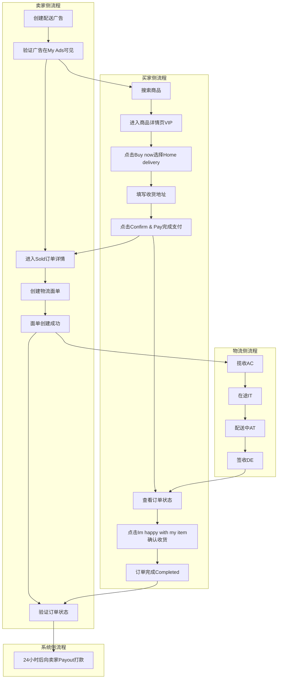
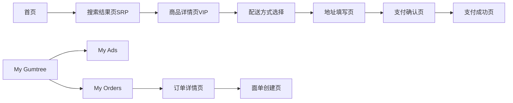
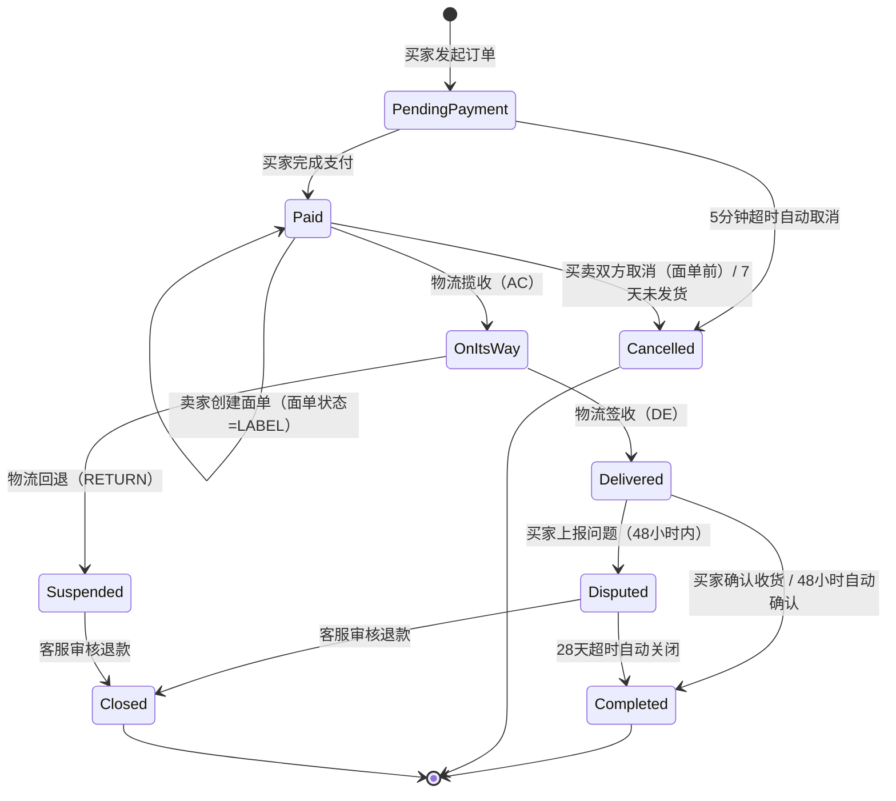

# Pay&Ship业务域 - 业务全景

## 1. 业务定位
Pay&Ship 业务域是 Gumtree 平台的核心交易业务之一，为买卖双方提供一站式的在线交易与配送服务。

**业务价值**：
- 为**卖家**提供便捷的在线收款和物流面单创建服务，降低二手交易的信任门槛
- 为**买家**提供安全的在线支付和到家配送体验，无需线下见面即可完成交易

**目标用户**：
- **卖家（Seller）**：已完成 KYC 认证、绑定 MangoPay 钱包和银行账户的注册用户
- **买家（Buyer）**：已注册并添加支付卡（或 Google Pay / Apple Pay）的用户

## 2. 业务范围

### 2.1 功能覆盖

| 功能模块 | 说明 | 核心能力 |
|---------|------|---------|
| 配送广告发布 | 卖家创建启用配送功能的广告 | API 创建、parcel_size 设置、类目限制 |
| 在线支付 | 买家通过 MangoPay 完成支付 | 支付卡、Google Pay、Apple Pay |
| 面单管理 | 卖家创建物流面单 | 面单创建、QR 码生成、面单下载 |
| 物流追踪 | 通过 Webhook 追踪物流状态 | AC/IT/AT/DE 状态流转 |
| 收货确认 | 买家确认收到商品 | 手动确认、48小时自动确认 |
| 资金结算 | 系统向卖家打款 | 24小时后 Payout |
| 订单管理 | 买卖双方查看和管理订单 | My Orders（Bought/Sold） |

### 2.2 地域覆盖
- **UK 站**：支持有效的英国地址（Home Delivery / Click & Collect）

### 2.3 用户角色

| 角色 | 权限 | 说明 |
|-----|------|------|
| 卖家（Seller） | 创建配送广告、创建面单、查看 Sold 订单、评价买家 | 需完成 KYC、绑定 MangoPay 钱包和银行账户 |
| 买家（Buyer） | 搜索商品、下单支付、填写地址、确认收货、上报问题、评价卖家 | 需注册账号、添加支付卡 |

## 3. 业务流程全景图

## 4. 核心业务流程概览

### 4.1 Pay&Ship 到家正向流程
**业务目标**：为买卖双方提供完整的"下单支付 → 面单创建 → 物流配送 → 签收确认"到家配送交易体验。

**核心步骤**：
1. 卖家创建启用配送的广告（API，指定 parcel_size）
2. 买家搜索商品并进入详情页（VIP），确认存在「Buy now」和物流费用
3. 买家选择 Home delivery，填写收货地址
4. 买家点击「Confirm & Pay」完成支付，获取 8 位订单号（Paid）
5. 卖家创建面单（Create label → Continue），面单创建后不可取消
6. 物流揽收（AC）→ 订单变为 On its way
7. 物流在途（IT）→ 配送中（AT）→ 状态不变
8. 物流签收（DE）→ 订单变为 Delivered
9. 买家点击「I'm happy with my item」→ 订单变为 Completed
10. 系统 24 小时后向卖家打款

**关键观测点**：
- ✅ VIP 页面显示「Buy now」按钮和物流费用信息
- ✅ 支付成功后显示 8 位订单号
- ✅ 面单创建后订单不可取消（QR 码或 Download 按钮可见）
- ✅ AC 后订单状态变为 On its way，DE 后变为 Delivered
- ✅ 确认收货按钮为「I'm happy with my item」
- ✅ 确认后订单状态变为 Completed

**详细流程文档**：[Pay&Ship到家正向流程业务流程](./Pay&Ship到家正向流程业务流程.md)

---

## 5. 页面拓扑关系

### 5.1 页面入口矩阵

| 页面 | 入口1 | 入口2 | 入口3 |
|-----|------|------|------|
| 首页（搜索框） | App 启动 | 底部 Tab 切换 | - |
| 搜索结果页（SRP） | 首页搜索提交 | - | - |
| 商品详情页（VIP） | SRP 点击商品 | - | - |
| 配送方式选择页 | VIP 点击「Buy now」 | - | - |
| 地址填写页 | 选择 Home delivery | - | - |
| 支付确认页 | 地址填写完成 | - | - |
| 支付成功页 | 支付完成自动跳转 | - | - |
| My Gumtree | 底部 Tab | - | - |
| My Ads | My Gumtree 点击 My Ads | - | - |
| My Orders（Bought/Sold） | My Gumtree 点击 My Orders | - | - |
| 订单详情页 | My Orders 点击具体订单 | - | - |
| 面单创建页 | 订单详情点击「Create label」 | - | - |

### 5.2 页面跳转流程图

### 5.3 页面关系详解

#### 首页 → 搜索结果页（SRP）
- **入口**：在首页搜索框输入关键词并提交
- **目标**：展示匹配商品列表，带 Ship 标识的商品支持配送
- **参数**：搜索关键词

#### 搜索结果页（SRP） → 商品详情页（VIP）
- **入口**：点击搜索结果中的商品卡片
- **目标**：展示商品详细信息、价格、物流费用
- **参数**：advert_id

#### 商品详情页（VIP） → 配送方式选择
- **入口**：点击「Buy now」按钮
- **目标**：选择配送方式（Home delivery / Click & Collect）
- **权限**：买家已登录

#### 地址填写页 → 支付确认页
- **入口**：填写完收货地址后
- **目标**：展示订单总金额（商品价格 + 物流费）
- **参数**：收货地址信息（Address line 1, City, Postcode, Phone）

#### 支付确认页 → 支付成功页
- **入口**：点击「Confirm & Pay」按钮
- **目标**：展示支付成功信息和 8 位订单号
- **数据**：订单号、支付金额、订单状态（Paid）

#### 订单详情页 → 面单创建页
- **入口**：卖家在 Sold 订单详情中点击「Create label」
- **目标**：创建物流面单
- **权限**：仅卖家可操作
- **流程**：点击 Create label → 点击 Continue → 面单生成（QR码）

## 6. 业务数据流转

### 6.1 订单状态流转

### 6.2 用户操作与数据变化

| 操作 | 数据变化 | 前台展示变化 | 涉及页面 |
|-----|---------|------------|---------|
| 卖家创建广告 | 新增广告记录（advert_id, title, price, parcel_size） | My Ads 列表新增一条广告 | My Ads |
| 买家搜索商品 | 无数据变化 | SRP 展示匹配商品列表（含 Ship 标识） | 首页、SRP |
| 买家完成支付 | 新增订单记录，状态=Paid，生成 8 位订单号 | 跳转支付成功页，My Orders 新增订单 | 支付确认页、支付成功页 |
| 卖家创建面单 | 面单状态=LABEL，订单不可取消 | 显示 QR 码/Download 按钮 | 订单详情、面单创建页 |
| 物流揽收（AC） | 订单状态 Paid→On its way | 订单详情显示 On its way | 订单详情页 |
| 物流签收（DE） | 订单状态 On its way→Delivered | 买家出现确认收货按钮 | 订单详情页 |
| 买家确认收货 | 订单状态 Delivered→Completed | 显示 Completed / Leave a review | 订单详情页 |
| 系统打款 | 卖家 MangoPay 钱包入账 | 卖家收到 Payout | 系统后台 |

### 6.3 关键业务数据

#### 广告信息

| 字段 | 类型 | 必填 | 说明 |
|-----|------|-----|------|
| advert_id | String | 是 | 广告唯一标识 |
| title | String | 是 | 广告标题 |
| price | Decimal | 是 | 商品价格（£1 - £250） |
| parcel_size | String | 是 | 包裹尺寸：small / medium / large |
| category | String | 是 | 商品类目（Pay&Ship 开放类目） |
| delivery_enabled | Boolean | 是 | 是否启用配送 |

#### 订单信息

| 字段 | 类型 | 必填 | 说明 |
|-----|------|-----|------|
| order_no | String（8位） | 是 | 订单号 |
| order_status | String | 是 | Paid / On its way / Delivered / Completed |
| tracking_number | String | 是 | 物流追踪号 |
| label_status | String | 否 | 面单状态：LABEL |
| shipping_status | String | 否 | AC / IT / AT / DE |
| delivery_method | String | 是 | HOME / COLLECT |

#### 收货地址

| 字段 | 类型 | 必填 | 说明 |
|-----|------|-----|------|
| address_line_1 | String | 是 | 街道地址 |
| city | String | 是 | 城市 |
| postcode | String | 是 | 英国邮编 |
| phone | String | 是 | 联系电话 |

## 7. 关键业务规则索引

### 7.1 交易流程相关
- [Pay&Ship到家正向流程规则.md](../../业务规则库/Pay&Ship模块/Pay&Ship到家正向流程规则.md)
- [Pay&Ship到家正向流程规则.md - 订单取消规则](../../业务规则库/Pay&Ship模块/Pay&Ship到家正向流程规则.md#订单取消规则)
- [Pay&Ship到家正向流程规则.md - 时间约束](../../业务规则库/Pay&Ship模块/Pay&Ship到家正向流程规则.md#时间约束)

### 7.2 支付相关
- [Pay&Ship到家正向流程规则.md - 支付规则](../../业务规则库/Pay&Ship模块/Pay&Ship到家正向流程规则.md#35-支付规则)
- [3DS认证支付规则.md](../../业务规则库/支付模块/3DS认证支付规则.md)

### 7.3 物流相关
- [Pay&Ship到家正向流程规则.md - 物流状态码映射](../../业务规则库/Pay&Ship模块/Pay&Ship到家正向流程规则.md#物流状态码映射)
- [Pay&Ship到家正向流程规则.md - 配送方式差异](../../业务规则库/Pay&Ship模块/Pay&Ship到家正向流程规则.md#配送方式差异)

## 8. 业务FAQ

### Q1: Pay & Ship 支持哪些商品类目？
**A**: 仅限 Pay & Ship 开放类目，如 Electronics > Mobile Phones。具体类目清单需由产品团队提供。

### Q2: 商品价格范围是多少？
**A**: £1 - £250 之间。超出范围的商品无法使用 Pay & Ship 功能。

### Q3: 面单创建后还能取消订单吗？
**A**: 不能。面单创建后买卖双方均不可取消订单。只有在面单创建前，已支付状态下双方才可取消。

### Q4: 买家多久需要确认收货？
**A**: 物流签收后 48 小时内买家可手动点击「I'm happy with my item」确认收货。超过 48 小时系统自动确认。

### Q5: 卖家什么时候能收到货款？
**A**: 买家确认收货（或系统自动确认）后 24 小时，系统自动通过 MangoPay 向卖家打款（Payout）。

### Q6: Home Delivery 和 Click & Collect 有什么区别？
**A**: Home Delivery 物流直接送到买家地址，DE 状态触发「已签收」；Click & Collect 物流送到自提点，SP 状态触发「送达自提点」，买家取件后才算签收。

### Q7: 支付按钮的名称是什么？
**A**: 支付确认按钮为「Confirm & Pay」（不是「Pay now」），确认收货按钮为「I'm happy with my item」（不是「Confirm receipt」）。

### Q8: 物流状态 IT 和 AT 会影响订单状态吗？
**A**: 不会。IT（在途）和 AT（配送中）只是物流中间状态，不会改变订单状态。只有 AC（揽收）和 DE（签收）会触发订单状态变更。

### Q9: 如何处理买家收到的商品有问题的情况？
**A**: 买家在签收后 48 小时内可上报问题，系统会创建 Salesforce 客诉工单，由客服审核退款。超过 28 天未处理的客诉会自动关闭。

### Q10: 测试中如何模拟物流状态变更？
**A**: 使用 ShippingWebhook API Mock，按 AC → IT → AT → DE 顺序发送状态，每次间隔 3 秒。

## 9. 业务指标（可选）

### 9.1 核心指标
- **订单完成率**：待补充
- **平均配送时长**：待补充
- **卖家打款成功率**：待补充

### 9.2 漏斗指标
- **交易漏斗**：搜索商品 → 进入详情页 → 点击 Buy now → 完成支付 → 卖家发货 → 物流签收 → 买家确认 → 订单完成

## 10. 已知问题与风险

### 10.1 产品待确认问题
1. 广告通过 API 创建而非 App UI 手动填写，实际用户体验的 UI 发布流程待验证
2. Click & Collect 自提模式的完整测试流程待补充
3. Pay & Ship 开放类目完整清单待产品团队提供

### 10.2 技术风险
- 物流状态通过 Mock Webhook 模拟，与真实物流回调可能存在时序差异
- 48 小时自动确认收货和 24 小时资金结算在测试环境中等待时间过长，建议使用缩短配置或手动触发
- KYC/3DS 认证在测试过程中可能被触发，需准备预认证账号

### 10.3 测试过程中发现的问题
- 待测试后补充

## 11. 变更历史

| 日期 | 版本 | 变更内容 | 变更人 |
|------|------|---------|--------|
| 2026-04-16 | v1.0 | 初始版本：基于 TC-PayShip-E2E-001 测试用例生成业务全景文档 | AI Assistant |
