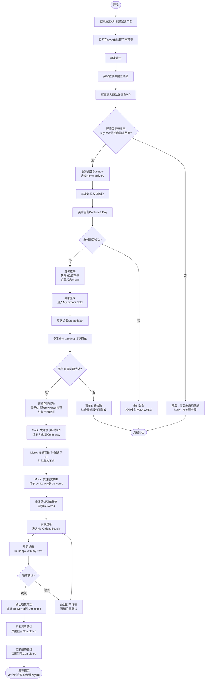

# Pay&Ship到家正向流程业务流程

> **业务目标**：为买卖双方提供完整的"下单支付 → 面单创建 → 物流配送 → 签收确认"到家配送交易体验，确保订单状态在每个阶段正确流转，最终完成交易并向卖家打款。

---

## 1. 完整流程图

---

## 2. 详细步骤与观测点

### 步骤1：卖家创建配送广告
**页面位置**：API 调用（`create_delivery_enabled_advert_with_info`）

**操作**：
1. 使用卖家账号登录 App
2. 调用 API 创建广告，参数：env（测试环境）、parcel_size=small
3. 重启 App，进入 My Gumtree → My Ads
4. 查找刚创建的广告标题

**观测点**：
- ✅ API 返回广告信息（advert_id、title、price、parcel_size）
- ✅ 广告创建成功，配送功能已启用
- ✅ 广告在 My Ads 列表中可见
- ❌ 如果 API 返回错误，检查环境配置和账号 KYC 状态

**验证方法**：
- 检查 API 响应中包含 advert_id、title、price 等字段
- 在 My Ads 列表中搜索广告标题确认可见

**关联规则**：[Pay&Ship到家正向流程规则.md - 输入规则](../../业务规则库/Pay&Ship模块/Pay&Ship到家正向流程规则.md#31-输入规则)

---

### 步骤2：买家搜索并进入商品详情页
**页面位置**：首页搜索框 → 搜索结果页（SRP）→ 商品详情页（VIP）

**操作**：
1. 卖家登出，买家登录 App
2. 在首页搜索框输入广告标题关键词
3. 提交搜索，等待结果加载
4. 在搜索结果中找到对应商品（包含 Ship 标识）
5. 点击商品进入详情页

**观测点**：
- ✅ 搜索结果页显示卖家发布的商品
- ✅ 商品带有 Ship 标识
- ✅ 成功进入商品详情页
- ✅ 详情页显示「Buy now」按钮
- ✅ 显示物流费用信息
- ❌ 搜索结果为空时，检查广告发布状态和搜索关键词

**验证方法**：
- 在 SRP 中确认商品标题与创建时一致
- 在 VIP 中确认存在「Buy now」按钮和物流费用展示

**关联规则**：[Pay&Ship到家正向流程规则.md - 权限规则](../../业务规则库/Pay&Ship模块/Pay&Ship到家正向流程规则.md#33-权限规则)

---

### 步骤3：买家选择配送方式并填写地址
**页面位置**：配送方式选择页 → 地址填写页

**操作**：
1. 点击「Buy now」按钮
2. 选择配送方式：Home delivery（配送到家）
3. 填写 Address line 1、City、Postcode、Phone
4. 确认地址信息无误

**观测点**：
- ✅ 点击 Buy now 后进入配送方式选择
- ✅ 选择 Home delivery 后进入地址填写页面
- ✅ 地址填写成功（若已有保存地址则自动填充）
- ❌ 地址格式不符合英国邮编规范时应有校验提示

**验证方法**：
- 确认所有必填字段已填写
- 检查页面是否支持历史地址自动填充

**关联规则**：[Pay&Ship到家正向流程规则.md - 输入规则](../../业务规则库/Pay&Ship模块/Pay&Ship到家正向流程规则.md#31-输入规则)

---

### 步骤4：买家完成支付
**页面位置**：支付确认页 → 支付成功页

**操作**：
1. 滚动到页面底部，找到「Confirm & Pay」按钮
2. 点击「Confirm & Pay」按钮
3. 等待支付处理完成（约 15 秒）

**观测点**：
- ✅ 支付成功，显示支付成功页面
- ✅ 页面中出现 8 位订单号（Order No）
- ✅ **订单状态**：Paid（已支付）
- ✅ 买家在 My Orders 页面可查看订单
- ⚠️ 支付按钮名称为「Confirm & Pay」，不是「Pay now」
- ❌ 支付失败时检查支付卡有效性、KYC 状态、3DS 认证

**验证方法**：
- 确认支付成功页面出现 8 位订单号
- 进入 My Orders → Bought 确认订单可见
- 此时买卖双方均可取消订单

**关联规则**：[Pay&Ship到家正向流程规则.md - 支付规则](../../业务规则库/Pay&Ship模块/Pay&Ship到家正向流程规则.md#35-支付规则)

---

### 步骤5：卖家创建面单
**页面位置**：My Gumtree → My Orders → Sold → 订单详情 → 面单创建页

**操作**：
1. 买家登出，卖家登录 App
2. 进入 My Gumtree → My Orders → Sold 标签
3. 找到对应订单并点击进入详情
4. 点击「Create label」按钮
5. 在面单创建页点击「Continue」提交

**观测点**：
- ✅ 成功进入订单详情页
- ✅ 存在「Create label」按钮
- ✅ 面单创建成功，页面出现以下任一标识：
  - 显示 "Label Generated" 文字
  - 出现 QR 码相关元素
  - 出现 "Download" 或 "Save" 按钮
- ✅ **订单状态**：仍为 Paid（面单创建后订单状态暂不变更）
- ✅ **面单状态**：LABEL（已创建）
- ✅ 订单操作限制：买卖双方不可再取消订单
- ❌ 面单创建失败时检查物流服务商集成状态

**验证方法**：
- 确认页面出现 QR 码或 Download/Save 按钮
- 尝试取消订单操作应被拒绝

**关联规则**：[Pay&Ship到家正向流程规则.md - 业务约束](../../业务规则库/Pay&Ship模块/Pay&Ship到家正向流程规则.md#34-业务约束)

---

### 步骤6：物流状态变更（AC → IT → AT → DE）
**页面位置**：API Mock（ShippingWebhook）

**操作**：
1. 调用 `ShippingWebhook.send_accepted(tracking_number)` 发送 AC 状态
2. 等待 3 秒
3. 调用 `ShippingWebhook.send_in_transit(tracking_number)` 发送 IT 状态
4. 等待 3 秒
5. 调用 `ShippingWebhook.send_delivery_attempt(tracking_number)` 发送 AT 状态
6. 等待 3 秒
7. 调用 `ShippingWebhook.send_delivered(tracking_number, delivery_method="HOME")` 发送 DE 状态

**观测点**：
- ✅ AC 发送后：订单状态 Paid → **On its way**
- ✅ IT 发送后：订单状态保持 **On its way** 不变
- ✅ AT 发送后：订单状态保持 **On its way** 不变
- ✅ DE 发送后：订单状态 On its way → **Delivered**
- ✅ 所有 Webhook 调用返回成功
- ❌ Webhook 调用失败时检查 tracking_number 和环境配置

**验证方法**：
- 每次 Webhook 发送后检查 API 响应状态
- DE 发送后刷新 App 确认订单状态变更为 Delivered

**关联规则**：[Pay&Ship到家正向流程规则.md - 物流状态码映射](../../业务规则库/Pay&Ship模块/Pay&Ship到家正向流程规则.md#34-业务约束)

---

### 步骤7：卖家验证订单状态
**页面位置**：My Gumtree → My Orders → Sold → 订单详情

**操作**：
1. 重启 App（卖家账号仍处于登录状态）
2. 进入 My Gumtree → My Orders → Sold 标签
3. 找到订单并点击进入详情页

**观测点**：
- ✅ 订单详情页显示以下任一状态关键字：Delivered、On its way、Dispatched
- ❌ 如果仍显示 Paid 状态，检查 Webhook 是否发送成功

**验证方法**：
- 在订单详情页搜索状态关键字
- 确认卖家视角的订单状态与物流状态一致

**关联规则**：[Pay&Ship到家正向流程规则.md - 订单状态流转规则](../../业务规则库/Pay&Ship模块/Pay&Ship到家正向流程规则.md#34-业务约束)

---

### 步骤8：买家确认收货
**页面位置**：My Gumtree → My Orders → Bought → 订单详情

**操作**：
1. 卖家登出，买家登录 App
2. 进入 My Gumtree → My Orders → Bought 标签
3. 找到对应订单并点击进入详情
4. 点击「I'm happy with my item」按钮
5. 弹出 "Check your item" 确认弹窗
6. 点击弹窗中的「I'm happy with my item」按钮（Y坐标较大的那个）

**观测点**：
- ✅ 订单详情页显示以下任一状态：Delivered、On its way、In transit
- ✅ 页面中存在「I'm happy with my item」按钮
- ✅ 确认收货成功，满足以下任一条件：
  - 显示 "Order Completed" 文字
  - 显示 "Leave a review" 按钮
  - 确认收货按钮消失且页面包含 completed / delivered / review 等关键词
- ✅ **订单状态**：Delivered → **Completed**
- ⚠️ 确认收货按钮名称为「I'm happy with my item」，不是 "Confirm receipt"
- ⚠️ 弹窗中有两个同名按钮，需点击 Y 坐标较大的那个
- ❌ 如果没有确认收货按钮，检查物流签收状态是否已更新

**验证方法**：
- 确认弹窗正常弹出和关闭
- 确认页面状态变更为 Completed 或显示 "Leave a review"

**关联规则**：[Pay&Ship到家正向流程规则.md - 业务约束](../../业务规则库/Pay&Ship模块/Pay&Ship到家正向流程规则.md#34-业务约束)

---

### 步骤9：最终状态验证
**页面位置**：买家 My Orders → Bought / 卖家 My Orders → Sold

**操作**：
1. 买家重启 App，进入 My Orders → Bought，确认订单最终状态
2. 买家登出
3. 卖家登录 App，进入 My Orders → Sold，确认订单最终状态
4. 卖家登出，整个 E2E 流程完成

**观测点**：
- ✅ 买家视角：页面包含以下任一关键字：Completed、Received、Leave a review、Rate seller
- ✅ 卖家视角：页面包含以下任一关键字：Completed、Delivered、Received
- ✅ 买卖双方均已成功登出
- ✅ 系统将在 24 小时后向卖家打款（Payout）
- ✅ 买卖双方可互评

**验证方法**：
- 分别以买家和卖家身份登录确认订单最终状态
- 确认登出操作成功

**关联规则**：[Pay&Ship到家正向流程规则.md - 订单状态流转规则](../../业务规则库/Pay&Ship模块/Pay&Ship到家正向流程规则.md#34-业务约束)

---

## 3. 流程完整性验证清单

- [ ] 卖家 KYC 认证已完成、MangoPay 钱包已绑定、银行账户已添加
- [ ] 买家账号已注册、支付卡已添加
- [ ] API 创建配送广告成功，返回 advert_id
- [ ] 广告在 My Ads 列表中可见
- [ ] 搜索结果中商品带有 Ship 标识
- [ ] VIP 页面显示「Buy now」按钮和物流费用
- [ ] 选择 Home delivery 后进入地址填写页面
- [ ] 收货地址四个必填字段全部填写
- [ ] 支付按钮为「Confirm & Pay」且支付成功
- [ ] 支付成功页显示 8 位订单号
- [ ] 已支付状态下买卖双方可取消订单
- [ ] 面单创建成功（QR 码 / Download 按钮可见）
- [ ] 面单创建后买卖双方不可取消订单
- [ ] AC Webhook 后订单状态变为 On its way
- [ ] IT/AT Webhook 后订单状态保持 On its way
- [ ] DE Webhook 后订单状态变为 Delivered
- [ ] 卖家视角订单显示 Delivered 相关状态
- [ ] 买家视角出现「I'm happy with my item」按钮
- [ ] 确认收货后订单状态变为 Completed
- [ ] 买家最终验证显示 Completed / Leave a review
- [ ] 卖家最终验证显示 Completed / Delivered

---

## 4. 关联文档

- [Pay&Ship业务全景](./Pay&Ship业务全景.md)
- [Pay&Ship到家正向流程规则.md](../../业务规则库/Pay&Ship模块/Pay&Ship到家正向流程规则.md)
- [3DS认证支付规则.md](../../业务规则库/支付模块/3DS认证支付规则.md)

---

## 5. 变更历史

| 日期 | 版本 | 变更内容 | 变更人 |
|------|------|---------|--------|
| 2026-04-16 | v1.0 | 初始版本：基于 TC-PayShip-E2E-001 测试用例生成完整业务流程文档 | AI Assistant |
