# Pay & Ship E2E 主流程业务流程

> **业务目标**：实现买卖双方二手商品从发布广告、在线支付到物流配送、确认收货的完整端到端交易闭环，保障买家权益（Buyer Protection），确保资金安全流转

---

## 1. 完整流程图

```mermaid
graph TD
    Start([卖家发布广告]) --> A1[选择开放 Pay&Ship 类目]
    A1 --> A2{价格在 1-250 英镑?}
    A2 -->|否| A3[Enable delivery 不可见\n普通广告发布]
    A2 -->|是| A4[显示 Enable delivery 开关]
    A4 --> A5{卖家勾选 Enable delivery?}
    A5 -->|否| A3
    A5 -->|是| A6[选择包裹尺寸 小/中/大]
    A6 --> A7{包裹尺寸已选?}
    A7 -->|否| A8[提示 Please select parcel size]
    A7 -->|是| A9[发布广告成功\n广告详情页展示 Buy now 按钮]

    A9 --> B1[买家访问广告详情页]
    B1 --> B2{是广告发布者本人?}
    B2 -->|是| B3[不显示 Buy now 按钮]
    B2 -->|否| B4[显示 Buy now 按钮 + 配送费用]
    B4 --> B5[买家点击 Buy now → 进入 Checkout]

    B5 --> C1[选择配送方式]
    C1 --> C2{配送到家 or 到自提点?}
    C2 -->|配送到家| C3[选择/添加收货地址]
    C2 -->|配送到自提点| C4[选择自提点 Nearby/Recently used/搜索]
    C3 --> C5[系统计算费用明细]
    C4 --> C5
    C5 --> C6[买家选择/添加银行卡]
    C6 --> C7{首次购买?}
    C7 -->|是| C8[系统异步创建 MangoPay 买家账户]
    C7 -->|否| C9[使用已保存银行卡]
    C8 --> C10[点击 Confirm & Pay]
    C9 --> C10
    C10 --> C11{触发 3DS?}
    C11 -->|是| C12[跳转 3DS 认证页面]
    C12 --> C13{3DS 通过?}
    C13 -->|否| C14[支付失败，提示重试]
    C13 -->|是| C15[支付成功]
    C11 -->|否| C15
    C15 --> C16[跳转订单成功页\n订单状态：Awaiting dispatch]

    C16 --> D1[卖家进入订单详情页]
    D1 --> D2{已注册 MangoPay 卖家身份?}
    D2 -->|否| D3[跳转 MangoPay 卖家注册\n完成 SCA/KYC 认证]
    D2 -->|是| D4[进入创建面单 preview 页]
    D3 --> D4
    D4 --> D5[系统自动填充发货地址和收货地址]
    D5 --> D6[卖家选择投递点]
    D6 --> D7[点击 Create label]
    D7 --> D8{面单创建成功?}
    D8 -->|否| D9[提示错误，建议重试]
    D8 -->|是| D10[生成面单条码和追踪号\n7天内发货，否则系统自动取消]

    D10 --> E1[卖家将包裹投递到投递点]
    E1 --> E2[承运商扫码接收\n物流回调 AC]
    E2 --> E3[订单状态 → On its way]
    E3 --> E4[物流运输中\n物流回调 IT]
    E4 --> E5{配送方式?}
    E5 -->|配送到家| E6[快递员上门投递\n物流回调 DE]
    E5 -->|配送到自提点| E7[包裹送达自提点\n物流回调 SP\n订单状态 → Arrived]
    E7 --> E8{买家 10天/3天内取件?}
    E8 -->|超期| E9[包裹退回\n物流回调 RETURN\n订单状态 → Suspended]
    E8 -->|已取件| E10[自提点扫码签收\n物流回调 DE]
    E6 --> E11[订单状态 → Delivered]
    E10 --> E11

    E11 --> F1[买家订单详情页显示\nConfirm received 按钮]
    F1 --> F2{48小时内买家操作?}
    F2 -->|确认收货| F3[订单状态 → Completed]
    F2 -->|上报问题| F4[订单状态 → Issue reported\n见逆向流程]
    F2 -->|超时未操作| F5[系统自动确认收货\n订单状态 → Completed]
    F3 --> F6[确认收货 24h 后系统 Payout 给卖家]
    F5 --> F6
    F6 --> F7[买卖双方互相评价\nLeave a review]
    F7 --> End([交易完成])
```

---

## 2. 详细步骤与观测点

### 步骤1：卖家发布广告
**页面位置**：广告发布页（Post Ad）

**操作**：
1. 登录卖家账号，进入广告发布页
2. 选择开放 Pay & Ship 的类目（for-sale > clothing）
3. 填写商品标题、价格（如 £50）、描述、图片
4. 勾选"Enable delivery"开关
5. 选择包裹尺寸（小/中/大）
6. 点击"Post ad"

**观测点**：
- ✅ 开放类目 + 价格 1-250 英镑时，Enable delivery 开关可见且可操作
- ✅ 勾选 Enable delivery 后，包裹尺寸选择弹窗/区域出现
- ✅ 发布成功后跳转广告详情页
- ✅ 广告详情页（卖家视角）显示"Delivery enabled"标识
- ✅ My ads 列表中该广告显示"Delivery enabled"标签
- ❌ 非开放类目时，Enable delivery 开关不可见
- ❌ 价格 < £1 或 > £250 时，Enable delivery 开关不可见
- ❌ 勾选 Enable delivery 但未选包裹尺寸，点击发布：提示"Please select parcel size"，阻止提交

**验证方法**：
- 分别测试边界值：£1、£250 可见；£0.99、£250.01 不可见
- 测试非开放类目（如 for-sale > electronics）不显示 Enable delivery 开关

**关联规则**：[广告发布规则.md - 3.2 校验规则](../../业务规则库/PayShip模块/广告发布规则.md#32-校验规则)

---

### 步骤2：买家下单（Checkout）
**页面位置**：广告详情页 → Checkout 提单页

**操作**：
1. 以非卖家账号登录，访问该广告详情页
2. 确认页面显示"Buy now"按钮和配送费用
3. 点击"Buy now"，进入 Checkout 页面
4. 选择配送方式：配送到家 或 配送到自提点
5. 选择/添加收货地址（到家）或选择自提点（到自提点）
6. 查看费用明细

**观测点**：
- ✅ 广告详情页显示 Buy now 按钮 + 配送费用（到家/到自提点两种价格）
- ✅ Checkout 页面显示费用明细：Item Price + Delivery Fee + Buyer Protection Fee + Your Total
- ✅ Buyer Protection Fee 计算正确：价格 × 5% + £0.7
- ✅ 选择配送到家：展示地址列表，可添加新地址
- ✅ 选择配送到自提点：展示 Nearby / Recently used Tab，显示最多 10 个自提点
- ✅ 没有默认地址时，Nearby 自提点使用 London 定位
- ❌ 卖家访问自己的广告详情页：不显示 Buy now 按钮

**验证方法**：
- 验证费用计算：商品 £50 + 中包裹到家 £3.99 + Buyer Protection Fee £3.20 = Total £57.19
- 验证自提点 Nearby 列表按距离升序排列

**关联规则**：[支付结算规则.md - 3.2 费用计算规则](../../业务规则库/PayShip模块/支付结算规则.md#32-费用计算规则)

---

### 步骤3：买家支付
**页面位置**：Checkout 页面 → MangoPay 3DS 认证页（可选）→ 订单成功页

**操作**：
1. 点击"Add payment method"，选择银行卡
2. 填写银行卡信息
3. 点击"Confirm & Pay"
4. 若触发 3DS，在认证页完成认证

**观测点**：
- ✅ 首次支付时，系统异步在后台创建 MangoPay 买家账户（用户无感知）
- ✅ 异地使用时触发 3DS 认证，跳转 MangoPay 3DS 页面
- ✅ 支付成功后跳转订单成功页
- ✅ 订单成功页显示订单号、商品信息、配送信息
- ✅ 买家订单列表出现新订单，状态：Awaiting dispatch
- ✅ 卖家订单列表同步出现该订单，状态：Awaiting dispatch
- ❌ 5 分钟内未完成支付：订单自动取消，买卖双方订单列表均不显示

**验证方法**：
- 使用测试卡号 4970105181818183（触发 3DS）验证 3DS 流程
- 使用测试卡号 5555555555554444（不触发 3DS）验证快速支付

**关联规则**：[支付结算规则.md - 3.3 校验规则](../../业务规则库/PayShip模块/支付结算规则.md#33-校验规则)

---

### 步骤4：卖家创建面单发货
**页面位置**：卖家订单详情页 → 创建面单页

**操作**：
1. 卖家进入订单列表，找到待发货订单
2. 点击"Ship item"
3. 若未注册 MangoPay 卖家身份，完成注册
4. 查看面单 preview：发货地址（Send From）和收货地址（Send To）
5. 选择投递点（Drop-off point）
6. 点击"Create label"

**观测点**：
- ✅ 发货地址自动从个人中心默认地址获取
- ✅ 收货地址自动从订单地址快照获取（下单时的地址）
- ✅ 投递点列表从物流平台实时拉取，按距离升序排列
- ✅ 面单创建成功后显示面单条码和追踪号
- ✅ 创建面单后，买卖双方不可取消订单
- ❌ 7 天内未实际发货（未投递）：系统自动取消订单并全额退款

**验证方法**：
- 确认面单创建成功后，订单详情页"Cancel order"按钮不再显示

**关联规则**：[物流配送规则.md - 3.3 发货/收货地址规则](../../业务规则库/PayShip模块/物流配送规则.md#33-发货收货地址规则)

---

### 步骤5：物流正向流转
**页面位置**：买家/卖家订单详情页（物流追踪信息）

**操作**：
1. 卖家将包裹投递到投递点
2. 测试环境：通过 Webhook 接口模拟物流回调（AC → IT → DE/SP）
3. 查看买家/卖家订单状态变化

**观测点**：
- ✅ AC 回调后：订单状态 → On its way；更新 ship_date 和 estimated_delivery_date
- ✅ IT 回调后：订单状态不变；物流追踪信息更新
- ✅ DE 回调后（配送到家）：订单状态 → Delivered；显示"Confirm received"按钮
- ✅ SP 回调后（配送到自提点）：订单状态 → Arrived；显示取件倒计时（商店10天/自提柜3天）
- ✅ 自提点取件后 DE 回调：订单状态 → Delivered
- ✅ 物流追踪页面显示完整状态时间轴
- ⚠️ AT（尝试配送）状态：订单状态不变，实际物流商很少调用

**验证方法**：
- 使用 `test_cases/PayShip/utils/ship_webhook.py` 模拟各物流状态回调
- 或通过 AREX 平台调用 Webhook 接口

**关联规则**：[物流配送规则.md - 3.1 物流状态映射规则](../../业务规则库/PayShip模块/物流配送规则.md#31-物流状态映射规则)

---

### 步骤6：买家签收确认收货
**页面位置**：买家订单详情页

**操作**：
1. 收到 Delivered 状态通知
2. 进入买家订单详情页
3. 点击"Confirm received"按钮
4. 确认操作

**观测点**：
- ✅ Delivered 状态下，48小时内显示"Confirm received"和"Report an issue"按钮
- ✅ 手动确认收货后：订单状态 → Completed
- ✅ 确认收货 24 小时后：系统向卖家 payout（商品金额打入卖家银行账户）
- ✅ Completed 状态后：显示"Leave a review"按钮
- ✅ 签收超过 48 小时未操作：系统自动确认收货 → Completed
- ✅ 评价提交后："Leave a review"按钮消失

**验证方法**：
- 确认收货后查看卖家订单列表，状态同步为 Completed
- 验证互相评价：买家评价后，聊天页评价入口消失

**关联规则**：[订单管理规则.md - 3.3 签收与确认收货规则](../../业务规则库/PayShip模块/订单管理规则.md#33-签收与确认收货规则)

---

## 3. 流程完整性验证清单

- [ ] 广告在开放类目 + 价格 1-250 英镑时，Enable delivery 开关可见
- [ ] 勾选 Enable delivery 必须选择包裹尺寸，否则阻止提交
- [ ] Buy now 按钮仅对非广告发布者显示
- [ ] 费用计算公式正确：Buyer Protection Fee = 价格 × 5% + £0.7
- [ ] 支付 5 分钟超时后，订单对买卖双方均不可见
- [ ] 创建面单后，买卖双方均不可取消订单
- [ ] 7 天未发货，系统自动取消并退款
- [ ] AC 回调后订单状态变为 On its way
- [ ] DE 回调后订单状态变为 Delivered，显示 Confirm received 按钮
- [ ] SP 回调（自提点）后订单状态变为 Arrived，显示超期倒计时
- [ ] 签收 48 小时内可手动确认收货或上报问题
- [ ] 签收 48 小时后系统自动确认收货 → Completed
- [ ] 确认收货 24 小时后系统向卖家 payout
- [ ] 评价提交后不可重复评价（Leave a review 按钮消失）
- [ ] 资金流转：Item Price → 卖家钱包；Ship Price + Buyer Protection Fee → Gumtree 钱包

---

## 4. 关联文档

- [PayShip 业务全景](./PayShip业务全景.md)
- [广告发布规则.md](../../业务规则库/PayShip模块/广告发布规则.md)
- [支付结算规则.md](../../业务规则库/PayShip模块/支付结算规则.md)
- [物流配送规则.md](../../业务规则库/PayShip模块/物流配送规则.md)
- [订单管理规则.md](../../业务规则库/PayShip模块/订单管理规则.md)

---

## 5. 变更历史

| 日期 | 版本 | 变更内容 | 变更人 |
|------|------|---------|--------|
| 2026-04-16 | v1.0 | 初始版本，来源：PayShip_Complete_TestPlan.md + GT Pay & Ship 业务.pdf | AI生成 |
