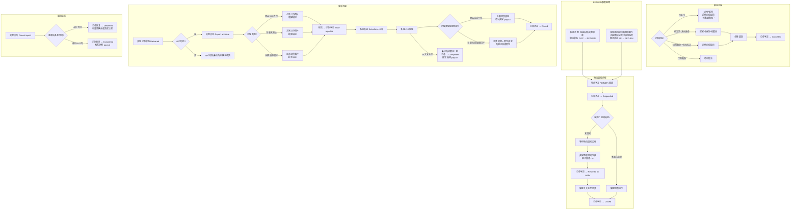

# Pay & Ship 逆向流程业务流程

> **业务目标**：处理 Pay & Ship 交易中的异常场景，包含订单取消退款、物流包裹退回、买家客诉处理，保障买家权益并公平处理买卖双方纠纷

---

## 1. 完整流程图

---

## 2. 详细步骤与观测点

### 步骤1：买家/卖家手动取消订单
**页面位置**：买家/卖家订单详情页

**操作**：
1. 进入订单详情页（订单状态：Awaiting dispatch，且未创建面单）
2. 点击"Cancel order"
3. 选择取消原因
4. 点击"Confirm cancellation"

**观测点**：
- ✅ 取消原因选择"Something else"时，描述框必填，否则提示"Please provide details"
- ✅ 取消成功后：订单状态 → Cancelled
- ✅ 订单移动到 Cancelled Tab
- ✅ 买家/卖家双方订单状态同步更新
- ✅ 系统触发全额退款（商品费 + 物流费 + 服务费）
- ❌ 已创建面单后：Cancel order 按钮不显示，不可取消

**验证方法**：
- 验证取消原因"Something else"必填校验
- 验证退款金额 = 完整订单总额

**关联规则**：[订单管理规则.md - 3.2 订单取消规则](../../业务规则库/PayShip模块/订单管理规则.md#32-订单取消规则)

---

### 步骤2：物流包裹退回（Suspended 流程）
**页面位置**：买家/卖家订单详情页

**操作（测试环境）**：
1. 通过 Webhook 模拟物流回调，状态：RETURN
2. 查看买家/卖家订单状态变化
3. 再次模拟 DE 回调（卖家签收退回包裹）
4. 查看最终订单状态

**观测点**：
- ✅ RETURN 回调后：订单状态 → Suspended（暂停）
- ✅ 买家订单详情页显示：包裹退回中的提示信息
- ✅ 卖家订单详情页显示：包裹正在退回中
- ✅ Suspended 状态下卖家签收退回包裹（DE 回调）：订单状态 → Returned to seller
- ✅ 需要客服介入才能完成退款，订单最终 → Closed
- ⚠️ 若客服先于卖家签收处理退款：订单 → Closed；后续 DE 回调不再改变订单状态（仅更新 order_ship 表）

**验证方法**：
- 使用 ship_webhook.py 发送 RETURN 状态回调
- 验证两种退回来源：投递失败（IT → RETURN）和超期未取件（SP → RETURN）

**关联规则**：[物流配送规则.md - 3.1 物流状态映射规则](../../业务规则库/PayShip模块/物流配送规则.md#31-物流状态映射规则)

---

### 步骤3：自提点超期退回
**页面位置**：买家订单详情页

**观测点**：
- ✅ SP 回调后，买家订单详情页显示取件倒计时：自提商店 10 天 / 自提柜 3 天
- ✅ 超期后物流回调 RETURN：订单状态 → Suspended
- ✅ 买家详情页显示：包裹因超期未取件正在退回

**关联规则**：[物流配送规则.md - 3.4 自提点超期规则](../../业务规则库/PayShip模块/物流配送规则.md#34-自提点超期规则)

---

### 步骤4：买家上报问题（客诉）
**页面位置**：买家订单详情页 → 上报问题页

**操作**：
1. 进入买家订单详情页（订单状态：Delivered，48小时内）
2. 点击"Report an issue"
3. 选择问题类型
4. 按要求上传图片（需要时）、填写描述
5. 点击"Submit report"

**观测点**：

**3a. 商品描述不符（Item is not as described）**：
- ✅ 必须上传至少 1 张图片，否则不可提交
- ✅ 提交后订单状态 → Issue reported
- ✅ 系统向 Salesforce 发送工单
- ✅ 客服处理后：全额退款买家，不对卖家 payout
- ✅ 订单状态 → Closed

**3b. 包裹未到达（Parcel didn't arrive）**：
- ✅ 无需上传图片，可直接提交
- ✅ 提交后订单状态 → Issue reported
- ✅ 客服处理后：退款买家 + 赔付卖家 + 向物流申请赔付
- ✅ 订单状态 → Closed

**3c. 运输途中损坏（Item is damaged in transit）**：
- ✅ 必须上传至少 1 张图片
- ✅ 客服处理后：退款买家 + 赔付卖家 + 向物流申请赔付

**共同观测点**：
- ✅ 上报后 28 天客服未处理：系统自动取消上报，订单 → Completed，触发卖家 payout
- ❌ 48 小时后无法上报问题（Report an issue 按钮消失）

**验证方法**：
- 测试每种问题类型的图片上传校验

**关联规则**：[客诉与地址规则.md - 3.1 客诉问题类型与处理规则](../../业务规则库/PayShip模块/客诉与地址规则.md#31-客诉问题类型与处理规则)

---

### 步骤5：买家取消上报
**页面位置**：买家订单详情页

**操作**：
1. 进入买家订单详情页（订单状态：Issue reported）
2. 点击"Cancel report"
3. 确认取消

**观测点**：
- ✅ 签收 48 小时内取消上报：订单状态恢复 → Delivered；"Confirm received"和"Report an issue"按钮重新出现
- ✅ 签收超过 48 小时后取消上报：订单状态直接 → Completed；不恢复 Delivered；触发卖家 payout

**验证方法**：
- 通过修改测试数据中的签收时间模拟两种场景

**关联规则**：[订单管理规则.md - 3.3 签收与确认收货规则](../../业务规则库/PayShip模块/订单管理规则.md#33-签收与确认收货规则)

---

## 3. 流程完整性验证清单

- [ ] 买家手动取消订单（待发货，未创面单）流程跑通
- [ ] 卖家手动取消订单（待发货，未创面单）流程跑通
- [ ] 取消原因"Something else"必填校验有效
- [ ] 物流 RETURN 回调后订单变为 Suspended
- [ ] 卖家签收退回包裹（RETURN→DE）后订单变为 Returned to seller
- [ ] 自提点超期未取件（SP→RETURN）流程正确
- [ ] 自提点商店超期 10 天触发退回
- [ ] 自提柜超期 3 天触发退回
- [ ] 客诉-商品描述不符：必须上传图片才能提交
- [ ] 客诉-包裹未到达：无需上传图片
- [ ] 客诉-运输损坏：必须上传图片才能提交
- [ ] 取消上报（48小时内）→ 订单恢复 Delivered
- [ ] 取消上报（48小时后）→ 订单直接 Completed
- [ ] 客诉 28 天未处理 → 系统自动取消上报并确认收货
- [ ] 系统自动取消后触发卖家 payout

---

## 4. 关联文档

- [PayShip 业务全景](./PayShip业务全景.md)
- [PayShip 主流程业务流程](./PayShip主流程业务流程.md)
- [订单管理规则.md](../../业务规则库/PayShip模块/订单管理规则.md)
- [物流配送规则.md](../../业务规则库/PayShip模块/物流配送规则.md)
- [客诉与地址规则.md](../../业务规则库/PayShip模块/客诉与地址规则.md)

---

## 5. 变更历史

| 日期 | 版本 | 变更内容 | 变更人 |
|------|------|---------|--------|
| 2026-04-16 | v1.0 | 初始版本，来源：PayShip_Complete_TestPlan.md | AI生成 |
