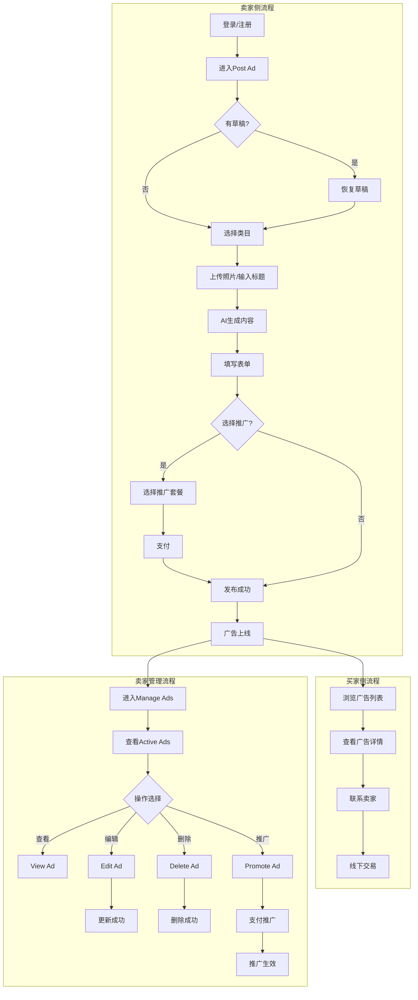
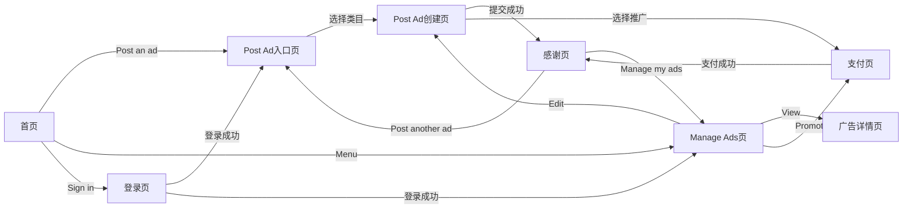
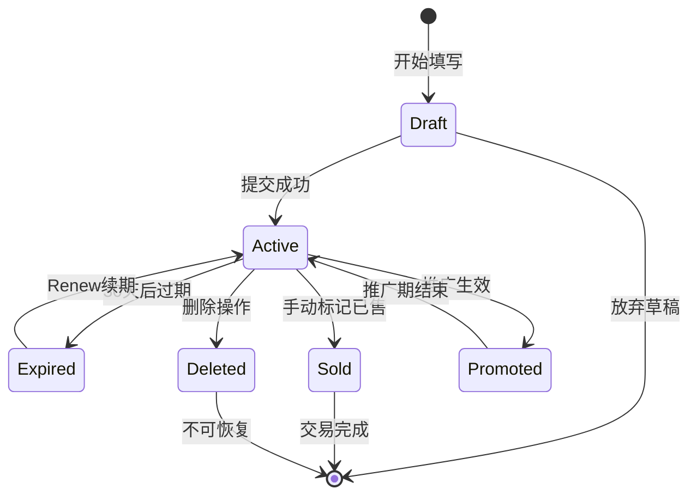

# Seller业务域 - 业务全景

## 1. 业务定位

Seller业务域是 Gumtree 平台的核心业务之一,为个人卖家和小商家提供广告发布、管理和推广服务,帮助用户快速将二手物品或商品上线并触达买家。

**业务价值**:
- 为**个人卖家**提供简单易用的广告发布工具,支持AI辅助填充,降低发布门槛
- 为**小商家**提供频繁发布、批量管理、推广套餐等高级功能,提升广告曝光
- 为**买家**提供海量优质广告供浏览和购买,建立信任交易环境

**目标用户**:
- **个人卖家**:希望快速出售二手物品的普通用户,占比约70%
- **小商家**:需要频繁发布商品的个体经营者,占比约25%
- **新手用户**:首次使用Gumtree的用户,通过AI辅助降低使用门槛,占比约30%(overlap)

## 2. 业务范围

### 2.1 功能覆盖

| 功能模块 | 说明 | 核心能力 |
|---------|------|---------|
| 广告发布 | 创建并发布For Sale类目广告 | 类目选择、表单填写、AI辅助生成、照片上传、推广选择 |
| 广告管理 | 管理已发布的广告 | 查看详情、编辑内容、删除广告、推广已发布广告 |
| 推广功能 | 提升广告曝光和排名 | Featured置顶、Urgent急售标签、Spotlight首页展示 |
| AI辅助(Genesis Phase 1) | 基于照片/标题自动生成广告内容 | AI识别物品、生成标题描述、推荐类目标签(移动端iOS) |
| 草稿功能 | 自动保存未完成的广告 | 自动保存、草稿恢复、跨设备同步 |
| 支付功能 | 推广套餐支付 | 3D Secure OTP验证、自动续费管理 |

### 2.2 地域覆盖

- **UK站点**:全英国地区,支持所有主要城市(如London, Manchester, Birmingham等)
- 货币:£(英镑)
- 手机号格式:UK手机号(07开头,11位)
- 地图服务:Google Maps(UK地区)

### 2.3 用户角色

| 角色 | 权限 | 说明 |
|-----|------|------|
| 游客 | 仅浏览广告 | 无法发布/管理广告,需登录后使用Seller功能 |
| 登录用户(个人卖家) | 发布/管理广告、选择推广、保存草稿 | 默认Seller Type为"Private" |
| 登录用户(商家) | 同个人卖家 + 批量发布(待确认) | Seller Type可选"Business" |
| 管理员 | 审核广告、管理用户、处理违规 | 后台权限,非用户端 |

## 3. 业务流程全景图



## 4. 核心业务流程概览

### 4.1 广告发布流程

**业务目标**:帮助卖家快速创建并发布For Sale类目广告,提供AI辅助和手动填写两种方式,最终成功上线广告供买家浏览。

**核心步骤**:
1. 用户登录并进入Post Ad页面,系统检测草稿
2. 选择类目(搜索或浏览4级类目树)
3. 上传照片触发AI识别,自动生成标题和描述
4. 用户确认/修改AI内容,填写Price/Location/Condition等必填字段
5. 可选:选择推广套餐(Featured/Urgent/Spotlight)
6. 点击"Post my Ad"提交,前端验证通过后调用后端API
7. 若选择推广,跳转支付页面完成支付(含3D Secure OTP验证)
8. 发布成功,跳转感谢页面,广告上线

**关键观测点**:
- ✅ P0:类目选择后URL包含正确的categoryId
- ✅ P0:AI生成完成(≤30秒),Title和Description自动填充
- ✅ P0:所有必填字段验证通过,无红色错误提示
- ✅ P0:提交后跳转到成功页或支付页
- ✅ P0:支付成功(若选择推广),广告状态为Active
- ❌ 负向:AI生成失败,显示错误提示并允许手动填写
- ❌ 负向:必填字段验证失败,页面滚动到错误字段

**详细流程文档**:[广告发布业务流程](./广告发布业务流程.md)

---

### 4.2 广告管理流程

**业务目标**:为卖家提供便捷的广告管理工具,支持查看、编辑、删除、推广已发布广告,提升管理效率。

**核心步骤**:
1. 用户导航到Manage Ads页面,点击Active ads标签
2. 广告列表加载,展示广告卡片(标题/价格/发布时间)
3. 鼠标悬停到广告,显示"三个点"操作按钮
4. 选择操作:View查看详情 / Edit编辑内容 / Delete删除 / Promote推广
5. 编辑流程:预填充原内容 → 修改字段 → 确认页面 → 提交更新
6. 删除流程:弹窗二次确认 → 选择"Yes" → 点击"Delete" → 从列表移除
7. 推广流程:选择推广套餐 → 支付 → 推广生效

**关键观测点**:
- ✅ P0:Active ads列表正确加载,显示真实广告(过滤推广卡片)
- ✅ P0:"三个点"菜单展开,显示4个操作选项
- ✅ P0:编辑页面预填充原内容,可修改所有字段(除Category)
- ✅ P0:删除确认弹窗显示,选择"Yes"后广告从列表移除
- ✅ P0:推广支付成功后,广告显示推广标签(Featured/Urgent/Spotlight)
- ❌ 负向:编辑Session过期,自动跳转登录页,登录后数据保留
- ❌ 负向:删除操作点击"No",广告保留不删除

**详细流程文档**:[广告管理业务流程](./广告管理业务流程.md)

---

### 4.3 AI辅助发布流程(Genesis Phase 1 - iOS)

**业务目标**:通过AI技术降低发布门槛,自动识别物品并生成标题描述,提升发布效率和广告质量。

**核心步骤**:
1. 用户上传首张照片,系统触发AI识别
2. 显示骨架屏动画,Title和Description字段加载中
3. AI服务分析照片,识别物品类型和属性
4. 生成标题(如"Red Bike for Sale")和描述(≥15字符)
5. 推荐3-5个类目标签(如"Dinning Tables", "Dinning Chairs")
6. 用户可直接使用或点击"Change"重新生成
7. 若AI生成失败(>30秒),显示错误提示,允许手动填写

**关键观测点**:
- ✅ P0:上传照片后,骨架屏动画正常显示(opacity 0.3-0.6循环)
- ✅ P0:AI生成完成(≤30秒),内容自动填充,骨架屏消失
- ✅ P0:Title非空,Description≥15字符且≤10000字符
- ✅ P1:类目建议标签显示(至少1个,最多5个)
- ✅ P1:"Change"按钮可见且可点击,重新生成流程正常
- ❌ 负向:AI生成超时,显示"AI generation failed. Please enter manually."
- ⚠️ 待确认:AI内容质量评估(是否符合Gumtree风格)

**详细流程文档**:[AI辅助发布业务流程](./AI辅助发布业务流程.md)

---

### 4.4 推广支付流程

**业务目标**:为卖家提供多种推广套餐选择,通过支付提升广告曝光和排名,增加成交机会。

**核心步骤**:
1. 用户选择推广套餐(Featured/Urgent/Spotlight,可多选)
2. Featured可选择天数(3/7/14天),Urgent和Spotlight固定7天
3. 点击"Continue"提交,可能出现自动续费确认弹窗
4. 跳转支付页面,处理隐私弹窗:"Accept all"
5. 点击"Pay Now"按钮,可能触发3D Secure OTP验证
6. 若触发:等待OTP iframe加载(10秒) → 输入OTP"1234" → 点击"SUBMIT"
7. 支付成功,跳转感谢页面,推广立即生效

**关键观测点**:
- ✅ P0:推广套餐选择页面显示3个卡片,价格正确
- ✅ P0:Featured天数下拉可选择3/7/14,默认7天
- ✅ P0:支付页面"Pay Now"按钮可见且可点击
- ✅ P0:若触发3D Secure,OTP iframe成功加载,输入框可见
- ✅ P0:OTP验证通过,30秒内跳转感谢页面
- ❌ 负向:支付超时(>30秒),显示超时提示,返回推广选择页
- ❌ 负向:OTP验证失败,显示错误,允许重新输入(最多3次)
- ⚠️ 待确认:并非所有支付都触发3D Secure,部分直接跳转

**详细流程文档**:[推广功能业务流程](./推广功能业务流程.md)(待补充)

---

## 5. 页面拓扑关系

### 5.1 页面入口矩阵

| 页面 | 入口1 | 入口2 | 入口3 | 入口4 | 入口5 |
|-----|------|------|------|------|------|
| 登录页(/login) | 首页"Sign in"按钮 | 未登录访问Post Ad自动跳转 | 导航栏"My Gumtree" | - | - |
| Post Ad入口页(/postad) | 首页"Post an ad"按钮 | 导航栏"Post Ad" | 成功页"Post another ad" | - | - |
| Post Ad创建页(/postad/create?categoryId=X) | Post Ad入口页选择类目后 | Edit Ad编辑页 | 草稿恢复后 | - | - |
| Manage Ads页(/manage/ads) | 首页Menu→"Manage my Ads" | 成功页"Manage my ads"链接 | 导航栏直接访问 | - | - |
| 广告详情页(/ad/123456) | Manage Ads页点击"View ad" | 买家浏览列表点击 | 搜索结果点击 | - | - |
| 支付页(/payment或/checkout) | Post Ad提交时选择推广 | Manage Ads页点击"Promote" | 成功页推广推荐 | - | - |
| 感谢页(/thankyou) | Post Ad提交成功 | 推广支付成功 | - | - | - |

### 5.2 页面跳转流程图



### 5.3 页面关系详解

#### 首页 → Post Ad入口页

- **入口**:首页"Post an ad"按钮(主CTA) / 导航栏"Post Ad"链接
- **目标**:`/postad`
- **参数**:无
- **权限**:需登录,若未登录自动跳转`/login?redirect=/postad`
- **流程**:点击后检测登录状态 → 跳转Post Ad入口页 → 检测草稿 → 显示类目选择页
- **数据**:无需携带

#### Post Ad入口页 → Post Ad创建页

- **入口**:选择类目后点击"Continue"按钮 / 搜索类目后点击建议项
- **目标**:`/postad/create?categoryId=121`
- **参数**:`categoryId`(类目ID,必填)
- **权限**:需登录
- **流程**:选择类目 → 确认 → 跳转创建页 → 显示面包屑导航 → 展示表单
- **数据**:类目ID、类目路径(面包屑展示用)

#### Post Ad创建页 → 支付页

- **入口**:点击"Post my Ad"按钮提交,且选择了推广套餐
- **目标**:`/payment?adId=789&promoIds=1,2`(推测)
- **参数**:`adId`(广告ID)、`promoIds`(推广套餐ID列表)
- **权限**:需登录,需选择至少1个推广套餐
- **流程**:提交 → 后端创建广告 → 返回adId → 跳转支付页 → 展示套餐信息和总价
- **数据**:广告ID、推广套餐列表、总价格

#### 支付页 → 感谢页

- **入口**:支付成功(含3D Secure OTP验证,若触发)
- **目标**:`/thankyou?adId=789`
- **参数**:`adId`(广告ID)
- **权限**:需登录,需支付成功
- **流程**:支付 → OTP验证(可能) → 支付成功 → 推广生效 → 跳转感谢页
- **数据**:广告ID、支付订单ID(后端处理)

#### Manage Ads页 → 广告详情页

- **入口**:点击"三个点"菜单中的"View ad"选项
- **目标**:`/ad/789`
- **参数**:`adId`(广告ID,在URL路径中)
- **权限**:需登录(若是自己的广告) / 公开访问(若是买家查看)
- **流程**:点击"View ad" → 跳转详情页 → 展示完整广告信息(标题/描述/照片/价格/位置等)
- **数据**:广告完整信息

#### Manage Ads页 → Post Ad创建页(编辑)

- **入口**:点击"三个点"菜单中的"Edit ad"选项
- **目标**:`/postad/edit?adId=789`(推测)
- **参数**:`adId`(广告ID)
- **权限**:需登录,需是广告所有者
- **流程**:点击"Edit ad" → 跳转编辑页 → 预填充原广告内容 → 页面顶部显示"Update my ad"
- **数据**:广告完整信息(预填充表单)

## 6. 业务数据流转

### 6.1 状态流转



### 6.2 用户操作与数据变化

| 操作 | 数据变化 | 前台展示变化 | 涉及页面 |
|-----|---------|-------------|---------|
| 选择类目 | 记录categoryId到本地 | 面包屑导航显示类目路径 | Post Ad入口页 → 创建页 |
| 上传照片 | 照片上传到CDN,返回URL | 缩略图显示,计数器更新(X/20) | Post Ad创建页 |
| AI生成 | 调用AI API,返回标题+描述 | 骨架屏消失,内容填充 | Post Ad创建页 |
| 填写表单 | 实时保存到草稿(30秒间隔) | 无明显UI变化 | Post Ad创建页 |
| 提交广告 | 后端创建广告记录,status=Active | 跳转成功页或支付页 | Post Ad创建页 → 感谢页 |
| 选择推广 | 创建推广订单,status=Pending | 跳转支付页,显示套餐信息 | Post Ad创建页 → 支付页 |
| 完成支付 | 更新订单status=Paid,推广生效 | 广告显示推广标签 | 支付页 → 感谢页 |
| 查看广告 | 浏览量+1(推测) | 无明显UI变化 | 广告详情页 |
| 编辑广告 | 更新广告字段,记录变更历史 | 广告内容更新,可能移到列表顶部 | Manage Ads → Edit页 → 成功页 |
| 删除广告 | 软删除,status=Deleted | 从Active ads列表移除 | Manage Ads页 |
| 推广已发布广告 | 创建推广订单 | 广告显示推广标签 | Manage Ads → 支付页 |

### 6.3 关键业务数据

**广告实体(Ad)**:

| 字段 | 类型 | 必填 | 说明 |
|-----|------|-----|------|
| adId | Integer | 是 | 广告唯一ID,主键 |
| userId | Integer | 是 | 用户ID,外键 |
| categoryId | Integer | 是 | 类目ID,外键 |
| title | String(100) | 是 | 广告标题 |
| description | String(10000) | 是 | 广告描述,15-10000字符 |
| price | Decimal(10,2) | 是 | 价格,货币单位£ |
| photos | Array<String> | 否 | 照片URL数组,最多20张 |
| location | Object | 是 | 位置信息{city, area, postcode} |
| condition | Enum | 是 | 成品状况:New/Used/For parts |
| contactEmail | String | 是 | 联系邮箱 |
| contactPhone | String(11) | 否 | 联系电话,UK格式 |
| showMap | Boolean | 否 | 是否显示地图,默认false |
| sellerType | Enum | 是 | 卖家类型:Private/Business |
| status | Enum | 是 | 广告状态:Draft/Active/Expired/Sold/Deleted |
| createdAt | DateTime | 是 | 创建时间 |
| updatedAt | DateTime | 是 | 更新时间 |
| expiresAt | DateTime | 是 | 过期时间,创建后30天 |

**推广订单实体(PromotionOrder)**:

| 字段 | 类型 | 必填 | 说明 |
|-----|------|-----|------|
| orderId | Integer | 是 | 订单唯一ID |
| adId | Integer | 是 | 关联广告ID |
| userId | Integer | 是 | 用户ID |
| packageType | Enum | 是 | 套餐类型:Featured/Urgent/Spotlight |
| duration | Integer | 是 | 推广天数:3/7/14 |
| price | Decimal(10,2) | 是 | 订单金额 |
| status | Enum | 是 | 订单状态:Pending/Paid/Active/Expired/Refunded |
| startDate | DateTime | 否 | 推广开始时间,支付成功后填充 |
| endDate | DateTime | 否 | 推广结束时间,startDate+duration |
| paymentId | String | 否 | 支付流水ID |
| autoRenew | Boolean | 否 | 是否自动续费,默认false |

## 7. 关键业务规则索引

**广告发布相关**:
- [广告发布规则 - 输入规则](../../业务规则库/Seller模块/广告发布规则.md#31-输入规则)
- [广告发布规则 - 校验规则](../../业务规则库/Seller模块/广告发布规则.md#32-校验规则)
- [广告发布规则 - AI辅助生成规则](../../业务规则库/Seller模块/广告发布规则.md#35-ai辅助生成规则genesis-phase-1---ios)
- [广告发布规则 - 业务约束](../../业务规则库/Seller模块/广告发布规则.md#34-业务约束)

**广告管理相关**:
- [广告管理规则 - 广告状态规则](../../业务规则库/Seller模块/广告管理规则.md#31-广告状态规则)
- [广告管理规则 - 广告列表规则](../../业务规则库/Seller模块/广告管理规则.md#32-广告列表规则)
- [广告管理规则 - 编辑操作规则](../../业务规则库/Seller模块/广告管理规则.md#33-编辑操作规则)
- [广告管理规则 - 删除操作规则](../../业务规则库/Seller模块/广告管理规则.md#34-删除操作规则)
- [广告管理规则 - 推广操作规则](../../业务规则库/Seller模块/广告管理规则.md#35-推广操作规则)

## 8. 业务FAQ

**Q1:AI生成失败后,用户能否正常发布广告?**
A:可以。AI生成失败后,系统显示错误提示"AI generation failed. Please enter manually.",用户可手动填写标题和描述,不影响后续发布流程。

**Q2:推广套餐可以叠加使用吗?**
A:可以。用户可同时选择Featured+Urgent+Spotlight,总费用为各套餐价格之和(如£1.00+£0.75+£1.99=£3.74)。

**Q3:编辑已发布的广告会影响原发布时间吗?**
A:不会。编辑后原始发布时间保留,但广告可能移动到列表顶部(推测,待确认)。

**Q4:删除广告是否可恢复?**
A:不可恢复。删除操作为软删除(后端数据库保留),但前端用户无法恢复,需重新发布。

**Q5:草稿保存有效期是多久?**
A:推测30天。超期后草稿可能自动清除或显示过期提示(待确认产品经理)。

**Q6:AI生成的内容准确率如何?**
A:根据Issue-003,类目标签准确率约80%,部分物品识别可能有误,建议用户人工确认。

**Q7:3D Secure OTP验证是否每次支付都触发?**
A:不是。部分支付不触发3D Secure,直接跳转感谢页。触发条件可能与银行风控策略相关(待确认开发工程师)。

**Q8:Spotlight推广有解锁限制吗?**
A:可能有。设计稿显示锁图标,推测新用户或低信誉用户无法使用,需满足某些条件(如发布量/账户等级,待确认)。

**Q9:推广期内删除广告,费用是否退款?**
A:待确认。可能需先取消推广再删除,或直接删除且不退款。

**Q10:Session有效期是多久?如何复用?**
A:推测24小时。测试脚本使用SessionManager将登录Session保存到本地`session_storage/{username}.json`,后续测试直接加载,节省15秒登录时间。

## 9. 业务指标(可选)

### 9.1 核心指标

- **广告发布成功率**:(提交成功数 / 点击"Post my Ad"数) × 100%
  - 目标:≥85%
  - 当前:(待补充数据)

- **AI生成成功率**:(AI生成成功数 / AI触发数) × 100%
  - 目标:≥95%
  - 当前:(待补充数据)

- **推广转化率**:(选择推广数 / 广告发布成功数) × 100%
  - 目标:≥20%
  - 当前:(待补充数据)

- **草稿恢复率**:(恢复草稿数 / 草稿弹窗显示数) × 100%
  - 目标:≥40%
  - 当前:(待补充数据)

### 9.2 漏斗指标

```
进入Post Ad页面: 10,000
  ↓ 80% (选择类目完成率)
选择类目: 8,000
  ↓ 70% (开始填写表单率)
开始填写: 5,600
  ↓ 60% (完成填写率)
填写完成: 3,360
  ↓ 85% (提交成功率)
提交成功: 2,856
  ↓ 20% (推广转化率)
选择推广: 571
  ↓ 90% (支付成功率)
支付成功: 514
```

**关键转化节点**:
- 类目选择 → 开始填写:流失30%(可能因类目不明确或放弃发布)
- 开始填写 → 填写完成:流失40%(可能因AI生成失败/字段复杂)
- 填写完成 → 提交成功:流失15%(验证失败/Session过期)

## 10. 已知问题与风险

### 10.1 产品待确认问题

- **Issue-001**:推广套餐Spotlight的解锁条件不明确,新用户无法使用 → 需明确解锁规则 → Jira: GT-1237
- **Issue-002**:草稿有效期为30天(推测),超期后行为待确认 → 确认草稿过期处理逻辑 → Jira: 待创建
- **Issue-003**:编辑广告后是否移动到列表顶部,待确认产品策略 → Jira: 待创建
- **Issue-004**:推广期内删除广告,费用是否退款,待确认退款规则 → Jira: 待创建
- **Issue-005**:总价格是否显示在推广选择页,设计稿未明确 → Jira: 待创建

### 10.2 技术风险

- **Risk-001**:AI生成服务稳定性依赖第三方API,可能出现超时/不可用 → 已实现降级方案(手动填写)
- **Risk-002**:照片CDN存储成本随用户增长快速上升 → 需评估存储策略和清理机制
- **Risk-003**:3D Secure OTP验证iframe加载可能失败,无明确超时提示 → 需增加超时处理 → Jira: GT-1242
- **Risk-004**:Session过期处理依赖前端检测,可能遗漏部分场景 → 需增强Session管理 → Jira: 待创建

### 10.3 测试过程中发现的问题

- **Issue-006**:照片拖拽调整顺序后刷新页面,顺序可能丢失 → 待修复 → Jira: GT-1234
- **Issue-007**:Description字符数统计在输入大量emoji时可能不准确 → 优化计数算法 → Jira: GT-1235
- **Issue-008**:AI生成的类目标签准确率约80%,部分物品识别错误 → AI模型优化中 → Jira: GT-1236
- **Issue-009**:iOS 14系统下,骨架屏动画可能卡顿 → 兼容性优化 → Jira: GT-1238
- **Issue-010**:广告列表滚动到底部时,分页加载可能卡顿(>5秒) → 性能优化 → Jira: GT-1241

## 11. 变更历史

| 日期 | 版本 | 变更内容 | 变更人 |
|-----|------|---------|--------|
| 2026-04-15 | v1.0 | 初始版本,基于Gumtree Seller功能测试用例集(50条用例)和AI Posting Genesis设计分析报告整合生成 | AI Agent |
| 2026-04-15 | v1.1 | 补充业务数据流转、页面拓扑关系、业务FAQ和已知问题章节 | AI Agent |
