# Seller业务域 - 广告发布业务流程

## 1. 完整流程图

> **业务目标**:帮助卖家快速创建并发布For Sale类目广告,提供AI辅助和手动填写两种方式,支持推广套餐选择,最终成功上线广告供买家浏览。

```mermaid
flowchart TB
    Start([用户进入Post Ad页面]) --> CheckLogin{已登录?}
    CheckLogin -->|否| Login[跳转登录页]
    Login --> CheckLogin
    CheckLogin -->|是| CheckDraft{有草稿?}
    
    CheckDraft -->|是| ShowDraftDialog[显示草稿恢复弹窗]
    ShowDraftDialog --> DraftChoice{用户选择}
    DraftChoice -->|继续编辑| LoadDraft[加载草稿数据]
    DraftChoice -->|新建| ClearDraft[清除草稿]
    
    CheckDraft -->|否| SelectCategory[选择类目]
    LoadDraft --> SelectCategory
    ClearDraft --> SelectCategory
    
    SelectCategory --> CategoryChoice{选择方式}
    CategoryChoice -->|搜索| SearchCategory[输入关键词搜索]
    CategoryChoice -->|浏览| BrowseCategory[展开类目树浏览]
    
    SearchCategory --> ConfirmCategory[确认类目]
    BrowseCategory --> ConfirmCategory
    ConfirmCategory --> EnterForm[进入发布表单页]
    
    EnterForm --> UploadPhoto{上传照片?}
    UploadPhoto -->|是| TriggerAI[触发AI识别]
    UploadPhoto -->|否| ManualInput[手动输入标题]
    
    TriggerAI --> AIGenerating[AI生成中:骨架屏动画]
    AIGenerating --> AIResult{AI生成结果}
    
    AIResult -->|成功| FillAIContent[标题+描述自动填充]
    AIResult -->|失败/超时| ShowError[显示错误提示:手动填写]
    
    FillAIContent --> EditContent[用户确认/修改内容]
    ShowError --> ManualInput
    ManualInput --> EditContent
    
    EditContent --> FillRequired[填写必填字段]
    FillRequired --> FillPrice[填写Price]
    FillPrice --> FillLocation[填写Location]
    FillLocation --> SelectCondition[选择Condition]
    SelectCondition --> FillContact[填写Contact Details]
    
    FillContact --> FillOptional{填写可选字段?}
    FillOptional -->|是| FillItemSpecifics[填写Item Specifics]
    FillOptional -->|否| SelectPromotion
    FillItemSpecifics --> SelectPromotion{选择推广?}
    
    SelectPromotion -->|是| ChoosePackage[勾选推广套餐]
    ChoosePackage --> CalculatePrice[计算总费用]
    CalculatePrice --> SubmitAd
    SelectPromotion -->|否| SubmitAd[点击Post my Ad]
    
    SubmitAd --> FrontValidation{前端验证}
    FrontValidation -->|失败| ShowValidationError[显示错误提示:滚动到错误字段]
    ShowValidationError --> EditContent
    
    FrontValidation -->|通过| SubmitAPI[调用后端API]
    SubmitAPI --> BackendResult{后端响应}
    
    BackendResult -->|成功| HasPromotion{选择推广?}
    BackendResult -->|失败| ShowSubmitError[显示提交失败提示]
    ShowSubmitError --> SubmitAd
    
    HasPromotion -->|是| PaymentPage[跳转支付页面]
    HasPromotion -->|否| SuccessPage[跳转成功页面]
    
    PaymentPage --> HandlePrivacyPopup[处理隐私弹窗:Accept all]
    HandlePrivacyPopup --> ClickPayNow[点击Pay Now]
    ClickPayNow --> Trigger3DS{触发3D Secure?}
    
    Trigger3DS -->|是| Load3DSIframe[加载3D Secure iframe]
    Load3DSIframe --> InputOTP[输入OTP验证码:1234]
    InputOTP --> ClickSubmit[点击SUBMIT]
    ClickSubmit --> PaymentResult{支付结果}
    
    Trigger3DS -->|否| PaymentResult
    
    PaymentResult -->|成功| SuccessPage
    PaymentResult -->|失败| ShowPaymentError[显示支付失败提示]
    ShowPaymentError --> PaymentPage
    
    SuccessPage --> ShowPromoRecommend[显示推广推荐:Make your Ad stand out]
    ShowPromoRecommend --> UserAction{用户操作}
    
    UserAction -->|Post another ad| Start
    UserAction -->|Manage my ads| ManageAdsPage[跳转Manage Ads页面]
    UserAction -->|完成| End([流程结束])
```

## 2. 详细步骤与观测点

### 步骤1:用户登录与Session验证

**页面位置**:`/login`

**操作流程**:
1. 用户点击首页"Post an ad"按钮
2. 系统检测登录状态:检查Session是否有效
3. 若未登录,重定向到`/login?redirect=/postad`
4. 用户输入邮箱和密码
5. 点击"Continue with email" → 输入邮箱密码 → 点击"Continue"
6. 等待5秒,登录完成
7. 自动跳转回`/postad`页面

**观测点**:
- ✅ **P0观测点**:页面URL不包含"login",顶部导航显示"Post an ad"或"My Gumtree"菜单
- ✅ **P0观测点**:Session成功保存到本地`session_storage/{username}.json`
- ❌ **负向观测点**:若Session过期,页面自动跳转到登录页,不影响用户填写的草稿数据

**验证方法**:
- 检查Cookie或LocalStorage中的Session Token
- 刷新页面后仍保持登录状态
- 关联规则:[用户认证模块](../../业务规则库/Seller模块/广告发布规则.md#33-权限规则)

---

### 步骤2:草稿恢复检测

**页面位置**:`/postad`

**操作流程**:
1. 用户进入Post Ad页面
2. 系统检测是否有未完成草稿
3. 若有草稿,显示弹窗:"Pick up where you left off?"
4. 弹窗显示两个按钮:"新建"(左侧)和"继续编辑"(右侧)
5. 用户选择:
   - 点击"继续编辑" → 加载草稿数据到表单
   - 点击"新建" → 清除草稿,展示空白表单
   - 点击右上角【X】关闭 → 等同于"新建"

**观测点**:
- ✅ **P1观测点**:草稿弹窗正确显示,包含"Pick up where you left off?"标题
- ✅ **P1观测点**:点击"继续编辑"后,所有字段(包括照片)成功恢复
- ✅ **P1观测点**:点击"新建"后,表单为空白状态
- ⚠️ **待确认观测点**:草稿有效期为30天(超期后是否显示弹窗?)

**验证方法**:
- 填写部分字段后关闭页面 → 重新进入 → 验证弹窗出现
- 恢复草稿后逐一检查字段值是否正确
- 关联规则:[草稿功能规则](../../业务规则库/Seller模块/广告发布规则.md#34-业务约束)

---

### 步骤3:类目选择

**页面位置**:`/postad` (类目选择页)

**操作流程A:搜索类目**:
1. 用户在搜索框输入关键词(如"Bike")
2. 系统实时显示建议类目列表
3. 类目列表展示完整路径:"For Sale > Phones > Mobile Phones"
4. 用户点击选中类目
5. 页面跳转到`/postad/create?categoryId=123`

**操作流程B:浏览类目**:
1. 用户点击"Or browse to find a category"
2. 展开类目树,显示第一级类目(如"For Sale")
3. 点击"For Sale" → 展开第二级(如"Baby & Kids Stuff")
4. 点击"Baby & Kids Stuff" → 展开第三级(如"Car Seats & Baby Carriers")
5. 点击第三级类目 → 类目选中
6. 点击"Continue"按钮确认
7. 页面跳转到`/postad/create?categoryId=121`

**观测点**:
- ✅ **P0观测点**:类目选择后,页面URL包含`postad/create`,且`categoryId`参数正确
- ✅ **P0观测点**:页面顶部显示面包屑导航,展示完整类目路径
- ✅ **P0观测点**:面包屑右侧显示"Edit"按钮,可重新选择类目
- ❌ **负向观测点**:若选择中间层级类目(非叶子节点),系统提示"Please select a specific category"

**验证方法**:
- 检查URL参数`categoryId`是否匹配选择的类目
- 读取面包屑文本,验证路径正确性
- 关联规则:[类目选择规则](../../业务规则库/Seller模块/广告发布规则.md#34-业务约束)

---

### 步骤4:照片上传与AI生成触发

**页面位置**:`/postad/create?categoryId=121`

**操作流程**:
1. 用户点击照片上传区域的"+"图标
2. 系统触发相册/相机选择器
3. 用户选择第一张照片(可单选/多选)
4. 照片开始上传,显示上传进度(可能)
5. 上传完成后,照片显示在横向滚动列表
6. **触发AI识别**:系统调用AI服务识别物品
7. Title和Description字段显示骨架屏动画
8. 右上角显示"01"旋转图标
9. 等待AI生成完成(≤30秒)

**骨架屏细节**:
- Title字段:1行灰色矩形(宽245px,高20px)
- Description字段:3行灰色矩形(宽度递减:285px/245px/185px)
- 动画效果:opacity 0.3-0.6循环,1.5秒周期

**观测点**:
- ✅ **P0观测点**:照片成功上传,缩略图显示在页面
- ✅ **P0观测点**:照片计数器更新,显示"1/20"
- ✅ **P0观测点**:Title和Description字段显示骨架屏动画,右上角"01"图标旋转
- ✅ **P1观测点**:AI生成完成后(≤30秒),骨架屏消失,内容填充
- ❌ **负向观测点**:若照片上传失败,显示错误提示"Upload failed. Please try again."
- ❌ **负向观测点**:若AI生成超时(>30秒),显示"AI generation failed. Please enter manually."

**验证方法**:
- 检查照片缩略图是否可见(`expect(image).to_be_visible()`)
- 验证计数器文本:`expect(counter).to_have_text("1/20")`
- 等待骨架屏消失:`page.wait_for_selector('[data-testid="ai-content"]', timeout=30000)`
- 关联规则:[AI辅助生成规则](../../业务规则库/Seller模块/广告发布规则.md#35-ai辅助生成规则genesis-phase-1---ios)

---

### 步骤5:AI生成内容验证与修改

**页面位置**:`/postad/create?categoryId=121`(AI生成完成后)

**操作流程**:
1. AI生成完成,骨架屏淡出
2. Title字段自动填充(如"Red Bike for Sale")
3. Description字段自动填充(如"This wooden dining table is in excellent condition...")
4. Description右上角显示"Change"按钮(带旋转箭头图标)
5. 类目建议标签自动展示(如"Dinning Tables", "Dinning Chairs", "Tableware")
6. 用户可以:
   - 选项A:直接使用AI生成内容,继续填写其他字段
   - 选项B:修改Title/Description内容
   - 选项C:点击"Change"按钮重新生成

**重新生成流程**:
1. 用户点击"Change"按钮
2. 当前内容保留(不清空)
3. 重新显示骨架屏
4. AI重新生成新内容
5. 新内容替换旧内容

**观测点**:
- ✅ **P0观测点**:Title字段不为空,长度合理(≤100字符)
- ✅ **P0观测点**:Description字段≥15字符,≤10000字符
- ✅ **P0观测点**:Description字数统计正确显示(如"56/10000")
- ✅ **P1观测点**:类目建议标签显示(至少1个,最多5个)
- ✅ **P1观测点**:"Change"按钮可见且可点击
- ❌ **负向观测点**:若Description<15字符,显示"15 characters minimum"错误提示

**验证方法**:
- 读取Title和Description字段值,验证非空且长度符合要求
- 检查字数统计文本匹配实际字符数
- 点击"Change"按钮,验证重新生成流程
- 关联规则:[Description字段验证](../../业务规则库/Seller模块/广告发布规则.md#32-校验规则)

---

### 步骤6:填写必填字段

**页面位置**:`/postad/create?categoryId=121`

**操作流程**:
1. **填写Price**:
   - 定位Price输入框
   - 输入价格数字(如"10")
   - 系统自动添加货币符号£
   - 按Tab键失去焦点,触发验证

2. **填写Location**:
   - 系统默认填充用户账户位置(如"Camden, London / NW5 4HX")
   - 用户可点击"Edit"按钮修改
   - 勾选"Show a map on my ad"复选框(可选)
   - 若勾选,下方展开Google Map iframe,显示近似区域

3. **选择Condition**:
   - 滚动到"Item Specifics"区域
   - 默认选中"Required"标签
   - 点击"Condition"选择按钮
   - 弹层展开,显示选项(New/Used/For parts or not working)
   - 选择"New"
   - 点击"Save"保存

4. **填写Contact Details**:
   - 系统默认勾选"Messages on platform"
   - 显示通知邮箱(如"get notified via test@example.com")
   - 用户可选择添加手机号:点击"Add phone number"按钮

**观测点**:
- ✅ **P0观测点**:Price字段成功填写,显示"£10"
- ✅ **P0观测点**:Location字段显示完整地址(City + Area / Postcode)
- ✅ **P0观测点**:Condition字段显示选中值"New",字段左侧绿色勾选标记
- ✅ **P0观测点**:Contact Details默认勾选"Messages on platform"
- ✅ **P1观测点**:若勾选"Show Map",Google Map iframe正确加载
- ❌ **负向观测点**:若Price输入负数,系统自动过滤,无法输入
- ❌ **负向观测点**:若未勾选任何Contact方式,提交时显示"Please select at least one contact method"

**验证方法**:
- 读取Price输入框值,验证格式正确
- 检查Location显示文本包含city和postcode
- 验证Condition按钮文本为"New"
- 检查"Messages on platform"复选框状态为勾选
- 关联规则:[必填字段规则](../../业务规则库/Seller模块/广告发布规则.md#31-输入规则)

---

### 步骤7:选择推广套餐(可选)

**页面位置**:`/postad/create?categoryId=121`(表单底部)

**操作流程**:
1. 滚动到"Make your ad stand out"推广区域
2. 查看3个推广套餐卡片:
   - **Featured**:绿色"Recommended"标签,下拉选择天数(3/7/14天)
   - **Urgent**:显示"7 days - £0.75"
   - **Spotlight**:显示"7 days - £1.99",可能有锁图标
3. 用户勾选推广套餐(可多选):
   - 方式A:点击单个卡片勾选
   - 方式B:点击"Select all"全选所有套餐
4. 若选择Featured,在下拉菜单中选择天数(默认7天)
5. 系统计算总费用(价格累加,设计稿未显示总价位置)

**观测点**:
- ✅ **P1观测点**:3个推广卡片全部可见,包含套餐名称/价格/描述/"View example"链接
- ✅ **P1观测点**:勾选Featured后,复选框状态为勾选
- ✅ **P1观测点**:Featured下拉菜单可选择3/7/14天,默认7天
- ✅ **P1观测点**:点击"Select all"后,所有套餐同时勾选
- ⚠️ **待确认观测点**:总价格是否显示?(设计稿未明确)
- ⚠️ **待确认观测点**:Spotlight是否有解锁限制?(带锁图标)

**验证方法**:
- 检查复选框状态:`expect(checkbox).to_be_checked()`
- 验证下拉菜单选项:`expect(dropdown).to_have_value("7")`
- 点击"Select all",验证所有复选框状态
- 关联规则:[推广套餐规则](../../业务规则库/Seller模块/广告发布规则.md#34-业务约束)

---

### 步骤8:提交发布

**页面位置**:`/postad/create?categoryId=121`

**操作流程**:
1. 滚动到页面底部
2. 截图提交前状态(测试用)
3. 阅读法律声明文本(可选):
   - "By selecting Post My Ad you agree you've read and accepted our Terms of Use and Posting Rules"
   - 链接:Terms of Use / Posting Rules / Privacy Notice / Contact Us
4. 点击"Post my Ad"按钮
5. **前端验证开始**:
   - 校验所有必填字段(Photos/Title/Description/Category/Price/Location/Condition/Contact)
   - 若验证失败:滚动到第一个错误字段,显示红色错误提示
   - 若验证通过:继续提交
6. 显示Loading动画(推测:按钮文案变为"Posting...",带旋转图标)
7. 调用后端API:`POST /api/ads`
8. 等待后端响应

**观测点**:
- ✅ **P0观测点**:点击"Post my Ad"后,页面发生跳转或显示Loading
- ✅ **P0观测点**:若有字段错误,页面滚动到错误字段,显示红色边框和错误文本
- ✅ **P0观测点**:若所有验证通过,后端API成功返回,跳转到成功页或支付页
- ❌ **负向观测点**:若后端API返回500,Toast提示"Failed to post ad. Please try again later."
- ❌ **负向观测点**:若网络超时,显示超时提示,保留用户数据

**验证方法**:
- 检查页面URL变化:`expect(page).to_have_url(/thankyou|payment/)`
- 验证按钮文案变化(如有Loading状态)
- Mock API返回错误,验证错误处理逻辑
- 关联规则:[提交验证规则](../../业务规则库/Seller模块/广告发布规则.md#32-校验规则)

---

### 步骤9:推广支付流程(若选择推广)

**页面位置**:`/payment` 或 `/checkout`

**操作流程**:
1. 跳转到支付页面(URL包含"payment"或"checkout")
2. **处理隐私弹窗**(若出现):
   - 等待2秒,检测弹窗:"We Care About Your Privacy"
   - 点击"Accept all"按钮关闭弹窗
3. **点击Pay Now**:
   - 定位"Pay Now"按钮(可能有多种选择器)
   - 验证按钮可见且可点击
   - 点击按钮
   - 等待3秒,等待跳转或加载3D Secure
4. **处理3D Secure OTP验证**(若触发):
   - 等待10秒,确保OTP iframe完全加载
   - 遍历所有iframe,查找包含OTP输入框的iframe
   - 在iframe中定位OTP输入框:`input[placeholder*="Enter Code"]`
   - 点击输入框获取焦点
   - 输入OTP验证码:"1234"(测试环境固定值)
   - 在同一iframe中查找"SUBMIT"按钮
   - 点击"SUBMIT"提交
   - 等待3秒,等待验证完成
5. **支付成功处理**:
   - 等待跳转到感谢页面
   - 循环检测(最多30秒):页面包含"Post another ad"或"Manage my ads"文本
   - 或URL包含"thankyou"

**观测点**:
- ✅ **P0观测点**:支付页面正确加载,显示推广套餐信息和价格
- ✅ **P0观测点**:"Pay Now"按钮可见且可点击
- ✅ **P0观测点**:若触发3D Secure,OTP iframe成功识别,OTP输入框可见
- ✅ **P0观测点**:输入OTP"1234"后,"SUBMIT"按钮可点击
- ✅ **P0观测点**:支付成功后,30秒内跳转到感谢页面
- ❌ **负向观测点**:若OTP验证失败,显示错误提示,允许重新输入(最多3次)
- ❌ **负向观测点**:若支付超时(>30秒),显示超时提示,返回支付页
- ⚠️ **待确认观测点**:并非所有支付都触发3D Secure,部分直接跳转感谢页

**验证方法**:
- 检查支付页面URL:`expect(page.url).to_contain("payment")`
- 定位并点击"Pay Now"按钮
- 遍历iframe查找OTP输入框:`for frame in page.frames`
- 输入OTP并提交,验证无错误
- 关联规则:[推广支付规则](../../业务规则库/Seller模块/广告管理规则.md#35-推广操作规则)

---

### 步骤10:发布成功页面

**页面位置**:`/thankyou` 或 `/my-ads`

**操作流程**:
1. 跳转到成功页面
2. 页面显示成功反馈:
   - 成功图标(Frame 1079)
   - 主文案:"How was your overall"(体验反馈,两行文本)
   - 可能包含星级评分组件(Group 799)
3. 显示推广推荐模块:"Make your Ad stand out"
   - 副标题:"Label"
   - 3个推广选项卡片(Featured/Urgent/Spotlight)
   - 复选框:"Select all"
4. 底部显示主按钮:"Post another ad"或"Manage my ads"

**观测点**:
- ✅ **P0观测点**:页面URL包含"thankyou"或"my ads"
- ✅ **P0观测点**:页面同时显示"Post another ad"和"Manage my ads"文本或链接
- ✅ **P1观测点**:推广推荐模块显示(若未选择推广)
- ✅ **P1观测点**:体验反馈组件可见,可交互
- ⚠️ **待确认观测点**:推广推荐模块的具体位置和样式

**验证方法**:
- 检查页面URL:`expect(page).to_have_url(/thankyou/)`
- 验证文本存在:`expect(page).to_contain_text("Post another ad")`
- 验证文本存在:`expect(page).to_contain_text("Manage my ads")`
- 截图成功页面,用于视觉回归测试
- 关联规则:[成功页面规则](../../业务规则库/Seller模块/广告发布规则.md)

---

## 3. 流程完整性验证清单

**类目选择阶段**:
- [ ] 搜索类目功能正常,建议列表显示
- [ ] 浏览类目树可展开,多级选择无误
- [ ] 类目确认后,URL参数categoryId正确
- [ ] 面包屑导航显示完整路径
- [ ] "Edit"按钮可重新选择类目

**照片上传阶段**:
- [ ] 照片上传成功,缩略图显示
- [ ] 照片计数器实时更新(X/20)
- [ ] 照片可删除,顺序可调整
- [ ] 照片上传失败有错误提示和重试机制

**AI生成阶段**:
- [ ] 上传照片后触发AI识别
- [ ] 骨架屏动画正常显示
- [ ] AI生成完成(≤30秒),内容自动填充
- [ ] AI生成失败有错误提示,允许手动填写
- [ ] "Change"按钮可重新生成

**表单填写阶段**:
- [ ] Title和Description字段可编辑
- [ ] Price字段仅允许数字和小数,货币符号£自动添加
- [ ] Location字段默认填充,可编辑
- [ ] Condition字段可选择,Required标签下
- [ ] Contact Details默认勾选"Messages on platform"
- [ ] Item Specifics所有Required字段已填写

**推广选择阶段**:
- [ ] 3个推广卡片全部可见
- [ ] Featured可选择天数(3/7/14)
- [ ] Urgent和Spotlight固定7天
- [ ] 可多选推广套餐
- [ ] "Select all"功能正常
- [ ] 价格计算正确(若显示总价)

**提交验证阶段**:
- [ ] 点击"Post my Ad"触发前端验证
- [ ] 必填字段验证失败,显示错误提示
- [ ] 验证失败时,页面滚动到第一个错误字段
- [ ] 验证通过后,显示Loading动画
- [ ] 后端API成功返回,跳转正确

**支付流程阶段**(若选择推广):
- [ ] 支付页面正确加载
- [ ] 隐私弹窗处理正确(若出现)
- [ ] "Pay Now"按钮可见且可点击
- [ ] 3D Secure OTP验证流程正确(若触发)
- [ ] OTP输入"1234"后验证通过
- [ ] 支付成功后跳转感谢页面

**成功页面阶段**:
- [ ] 成功页面URL正确(包含"thankyou")
- [ ] 页面显示"Post another ad"和"Manage my ads"链接
- [ ] 推广推荐模块显示(若适用)
- [ ] 体验反馈组件可交互

## 4. 关联文档

### 业务全景文档
- [Seller业务域 - 业务全景](./Seller业务全景.md)

### 业务规则库
- [广告发布规则](../../业务规则库/Seller模块/广告发布规则.md)
- [广告管理规则](../../业务规则库/Seller模块/广告管理规则.md)

### 其他业务流程
- [广告管理业务流程](./广告管理业务流程.md)
- [AI辅助发布业务流程](./AI辅助发布业务流程.md)(移动端iOS专属)

## 5. 变更历史

| 日期 | 版本 | 变更内容 | 变更人 |
|-----|------|---------|--------|
| 2026-04-15 | v1.0 | 初始版本,基于Gumtree Seller功能测试用例集提取完整发布流程 | AI Agent |
| 2026-04-15 | v1.1 | 补充AI辅助生成流程和推广支付流程(含3D Secure OTP验证) | AI Agent |
