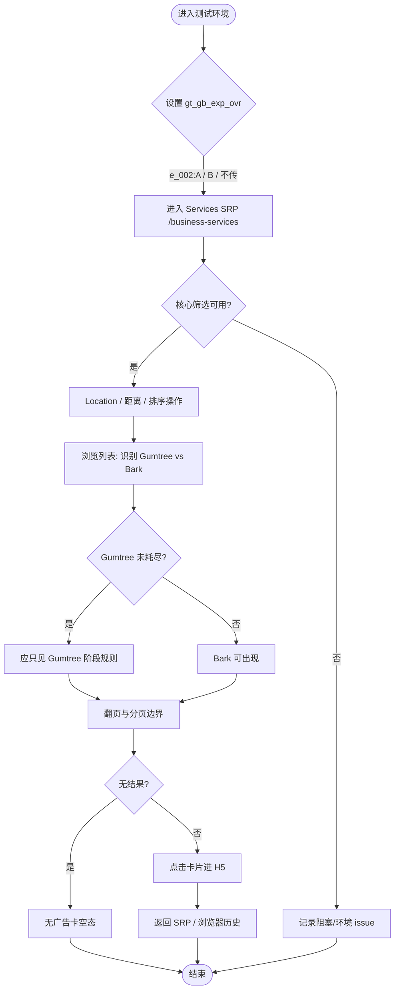

# Bark 集成（Web SRP）浏览业务流程

> **业务目标**: 在 Services SRP 上完成实验分流、地域与筛选、广告优先级（Gumtree→Bark）验证及卡片跳转 H5 的端到端浏览与回归。

---

## 1. 完整流程图

---

## 2. 详细步骤与观测点

### 步骤1：实验与入口（TC001–TC004）

**页面位置**: 首页 → Services 导航 → `/business-services`（SRP）

**操作**:
1. 注入 Header `gt_gb_exp_ovr=e_002:A` 或 `e_002:B`，或不传。
2. 按各 TC 路径进入 SRP。

**观测点**:
- ✅ A/B 下均可进入 SRP，核心能力（Location、距离、排序、翻页）可执行（TC003）。
- ⚠️ 不传 header 时默认实验策略需产品确认（TC004）。
- ❌ 不应出现无法进入或整页报错。

**验证方法**:
- 使用浏览器扩展或代理注入 Header，对比 A/B 页面可观察差异或至少可访问。

**关联规则**: [Bark集成SRP-Web规则.md - 3.1](../../业务规则库/Services模块/Bark集成SRP-Web规则.md#31-输入规则)

---

### 步骤2：Location、距离与排序（TC005–TC020）

**页面位置**: Services SRP 筛选区与列表

**操作**:
1. 输入地名/邮编，清空 Location，切换距离与排序，观察列表刷新与回到第 1 页行为。

**观测点**:
- ✅ 有效地名/邮编触发刷新；无效邮编有提示或不异常空白（TC007）。
- ✅ 距离与 Location 联动；排序切换后回到第 1 页（TC019）。
- ✅ 无结果时出现清晰空态（TC012）。

**验证方法**:
- 逐项执行用例表中的步骤与优先级（P0/P1）。

**关联规则**: [Bark集成SRP-Web规则.md - 3.2](../../业务规则库/Services模块/Bark集成SRP-Web规则.md#32-校验规则)

---

### 步骤3：广告优先级与卡片（TC021–TC024、TC031–TC038）

**页面位置**: SRP 列表首屏与多页

**操作**:
1. 在可出广告条件下浏览首屏与多页，用 CTA 文案区分 Bark。
2. 验证 Gumtree 优先、耗尽后出现 Bark、筛选变化重置策略等。

**观测点**:
- ✅ 首屏存在广告卡时可观察到 Ad；Gumtree 先于 Bark（TC022、TC031）。
- ✅ 卡片字段仅 Location + Category（及 Bark CTA）（TC024、TC029）。
- ✅ Bark 按钮文案严格为「Request a call」/「Request a call back」（TC037）。

**验证方法**:
- 同 query 下翻页记录广告来源顺序；变更 Location/距离/排序后重新观察是否从 Gumtree 优先重新开始（TC035）。

**关联规则**: [Bark集成SRP-Web规则.md - 3.4](../../业务规则库/Services模块/Bark集成SRP-Web规则.md#34-业务约束)

---

### 步骤4：分页、浏览器状态与异常 Header（TC025–TC028、TC048–TC055）

**页面位置**: SRP 分页与地址栏

**操作**:
1. 页码与上/下一页、条件保持、快速连点、非法页码、Back/Forward、F5。
2. 设置未知实验值或空字符串对比默认行为。

**观测点**:
- ✅ 翻页后筛选与排序保持；非法页码不 500（TC049）。
- ⚠️ 刷新后 query/页码保持或重置需与产品一致（TC052）。

**验证方法**:
- 手工改 URL 参数；使用浏览器导航组合验证。

**关联规则**: [Bark集成SRP-Web规则.md - 2.2](../../业务规则库/Services模块/Bark集成SRP-Web规则.md#22-异常流程)

---

### 步骤5：点击卡片落地（TC030、TC038）

**页面位置**: SRP → H5 落地页

**操作**:
1. 点击普通卡与 Bark 卡，验证 H5 打开与返回 SRP 状态。

**观测点**:
- ✅ H5 可加载；返回后 SRP 状态合理（TC030、TC050）。

**验证方法**:
- 对两种 Bark CTA 各执行一次点击（TC038）。

**关联规则**: [Bark集成SRP-Web规则.md - 1. 功能概述](../../业务规则库/Services模块/Bark集成SRP-Web规则.md#1-功能概述)

---

## 3. 流程完整性验证清单

- [ ] `e_002:A` 与 `e_002:B` 均可进入 SRP 并完成核心筛选冒烟（TC003）
- [ ] 不传或空 `gt_gb_exp_ovr` 行为符合当前产品定义（TC004、TC054）
- [ ] Location 有效/无效/清空场景覆盖（TC005–TC008、TC012）
- [ ] 距离与排序切换及「排序回第一页」（TC013–TC020、TC019）
- [ ] 首屏有广告时可见 Ad；Gumtree→Bark 优先级在多页成立（TC021、TC022、TC031–TC033）
- [ ] 筛选变更后广告策略重置（TC035）
- [ ] 无结果时不展示广告卡（TC047）
- [ ] 分页边界、条件保持、非法页码（TC025–TC028、TC048、TC049）
- [ ] Bark 按钮文案与 H5 跳转（TC037、TC038、TC030）
- [ ] 浏览器 Back/Forward 与刷新行为（TC050–TC052）
- [ ] A/B 下广告规则一致性抽检（TC055）
- [ ] 超长与特殊字符 Location 不导致安全问题（TC039、TC040）
- [ ] 组合筛选下 Gumtree→Bark 仍成立（TC046）

---

## 4. 关联文档

- [Services业务全景](./Services业务全景.md)
- [Bark集成SRP-Web规则.md](../../业务规则库/Services模块/Bark集成SRP-Web规则.md)
- [GT类广告Services-Web规则.md](../../业务规则库/Services模块/GT类广告Services-Web规则.md)

---

## 5. 变更历史

| 日期 | 版本 | 变更内容 | 变更人 |
|------|------|----------|--------|
| 2026-04-15 | v1.0 | 从 Bark-integration-SRP-web-testcases.md 归档 | 知识库管理器 |
