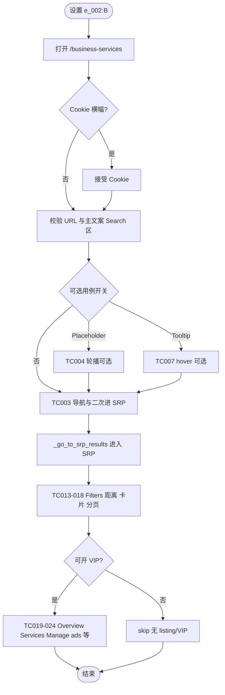

# GT 类广告（Services Web, e_002:B）业务流程

> **业务目标**: 在 **e_002:B** 下验证 Service Landing → Services SRP/BRP → Business profile（VIP）链路上 GT 类广告相关 UI 与导航，并与自动化脚本 TC001–TC024 对齐。

---

## 1. 完整流程图

---

## 2. 详细步骤与观测点

### 步骤1：Landing 页基础（TC001–TC012）

**页面位置**: `{base}/business-services`

**操作**:
1. 注入 `gt_gb_exp_ovr=e_002:B`，`domcontentloaded` 打开落地页。
2. 校验 Search 区、主按钮文案、`Most popular categories`、`All Categories`、热门类目与 Discovery 标题等；按需执行 FAQ、Join us 外链。

**观测点**:
- ✅ URL 与 `Find local professionals`、location testid、`Search Services(n)` 正则（TC001–TC002）。
- ✅ TC003 双路径：填 UK → 回 landing → 再 Search/All Categories 进 SRP。
- ✅ 可选 TC004/TC007 仅在环境变量开启时执行。

**验证方法**:
- 对照 `test_gt_ads_services_web_e002b.py` 中函数名与断言。

**关联规则**: [GT类广告Services-Web规则.md - 3.2](../../业务规则库/Services模块/GT类广告Services-Web规则.md#32-校验规则)

---

### 步骤2：进入 SRP（共同前置）

**页面位置**: Landing → 搜索结果/BRP

**操作**:
1. 使用 `_go_to_srp_results`：填 `GT_SRP_ENTRY_LOCATION`（默认 United Kingdom）→ 优先 **Search Services** / **All Categories** → 否则 **Health & Beauty** 等 fallback。

**观测点**:
- ✅ URL 进入 `search` 或 `business-services` 结果态（与脚本一致）。
- ❌ 控件缺失时不应硬失败，应 **skip**。

**验证方法**:
- 阅读脚本 `_go_to_srp_results` 与 `GT_SRP_*` 环境变量。

**关联规则**: [GT类广告Services-Web规则.md - 3.1](../../业务规则库/Services模块/GT类广告Services-Web规则.md#31-输入规则)

---

### 步骤3：SRP 列表与分页（TC013–TC018）

**页面位置**: Services SRP

**操作**:
1. 断言 `Location`、`Category` 文案；尝试距离 Update；断言 **`Request a quote`**；若有 `GtTestAd` 则在校验容器内断言；可选 Sponsored 外链；分页到第 2 页。

**观测点**:
- ✅ **`Request a quote` 必校验**；`Show phone number` 非必（TC015–TC016）。
- ✅ 分页 URL 含 `page=2` 或 `/page2`（TC018）。

**验证方法**:
- 运行对应 `test_tc013_*` … `test_tc018_*`。

**关联规则**: [GT类广告Services-Web规则.md - 2.1](../../业务规则库/Services模块/GT类广告Services-Web规则.md#21-主流程)

---

### 步骤4：VIP（TC019–TC024）

**页面位置**: SRP listing → VIP（Business profile）

**操作**:
1. `_open_vip_with_overview_services`：最多尝试 6 条 listing。
2. 断言 **Overview**、**Services** 可见；Manage ads 等检查点以各 TC 函数说明为准（当前实现路径相同）。

**观测点**:
- ✅ Overview/Services 可见为共同基线；无兼容 VIP 则 **skip**。
- ⚠️ 六条用例意图与代码路径差异见 [GT类广告Services-Web规则 - 5](../../业务规则库/Services模块/GT类广告Services-Web规则.md#5-已知问题)。

**验证方法**:
- 运行 `test_tc019_*` … `test_tc024_*`。

**关联规则**: [GT类广告Services-Web规则.md - 2.1](../../业务规则库/Services模块/GT类广告Services-Web规则.md#21-主流程)

---

## 3. 流程完整性验证清单

- [ ] TC001–TC002：落地页 URL、文案、Search 区与主按钮
- [ ] TC003：SRP ↔ landing 双次进入路径
- [ ] TC004/TC007（可选）：环境变量与稳定性策略
- [ ] TC005–TC010：分区标题、类目、Discovery、外链、FAQ
- [ ] TC011：Join us 外链域名
- [ ] TC012：FAQ 抽样与答案片段
- [ ] TC013–TC015：Filters、距离、Request a quote
- [ ] TC016：GtTestAd 与 Request a quote
- [ ] TC017：Sponsored 可选外链
- [ ] TC018：分页第 2 页
- [ ] TC019–TC024：VIP Overview/Services（及脚本扩展断言）
- [ ] 环境变量 `GT_SRP_*` 与默认行为一致

---

## 4. 关联文档

- [Services业务全景](./Services业务全景.md)
- [GT类广告Services-Web规则.md](../../业务规则库/Services模块/GT类广告Services-Web规则.md)
- [Bark集成SRP-Web规则.md](../../业务规则库/Services模块/Bark集成SRP-Web规则.md)（SRP 广告策略与 Bark 识别交叉参考）

---

## 5. 变更历史

| 日期 | 版本 | 变更内容 | 变更人 |
|------|------|----------|--------|
| 2026-04-15 | v1.0 | 从 GT-Ads-Services-Web-testcases.md 归档 | 知识库管理器 |
