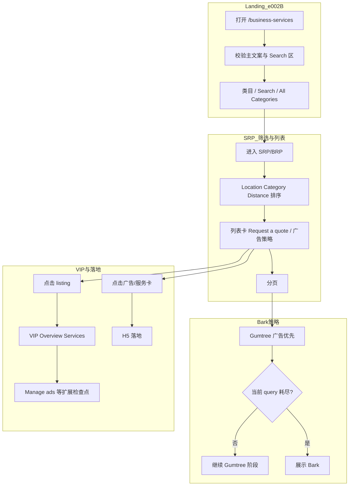
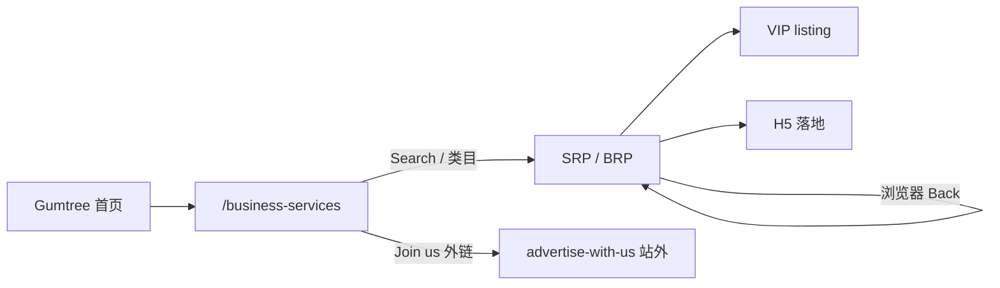
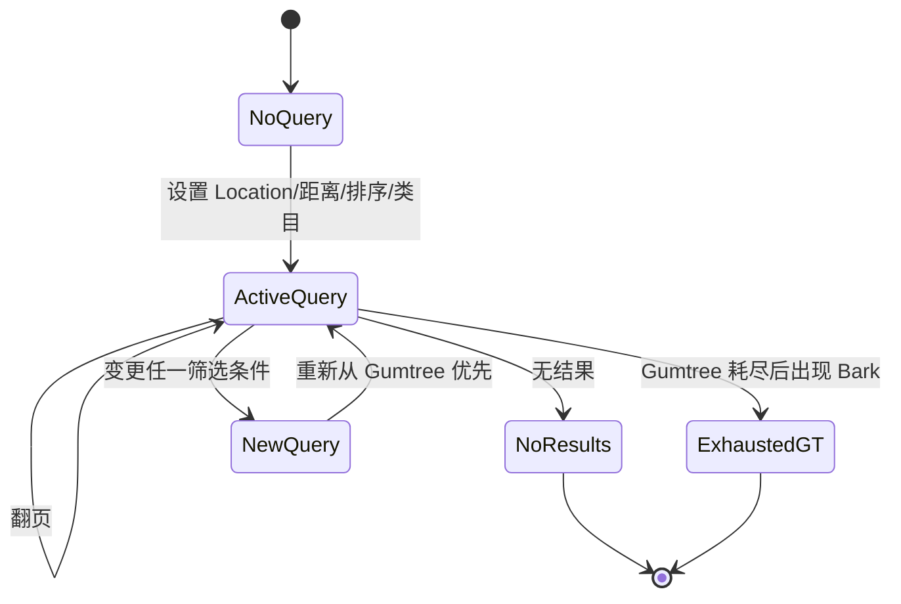

# Services业务域 - 业务全景

## 1. 业务定位

Services 业务域覆盖 Gumtree **Services / Business services** 在 Web 端的找服务体验：从 **Service Landing**、**搜索结果与类目（SRP/BRP）** 到 **商家主页（VIP）**，并包含 **Gumtree 与 Bark 来源的广告**展示策略及 **GT 类广告**相关测试与自动化对齐。

**业务价值**:
- 为访客提供可检索、可筛选、可分页的本地服务列表，并引导询价与进店（H5/VIP）。
- 为测试与交付提供可执行规则与观测点，支撑 e_002 等实验迭代与回归。

**目标用户**:
- **访客**: 浏览、筛选、联系服务方；默认未登录场景为主。
- **测试与研发**: 依据规则库与流程图执行用例、对齐自动化脚本。

---

## 2. 业务范围

### 2.1 功能覆盖

| 功能模块 | 说明 | 核心能力 |
|----------|------|----------|
| Service Landing | `/business-services` 入口页 | 地区搜索、Search Services、类目与 Discovery 分区、FAQ、外链 |
| Services SRP/BRP | 搜索结果与类目结果 | Location/Category/Distance、列表卡、分页、Sponsored 等 |
| 广告与三方 | Gumtree / Bark / GT 测试标记 | 优先级（Gumtree→Bark）、Bark CTA 识别、Request a quote |
| VIP | Business profile | Overview、Services、Manage ads 等模块可见性 |
| 实验 | `gt_gb_exp_ovr` | e_002:A/B 等分流与一致性验证 |

### 2.2 地域覆盖

- 文档与脚本以 **UK** 及示例域名（`unicorn.gumtree.io` 等）为主；实际以环境配置为准。

### 2.3 用户角色

| 角色 | 权限 | 说明 |
|------|------|------|
| 访客 | 浏览 Landing/SRP、点击卡片与外链 | 默认测试角色 |
| 登录用户 | 未在本批用例中展开 | 可按需求扩展规则文档 |

---

## 3. 业务流程全景图

---

## 4. 核心业务流程概览

### 4.1 Bark 集成 SRP 浏览与广告策略

**业务目标**: 在 Web SRP 上验证实验 Header、筛选、分页及 **Gumtree→Bark** 广告优先级与卡片/H5 行为。

**核心步骤**:
1. 配置 `gt_gb_exp_ovr`（A/B/不传）并进入 `/business-services`。
2. 执行 Location、距离、排序与分页组合。
3. 识别 Bark（CTA 文案）并验证优先级与字段规则。
4. 覆盖无结果、非法页码、浏览器历史与异常 Header 等场景。

**关键观测点**:
- ✅ A/B 下核心筛选能力可用；不传 header 默认策略需与产品一致。
- ✅ Gumtree 先于 Bark；筛选变更重置「耗尽」状态。
- ✅ 卡片字段与 H5 跳转符合规则库描述。

**详细流程文档**: [Bark集成SRP浏览业务流程.md](./Bark集成SRP浏览业务流程.md)

---

### 4.2 GT 类广告（e_002:B）Landing → SRP → VIP

**业务目标**: 在固定 **e_002:B** 下，将 Landing、SRP 与 VIP 关键元素与自动化 **TC001–TC024** 对齐。

**核心步骤**:
1. 打开 Landing 并校验 URL、文案与 Search 区。
2. 经 `_go_to_srp_results` 进入 SRP，执行 Filters、距离、卡片 CTA、分页等断言。
3. 在可打开 VIP 时校验 Overview/Services（及 Manage ads 相关检查点）。

**关键观测点**:
- ✅ **`Request a quote`** 为必验；`Show phone number` 非必。
- ✅ 可选用例（placeholder、tooltip、Sponsored）受环境变量控制，默认 skip。
- ⚠️ TC019–TC024 脚本路径一致，产品细分意图需与代码演进对齐。

**详细流程文档**: [GT类广告Services-Web业务流程.md](./GT类广告Services-Web业务流程.md)

---

## 5. 页面拓扑关系

### 5.1 页面入口矩阵

| 页面 | 入口1 | 入口2 | 入口3 | 入口4 |
|------|--------|--------|--------|--------|
| Service Landing `/business-services` | 直接 URL | 顶部导航 Services | TC003 从 SRP 链回后再进 | — |
| Services SRP/BRP | Search Services / All Categories | 填地区跳转 | 热门类目 → BRP | Landing 类目卡片 |
| VIP `/p/...` | SRP 列表 listing 锚点 | — | — | — |
| H5 落地 | 列表卡片点击 | Bark CTA 两种文案 | — | — |

### 5.2 页面跳转流程图

### 5.3 页面关系详解

#### 首页 → Service Landing

- **入口**: 顶部导航 **Services**（悬停子链或图标）。
- **目标**: `/business-services`。
- **参数**: 实验 Header 影响样式与分流。

#### Service Landing → SRP/BRP

- **入口**: **Search Services**、**All Categories**、热门类目（如 Removal）。
- **目标**: 含 `search` 或 `business-services` 的结果 URL（以脚本正则为准）。
- **参数**: 地区文本、类目 slug、实验变量。

#### SRP → VIP

- **入口**: 列表可点击的 listing（`/p/`、`data-q=search-result-anchor` 等）。
- **目标**: 含 **Overview**、**Services** 的 VIP 模板。
- **权限**: 访客可读；Manage 类能力依账号待定。

#### SRP → H5

- **入口**: 服务卡或 Bark 卡 CTA。
- **目标**: H5 落地；返回后保持或恢复 SRP 状态依产品定义。

---

## 6. 业务数据流转

### 6.1 搜索查询与实验状态（概念状态）

### 6.2 用户操作与数据变化

| 操作 | 数据变化 | 前台展示变化 | 涉及页面 |
|------|----------|--------------|----------|
| 修改 Location/邮编 | 后端搜索 query 更新 | 列表刷新，可能重置页码 | SRP |
| 切换距离/排序 | query 参数或状态更新 | 列表刷新，排序常回第 1 页 | SRP |
| 翻页 | page 参数变化 | 列表与页码高亮变化 | SRP |
| 点击 listing | 打开详情路由 | VIP 模块渲染 | VIP |
| 点击 Bark/GT 卡 | 打开 H5 | 新页或同页导航 | H5 |

### 6.3 关键业务数据

| 字段/变量 | 类型 | 必填 | 说明 |
|-----------|------|------|------|
| `gt_gb_exp_ovr` | string | 视场景 | e_002:A / e_002:B；GT 合集固定 B |
| Location 文本 | string | 否 | 地名或邮编；Bark 文档含空=全区域语义 |
| `GT_SRP_LOCATION` 等 | env | 否 | GT 自动化默认 postcode/类目 fallback |
| 分页 page | number | 否 | 与 URL 或组件状态绑定 |

---

## 7. 关键业务规则索引

### 7.1 Bark 与 SRP 广告

- [Bark集成SRP-Web规则.md](../../业务规则库/Services模块/Bark集成SRP-Web规则.md)

### 7.2 GT 类广告与自动化对齐

- [GT类广告Services-Web规则.md](../../业务规则库/Services模块/GT类广告Services-Web规则.md)

---

## 8. 业务FAQ

### Q1: 如何区分 Bark 与 Gumtree 广告？

**A**: Bark 卡片 CTA 为「Request a call」或「Request a call back」；其余按用例与产品定义识别。

### Q2: Gumtree 与 Bark 同时可能出现在哪一屏？

**A**: 首屏若同时存在，Gumtree 应优先；未耗尽前不应被 Bark 抢占（见 Bark 规则与 TC031）。

### Q3: 不传 `gt_gb_exp_ovr` 会怎样？

**A**: 应落到统一默认策略；具体落点需产品与研发确认（Bark 用例 TC004）。

### Q4: GT 合集中 `Request a quote` 与 `Show phone number` 区别？

**A**: 脚本 **必须** 断言 **`Request a quote`**；**`Show phone number` 非必**。

### Q5: TC019–TC024 为何实现路径相同？

**A**: 当前 Python 共用步骤，仅函数名不同；细分检查点待与脚本迭代对齐。

### Q6: 可选用例为何默认关闭？

**A**: Placeholder 轮播与 hover tooltip 易受时机与环境影响（TC004、TC007）。

### Q7: 如何从 Landing 稳定进入 SRP？

**A**: 使用脚本的 `_go_to_srp_results` 优先级：Search Services / All Categories → 备选类目。

### Q8: VIP 打不开时怎么办？

**A**: 脚本在有限次尝试后 **skip**，不判失败。

### Q9: Bark 文档中「空结果是否展示广告」？

**A**: TC047 要求无结果时不展示 Gumtree/Bark 广告卡。

### Q10: 排序切换后页码应如何？

**A**: 应回到第 1 页并刷新列表，避免「第 2 页的第二种排序」混用（Bark TC019）。

---

## 9. 业务指标（可选）

- **核心转化**: Landing → SRP 进入率、询价点击、VIP 到达率等：**待补充**（依赖埋点与产品指标口径）。
- **广告**: Gumtree/Bark 曝光占比、耗尽页码分布：**待补充**。

---

## 10. 已知问题与风险

### 10.1 产品待确认问题

- 默认实验（不传 Header）与未知 Header 值的精确降级策略。
- 刷新（F5）后 query/页码是否保持与 UK 以外站点差异。

### 10.2 技术风险

- 前端改版导致 testid、文案或导航路径变化，引发大规模 skip 或误报。
- 广告库存与实验组合导致环境不稳定，影响「耗尽」类用例复现。

### 10.3 测试过程中发现的问题

- GT 自动化中 TC019–TC024 与 docstring 意图不完全一致，需在迭代中收敛。
- Bark 部分依赖数据构造的用例标为不可自动化（如 TC023）。

---

## 11. 变更历史

| 日期 | 版本 | 变更内容 | 变更人 |
|------|------|----------|--------|
| 2026-04-15 | v1.0 | 归档 Bark-integration-SRP-web-testcases.md 与 GT-Ads-Services-Web-testcases.md，新建 Services 业务域全景与流程 | 知识库管理器 |
