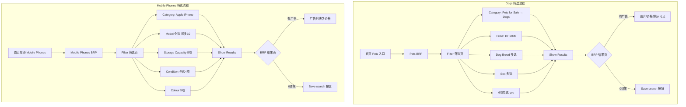
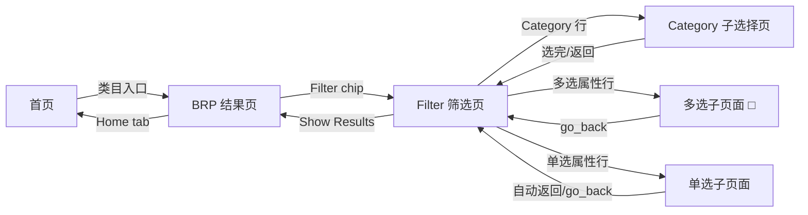
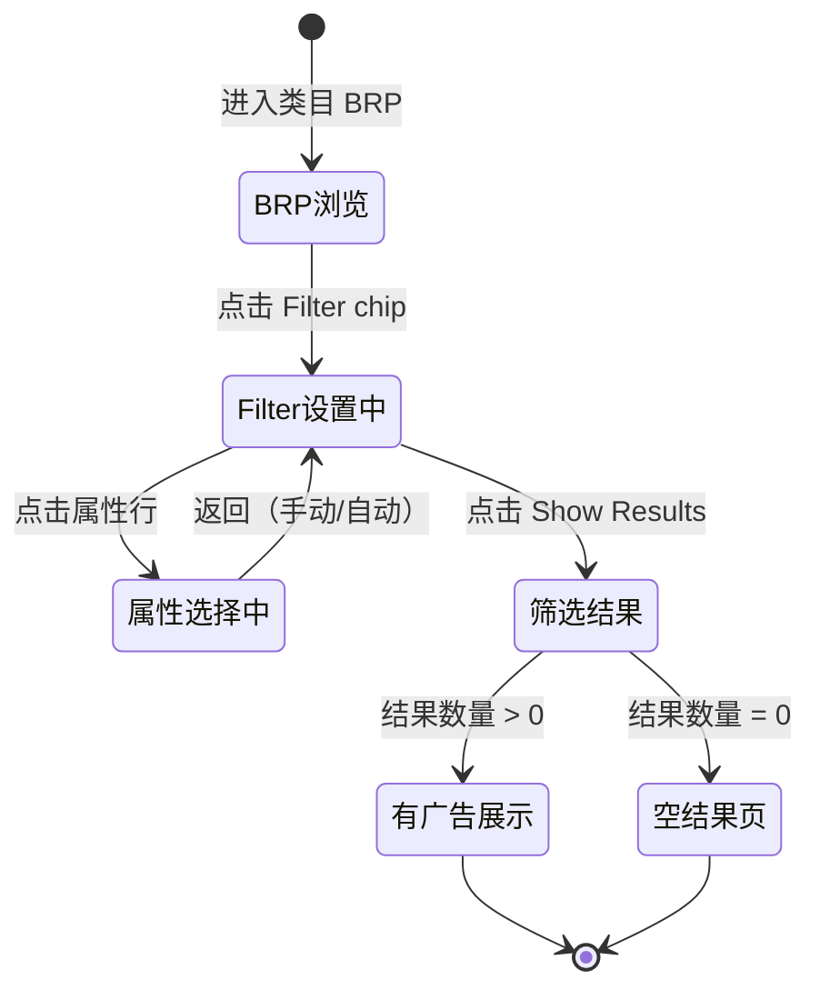

# BRP 筛选业务域 - 业务全景

## 1. 业务定位

BRP 筛选业务域是 Gumtree App 买家侧的核心精准找货路径，为买家在浏览结果页（BRP）提供多维属性组合筛选能力，将宽泛的类目浏览转化为精准的需求匹配，提升广告相关性和买家找货效率。

**业务价值**：
- 为买家提供无需登录即可使用的多属性精准筛选，降低找货摩擦
- 通过类目下钻 + 价格区间 + 多维属性组合，快速缩小候选广告集
- 0 结果时引导买家保存搜索（Save search），形成后续消息触达机会

**目标用户**：
- **访客（未登录）**：可完整使用 BRP 筛选功能（无需登录）
- **已登录买家**：完整筛选功能 + 可保存搜索

## 2. 业务范围

### 2.1 功能覆盖
| 功能模块 | 说明 | 核心能力 |
|---------|------|---------|
| BRP Filter 入口 | BRP 页顶部 Filter chip | 点击进入多属性筛选页 |
| Category 下钻 | 从类目到子类目的层级选择 | 支持多层下钻（如 Pets → Pets for Sale → Dogs） |
| 价格区间 | Min/Max 双输入框 | 独立设置；Min > Max 仍允许提交 |
| 多选属性（□） | Dog Breed / Sex / Model / Storage / Condition / Colour | 勾选策略：< 5 项全选，≥ 5 项选 5 个；Model 上限 10 |
| 单选属性（无□） | Vaccinated / Neutered / Deflead / Microchipped 等 | 点击 yes 后自动返回 Filter |
| Show Results | Filter 页底部按钮（始终 enabled） | 提交筛选条件，跳回 BRP 结果页 |
| 0 结果处理 | BRP 空结果页 | Save search 按钮 + iOS 相似广告推荐 |

### 2.2 地域覆盖
- **Gumtree App（UK）**：Android（com.gumtree.android）/ iOS（com.gumtreeuk2.iphone）

### 2.3 用户角色
| 角色 | 权限 | 说明 |
|-----|------|------|
| 访客（未登录） | 完整筛选功能 | 无需登录即可使用所有筛选属性 |
| 已登录买家 | 完整筛选 + Save search | 0 结果时可保存搜索设置提醒 |

## 3. 业务流程全景图

## 4. 核心业务流程概览

### 4.1 Pets/Dogs 全属性筛选流程
**业务目标**：买家在 Pets BRP 通过 Filter 设置 10 个属性维度（Category+价格+品种+性别+6项健康），精准找到符合条件的狗狗广告。

**核心步骤**：
1. 首页点击 Pets 类目入口，进入 Pets BRP
2. 点击 Filter → 进入筛选页
3. 设置 Category（Pets for Sale → Dogs）
4. 设置价格区间（Min=10 / Max=2000）
5. Dog Breed 多选（≤5项全选，否则选5个）
6. Sex 多选（3项全选）
7. 依次设置 6 个单选属性（各选 yes）
8. 点击 Show Results → 验证 BRP 结果页

**关键观测点**：
- ✅ Category 下钻 Pets for Sale → Dogs 后正确返回 Filter
- ✅ Price Min/Max 字段回显正确（10/2000）
- ✅ Dog Breed 至少勾选 1 项，返回 Filter 正常
- ✅ Sex 3项全选，返回 Filter 正常
- ✅ 单选属性（Vaccinated 等）选 yes 后自动返回
- ✅ 点击 Show Results → BRP Filter 按钮显示「Filter (n)」
- ✅ 有广告：图片/价格/排序标签可见；0 结果：Save search 可见

**详细流程文档**：[Dogs筛选业务流程.md](./Dogs筛选业务流程.md)

---

### 4.2 Mobile Phones 多属性筛选流程
**业务目标**：买家在 Mobile Phones BRP 通过 Filter 设置 Category/Model/Storage/Condition/Colour 5个维度，精准找到目标型号手机广告。

**核心步骤**：
1. 首页类目栏左滑找到 Mobile Phones 入口，进入 BRP
2. 点击 Filter → 进入筛选页
3. Category 选择 Apple iPhone
4. Model 全选（滚动加载，最多 10 项）
5. Storage Capacity 选 5 项
6. Condition 全选（4项）
7. Colour 选 5 项
8. 点击 Show Results → 验证结果页

**关键观测点**：
- ✅ Mobile Phones BRP 加载时间较长，需 long timeout
- ✅ Category 选择页标题含「Mobile Phones」
- ✅ Model 选择页最多勾选 10 项，超出置灰
- ✅ 各属性返回 Filter 后页面仍可见
- ✅ 有广告：价格标签可见；0 结果：Save search 可见

**详细流程文档**：[MobilePhones筛选业务流程.md](./MobilePhones筛选业务流程.md)

---

## 5. 页面拓扑关系

### 5.1 页面入口矩阵
| 页面 | 入口1 | 入口2 |
|-----|------|------|
| Pets BRP | 首页「Pets」类目入口 | - |
| Mobile Phones BRP | 首页类目栏左滑 → Mobile Phones | - |
| Filter 筛选页 | BRP 顶部 Filter chip | - |
| Category 子选择页 | Filter 页「Category」行 | - |
| 多选子页面（□） | Filter 页对应属性行（Dog Breed / Model / Storage 等） | - |
| 单选子页面（无□） | Filter 页对应属性行（Vaccinated / Neutered 等） | - |
| BRP 结果页 | Filter 页「Show Results」按钮 | - |

### 5.2 页面跳转流程图

### 5.3 页面关系详解

#### BRP → Filter 筛选页
- **入口**：BRP 顶部「Filter」chip 按钮
- **目标**：Filter 筛选页（Filters 标题）
- **特点**：Filter 页**无底部导航栏**，无法通过 Tab 直接回首页

#### Filter 筛选页 → 多选子页面
- **入口**：点击多选属性行（Dog Breed / Model / Storage Capacity / Condition / Colour）
- **目标**：对应属性的多选页面
- **特点**：含 CheckBox（□），支持多选；需手动 go_back() 返回

#### Filter 筛选页 → 单选子页面
- **入口**：点击单选属性行（Vaccinated / Neutered 等）
- **目标**：对应属性的单选页面
- **特点**：无 CheckBox，点击 yes 后**自动返回** Filter（若未自动返回则手动 go_back()）

#### Filter 筛选页 → BRP 结果页
- **入口**：Show Results 按钮（始终 enabled）
- **目标**：BRP 结果页（含筛选激活标记「Filter (n)」）
- **特点**：跳回 BRP 后 Filter 按钮显示激活筛选条件数量

## 6. 业务数据流转

### 6.1 筛选状态流转

### 6.2 用户操作与数据变化
| 操作 | 数据变化 | 前台展示变化 | 涉及页面 |
|-----|---------|------------|---------|
| 进入 BRP | 无 | 显示全量广告列表 + 结果数量 | BRP 页 |
| 点击 Filter | 无 | 进入 Filter 筛选页 | Filter 页 |
| Category 下钻选择 | 无（前端状态） | Category 行显示已选值 | Category 子选择页 |
| 多选属性勾选 | 无（前端状态） | 勾选项高亮 | 多选子页面 |
| 单选属性选 yes | 无（前端状态） | 自动返回 Filter，属性行显示 yes | 单选子页面 |
| 输入价格区间 | 无（前端状态） | 输入框回显 Min/Max 值 | Filter 页 |
| 点击 Show Results | 无 | 跳回 BRP，Filter 按钮显示「Filter (n)」 | BRP 页 |
| BRP 有广告 | 无 | 广告图片/价格/排序标签/数量可见 | BRP 页 |
| BRP 0 结果 | 无 | 显示 Save search 按钮 | BRP 0结果页 |

### 6.3 关键业务数据

#### 筛选条件参数
| 字段 | 类型 | 必填 | 说明 |
|-----|------|-----|------|
| Category | String | 否 | 下钻路径，如 Pets for Sale/Dogs |
| Price Min | Number | 否 | 价格下限 |
| Price Max | Number | 否 | 价格上限 |
| 多选属性值 | Array[String] | 否 | 勾选的属性值列表 |
| 单选属性值 | String | 否 | yes / no / any |

## 7. 关键业务规则索引

### 7.1 多选勾选策略
- [BRP筛选规则.md - 3.2 校验规则](../../../业务规则库/buyer/BRP筛选模块/BRP筛选规则.md#32-校验规则)

### 7.2 回首页导航策略
- [BRP筛选规则.md - 3.4 业务约束](../../../业务规则库/buyer/BRP筛选模块/BRP筛选规则.md#34-业务约束)

### 7.3 Dogs 类目属性规则
- [BRP筛选规则.md - 3.5 Dogs 类目专属规则](../../../业务规则库/buyer/BRP筛选模块/BRP筛选规则.md#35-dogs-类目专属规则)

### 7.4 Mobile Phones 类目属性规则
- [BRP筛选规则.md - 3.6 Mobile Phones 类目专属规则](../../../业务规则库/buyer/BRP筛选模块/BRP筛选规则.md#36-mobile-phones-类目专属规则)

## 8. 业务FAQ

### Q1: 未登录用户可以使用 BRP 筛选功能吗？
**A**: 可以。筛选功能无需登录，访客和已登录买家均可完整使用 Filter 的全部属性。

### Q2: Show Results 按钮什么时候会变成 disabled？
**A**: 不会。Show Results 按钮始终处于 enabled 状态，无论是否设置了任何筛选条件。

### Q3: Price Min > Price Max 会报错吗？
**A**: 会显示前端校验提示，但**仍允许提交跳转 SRP**（实测确认，非强阻断）。

### Q4: Model 最多选几个？
**A**: Apple iPhone Model 最多勾选 10 个，超出后其余项自动置灰不可选。

### Q5: 单选属性选完后为什么会自动返回？
**A**: 单选属性（无 CheckBox）选中后页面自动返回 Filter，是设计行为。若未自动返回（如部分 iOS 机型），脚本会执行 go_back() 手动返回。

### Q6: iOS 和 Android 的属性集完全一致吗？
**A**: 不完全一致。特别是 Dogs 类目的 6 个单选属性（Vaccinated 等）在 iOS / Android 上可能存在差异，找不到的属性会跳过处理。

### Q7: BRP 筛选结果为 0 时，iOS 会展示相似广告吗？
**A**: 是的。iOS 可能展示「相似广告」推荐（业务兜底策略），因此 0 结果时不强断言「无广告图片」，只断言「Save search」按钮可见。

### Q8: Mobile Phones BRP 加载为什么比其他类目慢？
**A**: Mobile Phones 类目数据量较大，BRP 加载需要约 6 秒，自动化脚本中使用 `is_brp_visible_long()`（更长的 timeout）进行等待。

### Q9: Filter 筛选页没有底部导航，如何回首页？
**A**: 需先 go_back() 退出 Filter 筛选页回到 BRP，再点击底部导航的 Home Tab。直接在 Filter 页无法点击 Tab 导航。

### Q10: 筛选激活后 Filter 按钮会变化吗？
**A**: 是的。设置筛选条件并点击 Show Results 后，BRP 的 Filter 按钮会显示激活状态「Filter (n)」，n 为激活的筛选条件数量，且 n > 0。

## 9. 业务指标（可选）

### 9.1 核心指标
- 待补充（筛选使用率、筛选后 CTR、Show Results 点击率等需接入埋点数据）

### 9.2 漏斗指标
- **Dogs 筛选漏斗**：进入 Pets BRP → 点击 Filter → 设置 Category/Price/属性 → Show Results → 点击广告
- **Mobile Phones 筛选漏斗**：进入 Mobile Phones BRP → 点击 Filter → 设置 5个属性维度 → Show Results → 点击广告

## 10. 已知问题与风险

### 10.1 产品待确认问题
1. **Price Min > Max 强校验缺失**：当前允许 Min > Max 提交，是否需要强阻断待产品确认
2. **0 结果 iOS 相似广告**：iOS 0 结果页展示相似广告推荐，是产品规划行为还是临时兜底，待确认是否需统一

### 10.2 技术风险
- Filter 页滚动查找单选属性依赖动态内容高度，在不同设备/分辨率下可能找不到属性行
- iOS BRP 的 tab bar 可见性问题需特殊处理（`element_to_be_clickable`），与 Android 行为不同
- Model 全选时 `select_all_with_scroll(max_scrolls=25)` 依赖滚动次数，数据量变化时可能需调整

### 10.3 测试过程中发现的问题
- **Dogs TC022**：Keyword 特殊字符搜索行为：自动化脚本 selector 错误，产品行为待人工或修正脚本验证
- iOS / Android 上 6 个单选属性的存在情况不同，需分平台维护测试覆盖

## 11. 变更历史
| 日期 | 版本 | 变更内容 | 变更人 |
|-----|------|---------|--------|
| 2026-04-17 | v1.0 | 初始版本，基于 buyer-筛选功能-Dogs与MobilePhones.md（2条用例）归档 | Arin Yang |
