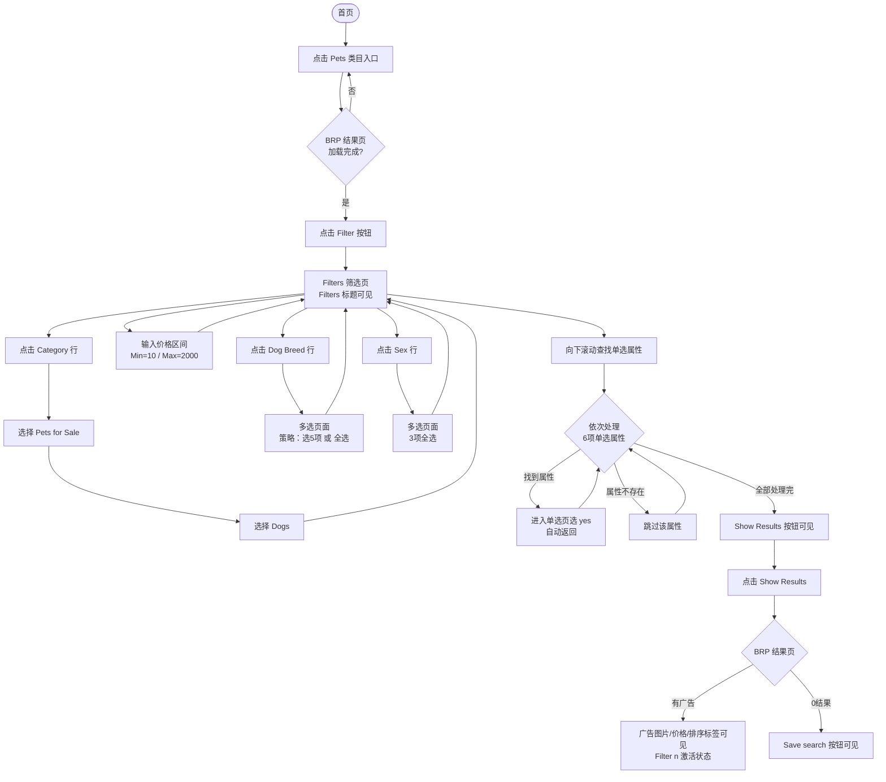

# Pets/Dogs 多属性筛选业务流程

> **业务目标**：买家在 Pets 类目 BRP 页通过 Filter 设置 Category（Pets for Sale → Dogs）、价格区间、Dog Breed（多选）、Sex（多选）及 6 项健康单选属性，精准缩小找狗范围，最终查看符合条件的广告列表。

---

## 1. 完整流程图

---

## 2. 详细步骤与观测点

### 步骤1：进入 Pets BRP 页
**页面位置**：App 首页 → Pets 类目入口

**操作**：
1. 在首页顶部类目栏点击「Pets」入口
2. 等待 BRP 页面加载

**观测点**：
- ✅ 成功进入 Pets BRP 页面
- ✅ 页面顶部显示结果数量文字（如「1,234 results」）
- ❌ 若结果数量不可见，说明 BRP 未加载完成

**验证方法**：
- 断言结果数量文字（results / adverts）元素可见（timeout 10s）

**关联规则**：[BRP筛选规则.md - 2.1 主流程](../../../业务规则库/buyer/BRP筛选模块/BRP筛选规则.md#21-主流程)

---

### 步骤2：打开 Filter 筛选页
**页面位置**：Pets BRP 页顶部

**操作**：
1. 点击 BRP 顶部「Filter」chip 按钮

**观测点**：
- ✅ 进入 Filter 筛选页
- ✅ 页面标题「Filters」可见
- ✅ 底部「Show Results」按钮可见

**验证方法**：
- 断言「Filters」标题元素可见
- 断言「Show Results」按钮可见

**关联规则**：[BRP筛选规则.md - 3.3 权限规则](../../../业务规则库/buyer/BRP筛选模块/BRP筛选规则.md#33-权限规则)

---

### 步骤3：设置 Category（Pets for Sale → Dogs）
**页面位置**：Filter 筛选页 → Category 子选择页

**操作**：
1. 点击「Category」属性行
2. 等待类目选择页打开
3. 选择「Pets for Sale」
4. 选择「Dogs」
5. 验证返回 Filters 主页面

**观测点**：
- ✅ 点击 Category 后进入下钻选择页
- ✅ 「Pets for Sale」可选且点击有效
- ✅ 「Dogs」可选且点击有效
- ✅ 选完后返回 Filters 主页面

**验证方法**：
- 断言 Category 下钻页出现
- 点击 Pets for Sale → 断言 Dogs 子选项出现
- 断言返回后 Filters 标题可见

**关联规则**：[BRP筛选规则.md - 3.5 Dogs 类目专属规则](../../../业务规则库/buyer/BRP筛选模块/BRP筛选规则.md#35-dogs-类目专属规则)

---

### 步骤4：设置价格区间（Min=10 / Max=2000）
**页面位置**：Filter 筛选页价格区间输入框

**操作**：
1. 找到 Price Min 输入框，输入 `10`
2. 找到 Price Max 输入框，输入 `2000`

**观测点**：
- ✅ Price Min 字段显示 `10`
- ✅ Price Max 字段显示 `2000`
- ⚠️ Min > Max 时显示校验提示，但仍允许继续筛选（已实测行为）

**验证方法**：
- 断言 Min 字段值包含 `10`
- 断言 Max 字段值包含 `2000`

**关联规则**：[BRP筛选规则.md - 3.2 校验规则](../../../业务规则库/buyer/BRP筛选模块/BRP筛选规则.md#32-校验规则)

---

### 步骤5：设置 Dog Breed（多选 □）
**页面位置**：Filter 筛选页 → Dog Breed 多选子页面

**操作**：
1. 点击「Dog Breed」属性行，进入多选页面
2. 按策略勾选：总项数 < 5 则全选；否则选 5 个品种
3. 验证至少勾选 1 项
4. 点击返回，确认回到 Filters 主页面

**观测点**：
- ✅ 进入 Dog Breed 多选页面（含 CheckBox □）
- ✅ 至少勾选 1 项品种
- ✅ 返回后 Filters 标题可见

**验证方法**：
- 断言多选页面打开
- 执行勾选策略，断言 count >= 1
- go_back() 后断言 Filters 页面可见

**关联规则**：[BRP筛选规则.md - 3.2 校验规则（多选数量策略）](../../../业务规则库/buyer/BRP筛选模块/BRP筛选规则.md#32-校验规则)

---

### 步骤6：设置 Sex（多选 □，3 项全选）
**页面位置**：Filter 筛选页 → Sex 多选子页面

**操作**：
1. 点击「Sex」属性行，进入多选页面
2. 全选所有选项（共 3 项，不足 5 项则全选策略）
3. 验证至少勾选 1 项
4. 点击返回，确认回到 Filters 主页面

**观测点**：
- ✅ 进入 Sex 多选页面（含 CheckBox □，共 3 项）
- ✅ 3 项全部被选中
- ✅ 返回后 Filters 标题可见

**验证方法**：
- 断言 count >= 1（实际应为 3）
- go_back() 后断言 Filters 页面可见

**关联规则**：[BRP筛选规则.md - 3.5 Dogs 类目专属规则](../../../业务规则库/buyer/BRP筛选模块/BRP筛选规则.md#35-dogs-类目专属规则)

---

### 步骤7：设置 6 项单选属性（各选 yes）
**页面位置**：Filter 筛选页（需向下滚动查找属性行）

**操作（对每个属性重复）**：
1. 在 Filter 页向下滚动找到属性行（如「Vaccinated」）
2. 点击属性行进入单选页
3. 点击「yes」选项
4. 页面自动返回 Filter（若未自动返回则手动 go_back()）
5. 若属性行在当前平台不存在，跳过该属性继续

**6 项属性**：Vaccinated / Neutered or Spayed / Deflead / Microchipped / KC Registered / Health checked by a vet

**观测点**：
- ✅ 找到属性行时，进入单选页并选中 yes
- ✅ 选中后页面自动返回 Filter 主页
- ⚠️ iOS/Android 属性集不同，部分属性可能不存在（跳过处理，不影响流程）

**验证方法**：
- 对每个属性：若找到则断言选中成功，返回后 Filters 可见
- 记录实际设置的属性列表（allure attach）

**关联规则**：[BRP筛选规则.md - 3.4 业务约束](../../../业务规则库/buyer/BRP筛选模块/BRP筛选规则.md#34-业务约束)

---

### 步骤8：验证 Show Results 并查看结果
**页面位置**：Filter 筛选页底部 → BRP 结果页

**操作**：
1. 向上滚动回 Filter 页顶部
2. 确认「Show Results」按钮可见
3. 点击「Show Results」
4. 等待约 4 秒，验证 BRP 结果页

**观测点（有广告时）**：
- ✅ BRP 结果页正常加载（结果数量文字可见）
- ✅ Filter 按钮显示激活状态（「Filter (n)」，n > 0）
- ✅ 广告图片（content-desc=Image）可见
- ✅ 价格标签（£ 或 Free）可见
- ✅ 排序标签（Newest first 等）可见
- ✅ 当前屏幕广告数量 ≥ 1

**观测点（0 结果时）**：
- ✅ BRP 结果页正常展示（不崩溃）
- ✅ 「Save search」按钮可见
- ⚠️ iOS 可能展示「相似广告」推荐，不强断言无广告图片

**验证方法**：
- 断言 BRP 结果页可见
- 断言 Filter 按钮激活计数 > 0
- 若有广告：断言图片、价格、排序标签、广告数量
- 若 0 结果：断言 Save search 按钮可见

**关联规则**：[BRP筛选规则.md - 2.2 异常流程](../../../业务规则库/buyer/BRP筛选模块/BRP筛选规则.md#22-异常流程)

---

## 3. 流程完整性验证清单

- [ ] 点击首页 Pets 类目 → 成功进入 BRP，结果数量文字可见
- [ ] BRP 页 Filter 按钮可见
- [ ] 点击 Filter → Filters 标题可见
- [ ] Filter 页 Show Results 按钮始终可见
- [ ] Category 下钻：Pets for Sale → Dogs → 返回 Filters 正常
- [ ] Price Min 字段显示 `10`
- [ ] Price Max 字段显示 `2000`
- [ ] Dog Breed 多选页可打开，至少勾选 1 项，返回 Filters 正常
- [ ] Sex 多选页可打开（3 项），至少勾选 1 项，返回 Filters 正常
- [ ] Vaccinated 单选 yes → 自动返回 Filters（或手动返回成功）
- [ ] Neutered or Spayed 单选 yes → 返回 Filters 正常
- [ ] Deflead 单选 yes → 返回 Filters 正常
- [ ] Microchipped 单选 yes → 返回 Filters 正常
- [ ] KC Registered 单选 yes → 返回 Filters 正常
- [ ] Health checked by a vet 单选 yes → 返回 Filters 正常
- [ ] 点击 Show Results → BRP 结果页正常加载
- [ ] BRP Filter 按钮显示激活状态「Filter (n)」，n > 0
- [ ] 有广告：图片/价格/排序标签/数量均可见
- [ ] 0 结果：Save search 按钮可见，页面不崩溃

---

## 4. 关联文档

- [BRP筛选业务全景](./BRP筛选业务全景.md)
- [BRP筛选规则.md](../../../业务规则库/buyer/BRP筛选模块/BRP筛选规则.md)

---

## 5. 变更历史

| 日期 | 版本 | 变更内容 | 变更人 |
|-----|------|---------|--------|
| 2026-04-17 | v1.0 | 初始版本，基于 buyer-筛选功能-Dogs与MobilePhones.md（APP_BUYER_DOGS_FILTER_001）归档 | Arin Yang |
