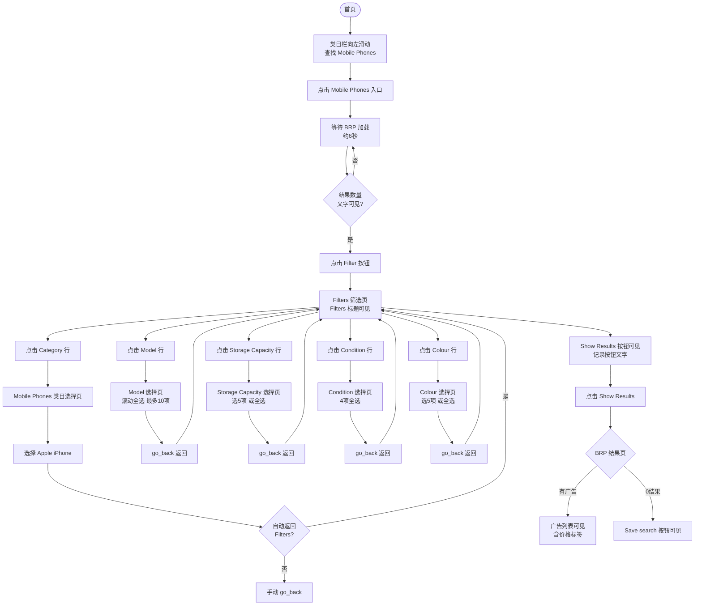

# Mobile Phones 多属性筛选业务流程

> **业务目标**：买家在 Mobile Phones 类目 BRP 页通过 Filter 依次设置 Category（Apple iPhone）、Model（全选）、Storage Capacity（5项）、Condition（全选）、Colour（5项），精准找到目标手机广告，验证筛选结果页正常展示。

---

## 1. 完整流程图

---

## 2. 详细步骤与观测点

### 步骤1：进入 Mobile Phones BRP 页
**页面位置**：App 首页类目栏

**操作**：
1. 首页顶部类目栏向左滑动，查找「Mobile Phones」类目
2. 点击「Mobile Phones」入口
3. 等待 BRP 加载（约 6 秒）

**观测点**：
- ✅ 成功进入 Mobile Phones BRP 页面
- ✅ 页面显示结果数量文字（long timeout 约 10 秒等待）
- ⚠️ Mobile Phones 类目 BRP 加载时间较长，需使用 `is_brp_visible_long()`

**验证方法**：
- 断言结果数量文字可见（long timeout 版本）

**关联规则**：[BRP筛选规则.md - 3.6 Mobile Phones 类目专属规则](../../../业务规则库/buyer/BRP筛选模块/BRP筛选规则.md#36-mobile-phones-类目专属规则)

---

### 步骤2：打开 Filter 筛选页
**页面位置**：Mobile Phones BRP 页顶部

**操作**：
1. 点击「Filter」chip 按钮

**观测点**：
- ✅ Filter 筛选页打开（「Filters」标题可见）

**验证方法**：
- 断言「Filters」标题可见

**关联规则**：[BRP筛选规则.md - 3.3 权限规则](../../../业务规则库/buyer/BRP筛选模块/BRP筛选规则.md#33-权限规则)

---

### 步骤3：Category → 选择 Apple iPhone
**页面位置**：Filter 筛选页 → Category 子选择页

**操作**：
1. 点击「Category」属性行
2. 等待 Category 选择页打开
3. 验证页面标题含「Mobile Phones」
4. 选择「Apple iPhone」
5. 若未自动返回，手动 go_back()
6. 验证回到 Filters 主页面

**观测点**：
- ✅ Category 选择页标题含「Mobile Phones」
- ✅ 「Apple iPhone」可选且点击有效
- ✅ 返回后 Filters 标题可见

**验证方法**：
- 断言页面标题含「Mobile Phones」
- 断言返回后 Filters 页面可见

**关联规则**：[BRP筛选规则.md - 3.6 Mobile Phones 类目专属规则](../../../业务规则库/buyer/BRP筛选模块/BRP筛选规则.md#36-mobile-phones-类目专属规则)

---

### 步骤4：Model → 全选（最多 10 项）
**页面位置**：Filter 筛选页 → Model 多选子页面

**操作**：
1. 点击「Model」属性行
2. 验证 Model 选择页打开（标题含「Model」）
3. 滚动全选所有 Model 选项（App 限制最多选 10 个）
4. 验证至少勾选 1 项
5. 点击返回，验证回到 Filters 主页面

**观测点**：
- ✅ Model 选择页标题含「Model」
- ✅ 已选择至少 1 个 Model 选项
- ✅ 超出 10 个后，其余项自动置灰（不可继续选择）
- ✅ go_back() 后 Filters 页面可见

**验证方法**：
- 断言 Model 页面标题含「Model」
- 执行 `select_all_with_scroll(max_scrolls=25)`，断言 count > 0
- 记录已选数量（Allure attach）
- go_back() 后断言 Filters 可见

**关联规则**：[BRP筛选规则.md - 3.2 校验规则（多选上限）](../../../业务规则库/buyer/BRP筛选模块/BRP筛选规则.md#32-校验规则)

---

### 步骤5：Storage Capacity → 选 5 项
**页面位置**：Filter 筛选页 → Storage Capacity 多选子页面

**操作**：
1. 点击「Storage Capacity」属性行
2. 验证页面标题含「Storage Capacity」
3. 按策略勾选：总项数 < 5 则全选；否则选 5 项
4. 验证至少勾选 1 项
5. go_back() 返回，验证 Filters 可见

**观测点**：
- ✅ Storage Capacity 选择页打开
- ✅ 至少勾选 1 项

**验证方法**：
- 断言页面标题含「Storage Capacity」
- 断言 count > 0
- go_back() 后断言 Filters 可见

**关联规则**：[BRP筛选规则.md - 3.6 Mobile Phones 类目专属规则](../../../业务规则库/buyer/BRP筛选模块/BRP筛选规则.md#36-mobile-phones-类目专属规则)

---

### 步骤6：Condition → 全选（共 4 项）
**页面位置**：Filter 筛选页 → Condition 多选子页面

**操作**：
1. 点击「Condition」属性行
2. 验证页面标题含「Condition」
3. 全选所有选项（4 项，不足 5 项则全选策略）
4. 验证至少勾选 1 项
5. go_back() 返回，验证 Filters 可见

**观测点**：
- ✅ Condition 选择页打开（共 4 项）
- ✅ 4 项全部勾选（count = 4）

**验证方法**：
- 断言页面标题含「Condition」
- 断言 count > 0（实际为 4）
- go_back() 后断言 Filters 可见

**关联规则**：[BRP筛选规则.md - 3.6 Mobile Phones 类目专属规则](../../../业务规则库/buyer/BRP筛选模块/BRP筛选规则.md#36-mobile-phones-类目专属规则)

---

### 步骤7：Colour → 选 5 项
**页面位置**：Filter 筛选页 → Colour 多选子页面

**操作**：
1. 点击「Colour」属性行
2. 验证页面标题含「Colour」
3. 按策略勾选：总项数 < 5 则全选；否则选 5 项
4. 验证至少勾选 1 项
5. go_back() 返回，验证 Filters 可见

**观测点**：
- ✅ Colour 选择页打开
- ✅ 至少勾选 1 种颜色

**验证方法**：
- 断言页面标题含「Colour」
- 断言 count > 0
- go_back() 后断言 Filters 可见

**关联规则**：[BRP筛选规则.md - 3.6 Mobile Phones 类目专属规则](../../../业务规则库/buyer/BRP筛选模块/BRP筛选规则.md#36-mobile-phones-类目专属规则)

---

### 步骤8：验证 Show Results 并查看结果
**页面位置**：Filter 筛选页底部 → BRP 结果页

**操作**：
1. 验证「Show Results」按钮可见，记录按钮文字（如「Show Results (123)」）
2. 点击「Show Results」
3. 等待约 4 秒，验证 BRP 结果页

**观测点（有广告时）**：
- ✅ BRP 结果页正常加载，结果数量文字可见
- ✅ 广告列表可见，含价格标签（£ 或 Free）

**观测点（0 结果时）**：
- ✅ 结果页正常展示（不崩溃）
- ✅ 「Save search」按钮可见
- ⚠️ iOS 可能展示「相似广告」推荐，不强断言无广告

**验证方法**：
- 断言 Show Results 按钮可见
- 点击后断言 BRP 结果页可见
- 若有广告：断言广告列表含价格标签
- 若 0 结果：断言 Save search 按钮可见

**关联规则**：[BRP筛选规则.md - 2.2 异常流程](../../../业务规则库/buyer/BRP筛选模块/BRP筛选规则.md#22-异常流程)

---

## 3. 流程完整性验证清单

- [ ] 首页类目栏左滑找到 Mobile Phones 入口
- [ ] 点击 Mobile Phones → BRP 加载完成，结果数量文字可见（long timeout）
- [ ] BRP 页 Filter 按钮可见
- [ ] 点击 Filter → Filters 标题可见
- [ ] Category 选择页标题含「Mobile Phones」
- [ ] 选择 Apple iPhone → 返回 Filters 成功
- [ ] Model 选择页标题含「Model」
- [ ] Model 全选（最多 10 项），count > 0
- [ ] go_back() 返回 Filters 后页面可见
- [ ] Storage Capacity 选择页打开，勾选 ≥ 1 项
- [ ] go_back() 返回 Filters 成功
- [ ] Condition 选择页打开（4 项），全选
- [ ] go_back() 返回 Filters 成功
- [ ] Colour 选择页打开，勾选 ≥ 1 项
- [ ] go_back() 返回 Filters 成功
- [ ] Show Results 按钮可见
- [ ] 点击 Show Results → BRP 结果页加载完成
- [ ] 有广告：价格标签（£ 或 Free）可见
- [ ] 0 结果：Save search 按钮可见，页面不崩溃

---

## 4. 关联文档

- [BRP筛选业务全景](./BRP筛选业务全景.md)
- [BRP筛选规则.md](../../../业务规则库/buyer/BRP筛选模块/BRP筛选规则.md)

---

## 5. 变更历史

| 日期 | 版本 | 变更内容 | 变更人 |
|-----|------|---------|--------|
| 2026-04-17 | v1.0 | 初始版本，基于 buyer-筛选功能-Dogs与MobilePhones.md（APP_BUYER_MOBILE_FILTER_001）归档 | Arin Yang |
