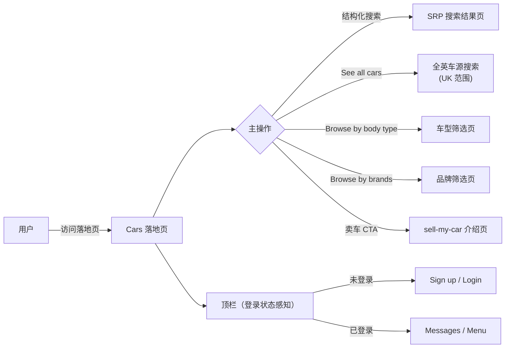
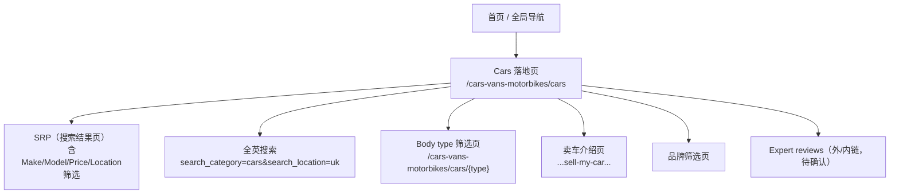
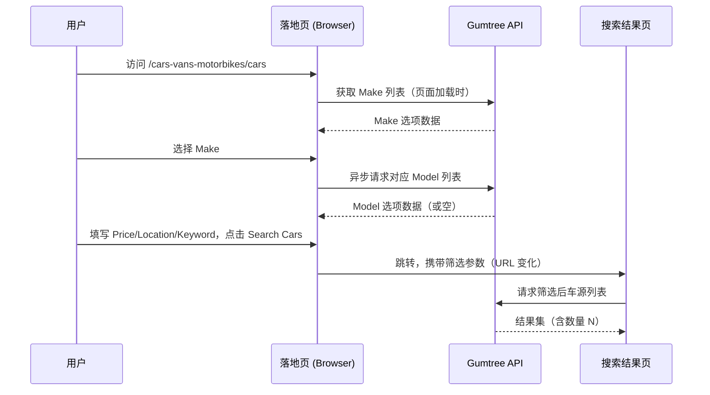

# Cars 类目业务全景

## 1. 业务定位与价值
- **业务目标**: 作为 Cars 类目的 SEO/导流落地页，汇聚结构化找车入口，将浏览意图用户转化为 SRP（搜索结果页）用户，同时覆盖「卖车」转化路径
- **核心价值**:
  - SEO 收录：URL `/cars-vans-motorbikes/cars` + 标题 `Used Cars for Sale Across the UK | Gumtree` 形成精准关键词落点
  - 结构化搜索：Make/Model 联动 + 价格/地区/关键词，降低用户找车门槛
  - 内容运营：24h 上新、Popular models、Body type、Expert reviews、Brands 等内容区块增强留存
- **业务范围**: 落地页浏览与搜索（不含 SRP、广告详情页、支付、账户管理）

## 2. 业务流程总览

## 3. 核心业务场景

### 3.1 结构化找车（主场景）
- **Make/Model 联动**: 选 Make → 异步刷新 Model，两者均可选或跳过
- **Price 区间**: min/max 下拉，均可选 Any
- **Location**: 邮编或城镇名
- **More options / Keyword**: 折叠式，可展开输入关键词
- **Search Cars (N)**: 按钮始终 enabled，N 为实时数量（6,058 as of 2026-04-10）

### 3.2 内容浏览（辅助场景）
- **24h 上新**: 显示过去 24 小时新增广告数 + 至少 1 条广告链接
- **Popular models**: 热门车型品牌内链
- **Browse by body type**: 6 种车型（Hatchback/Saloon/Estate/MPV/Coupe/Convertible）+ SVG 图标
- **Expert reviews**: 专业评测文章（跳转目标待实测）
- **Browse by brands**: 品牌快捷入口

## 4. 页面拓扑

## 5. 数据流

## 6. 关键规则索引

| 规则类型 | 关键规则 | 规则文档 |
|---------|---------|---------|
| UI 展示 | Hero 主标题/副标题（响应式） | [Cars落地页规则.md §3.4](../../../业务规则库/buyer/Cars类目模块/Cars落地页规则.md) |
| 搜索表单 | Make/Model 联动、Price/Location/Keyword | [Cars落地页规则.md §3.1](../../../业务规则库/buyer/Cars类目模块/Cars落地页规则.md) |
| 按钮行为 | Search Cars (N) 始终 enabled，N 为动态数量 | [Cars落地页规则.md §3.4](../../../业务规则库/buyer/Cars类目模块/Cars落地页规则.md) |
| 跳转规则 | See all cars → search_category=cars&search_location=uk | [Cars落地页规则.md §3.4](../../../业务规则库/buyer/Cars类目模块/Cars落地页规则.md) |
| 内容区块 | 24h 上新 / Body type / Popular models / Expert reviews / Brands | [Cars落地页规则.md §3.4](../../../业务规则库/buyer/Cars类目模块/Cars落地页规则.md) |
| 权限 | 未登录可完整使用落地页所有功能 | [Cars落地页规则.md §3.3](../../../业务规则库/buyer/Cars类目模块/Cars落地页规则.md) |
| Cookie | 首次访问需 Accept all，否则可能遮挡搜索区 | [Cars落地页规则.md §3.4](../../../业务规则库/buyer/Cars类目模块/Cars落地页规则.md) |

## 7. 常见问题（FAQ）

**Q1: 未登录用户能否使用所有找车功能？**
A: 是的。搜索、浏览、Body type / Brands / Reviews 等所有落地页内容均无需登录。顶栏登录态感知但不影响找车路径。

**Q2: Make/Model 下拉是静态数据还是动态接口？**
A: Make 列表在页面加载时获取；Model 在选择 Make 后通过异步接口刷新。若该 Make 无 Model 数据，则 Model 下拉无有效选项，可直接跳过搜索。

**Q3: Search Cars (N) 的 N 是固定值吗？**
A: 不是。N 为实时动态条数（可能含千位分隔符，如 6,058）。自动化验证时应使用正则匹配 `\d[\d,]*` 而非硬编码数字。

**Q4: See all cars 和直接点击 Search Cars 有何区别？**
A: See all cars 固定跳转全英车源（`search_location=uk`），不附带 Make/Model/Price 筛选条件；Search Cars 则携带当前表单中填写的所有筛选参数进入 SRP。

**Q5: 如何处理 Cookie 横幅影响自动化？**
A: 在自动化脚本中封装 `close_privacy_dialogs`，在各测试用例前先关闭横幅，再操作搜索区元素。

## 8. 业务指标

| 指标 | 描述 | 当前值（实测 2026-04-10） |
|-----|------|----------------------|
| Search Cars 总量 | 按钮显示的全平台 Cars 广告数 | ~6,058 |
| 24h 上新量 | 过去 24 小时新增广告数 | ~63 |
| Body type 卡片数 | 落地页展示车型数 | 6 |
| 覆盖测试用例数 | unicorn-cars-landing-测试用例-20260410.md | 34 |

## 9. 已知问题与风险

| ID | 问题 | 影响 | 状态 |
|----|------|------|------|
| TC023 | ~~Price min > Price max 前端校验行为未实测~~ | — | ✅ 已实测（2026-04-16）：显示校验提示，仍允许跳转 SRP |
| TC026 | ~~Popular models 链接有效性未验证~~ | — | ✅ 已实测（2026-04-16）：站内链接 `/cars-vans-motorbikes/cars/{brand}/{model}` |
| TC027 | ~~Expert reviews 跳转目标未实测~~ | — | ✅ 已实测（2026-04-16）：外链至 `gumtree.com/info/cars/reviews-hub/` |
| TC028 | ~~Browse by brands 跳转目标未实测~~ | — | ✅ 已实测（2026-04-16）：站内链接 `/cars-vans-motorbikes/cars/{brand}?distance=50` |
| TC022 | Keyword 特殊字符搜索行为 | 可能导致 XSS 风险或空结果无提示 | ⚠️ 自动化脚本 selector 错误，产品行为待人工或修正脚本验证 |
| TC025 | SRP 后退导航行为异常（新 Bug）| 用户期望后退回落地页，实测跳至 `/search?...`；SRP URL 疑似与落地页相同 | ❌ 待产品确认设计意图 |
| TC030 | 已登录 Cars LP 顶栏显示验证 | 无法确认登录态顶栏渲染正确 | ⚠️ LOGIN-SETUP 超时，待自动化修复后重测 |
| TC033 | 首屏可见时间无 SLA 基线 | 性能测试无法自动化 | ⚠️ 暂跳过 |

## 10. 依赖与影响分析

| 类型 | 模块/页面 | 关系 |
|-----|---------|------|
| 上游入口 | 首页、全局导航 | 提供进入 Cars 落地页的点击入口 |
| 下游跳转 | SRP 搜索结果页 | Search Cars / See all cars / Body type / Brands 均跳转至此 |
| 下游跳转 | sell-my-car 介绍页 | 卖车 CTA 跳转目标 |
| 共享规则 | 首页模块顶栏规则 | 顶栏登录态感知规则与首页完全一致 |
| 共享规则 | Cookie / OneTrust | 同全站 Cookie 机制 |

## 11. 变更历史

| 日期 | 版本 | 变更内容 | 变更人 |
|-----|------|---------|--------|
| 2026-04-16 | v1.0 | 初始版本，基于 unicorn-cars-landing-测试用例-20260410.md（34条用例）归档 | Arin Yang |
| 2026-04-16 | v1.1 | 根据实测结果更新：TC023/TC026/TC027/TC028 已验证关闭，新增 TC025 SRP 后退异常（新 Bug）、TC030 待重测 | Arin Yang |
