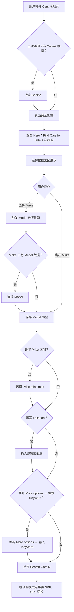
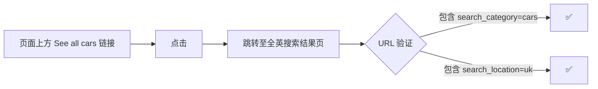
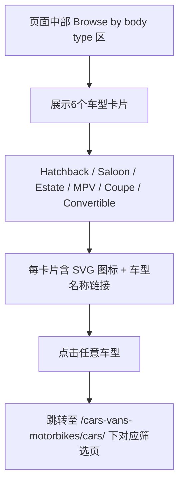
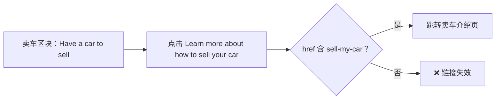
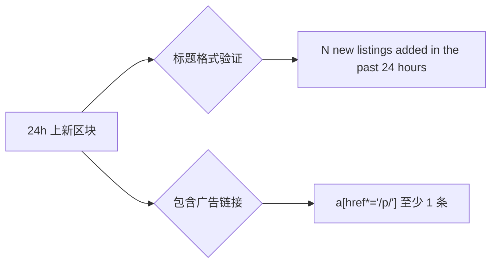

# Cars 落地页浏览业务流程

## 1. 流程概述
- **流程名称**: Cars 类目落地页浏览与结构化找车
- **触发条件**:
  - 用户从首页点击「Cars & Vehicles」热门分类图标
  - 用户点击全局顶栏导航「Cars & Vehicles」
  - 用户直接访问 `https://www.unicorn.gumtree.io/cars-vans-motorbikes/cars`
- **前置条件**: 可匿名访问，无需登录；首次访问可能触发 Cookie 同意横幅
- **主要参与角色**: 访客（未登录用户）、已登录用户、Gumtree 搜索引擎
- **关联规则文档**: [Cars落地页规则.md](../../../业务规则库/buyer/Cars类目模块/Cars落地页规则.md)

## 2. 主流程

### 2.1 流程图

### 2.2 步骤说明

**步骤 1：页面加载**
- 浏览器加载 `https://www.unicorn.gumtree.io/cars-vans-motorbikes/cars`
- 验证页面标题：`Used Cars for Sale Across the UK | Gumtree`
- 若无 Cookie：OneTrust 横幅出现 → 点击「Accept all」后继续

**步骤 2：Hero 区确认**
- 可见主标题「Find Cars for Sale」（H1 或显著文本节点）
- 可见副标题：完整版 `Search thousands of ads on the UK's local motors marketplace` 或简短版 `The UK's local motors marketplace`（响应式二选一）

**步骤 3：结构化搜索**
- 搜索区展示 6 个输入字段：Make / Model / Price min / Price max / Location / Keyword（需展开 More options）
- Make 初始为占位值（option 数 > 1）
- Model 依赖 Make 选值；Make 未选时 Model 通常无有效选项

**步骤 4：Make → Model 联动**
- 选择 Make 品牌（`#select-make`）
- 触发 Model（`#select-model`）异步刷新
- 若该 Make 有对应 Model 数据，option 数 > 1；若无数据，Model 保持无有效选项

**步骤 5：Price 区间**
- `#select-price-min` / `#select-price-max` 下拉选择，均可选 Any
- Price min > Price max 场景行为待实测

**步骤 6：Location 填写**
- 定位字段：`[data-qa="search-location-field"]`
- placeholder：「Postcode or location」
- 支持城镇名称或邮编

**步骤 7：More options 展开 + Keyword**
- 点击「More options」展开折叠区
- 显示 Keyword 输入框（`#keyword-field-value`）
- 可输入关键词（如车名、颜色、描述词）

**步骤 8：点击 Search Cars (N)**
- 按钮文案含当前结果数，格式：`Search Cars (N)`，N 含千位分隔符
- 按钮 enabled，无 disabled 状态
- 点击后跳转 SRP，当前落地页 URL 发生变化

## 3. 辅助流程

### 3.1 See all cars 流程图

### 3.2 Browse by body type 流程图

### 3.3 Sell a Car CTA 流程图

### 3.4a Expert reviews 跳转（已实测）

- 链接 href：`https://www.gumtree.com/info/cars/reviews-hub/`（外链，跳出 unicorn.gumtree.io 域）
- 自动化建议：校验 href 值即可，不需实际点击外链（CARS-TC027）

### 3.4b Browse by brands 跳转（已实测）

- 链接格式：`/cars-vans-motorbikes/cars/{brand}?distance=50`（站内链接，含 distance=50 参数）
- 示例：`/cars-vans-motorbikes/cars/audi?distance=50`（CARS-TC028）

### 3.5 24 小时上新区块

## 4. 观测点与测试映射

| 观测点 | 选择器 / 属性 | 预期值 | 关联用例 |
|-------|------------|------|---------|
| 页面标题 | `document.title` | `Used Cars for Sale Across the UK \| Gumtree` | TC001 |
| URL 路径 | `window.location.pathname` | `/cars-vans-motorbikes/cars` | TC001 |
| Hero 主标题文字 | heading 文本 | `Find Cars for Sale` | TC002 |
| Hero 副标题（完整） | 文本节点 | `Search thousands of ads on the UK's local motors marketplace` | TC003 |
| Hero 副标题（简短） | 文本节点 | `The UK's local motors marketplace` | TC003 |
| Make 下拉选项数 | `#select-make option` count | > 1 | TC005 |
| Model 联动刷新 | 选中 Make 后 `#select-model option` count | Make有数据时 > 1 | TC007 |
| Location placeholder | `[data-qa="search-location-field"]` placeholder | `Postcode or location` | TC009 |
| Keyword 字段 | `#keyword-field-value` visibility | More options 展开后可见 | TC010 |
| Search Cars 按钮文案 | button text | 匹配 `Search Cars \(\d[\d,]*\)` | TC011 |
| Search Cars 跳转 | 点击后 URL | 与落地页 URL 不同 | TC012 |
| See all cars URL | `href` 参数 | 包含 `search_category=cars` 且 `search_location=uk` | TC013 |
| 24h 上新标题格式 | 区块 heading 文本 | 匹配 `/\d[\d,]* new listings added in the past 24 hours/` | TC015 |
| 24h 广告链接 | `a[href*='/p/']` count | ≥ 1 | TC016 |
| Body type 卡片数 | 车型卡片 count | 6（Hatchback/Saloon/Estate/MPV/Coupe/Convertible）| TC018 |
| Body type SVG | 卡片内 SVG | 每张卡含 SVG | TC018 |
| Body type 链接 | 卡片 href | 含 `/cars-vans-motorbikes/cars/` | TC019 |
| 卖车 CTA 链接 | `href` | 含 `sell-my-car` | TC020 |
| Popular models 链接格式 | 链接 `href` | `/cars-vans-motorbikes/cars/{brand}/{model}`（如 vauxhall-motors/corsa）✅ | TC026 |
| Expert reviews 链接 | 链接 `href` | `https://www.gumtree.com/info/cars/reviews-hub/`（外链）✅ | TC027 |
| Browse by brands 链接格式 | 链接 `href` | `/cars-vans-motorbikes/cars/{brand}?distance=50`（如 audi?distance=50）✅ | TC028 |
| Cookie 横幅接受 | 搜索区可见 | Accept all 后 `[data-qa="search-location-field"]` visible | TC034 |

## 5. 异常与边界场景

| 场景 | 触发 | 实测行为 | 状态 |
|-----|------|---------|------|
| Make 下 Model 无数据 | 选择特定小众 Make | Model 下拉无有效选项，搜索仍可触发 | Skip 该 make |
| Price min > Price max | 用户手动选择倒序价格（如 min=2000, max=500） | ✅ 前端显示校验提示，但仍允许跳转 SRP（CARS-TC023） | 已实测 |
| Keyword 特殊字符 | 输入 `<>&"'` | ⚠️ 自动化 selector 解析失败（`button:has-text('More options')` 语法错），产品行为未验证（CARS-TC022）；参考 HP-TC016 首页特殊字符搜索 PASS | 脚本需修复 |
| Cookie 横幅遮挡搜索 | 首次访问，Cookie 横幅出现 | ✅ Accept all 后搜索区可交互（CARS-TC020） | 已实测 |
| SRP 后退回落地页 | 从 Search Cars 跳转后点后退 | ❌ 实测 SRP URL 与落地页相同（`/cars-vans-motorbikes/cars`），后退跳至 `/search?search_category=cars&search_location=united+kingdom`，非预期 LP（CARS-TC025） | 新 Bug，待产品确认 |
| 首屏加载过慢 | 网络慢 | 首屏可见时间 < 阈值（无 SLA，暂不可自动化） | TC033：⚠️ 暂跳过 |
