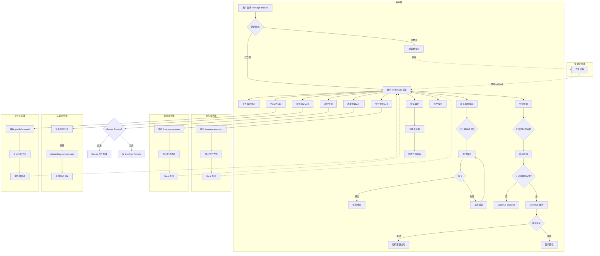
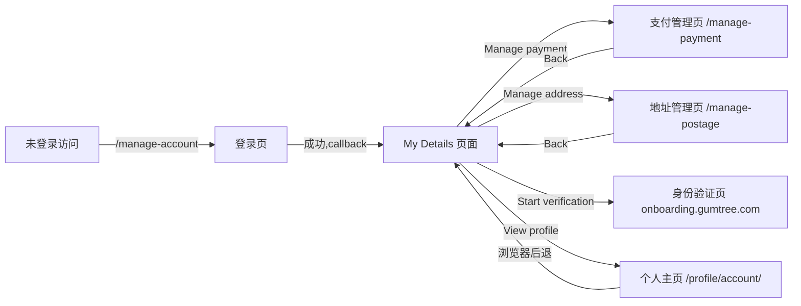
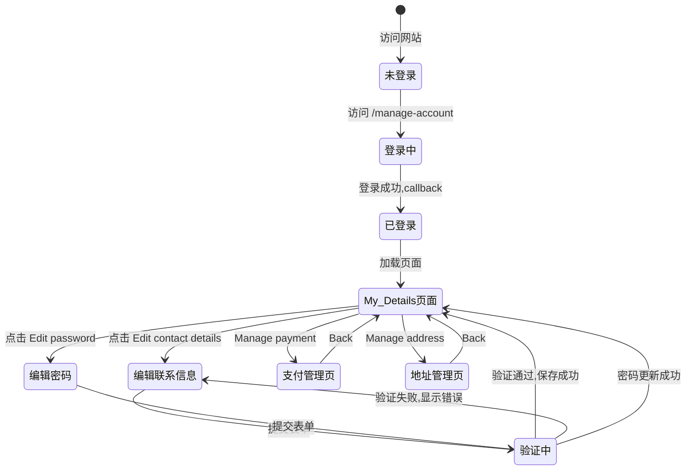

# My Details业务域 - 业务全景

## 1. 业务定位

My Details 业务域是 Gumtree 的核心账户管理中心,为已登录用户提供统一的个人信息管理、支付地址配置、账户设置和安全管理入口。

**业务价值**:
- 为用户提供一站式账户信息管理中心,提升用户体验
- 集中管理个人信息、支付方式、配送地址,支撑交易流程
- 提供账户安全设置(密码修改、身份验证),保障账户安全
- 连接多个业务域(支付、地址、认证),作为账户管理枢纽

**目标用户**:
- **已登录买家**: 管理个人信息、配送地址、查看评价
- **已登录卖家**: 管理个人信息、支付账户、身份验证
- **普通用户**: 查看和编辑基本账户信息

## 2. 业务范围

### 2.1 功能覆盖

| 功能模块 | 说明 | 核心能力 |
|---------|------|---------|
| 个人信息展示 | 头像、姓名、邮箱展示 | 用户身份标识;View profile 链接 |
| 联系信息编辑 | 姓名、电话编辑 | 对话框编辑;前端验证(非空、纯字母) |
| 评价管理 | Gumtree Reviews、Google Reviews | 星级显示;Google Review 启用开关 |
| 身份验证入口 | ID 和 Business Verification | 跳转外部验证服务 onboarding.gumtree.com |
| 密码管理 | 密码修改 | 对话框编辑;三字段验证;Continue disabled 逻辑 |
| 支付管理入口 | 跳转支付管理页 | Manage payment 按钮;Back 返回 |
| 地址管理入口 | 跳转配送地址管理页 | Manage address 按钮;Back 返回 |
| 简历上传 | CV 文件上传 | 支持 Word/PDF/Richtext;最大6MB |
| 营销偏好 | 营销推送设置 | 复选框切换;状态即时保存 |
| 账户管理 | 账户停用 | Deactivate my account 按钮 |

### 2.2 地域覆盖
- **UK 站(测试站)**: `https://www.zoidberg.gumtree.io/manage-account`
- **其他站点**: 域名不同,功能结构一致

### 2.3 用户角色

| 角色 | 权限 | 说明 |
|-----|------|------|
| 未登录访客 | 无法访问 | 访问 /manage-account 自动跳转登录页 |
| 已登录买家 | 可访问所有功能 | 管理个人信息、地址、营销偏好 |
| 已登录卖家 | 可访问所有功能 | 管理个人信息、支付、身份验证 |

## 3. 业务流程全景图

> **要求**: 全景图必须详细展示跨域交互与依赖的逻辑分支。

## 4. 核心业务流程概览

### 4.1 个人信息管理流程
**业务目标**: 用户查看和编辑基本个人信息,维护账户资料完整性。

**核心步骤**:
1. 访问 My Details 页面(登录验证)
2. 查看个人信息卡片(头像、姓名、邮箱)
3. 编辑联系信息(姓名、电话)
4. 前端验证(非空、纯字母)
5. 保存更新

**关键观测点**:
- ✅ 页面 URL 为 `/manage-account`
- ✅ My Details tab 选中状态
- ✅ 头像显示用户名首字母
- ✅ 联系信息编辑对话框结构完整
- ✅ 验证规则生效

**详细流程文档**: [My Details管理业务流程.md](./My%20Details管理业务流程.md)

---

### 4.2 密码管理流程
**业务目标**: 用户自主修改登录密码,保障账户安全。

**核心步骤**:
1. 点击 "Edit password" 按钮
2. 打开密码编辑对话框
3. 填写 Current password、New password、Confirm password
4. 三字段填写完整后 Continue 激活
5. 提交验证(密码强度、一致性)
6. 密码更新成功

**关键观测点**:
- ✅ 对话框标题 "Edit your password"
- ✅ 三个密码输入框初始为空
- ✅ Continue 按钮 disabled 逻辑
- ✅ 密码强度要求提示
- ✅ 验证失败显示错误

**详细流程文档**: [My Details管理业务流程.md](./My%20Details管理业务流程.md#步骤4-密码修改)

---

### 4.3 跨域跳转流程(支付/地址管理)
**业务目标**: 提供支付方式和配送地址管理入口,支撑交易流程。

**核心步骤**:
1. 点击 "Manage payment" 或 "Manage address"
2. 跳转到对应管理页面
3. 查看和编辑支付方式/配送地址
4. 点击 "Back" 返回 My Details

**关键观测点**:
- ✅ 跳转 URL 正确(/manage-payment 或 /manage-postage)
- ✅ 页面显示对应功能模块
- ✅ Back 链接返回 /manage-account
- ✅ 用户 session 保持

**详细流程文档**: [My Details管理业务流程.md](./My%20Details管理业务流程.md#步骤5-支付管理跳转)

---

### 4.4 身份验证流程
**业务目标**: 引导用户完成 ID 和 Business 验证,获得验证徽章。

**核心步骤**:
1. 查看 Verification 区域提示
2. 点击 "Start verification" 按钮
3. 新标签页打开 `onboarding.gumtree.com`
4. 完成外部验证流程

**关键观测点**:
- ✅ 显示提示文字 "Complete ID and Business Verification..."
- ✅ 新标签页跳转
- ✅ URL 包含 "onboarding.gumtree.com"
- ✅ 页面标题包含 "Welcome" 或 "Verification"

**详细流程文档**: [My Details管理业务流程.md](./My%20Details管理业务流程.md#步骤7-评价与验证入口)

---

## 5. 页面拓扑关系

### 5.1 页面入口矩阵

| 页面 | 入口1 | 入口2 | 入口3 |
|-----|------|------|------|
| My Details 页面 | 直接访问 /manage-account | 顶部导航 Menu → My Details | 登录成功 callback |
| 支付管理页 | My Details → Manage payment | - | - |
| 地址管理页 | My Details → Manage address | - | - |
| 身份验证页 | My Details → Start verification | - | - |
| 个人主页 | My Details → View profile | - | - |
| 登录页 | 未登录访问 /manage-account 跳转 | - | - |

### 5.2 页面跳转流程图

### 5.3 页面关系详解

#### 未登录访问 → 登录页
- **入口**: 直接访问 `/manage-account`
- **目标**: 登录页 `/login`
- **参数**: `cb=/manage-account`
- **特点**: 登录成功后自动跳回 My Details

#### My Details → 支付管理页
- **入口**: Manage payment 按钮
- **目标**: `/manage-payment`
- **特点**: 显示 Payment methods 和 Bank account;Back 返回
- **权限**: 已登录用户

#### My Details → 地址管理页
- **入口**: Manage address 按钮
- **目标**: `/manage-postage`
- **特点**: 显示配送地址列表和 Default 标签;Back 返回
- **权限**: 已登录用户

#### My Details → 身份验证页
- **入口**: Start verification 按钮
- **目标**: `onboarding.gumtree.com`
- **特点**: 新标签页打开;外部服务
- **权限**: 已登录用户

#### My Details → 个人主页
- **入口**: View profile 链接
- **目标**: `/profile/account/`
- **特点**: 显示公开个人主页;浏览器后退返回
- **权限**: 已登录用户

## 6. 业务数据流转

### 6.1 状态流转图

### 6.2 用户操作与数据变化

| 操作 | 数据变化 | 前台展示变化 | 涉及页面 |
|-----|---------|------------|---------|
| 编辑联系信息成功 | 更新 First name、Last name、Contact number | 对话框关闭,Contact details 区域显示新值 | My Details |
| 修改密码成功 | 更新用户密码 | 对话框关闭,密码掩码保持 ************ | My Details |
| 切换营销偏好 | 更新营销偏好状态 | 复选框状态切换 | My Details |
| 上传 CV | 保存 CV 文件 | 显示文件名(待确认) | My Details |
| 启用 Google Review | 更新 Google Review 设置 | 复选框选中 | My Details |
| 跳转支付管理 | 无 | 跳转到 /manage-payment 页面 | 跨页面 |
| 跳转地址管理 | 无 | 跳转到 /manage-postage 页面 | 跨页面 |
| 跳转身份验证 | 无 | 新标签页打开 onboarding.gumtree.com | 跨域 |
| View Profile | 无 | 跳转到 /profile/account/ | 跨页面 |

### 6.3 关键业务数据

#### 联系信息字段
| 字段 | 类型 | 必填 | 说明 |
|-----|------|-----|------|
| First name | String | 是 | 纯字母,不允许数字;用户显示名称 |
| Last name | String | 是 | 纯字母,不允许数字;用户姓氏 |
| Contact number | String | 是 | 手机号格式;联系电话 |

#### 密码字段
| 字段 | 类型 | 必填 | 说明 |
|-----|------|-----|------|
| Current password | String | 是 | 当前密码验证 |
| New password | String | 是 | 符合密码强度要求 |
| Confirm password | String | 是 | 与新密码一致 |

#### 营销偏好
| 字段 | 类型 | 说明 |
|-----|------|------|
| Marketing consent | Boolean | 是否接收营销推送 |

## 7. 关键业务规则索引

### 7.1 联系信息验证规则
- [My Details管理规则.md - 3.2 校验规则](../../../业务规则库/buyer/My%20Details模块/My%20Details管理规则.md#32-校验规则)

### 7.2 密码管理规则
- [My Details管理规则.md - 3.2 校验规则](../../../业务规则库/buyer/My%20Details模块/My%20Details管理规则.md#32-校验规则)

### 7.3 权限规则
- [My Details管理规则.md - 3.3 权限规则](../../../业务规则库/buyer/My%20Details模块/My%20Details管理规则.md#33-权限规则)

### 7.4 跨域跳转规则
- [My Details管理规则.md - 3.4 业务约束](../../../业务规则库/buyer/My%20Details模块/My%20Details管理规则.md#34-业务约束)

## 8. 业务FAQ

### Q1: My Details 和登录页有什么关系?
**A**: 未登录用户访问 `/manage-account` 会自动跳转到登录页,URL 包含 `callback=/manage-account`。登录成功后自动跳回 My Details 页面。

### Q2: 为什么联系信息的 First name 不允许数字?
**A**: First name 用作用户显示名称,产品规定只能包含字母,不允许数字。提示文字明确说明: "Your first name will be your display name. Please use letters only, no numbers."

### Q3: 密码修改的 Continue 按钮为什么一开始是灰色的?
**A**: 密码修改对话框实现了前端 disabled 校验——Current password、New password、Confirm password 三个字段均填写后 Continue 按钮才激活,防止空提交。

### Q4: 支付管理和地址管理页面怎么返回 My Details?
**A**: 两个页面顶部都有 "Back" 链接,点击后返回 `/manage-account`。

### Q5: Start verification 跳转到哪里?
**A**: 点击 "Start verification" 按钮会在新标签页打开 `onboarding.gumtree.com`,这是外部身份验证服务。

### Q6: View Profile 显示什么内容?
**A**: 跳转到 `/profile/account/` 显示公开个人主页,包括用户名、评分、发帖时长、活跃状态、Selling history 和广告列表。

### Q7: 营销偏好的复选框何时保存?
**A**: 复选框状态切换后立即保存,无需点击额外的保存按钮。刷新页面后状态保持。

### Q8: CV 上传支持哪些格式?
**A**: 支持 Word、PDF、Richtext 格式,最大文件大小 6MB。

### Q9: Google Review 和 Gumtree Review 有什么区别?
**A**: Gumtree Review 是平台内置评价系统,默认显示。Google Review 需要用户主动启用复选框,启用后会在个人主页和广告上显示 Google 评分。

### Q10: 账户停用按钮点击后发生什么?
**A**: 点击 "Deactivate my account" 按钮后会有响应(可能是确认对话框或跳转页面),具体停用流程待产品确认。

## 9. 业务指标(可选)

### 9.1 核心指标
- 待补充(My Details 页面访问量、信息编辑完成率等需接入埋点数据)

### 9.2 转化漏斗
- **信息编辑漏斗**: 打开编辑对话框 → 修改信息 → 验证通过 → 保存成功
- **密码修改漏斗**: 打开密码对话框 → 填写三字段 → 验证通过 → 更新成功

## 10. 已知问题与风险

### 10.1 产品待确认问题
1. **密码强度要求**: 密码编辑对话框提示"密码强度要求",但具体规则未明确(长度、特殊字符等)
2. **Google Review 集成**: 启用 Google Review 复选框的具体效果和 API 集成细节待确认
3. **CV 上传成功状态**: 上传成功后的展示效果(文件名、删除按钮、预览)待确认
4. **账户停用完整流程**: 点击 "Deactivate my account" 后的确认对话框、停用效果、账户恢复流程待确认
5. **Gumtree Reviews 点击行为**: 点击评分按钮的具体跳转目标(评价详情页或弹窗)待确认
6. **Verification 完成后状态**: 身份验证完成后,My Details 页面如何显示验证徽章待确认

### 10.2 技术风险
- 对话框编辑与页面刷新的状态同步问题
- 跨页面跳转(支付、地址、个人主页)后的 session 保持
- CV 文件上传的文件类型、大小校验和存储安全
- 营销偏好复选框的即时保存可靠性和失败处理
- Google Review API 集成的稳定性和降级策略
- 身份验证跨域跳转的安全性和回调处理

### 10.3 跨域依赖风险
- **支付业务域**: 支付管理页面异常会影响用户添加支付方式
- **地址业务域**: 地址管理页面异常会影响用户配置配送地址
- **认证业务域**: 外部验证服务 `onboarding.gumtree.com` 不可用会阻塞身份验证流程
- **登录业务域**: 登录失败或 session 过期会导致无法访问 My Details

## 11. 变更历史

| 日期 | 版本 | 变更内容 | 变更人 |
|-----|------|---------|--------|
| 2026-04-22 | v1.0 | 初始版本,基于 TC_My_Details测试用例.md(38条用例)归档 | AI Assistant |
