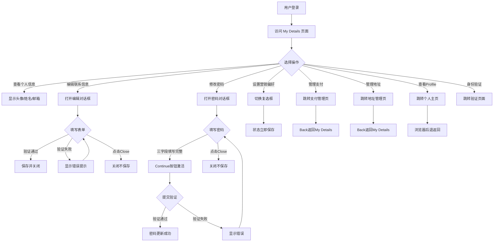

# My Details管理业务流程

> **业务目标**: 为已登录用户提供统一的账户信息管理中心,支持个人信息、支付地址、密码、营销偏好等核心设置的查看和编辑

## 1. 完整流程图

> **要求**: 专注于本业务域内的详细步骤,不包含跨域交互的复杂逻辑分支(跨域逻辑统一在业务全景文档中展示)。

## 2. 详细步骤与观测点

### 步骤1: 访问 My Details 页面
- **页面位置**: `https://www.{site}.gumtree.io/manage-account`
- **操作流程**:
  1. 用户通过顶部导航 Menu → My Details 或直接访问URL
  2. 系统检查登录状态
  3. 已登录用户正常显示页面
  4. 未登录用户跳转到登录页
- **观测点**:
  - ✅ P0: 页面URL为 `/manage-account`
  - ✅ P0: "My Details" tab 显示为选中状态
  - ✅ P0: 页面顶部显示个人信息区域
  - ❌ 负向: 未登录访问自动跳转登录页,URL包含callback参数
- **验证方法**: 
  - 检查页面URL
  - 验证tab选中状态
  - 验证个人信息区域可见
- **关联规则**: [My Details管理规则.md - 3.3 权限规则](../../../业务规则库/buyer/My%20Details模块/My%20Details管理规则.md#33-权限规则)

### 步骤2: 个人信息展示
- **页面位置**: My Details 页面顶部
- **操作流程**:
  1. 页面加载完成后自动展示
  2. 显示圆形头像(用户名首字母)
  3. 显示完整姓名(如 "Jimmy Chow")
  4. 显示注册邮箱(如 "jimmy.chow@gumtree.com")
  5. 显示 "View profile" 链接
- **观测点**:
  - ✅ P0: 头像显示用户名首字母
  - ✅ P0: 显示完整姓名
  - ✅ P0: 显示注册邮箱
  - ✅ P1: "View profile" 链接可点击
- **验证方法**: 
  - 检查头像内容
  - 验证姓名和邮箱正确性
  - 验证链接可交互性
- **关联规则**: [My Details管理规则.md - 2.1 主流程](../../../业务规则库/buyer/My%20Details模块/My%20Details管理规则.md#21-主流程个人信息管理)

### 步骤3: 联系信息编辑
- **页面位置**: Contact details 区域
- **操作流程**:
  1. 查看当前联系信息(First name、Last name、Contact number)
  2. 点击 "Edit contact details" 按钮
  3. 弹出编辑对话框,预填当前值
  4. 修改字段内容
  5. 点击 "Save changes" 提交或点击 "Close" 取消
  6. 提交时进行前端验证
  7. 验证通过后保存并关闭对话框
- **观测点**:
  - ✅ P0: 显示当前联系信息
  - ✅ P0: 对话框标题为 "Contact details"
  - ✅ P0: 三个输入框预填当前值
  - ✅ P0: 显示提示文字 "Your first name will be your display name. Please use letters only, no numbers."
  - ✅ P0: First name为空提交显示错误 "This field is required"
  - ✅ P1: First name包含数字显示错误 "Please use letters only, no numbers"
  - ❌ 负向: 点击Close关闭对话框,数据不保存
- **验证方法**: 
  - 检查对话框结构
  - 测试空值提交
  - 测试数字验证
  - 测试保存和取消功能
- **关联规则**: [My Details管理规则.md - 3.2 校验规则](../../../业务规则库/buyer/My%20Details模块/My%20Details管理规则.md#32-校验规则)

### 步骤4: 密码修改
- **页面位置**: Password 区域
- **操作流程**:
  1. 查看掩码密码显示 "************"
  2. 点击 "Edit password" 按钮
  3. 弹出密码编辑对话框
  4. 填写 Current password、New password、Confirm password
  5. 三个字段均填写后 Continue 按钮激活
  6. 点击 Continue 提交
  7. 验证密码强度和一致性
  8. 验证通过后更新密码并关闭对话框
- **观测点**:
  - ✅ P1: 显示掩码密码 "************"
  - ✅ P1: 对话框标题为 "Edit your password"
  - ✅ P1: 显示密码强度要求提示
  - ✅ P1: 三个密码输入框为空
  - ✅ P1: 初始状态 Continue 按钮 disabled
  - ✅ P1: 三字段均填写后 Continue 激活
  - ❌ 负向: 点击Close关闭对话框
- **验证方法**: 
  - 检查对话框结构
  - 测试按钮激活逻辑
  - 测试密码验证规则
  - 测试关闭功能
- **关联规则**: [My Details管理规则.md - 3.2 校验规则](../../../业务规则库/buyer/My%20Details模块/My%20Details管理规则.md#32-校验规则)

### 步骤5: 支付管理跳转
- **页面位置**: Payments 区域
- **操作流程**:
  1. 查看 Payments 区域提示 "Make purchases quickly and securely."
  2. 点击 "Manage payment" 按钮
  3. 跳转到支付管理页面 `/manage-payment`
  4. 显示 Payment methods 和 Bank account 区域
  5. 点击 "Back" 链接返回 My Details
- **观测点**:
  - ✅ P1: 显示 "Payments" 标题和提示文字
  - ✅ P1: 跳转到 `/manage-payment`
  - ✅ P1: 显示 "Add new card" 和 "Add bank account" 按钮
  - ✅ P1: Back 链接返回 `/manage-account`
- **验证方法**: 
  - 检查跳转URL
  - 验证页面内容
  - 测试返回功能
- **关联规则**: [My Details管理规则.md - 5.2 下游依赖](../../../业务规则库/buyer/My%20Details模块/My%20Details管理规则.md#52-下游依赖我调用谁)

### 步骤6: 地址管理跳转
- **页面位置**: Delivery Addresses 区域
- **操作流程**:
  1. 查看 Delivery Addresses 区域提示 "Get your orders sent to the right place."
  2. 点击 "Manage address" 按钮
  3. 跳转到地址管理页面 `/manage-postage`
  4. 显示已有地址信息和 Default 标签
  5. 点击 "Back" 链接返回 My Details
- **观测点**:
  - ✅ P1: 显示 "Delivery Addresses" 标题和提示文字
  - ✅ P1: 跳转到 `/manage-postage`
  - ✅ P1: 显示 "Delivery addresses" 标题
  - ✅ P1: 显示已有地址和 Default 标签
  - ✅ P1: Back 链接返回 `/manage-account`
- **验证方法**: 
  - 检查跳转URL
  - 验证地址列表
  - 测试返回功能
- **关联规则**: [My Details管理规则.md - 5.2 下游依赖](../../../业务规则库/buyer/My%20Details模块/My%20Details管理规则.md#52-下游依赖我调用谁)

### 步骤7: 评价与验证入口
- **页面位置**: Ratings 和 Verification 区域
- **操作流程**:
  1. **Gumtree reviews**: 显示星级和评价数量,点击评分按钮
  2. **Google reviews**: 显示复选框和说明文字
  3. **Verification**: 显示 "Start verification" 按钮
  4. 点击 Start verification 打开新标签页跳转到 `onboarding.gumtree.com`
- **观测点**:
  - ✅ P1: Gumtree reviews 显示星级和评价数
  - ✅ P1: Google reviews 显示复选框
  - ✅ P2: Verification 显示提示文字
  - ✅ P2: Start verification 新标签页跳转
- **验证方法**: 
  - 检查评价显示
  - 测试复选框功能
  - 验证验证入口跳转
- **关联规则**: [My Details管理规则.md - 5.2 下游依赖](../../../业务规则库/buyer/My%20Details模块/My%20Details管理规则.md#52-下游依赖我调用谁)

### 步骤8: 营销偏好设置
- **页面位置**: Marketing Preferences 区域
- **操作流程**:
  1. 查看复选框状态(选中/未选中)
  2. 阅读说明文字 "I would like to receive news, offers and promotions from Gumtree"
  3. 点击复选框切换状态
  4. 状态立即保存
  5. 刷新页面验证状态保持
- **观测点**:
  - ✅ P2: 显示 "Marketing Preferences" 标题
  - ✅ P2: 复选框可切换状态
  - ✅ P2: 状态立即响应,无 JavaScript 错误
  - ✅ P2: 刷新后状态保持
- **验证方法**: 
  - 测试复选框切换
  - 验证状态保存
  - 刷新页面验证持久化
- **关联规则**: [My Details管理规则.md - 3.2 校验规则](../../../业务规则库/buyer/My%20Details模块/My%20Details管理规则.md#32-校验规则)

### 步骤9: 账户停用入口
- **页面位置**: Account 区域(页面底部)
- **操作流程**:
  1. 滚动到页面底部
  2. 查看 "Account" 区域
  3. 点击 "Deactivate my account" 按钮
  4. 触发确认流程(具体行为待确认)
- **观测点**:
  - ✅ P2: 显示 "Account" 标题
  - ✅ P2: 显示 "Deactivate my account" 按钮
  - ✅ P2: 按钮点击有响应,无 JavaScript 错误
- **验证方法**: 
  - 检查按钮存在
  - 测试点击响应
- **关联规则**: [My Details管理规则.md - 6.1 产品待确认问题](../../../业务规则库/buyer/My%20Details模块/My%20Details管理规则.md#61-产品待确认问题)

### 步骤10: View Profile 查看
- **页面位置**: 页面顶部个人信息区域
- **操作流程**:
  1. 点击 "View profile" 链接
  2. 跳转到个人资料页面 `/profile/account/`
  3. 显示公开个人主页内容
  4. 点击浏览器后退或顶部 My Details tab 返回
- **观测点**:
  - ✅ P1: 跳转到 URL 包含 `/profile/account/`
  - ✅ P1: 页面标题包含 "Account Profile"
  - ✅ P1: 显示用户名和评分
  - ✅ P1: 显示 "Posting for X+ years" 和活跃状态
  - ✅ P1: 显示广告列表(Listings tab)
  - ✅ P1: 返回 My Details 正常
- **验证方法**: 
  - 检查跳转URL
  - 验证页面内容
  - 测试返回功能
- **关联规则**: [My Details管理规则.md - 5.2 下游依赖](../../../业务规则库/buyer/My%20Details模块/My%20Details管理规则.md#52-下游依赖我调用谁)

## 3. 流程完整性验证清单

- [ ] 未登录访问 `/manage-account` 自动跳转登录页
- [ ] 页面正确显示个人信息(头像、姓名、邮箱)
- [ ] 联系信息编辑对话框正常打开和关闭
- [ ] 联系信息验证规则生效(非空、纯字母)
- [ ] 密码编辑对话框正常打开和关闭
- [ ] 密码 Continue 按钮 disabled 逻辑正确
- [ ] Manage payment 跳转和返回正常
- [ ] Manage address 跳转和返回正常
- [ ] Start verification 新标签页跳转正常
- [ ] 营销偏好复选框切换和保存正常
- [ ] View profile 跳转和返回正常
- [ ] 页面刷新后用户保持登录状态
- [ ] Tab 切换后返回页面状态正常
- [ ] Cookie 弹窗(如出现)不阻止页面交互

## 4. 关联文档

- [My Details业务全景](./My%20Details业务全景.md)
- [My Details管理规则](../../../业务规则库/buyer/My%20Details模块/My%20Details管理规则.md)
- [登录业务全景](../登录业务域/登录业务全景.md)
- [支付管理业务流程](../../Pay&Ship业务域/Pay&Ship业务全景.md)

## 5. 变更历史

| 日期 | 版本 | 变更内容 | 变更人 |
|-----|------|---------|--------|
| 2026-04-22 | v1.0 | 初始版本,基于 TC_My_Details测试用例.md(38条用例)归档 | AI Assistant |
