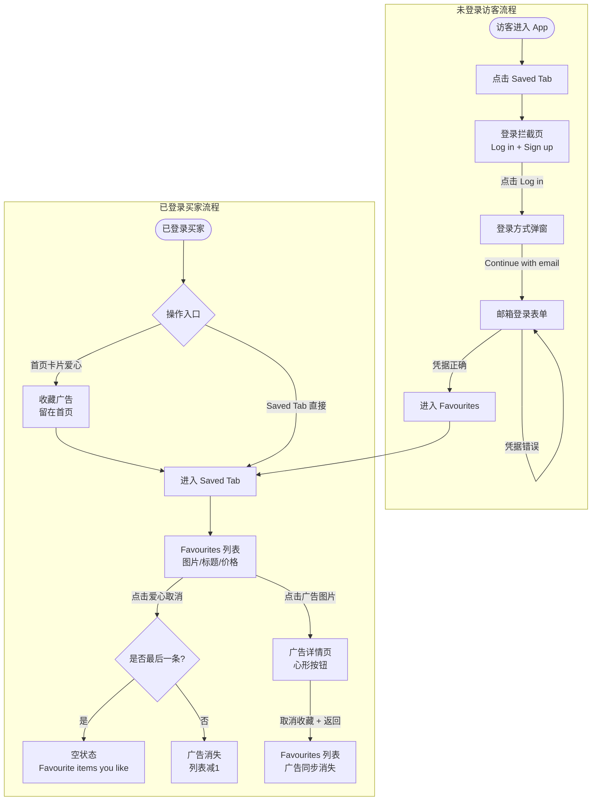
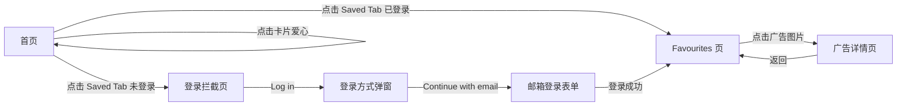
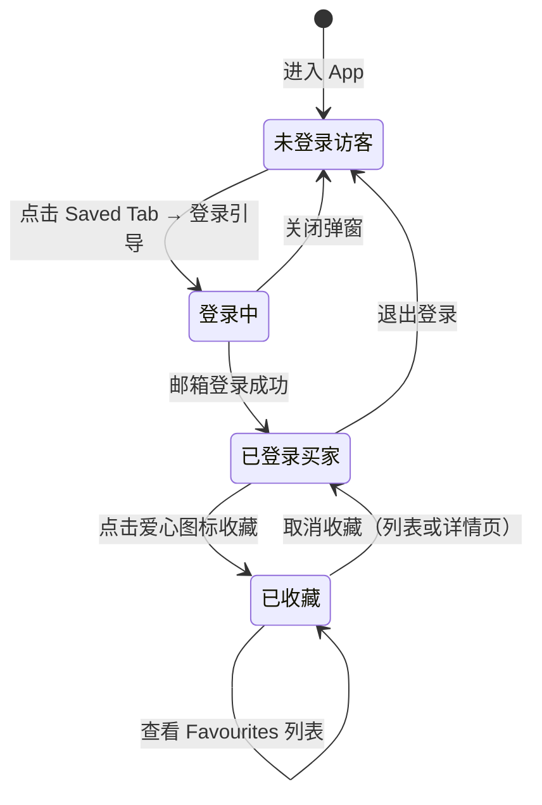

# 收藏业务域 - 业务全景

## 1. 业务定位

收藏业务域是 Gumtree App 的核心用户留存功能，为买家提供广告收藏、收藏管理和快速回溯的能力，将一次性浏览行为转化为持续的购买意向跟踪。

**业务价值**：
- 为已登录买家提供跨会话的广告追踪能力，降低因广告下架或遗忘导致的流失
- 通过 Saved Tab 未登录拦截 + 引导登录，将访客转化为注册用户
- Favourites 列表成为买家决策中心，集中管理感兴趣的商品

**目标用户**：
- **已登录买家**：可完整使用收藏、查看收藏列表、取消收藏等功能
- **未登录访客**：点击 Saved Tab 时触发登录引导流程

## 2. 业务范围

### 2.1 功能覆盖
| 功能模块 | 说明 | 核心能力 |
|---------|------|---------|
| 首页收藏入口 | 广告卡片爱心图标 | 一键收藏；操作后留在首页 |
| 详情页收藏入口 | 顶部心形按钮（显示收藏数） | 收藏/取消；实时同步至列表 |
| Saved Tab 拦截 | 未登录时显示登录引导 | Log in / Sign up 双入口；邮箱登录流程 |
| Favourites 列表 | 收藏广告聚合展示 | 图片/标题/价格展示；取消收藏；空状态 |
| Search alerts | Favourites 子 Tab | 搜索提醒管理（与收藏功能同页） |

### 2.2 地域覆盖
- **Gumtree App（UK）**：Android（com.gumtree.android）/ iOS（com.gumtreeuk2.iphone）

### 2.3 用户角色
| 角色 | 权限 | 说明 |
|-----|------|------|
| 未登录访客 | 仅触发登录引导 | 无法查看或操作收藏列表 |
| 已登录买家 | 完整收藏功能 | 收藏/取消/查看列表/详情页操作 |

## 3. 业务流程全景图

## 4. 核心业务流程概览

### 4.1 收藏广告流程（已登录）
**业务目标**：已登录买家通过首页卡片一键收藏感兴趣的广告，并在 Favourites 列表中查看和管理。

**核心步骤**：
1. 确保账号处于已登录状态
2. 在首页广告列表中找到目标广告，点击卡片爱心图标
3. 收藏成功，停留在首页（不跳转）
4. 进入 Saved Tab → Favourites 页，验证广告出现在列表中
5. 确认列表展示广告图片、标题、价格（£xx 或 FREE）

**关键观测点**：
- ✅ 收藏后首页搜索栏仍可见（未跳转）
- ✅ Favourites 列表不为空，至少 1 张广告图片卡片
- ✅ 广告标题前 20 字符可在列表中匹配
- ✅ 广告价格元素（£ 或 FREE）可见

**详细流程文档**：[收藏广告业务流程.md](./收藏广告业务流程.md)

---

### 4.2 取消收藏流程
**业务目标**：买家在 Favourites 列表或广告详情页取消收藏，广告实时从列表移除，支持空状态降级展示。

**核心步骤**：
1. 进入 Favourites 列表，确认目标广告存在
2. 方式一：直接点击列表中广告的爱心图标取消
3. 方式二：点击广告图片进入详情页 → 点击心形取消 → 返回列表
4. 验证广告已从列表消失
5. 若为最后一条，验证空状态提示出现

**关键观测点**：
- ✅ 取消后广告在 6 秒内从列表消失（列表操作）
- ✅ 详情页取消后返回，广告在 8 秒内消失（同步生效）
- ✅ 最后一条取消后显示「Favourite items you like」
- ✅ 非最后一条：剩余数量 = 取消前数量 - 1

**详细流程文档**：[收藏广告业务流程.md](./收藏广告业务流程.md)

---

### 4.3 未登录登录引导流程
**业务目标**：未登录访客通过 Saved Tab 触发登录引导，完成邮箱登录后直接进入 Favourites 功能。

**核心步骤**：
1. 未登录状态下点击底部「Saved」Tab
2. 显示登录拦截页（Log in + Sign up）
3. 点击「Log in」→ 弹出登录方式选择弹窗
4. 选择「Continue with email」→ 邮箱登录表单
5. 填写账号密码，点击「Continue」登录成功
6. 自动进入 Favourites 页面

**关键观测点**：
- ✅ 拦截页同时展示「Log in」和「Sign up」
- ✅ 弹窗含「Continue with email」选项
- ✅ 邮箱表单含 Email/Password/Continue/Forgot Password
- ✅ 登录成功 → Favourites 标题可见 + Search alerts Tab 可见

**详细流程文档**：[收藏广告业务流程.md](./收藏广告业务流程.md)

---

## 5. 页面拓扑关系

### 5.1 页面入口矩阵
| 页面 | 入口1 | 入口2 | 入口3 |
|-----|------|------|------|
| 登录拦截页 | 未登录点击 Saved Tab | - | - |
| 登录方式弹窗 | 拦截页「Log in」按钮 | - | - |
| 邮箱登录表单 | 弹窗「Continue with email」 | - | - |
| Favourites 页 | 已登录点击 Saved Tab | 登录成功后自动跳转 | - |
| 广告详情页 | Favourites 列表点击广告图片 | - | - |

### 5.2 页面跳转流程图

### 5.3 页面关系详解

#### 首页 → Favourites（已登录）
- **入口**：底部「Saved」Tab
- **目标**：Favourites 列表页
- **权限**：仅已登录用户直达；未登录触发拦截页

#### 首页 → 登录拦截页（未登录）
- **入口**：底部「Saved」Tab（未登录状态）
- **目标**：登录拦截页（模态层或新页面）
- **特点**：展示 Log in / Sign up 双入口，引导用户完成认证

#### 登录成功 → Favourites
- **入口**：邮箱登录表单提交成功
- **目标**：Favourites 页
- **特点**：自动跳转，无需用户再次点击 Saved Tab

#### Favourites → 广告详情页
- **入口**：点击列表中广告卡片图片
- **目标**：广告详情页
- **特点**：详情页取消收藏操作实时同步回 Favourites 列表

## 6. 业务数据流转

### 6.1 收藏状态流转

### 6.2 用户操作与数据变化
| 操作 | 数据变化 | 前台展示变化 | 涉及页面 |
|-----|---------|------------|---------|
| 首页点击爱心收藏 | 收藏记录新增 | 留在首页，不跳转 | 首页 |
| 进入 Saved Tab（已登录） | 无 | 显示 Favourites 列表（含图片/标题/价格） | Favourites 页 |
| 列表取消收藏 | 收藏记录删除 | 广告从列表消失（≤6秒） | Favourites 页 |
| 取消最后一条收藏 | 收藏记录清空 | 显示空状态「Favourite items you like」 | Favourites 页 |
| 详情页取消收藏 | 收藏记录删除 | 返回列表后广告消失（≤8秒） | 详情页 → Favourites |
| 未登录登录成功 | 用户会话建立 | 进入 Favourites 页面 | 邮箱表单 → Favourites |

### 6.3 关键业务数据

#### 收藏信息
| 字段 | 类型 | 必填 | 说明 |
|-----|------|-----|------|
| 广告 ID | String | 是 | 被收藏广告唯一标识 |
| 广告标题 | String | 是 | 在 Favourites 列表展示（前 20 字符匹配） |
| 广告价格 | String | 是 | £xx 格式或 FREE；列表中必须可见 |
| 广告图片 | Image | 是 | 收藏列表卡片必须有图片 |

## 7. 关键业务规则索引

### 7.1 收藏权限与拦截
- [收藏规则.md - 3.3 权限规则](../../../业务规则库/buyer/收藏模块/收藏规则.md#33-权限规则)

### 7.2 收藏操作约束
- [收藏规则.md - 3.4 业务约束](../../../业务规则库/buyer/收藏模块/收藏规则.md#34-业务约束)

### 7.3 取消收藏校验
- [收藏规则.md - 3.2 校验规则](../../../业务规则库/buyer/收藏模块/收藏规则.md#32-校验规则)

### 7.4 登录引导（关联）
- [登录规则.md - 3.3 权限规则](../../../业务规则库/buyer/登录模块/登录规则.md#33-权限规则)

## 8. 业务FAQ

### Q1: 未登录用户点击首页广告爱心图标会发生什么？
**A**: 未经测试覆盖（当前用例仅测试 Saved Tab 拦截）。推断行为与 Web 端一致——弹出登录引导浮层。需补充 App 端未登录收藏的边界用例。

### Q2: 收藏后爱心图标会变色/状态切换吗？
**A**: 已收藏态的爱心 UI 变化以实机为准，当前自动化未做 icon 状态断言（仅验证操作后的列表行为）。

### Q3: Favourites 列表中广告的排序规则是什么？
**A**: 当前测试未验证排序逻辑（收藏时间倒序为推断），如需验证需补充测试用例。

### Q4: 详情页取消收藏为何要等 8 秒而非 6 秒？
**A**: 详情页 → 列表页涉及页面返回动画 + 列表刷新，等待时间略长，测试中设置 timeout=8s；列表页直接取消设置 timeout=6s。

### Q5: Favourites 列表的空状态文案是什么？
**A**: 固定为「Favourite items you like」，取消最后一条收藏后显示。

### Q6: Search alerts Tab 是什么功能？
**A**: Favourites 页的第二个子 Tab，用于管理搜索提醒（Search Alerts）。当前收藏用例中仅验证其可见性，不测试其功能。

### Q7: 收藏列表的广告卡片包含哪些信息？
**A**: 经测试验证的必须字段：广告图片、广告标题、价格（£xx 或 FREE）。其他字段（地区、发布时间等）未做强断言。

### Q8: 已登录状态下可以直接访问 Saved Tab 吗？
**A**: 是的。已保持登录态时，点击 Saved Tab 直接进入 Favourites 页面，跳过登录拦截步骤。

## 9. 业务指标（可选）

### 9.1 核心指标
- 待补充（收藏转化率、收藏后购买率等需接入埋点数据）

### 9.2 漏斗指标
- **收藏转化漏斗**：浏览首页广告 → 点击收藏 → 进入 Favourites → 点击广告详情 → 询价/购买
- **未登录引导漏斗**：点击 Saved Tab → 触发拦截 → 点击 Log in → 完成登录 → 进入 Favourites

## 10. 已知问题与风险

### 10.1 产品待确认问题
1. **未登录首页收藏行为**（未测试）：App 端未登录点击首页广告爱心图标是否弹出登录引导，行为待实测
2. **收藏数量上限**：单账号最大收藏数量未定义，极大数量时列表性能未测试
3. **广告下架后的收藏行为**：已收藏广告被下架后，Favourites 列表如何展示（显示/隐藏/灰化）待确认

### 10.2 技术风险
- 详情页取消收藏与列表页同步依赖实时接口，网络慢时可能超过 8 秒 timeout
- 多设备登录同账号时，收藏状态同步行为未测试

### 10.3 测试过程中发现的问题
- 广告标题模糊匹配（前 20 字符）存在误判风险，建议升级为广告 ID 精确匹配
- iOS/Android 拦截页 UI 差异需分平台维护选择器

## 11. 变更历史
| 日期 | 版本 | 变更内容 | 变更人 |
|-----|------|---------|--------|
| 2026-04-17 | v1.0 | 初始版本，基于 buyer-收藏广告功能.md（4条用例）归档 | Arin Yang |
