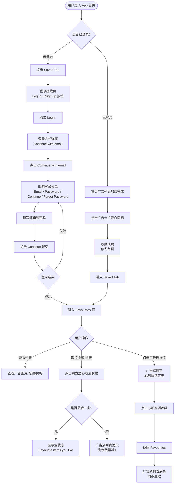

# 收藏广告业务流程

> **业务目标**：已登录用户通过首页或详情页收藏广告，并在 Favourites 列表中管理收藏；未登录用户触发收藏时经过完整登录引导流程进入收藏功能。

---

## 1. 完整流程图

---

## 2. 详细步骤与观测点

### 步骤1：未登录 - Saved Tab 登录拦截
**页面位置**：App 底部导航栏 → Saved Tab

**操作**：
1. 在未登录状态下点击底部「Saved」Tab

**观测点**：
- ✅ 显示登录拦截页
- ✅ 拦截页同时展示「Log in」和「Sign up」两个按钮
- ❌ 不直接进入 Favourites 列表
- ⚠️ iOS / Android 拦截页 UI 布局可能存在差异

**验证方法**：
- 断言「Log in」按钮可见
- 断言「Sign up」按钮可见
- 断言 Favourites 页面标题不可见

**关联规则**：[收藏规则.md - 3.3 权限规则](../../../业务规则库/buyer/收藏模块/收藏规则.md#33-权限规则)

---

### 步骤2：未登录 - 登录弹窗交互
**页面位置**：登录方式选择弹窗

**操作**：
1. 点击拦截页「Log in」按钮
2. 查看弹窗内容
3. 点击「Continue with email」

**观测点**：
- ✅ 弹出登录方式选择弹窗
- ✅ 弹窗中「Continue with email」选项可见
- ✅ 点击后跳转邮箱登录表单页

**验证方法**：
- 点击「Log in」后断言弹窗出现
- 断言「Continue with email」元素可见

**关联规则**：[收藏规则.md - 3.4 业务约束](../../../业务规则库/buyer/收藏模块/收藏规则.md#34-业务约束)

---

### 步骤3：未登录 - 邮箱登录表单
**页面位置**：邮箱登录表单页

**操作**：
1. 查看表单元素
2. 输入邮箱（`1852134166@qq.com`）和密码（`Dong123!`）
3. 点击「Continue」提交

**观测点**：
- ✅ Email 输入框可见
- ✅ Password 输入框可见
- ✅ Continue 按钮可见
- ✅ Forgot Password 链接可见
- ✅ 登录成功后进入 Favourites 页面
- ✅ Favourites 页面标题可见
- ✅ 「Search alerts」子 Tab 可见

**验证方法**：
- 断言 4 个 UI 元素均可见
- 填写凭据点击提交，断言 Favourites 标题可见
- 断言「Search alerts」Tab 可见

**关联规则**：[收藏规则.md - 3.2 校验规则](../../../业务规则库/buyer/收藏模块/收藏规则.md#32-校验规则)

---

### 步骤4：已登录 - 首页收藏广告
**页面位置**：App 首页广告列表

**操作**：
1. 确保账号已登录，当前在首页
2. 等待广告列表加载完成
3. 点击第一个广告卡片的爱心图标
4. 记录广告标题（用于后续验证）

**观测点**：
- ✅ 收藏操作完成后仍留在首页（搜索栏可见）
- ✅ 不发生页面跳转
- ⚠️ 爱心图标状态切换（已收藏态）的 UI 表现以实机为准

**验证方法**：
- 点击爱心后断言首页搜索栏仍可见
- 断言未跳转至其他页面

**关联规则**：[收藏规则.md - 3.4 业务约束](../../../业务规则库/buyer/收藏模块/收藏规则.md#34-业务约束)

---

### 步骤5：已登录 - Favourites 列表验证
**页面位置**：Saved Tab → Favourites 页

**操作**：
1. 点击底部「Saved」Tab
2. 验证列表内容

**观测点**：
- ✅ Favourites 页面标题可见
- ✅ 收藏列表不为空（empty-state 不展示）
- ✅ 至少有 1 张广告图片卡片
- ✅ 刚收藏的广告标题出现在列表中（前 20 字符模糊匹配）
- ✅ 广告价格元素可见（£xx 或 FREE）

**验证方法**：
- 断言 Favourites 标题可见
- 断言 empty-state 不可见
- 断言至少 1 张广告图片卡片存在
- 用标题前 20 字符断言列表中存在匹配广告
- 断言价格元素（£ 或 FREE）可见

**关联规则**：[收藏规则.md - 3.4 业务约束](../../../业务规则库/buyer/收藏模块/收藏规则.md#34-业务约束)

---

### 步骤6：取消收藏（Favourites 列表）
**页面位置**：Favourites 页面

**操作**：
1. 记录当前收藏列表广告数量
2. 点击广告爱心图标取消收藏
3. 等待列表更新（最多 6 秒）

**观测点**：
- ✅ 取消的广告从列表中消失
- ✅ 若为最后一条 → 显示空状态「Favourite items you like」
- ✅ 若非最后一条 → 剩余数量 = 取消前数量 - 1

**验证方法**：
- 断言取消的广告标题在列表中不可见（timeout 6s）
- 若取消前数量=1：断言 empty-state 可见
- 若取消前数量>1：断言剩余数量正确

**关联规则**：[收藏规则.md - 3.2 校验规则](../../../业务规则库/buyer/收藏模块/收藏规则.md#32-校验规则)

---

### 步骤7：取消收藏（广告详情页）
**页面位置**：广告详情页 → 返回 Favourites

**操作**：
1. 从 Favourites 列表点击广告图片进入详情页
2. 点击顶部心形按钮取消收藏
3. 点击返回，回到 Favourites 列表
4. 验证广告消失

**观测点**：
- ✅ 详情页正常打开（返回按钮可见）
- ✅ 顶部心形按钮可见
- ✅ 返回后正确回到 Favourites 页面
- ✅ 详情页取消收藏同步反映到列表（等待最多 8 秒）

**验证方法**：
- 断言详情页返回按钮可见
- 断言心形按钮可见
- 返回后断言 Favourites 标题可见
- 断言该广告在列表中不可见（timeout 8s）

**关联规则**：[收藏规则.md - 3.4 业务约束](../../../业务规则库/buyer/收藏模块/收藏规则.md#34-业务约束)

---

## 3. 流程完整性验证清单

- [ ] 未登录点击 Saved Tab → 登录拦截页显示「Log in」和「Sign up」
- [ ] 点击拦截页「Log in」→ 弹出登录方式选择弹窗（含 Continue with email）
- [ ] 点击 Continue with email → 邮箱表单页：Email/Password/Continue/Forgot Password 均可见
- [ ] 邮箱登录成功 → 进入 Favourites，「Favourites」标题可见
- [ ] Favourites 页「Search alerts」子 Tab 可见
- [ ] 已登录首页点击爱心收藏 → 停留首页（不跳转）
- [ ] 收藏后进入 Saved Tab → 列表不为空，含广告图片
- [ ] 收藏列表中广告标题匹配（前 20 字符）
- [ ] 收藏列表中广告价格可见（£ 或 FREE）
- [ ] Favourites 列表取消收藏 → 广告在 6 秒内消失
- [ ] 取消最后一条收藏 → 显示空状态「Favourite items you like」
- [ ] 取消非最后一条 → 剩余数量 = 取消前 - 1
- [ ] 从详情页取消收藏 → 返回 Favourites 后广告消失（8 秒内）
- [ ] 已登录态访问 Saved Tab → 跳过拦截页直接进入 Favourites

---

## 4. 关联文档

- [收藏业务全景](./收藏业务全景.md)
- [收藏规则.md](../../../业务规则库/buyer/收藏模块/收藏规则.md)
- [登录规则.md](../../../业务规则库/buyer/登录模块/登录规则.md)

---

## 5. 变更历史

| 日期 | 版本 | 变更内容 | 变更人 |
|-----|------|---------|--------|
| 2026-04-17 | v1.0 | 初始版本，基于 buyer-收藏广告功能.md（4条用例）归档 | Arin Yang |
