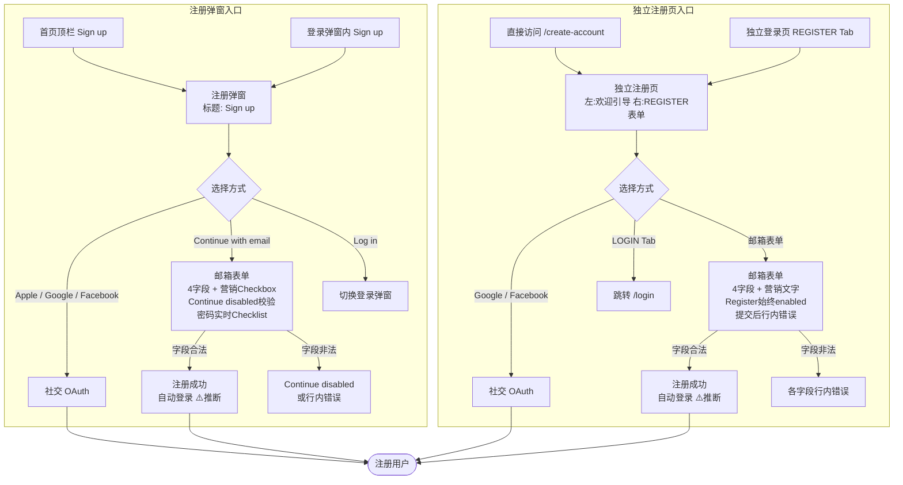
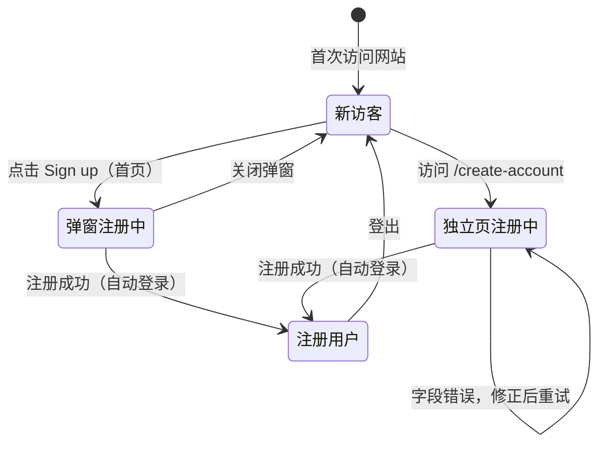

# 注册业务域 - 业务全景

## 1. 业务定位

注册业务域是 Gumtree Unicorn 的用户增长核心链路，为新访客提供两种注册路径，将匿名访客转化为注册用户，解锁发帖、收藏、消息等核心功能。

**业务价值**：
- 为新访客提供无需离页的弹窗注册体验，最小化转化摩擦
- 为通过独立注册页进入的用户提供完整的引导说明（5条功能好处），提升注册动力
- 通过社交注册（Google、Facebook、Apple）降低注册门槛

**目标用户**：
- **新访客**：尚未拥有 Gumtree 账号，希望发帖、收藏或使用站内信等功能

## 2. 业务范围

### 2.1 功能覆盖

| 功能模块 | 说明 | 核心能力 |
|---------|------|---------|
| 注册弹窗 | 首页 Modal 叠加层 | 不离页注册；实时密码 Checklist；营销 Checkbox |
| 独立注册页 | my 子域全页面 | 左侧引导好处说明；REGISTER Tab；Register 始终 enabled |
| 邮箱注册 | 两种入口均支持 | 4字段表单；密码强度校验；Show/Hide |
| 社交注册 | 弹窗：Apple+Google+Facebook；独立页：Google+Facebook | 第三方 OAuth |
| 合规展示 | 两种入口均有 Terms of Use + Privacy Notice 链接 | /termsofuse；/privacy_policy |
| 营销同意 | 弹窗：Checkbox（默认未选）；独立页：文字 + 退订链接 | 不同展示形式 |

### 2.2 地域覆盖
- **Unicorn 站（UK 测试站）**：弹窗入口 `www.unicorn.gumtree.io`；独立注册页 `my.unicorn.gumtree.io/create-account`

### 2.3 用户角色

| 角色 | 权限 | 说明 |
|-----|------|------|
| 未登录新访客 | 可访问两种注册入口 | 注册目标角色 |
| 已登录用户 | 访问 /create-account 重定向（⚠️ 推断） | 无需再次注册 |
| 已登录用户 | 首页不显示「Sign up」按钮（⚠️ 推断） | 顶栏显示账户入口 |

## 3. 业务流程全景图



## 4. 核心业务流程概览

### 4.1 注册弹窗流程
**业务目标**：访客在首页不离页完成账号注册，降低页面切换摩擦，注册后即时进入已登录态。

**核心步骤**：
1. 点击首页顶栏「Sign up」触发注册 Modal 弹窗
2. 第一步展示社交注册选项 + Continue with email + 合规链接
3. 选择邮箱注册：展开 4 字段表单，密码实时展示 Checklist
4. 所有字段合法（含强密码）→ Continue 激活 → 点击提交
5. 注册成功自动登录，跳转个人中心（⚠️ 推断）

**关键观测点**：
- ✅ 弹窗标题「Sign up」，展示 Apple / Google / Facebook 三种社交注册（含 Apple）
- ✅ Continue 按钮：全字段合法后激活（disabled 前端校验）
- ✅ 密码实时 Checklist：5条规则逐一显示，全满足显示「Strong password」
- ✅ 营销 Checkbox 默认未勾选，不影响表单激活
- ✅ X 按钮关闭弹窗；弹窗内可切换至登录弹窗

**详细流程文档**：[注册弹窗业务流程.md](./注册弹窗业务流程.md)

---

### 4.2 独立注册页流程
**业务目标**：访客通过独立注册页完成账号创建，左侧引导内容帮助用户了解注册价值，提升转化意愿。

**核心步骤**：
1. 访问 `my.unicorn.gumtree.io/create-account`
2. 左侧阅读 5 条注册好处引导
3. 选择注册方式（社交 或 邮箱表单）
4. 邮箱表单：Register 按钮始终可点，填写并提交
5. 提交后显示行内错误（如有）；全部合法 → 注册成功（⚠️ 推断）

**关键观测点**：
- ✅ 页面标题「Create an account | My Gumtree - Gumtree」
- ✅ REGISTER Tab 激活，LOGIN Tab 跳转 /login
- ✅ 社交登录：Google + Facebook（无 Apple）
- ✅ Register 按钮始终 enabled（与弹窗不同）
- ✅ 密码校验：提交后综合错误文案（两行：过短 + 复杂度）

**详细流程文档**：[独立注册页业务流程.md](./独立注册页业务流程.md)

---

## 5. 页面拓扑关系

### 5.1 页面入口矩阵

| 页面 | 入口1 | 入口2 | 入口3 |
|-----|------|------|------|
| 注册弹窗（Modal） | 首页顶栏「Sign up」 | 登录弹窗内「Sign up」切换 | - |
| 独立注册页 /create-account | 独立登录页 REGISTER Tab | 直接访问 URL | - |
| /termsofuse | 注册弹窗第一步合规链接 | 独立注册页 Register 按钮下方链接 | 首页 Sign up 浮层（首页规则已记录） |
| /privacy_policy | 注册弹窗第一步合规链接 | 独立注册页 Register 按钮下方链接 | - |
| 登录弹窗 | 注册弹窗内「Log in」切换 | - | - |
| /login 独立登录页 | 独立注册页 LOGIN Tab | - | - |

### 5.2 页面跳转流程图

```mermaid
graph LR
    Home[首页] -->|Sign up| RegModal[注册弹窗]
    LoginModal[登录弹窗] -->|Sign up 切换| RegModal
    RegModal -->|Log in 切换| LoginModal
    RegModal -->|Terms of Use| Terms[/termsofuse]
    RegModal -->|Privacy notice| Privacy[/privacy_policy]
    RegModal -->|注册成功| PersonalCenter[个人中心\n⚠️推断]
    IndLogin[独立登录页 /login] -->|REGISTER Tab| IndReg[独立注册页 /create-account]
    IndReg -->|LOGIN Tab| IndLogin
    IndReg -->|Terms of Use| Terms
    IndReg -->|Privacy Notice| Privacy
    IndReg -->|注册成功| PersonalCenter
```

### 5.3 页面关系详解

#### 首页 → 注册弹窗
- **入口**：顶栏「Sign up」按钮
- **目标**：Modal 叠加层（不离页）
- **特点**：含合规链接、社交注册（含 Apple）、邮箱表单；X/ESC 关闭

#### 登录弹窗 ↔ 注册弹窗
- **入口（登录→注册）**：登录弹窗内「Don't have an account? Sign up」
- **入口（注册→登录）**：注册弹窗内「Already got an account? Log in」
- **特点**：弹窗内视图切换，不离页；实测确认（注册用例 TC001，登录用例逻辑互通）

#### 独立登录页 ↔ 独立注册页
- **入口（登录→注册）**：独立登录页顶部 REGISTER Tab → `/create-account`
- **入口（注册→登录）**：独立注册页顶部 LOGIN Tab → `/login`
- **特点**：页面跳转（同 my 子域内）

## 6. 业务数据流转

### 6.1 用户状态流转



### 6.2 用户操作与数据变化

| 操作 | 数据变化 | 前台展示变化 | 涉及页面 |
|-----|---------|------------|---------|
| 点击弹窗 Continue with email | 无 | 弹窗切换为邮箱表单视图 | 注册弹窗 |
| 输入弱密码（弹窗） | 无 | 实时显示 5 条规则 Checklist | 注册弹窗 |
| 输入强密码（弹窗） | 无 | 显示绿色「Strong password」 | 注册弹窗 |
| 空表单提交（独立页） | 无 | 各字段显示行内错误文案 | /create-account |
| 注册成功 | 新用户记录创建；会话建立 | 自动登录，跳转个人中心（⚠️推断） | 个人中心 |
| 已注册邮箱提交 | 无 | 显示邮箱已存在错误（⚠️推断） | 注册弹窗 / /create-account |

### 6.3 关键业务数据

#### 注册表单字段
| 字段 | 类型 | 必填 | 说明 |
|-----|------|-----|------|
| First name | String | 是 | 用户名（名），非空 |
| Last name | String | 是 | 用户名（姓），非空 |
| Email address | String | 是 | 邮箱格式，需为未注册邮箱 |
| Password | String | 是 | 满足 5 条复杂度规则，最少 8 位 |

#### 密码复杂度规则
| 规则 | 要求 |
|-----|------|
| 小写字母 | 至少 1 个 |
| 大写字母 | 至少 1 个 |
| 数字 | 至少 1 个 |
| 特殊字符 | 至少 1 个（如 !@#$£%^*-_+=） |
| 最小长度 | 最少 8 个字符 |

## 7. 关键业务规则索引

### 7.1 表单字段与校验规则
- [注册规则.md - 3.1 输入规则](../../../业务规则库/buyer/注册模块/注册规则.md#31-输入规则)
- [注册规则.md - 3.2 校验规则](../../../业务规则库/buyer/注册模块/注册规则.md#32-校验规则)

### 7.2 两种入口差异规则
- [注册规则.md - 3.4 业务约束](../../../业务规则库/buyer/注册模块/注册规则.md#34-业务约束)

### 7.3 错误处理与错误文案
- [注册规则.md - 4. 错误处理](../../../业务规则库/buyer/注册模块/注册规则.md#4-错误处理)

### 7.4 登录/注册弹窗切换规则
- [登录规则.md - 3.4 业务约束](../../../业务规则库/buyer/登录模块/登录规则.md#34-业务约束)

## 8. 业务FAQ

### Q1: 注册弹窗和独立注册页有什么核心区别？
**A**: 5点关键差异——①弹窗含 Apple 社交注册，独立页无；②弹窗 Continue 有 disabled 校验，独立页 Register 始终 enabled；③密码校验：弹窗实时 Checklist，独立页提交后综合错误；④营销同意：弹窗为 Checkbox，独立页为文字；⑤注册成功跳转：弹窗停留首页（推断），独立页跳转个人中心（推断）。

### Q2: 注册弹窗的密码规则是什么？
**A**: 5条规则须全部满足：至少1个小写字母、至少1个大写字母、至少1个数字、至少1个特殊字符、最少8个字符。全部满足时显示绿色「Strong password」。

### Q3: 注册弹窗的 Continue 按钮什么时候激活？
**A**: First name、Last name、格式合法的 Email、满足全部 5 条规则的 Password 四者均填写时激活。营销 Checkbox 的勾选状态不影响激活。

### Q4: 独立注册页的密码错误怎么展示？
**A**: 提交后在 Password 字段下方显示两行：第1行「Too short. Please enter at least 8 characters.」（长度不足）；第2行「Include at least one capital letter, one lowercase letter, one number and one special character e.g. !@#$£%^*-_+=」（复杂度不足）。

### Q5: 注册时合规链接在哪里？
**A**: 弹窗第一步（社交选项页）和独立注册页 Register 按钮下方均有 Terms of Use（/termsofuse）和 Privacy Notice（/privacy_policy）链接。

### Q6: 如何从注册弹窗切换到登录弹窗（或反向）？
**A**: 注册弹窗内点击「Already got an account? Log in」切换为登录弹窗（推断）；登录弹窗内点击「Don't have an account? Sign up」切换为注册弹窗（实测确认 ✅）。

### Q7: 注册后会发生什么？
**A**: 注册成功后自动登录（推断，行业惯例），跳转至个人中心或首页。尚未在 Unicorn 站实测完整注册成功路径。

### Q8: 独立注册页左侧展示什么内容？
**A**: 「Welcome to Gumtree.」欢迎语及 5 条注册好处：Send and receive messages / Post and manage your ads / Rate other users / Favourite ads / Set alerts for your searches。

### Q9: 使用已注册邮箱注册会发生什么？
**A**: 服务端应返回「邮箱已被注册」类错误，但具体错误文案未在 Unicorn 站实测，需补充验证。

### Q10: 已登录用户能访问注册页吗？
**A**: 推断已登录用户访问 /create-account 会自动重定向至个人中心，且首页顶栏不显示「Sign up」按钮（均为行业惯例推断，未实测）。

## 9. 业务指标（可选）

### 9.1 核心指标
- 待补充（注册转化率、社交注册占比、邮箱注册成功率等需接入埋点数据）

### 9.2 漏斗指标
- **弹窗注册漏斗**：触发弹窗 → 选择邮箱注册 → 完成表单 → Continue 激活 → 提交 → 成功
- **独立页注册漏斗**：访问 /create-account → 选择邮箱注册 → 填写表单 → Register → 成功

## 10. 已知问题与风险

### 10.1 产品待确认问题
1. **弹窗 Apple 注册缺失（独立页）**：独立注册页无 Apple 注册，与弹窗功能不对等，是否需要对齐？
2. **注册成功跳转目标**（TC037）：注册成功后自动登录跳转至个人中心还是首页，待实测确认
3. **已注册邮箱错误文案**（TC036）：具体错误文案未实测，需补充
4. **已登录用户访问 /create-account**（TC034）：重定向目标待验证
5. **弹窗内 Log in 切换**（TC004）：注册弹窗→登录弹窗的切换行为为推断，待实测

### 10.2 技术风险
- 两套注册实现（弹窗 vs 独立页）维护成本高，规则变更需同步两处
- 密码实时 Checklist（弹窗）与提交后错误文案（独立页）两种校验时机不同，可能导致用户体验不一致
- 社交注册依赖第三方 OAuth（Apple/Google/Facebook），授权页行为不受控

### 10.3 测试过程中发现的问题
- TC038：First name 特殊字符/XSS 注入处理机制未测试
- TC039：Email 超长字符串（255+）校验行为未测试
- TC003：ESC 键关闭弹窗无法通过 Playwright 直接验证 ESC 事件绑定，需特殊处理

## 11. 变更历史

| 日期 | 版本 | 变更内容 | 变更人 |
|-----|------|---------|--------|
| 2026-04-16 | v1.0 | 初始版本，基于 unicorn-register-测试用例-20260413.md（40条用例）归档 | Arin Yang |
