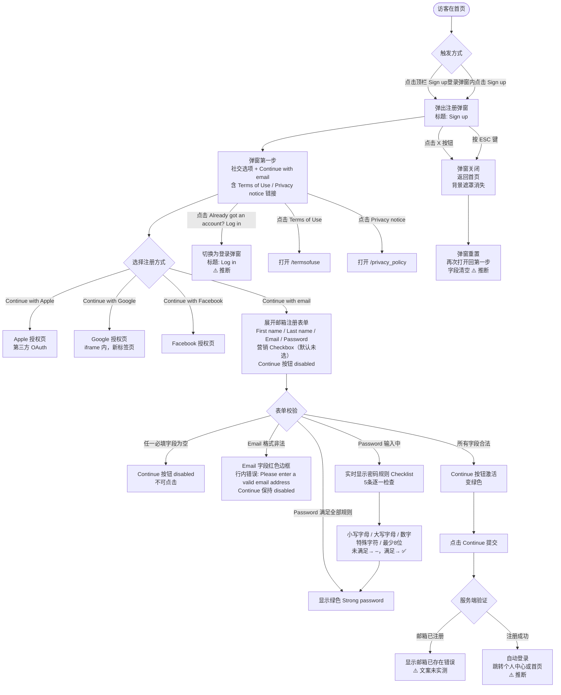

# 注册弹窗业务流程

> **业务目标**：未登录访客在首页通过 Modal 弹窗完成账号注册，无需离开当前页面，注册成功后自动登录进入已登录态。

---

## 1. 完整流程图

---

## 2. 详细步骤与观测点

### 步骤1：触发注册弹窗
**页面位置**：首页顶栏

**操作**：
1. 点击顶栏「Sign up」按钮

**观测点**：
- ✅ 弹窗出现，标题「Sign up」
- ✅ 副标题「Already got an account? Log in」，Log in 为可点击按钮
- ✅ 显示三个社交注册按钮：「Continue with Apple」、「Continue with Google（iframe 内）」、「Continue with Facebook」
- ✅ 显示「Continue with email」按钮
- ✅ 显示 Terms of Use 和 Privacy notice 链接
- ✅ 背景遮罩变暗

**验证方法**：
- 断言弹窗标题为「Sign up」
- 断言三个社交按钮均可见
- 断言「Continue with email」按钮可见
- 断言合规链接存在

**关联规则**：[注册规则.md - 3.4 业务约束](../../../业务规则库/buyer/注册模块/注册规则.md#34-业务约束)

---

### 步骤2：选择邮箱注册，展开表单
**页面位置**：注册弹窗（第一步）

**操作**：
1. 点击「Continue with email」

**观测点**：
- ✅ 弹窗切换为邮箱注册表单
- ✅ 显示字段：First name、Last name、Email address、Password
- ✅ Password 字段右侧有「Show/Hide」切换按钮
- ✅ 显示营销邮件 Checkbox（默认未勾选）
- ✅ Continue 按钮默认为 disabled（灰色）

**验证方法**：
- 断言 4 个输入字段均可见
- 断言营销 Checkbox 默认 unchecked
- 断言 Continue 按钮 disabled

**关联规则**：[注册规则.md - 3.2 校验规则](../../../业务规则库/buyer/注册模块/注册规则.md#32-校验规则)

---

### 步骤3：表单校验 — Continue 按钮激活条件
**页面位置**：注册弹窗（邮箱表单）

**操作**：
1. 逐一填写各字段，观察 Continue 按钮状态变化

**观测点**：
- ✅ 任一必填字段为空 → Continue 保持 disabled
- ✅ Email 格式非法（如 `test.invalid.format` 无 @）→ 字段红色边框 + 行内错误「Please enter a valid email address」，Continue 保持 disabled
- ✅ 全部字段合法（First name、Last name、合法 Email、满足密码规则）→ Continue 变绿色激活
- ✅ 营销 Checkbox 勾选/取消不影响 Continue 激活状态

**验证方法**：
- 断言空字段时 Continue disabled
- 输入非法 Email 断言错误文案和 disabled 状态
- 四字段全部合法后断言 Continue enabled

**关联规则**：[注册规则.md - 3.2 校验规则](../../../业务规则库/buyer/注册模块/注册规则.md#32-校验规则)

---

### 步骤4：密码实时强度校验
**页面位置**：注册弹窗（邮箱表单 Password 字段）

**操作**：
1. 在 Password 字段输入弱密码（如 `123456`）
2. 输入强密码（如 `Test1234!`）

**观测点**：
- ✅ 输入时实时显示 5 条规则 Checklist：
  - One lower case letter（未满足 → –）
  - One upper case letter（未满足 → –）
  - One number（满足 → ✅）
  - One special character（未满足 → –）
  - Minimum 8 characters（未满足 → –）
- ✅ 输入 `Test1234!` 满足全部规则 → 显示绿色「Strong password」，不再逐条展示
- ✅ **与独立页不同**：独立页为提交后显示综合错误文案，弹窗为实时 Checklist

**验证方法**：
- 输入弱密码，断言 Checklist 各条状态
- 输入强密码，断言「Strong password」文案出现

**关联规则**：[注册规则.md - 3.2 校验规则](../../../业务规则库/buyer/注册模块/注册规则.md#32-校验规则)

---

### 步骤5：密码可见性切换
**页面位置**：注册弹窗（邮箱表单 Password 字段）

**操作**：
1. 在 Password 字段输入内容（默认密文 ●●●）
2. 点击「Show」按钮
3. 再次点击「Hide」

**观测点**：
- ✅ 点击 Show → 密码以明文显示，按钮文案变为「Hide」
- ✅ 再次点击 → 密码重新以 ● 遮盖

**验证方法**：
- 断言 Show 切换前后密码字段可见性变化

**关联规则**：[注册规则.md - 3.4 业务约束](../../../业务规则库/buyer/注册模块/注册规则.md#34-业务约束)

---

### 步骤6：营销邮件 Checkbox
**页面位置**：注册弹窗（邮箱表单）

**操作**：
1. 观察营销邮件 Checkbox 默认状态
2. 点击 Checkbox

**观测点**：
- ✅ 默认未勾选
- ✅ 点击后变为勾选状态
- ✅ 勾选/取消不影响 Continue 按钮的激活状态

**验证方法**：
- 断言 Checkbox 默认 unchecked
- 点击后断言 checked 状态
- 确认 Continue 按钮状态不受影响

**关联规则**：[注册规则.md - 3.4 业务约束](../../../业务规则库/buyer/注册模块/注册规则.md#34-业务约束)

---

### 步骤7：合规链接跳转
**页面位置**：注册弹窗（第一步，社交选项页）

**操作**：
1. 点击「Terms of use」链接
2. 返回，点击「Privacy notice」链接

**观测点**：
- ✅ Terms of use → 跳转至 `https://www.unicorn.gumtree.io/termsofuse`
- ✅ Privacy notice → 跳转至 `https://www.unicorn.gumtree.io/privacy_policy`

**验证方法**：
- 点击后断言目标 URL

**关联规则**：[注册规则.md - 3.4 业务约束](../../../业务规则库/buyer/注册模块/注册规则.md#34-业务约束)

---

### 步骤8：关闭弹窗
**页面位置**：注册弹窗（任意步骤）

**操作**：
1. 点击弹窗右上角 X 按钮

**观测点**：
- ✅ 弹窗关闭，返回首页
- ✅ 页面背景遮罩消失
- ✅ 页面内容可正常交互
- ⚠️ ESC 键也可关闭弹窗（推断，行业惯例）
- ⚠️ 再次打开弹窗时回到第一步，字段内容清空（推断）

**验证方法**：
- 点击 X 后断言弹窗不可见
- 断言遮罩消失

**关联规则**：[注册规则.md - 3.4 业务约束](../../../业务规则库/buyer/注册模块/注册规则.md#34-业务约束)

---

### 步骤9：登录/注册弹窗切换
**页面位置**：注册弹窗（第一步）

**操作**：
1. 点击「Already got an account? Log in」

**观测点**：
- ⚠️ 弹窗切换为登录表单，标题变为「Log in」（推断，基于 UI 链接行为）
- ✅ 仍保持弹窗状态（已由登录用例确认：登录弹窗内 Sign up 可切换至注册弹窗，反向同理）

**验证方法**：
- 点击 Log in 后断言弹窗标题变为「Log in」

**关联规则**：[注册规则.md - 3.4 业务约束](../../../业务规则库/buyer/注册模块/注册规则.md#34-业务约束)

---

## 3. 流程完整性验证清单

- [ ] 点击顶栏「Sign up」弹出注册弹窗，标题「Sign up」
- [ ] 弹窗展示 Apple / Google / Facebook 三种社交注册方式
- [ ] Google 按钮位于 iframe 内，标注「Opens in new tab」
- [ ] 显示「Continue with email」入口
- [ ] 弹窗含 Terms of Use 和 Privacy notice 合规链接
- [ ] Terms of Use 链接指向 /termsofuse
- [ ] Privacy notice 链接指向 /privacy_policy
- [ ] 点击 Continue with email 展开含 4 字段的注册表单
- [ ] 营销邮件 Checkbox 默认未勾选
- [ ] 任一字段为空时 Continue 按钮为 disabled
- [ ] Email 格式非法时显示「Please enter a valid email address」+ 红色边框 + Continue disabled
- [ ] Password 输入时实时显示 5 条规则 Checklist
- [ ] Password 满足全部规则时显示「Strong password」绿色文案
- [ ] 所有字段合法后 Continue 变绿色激活
- [ ] 营销 Checkbox 勾选/取消不影响 Continue 激活状态
- [ ] 密码 Show/Hide 切换正常
- [ ] X 按钮关闭弹窗，背景遮罩消失
- [ ] 弹窗内「Log in」可切换至登录弹窗
- [ ] 关闭后重新打开弹窗回到第一步，字段清空（待验证）
- [ ] 已注册邮箱注册显示错误（待验证）
- [ ] 注册成功自动登录并跳转（待验证）

---

## 4. 关联文档

- [注册业务全景](./注册业务全景.md)
- [独立注册页业务流程](./独立注册页业务流程.md)
- [注册规则.md](../../../业务规则库/buyer/注册模块/注册规则.md)
- [登录规则.md](../../../业务规则库/buyer/登录模块/登录规则.md)

---

## 5. 变更历史

| 日期 | 版本 | 变更内容 | 变更人 |
|-----|------|---------|--------|
| 2026-04-16 | v1.0 | 初始版本，基于 unicorn-register-测试用例-20260413.md 归档 | Arin Yang |
