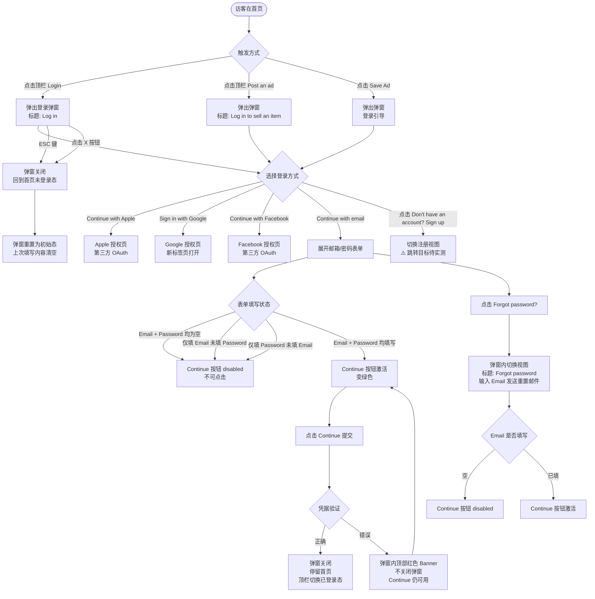

# 弹窗登录业务流程

> **业务目标**：未登录访客在首页通过 Modal 弹窗完成账号登录，无需离开当前页面，登录后顶栏即时切换为已登录态。

---

## 1. 完整流程图

---

## 2. 详细步骤与观测点

### 步骤1：触发登录弹窗
**页面位置**：首页顶栏

**操作**：
1. 点击顶栏「Login」按钮

**观测点**：
- ✅ 弹窗出现，标题「Log in」
- ✅ 展示 4 种登录方式：「Continue with Apple」、「Sign in with Google」、「Continue with Facebook」、「Continue with email」
- ✅ 显示「Don't have an account? Sign up」
- ✅ 背景页面被蒙层遮挡，不可滚动
- ✅ 弹窗右上角有 ✕ 关闭按钮

**验证方法**：
- 断言弹窗标题为「Log in」
- 断言 4 种登录方式按钮均可见
- 断言背景蒙层存在（overflow: hidden 或蒙层元素）

**关联规则**：[登录规则.md - 3.4 业务约束](../../../业务规则库/buyer/登录模块/登录规则.md#34-业务约束)

---

### 步骤2：选择邮箱登录，展开表单
**页面位置**：登录弹窗（选择方式视图）

**操作**：
1. 点击「Continue with email」

**观测点**：
- ✅ 弹窗切换到邮箱/密码表单视图
- ✅ 显示「Email address」输入框
- ✅ 显示「Password」输入框（含「Show」切换按钮）
- ✅ 显示「Forgot password?」按钮
- ✅ 显示「Continue」按钮，初始为 disabled（灰色）
- ✅ 页面副标题文案：「You can now login to your account using your new password.」

**验证方法**：
- 断言 Email 输入框存在
- 断言 Password 输入框存在
- 断言 Continue 按钮 disabled 属性为 true

**关联规则**：[登录规则.md - 3.2 校验规则](../../../业务规则库/buyer/登录模块/登录规则.md#32-校验规则)

---

### 步骤3：表单校验 — Continue 按钮激活条件
**页面位置**：登录弹窗（邮箱/密码表单）

**操作**：
1. 仅填 Email，不填 Password
2. 仅填 Password，不填 Email
3. Email + Password 均填写

**观测点**：
- ✅ 仅填 Email（未填 Password）→ Continue 仍为 disabled
- ✅ 仅填 Password（未填 Email）→ Continue 仍为 disabled
- ✅ Email + Password 均有值 → Continue 变绿色，可点击

**验证方法**：
- 分别断言各场景下 Continue 按钮的 disabled 属性
- 两者均填后断言按钮可点击（disabled 为 false）

**关联规则**：[登录规则.md - 3.2 校验规则](../../../业务规则库/buyer/登录模块/登录规则.md#32-校验规则)

---

### 步骤4：提交错误账密 — 顶部 Banner 错误提示
**页面位置**：登录弹窗（邮箱/密码表单）

**操作**：
1. 填写不存在的账号邮箱（如 `test@test.com`）
2. 填写错误密码（如 `wrongpassword`）
3. 点击「Continue」

**观测点**：
- ✅ 弹窗内顶部显示红色 Banner
- ✅ Banner 文案：「Incorrect email address or password. Check your details and try again.」
- ✅ 弹窗不关闭，URL 不变
- ✅ Continue 按钮仍可用（已填内容未清空）
- ✅ **与独立页错误文案不同**（独立页为字段下方行内文案）

**验证方法**：
- 断言红色 Banner 元素可见
- 断言 Banner 文案内容
- 断言当前 URL 仍为首页

**关联规则**：[登录规则.md - 4. 错误处理](../../../业务规则库/buyer/登录模块/登录规则.md#4-错误处理)

---

### 步骤5：密码可见性切换
**页面位置**：登录弹窗（邮箱/密码表单）

**操作**：
1. 在 Password 字段输入内容（默认密文显示 •••）
2. 点击「Show」按钮
3. 再次点击（变为「Hide」）

**观测点**：
- ✅ 默认状态：密码为密文（•••）
- ✅ 点击 Show → 密码明文可见，图标切换为「睁眼」样式
- ✅ 再次点击 → 恢复密文，图标切回

**验证方法**：
- 断言默认 Password 字段 type="password"
- 点击 Show 后断言字段内容可见（或 type="text"）

**关联规则**：[登录规则.md - 3.4 业务约束](../../../业务规则库/buyer/登录模块/登录规则.md#34-业务约束)

---

### 步骤6：关闭弹窗
**页面位置**：登录弹窗（任意步骤）

**操作（两种方式）**：
1. 按键盘 ESC 键
2. 点击弹窗右上角 ✕ 按钮

**观测点**：
- ✅ ESC 关闭 → 弹窗关闭，回到首页，URL 不变，顶栏仍显示 Login/Sign up
- ✅ X 按钮关闭 → 同上
- ✅ 再次打开弹窗 → 回到第一步（选择登录方式页），上次填写内容已清空（⚠️ 推断）

**验证方法**：
- 按 ESC 后断言弹窗不可见
- 断言当前 URL 和顶栏状态未变化

**关联规则**：[登录规则.md - 3.4 业务约束](../../../业务规则库/buyer/登录模块/登录规则.md#34-业务约束)

---

### 步骤7：Forgot password — 弹窗内视图切换
**页面位置**：登录弹窗（邮箱/密码表单）

**操作**：
1. 点击「Forgot password?」按钮

**观测点**：
- ✅ 弹窗不关闭，内容切换（不跳新页）
- ✅ 标题变为「Forgot password」
- ✅ 说明文案：「Please enter the email address you used to create your account. We will then send you an email to change your password.」
- ✅ 显示 Email address 输入框和 Continue 按钮
- ✅ Email 为空时 Continue 为 disabled
- ✅ **与独立页不同**（独立页点击 Forgot 跳转独立页 /forgotten-password）

**验证方法**：
- 断言弹窗标题变为「Forgot password」
- 断言说明文案存在
- 断言空 Email 时 Continue disabled

**关联规则**：[登录规则.md - 3.4 业务约束](../../../业务规则库/buyer/登录模块/登录规则.md#34-业务约束)

---

### 步骤8：成功登录 — 弹窗关闭，顶栏切换
**页面位置**：登录弹窗（邮箱/密码表单）

**操作**：
1. 填写有效账号 Email + 正确 Password
2. 点击「Continue」

**观测点**：
- ✅ 弹窗关闭（⚠️ 推断，完整成功路径待实测）
- ✅ 当前页 URL 保持不变（留在首页）
- ✅ 顶栏切换为已登录态：显示「Post an ad」、「Messages」、「Menu」，不显示「Login」、「Sign up」

**验证方法**：
- 登录后断言弹窗不可见
- 断言 URL 仍为首页
- 断言顶栏出现 Messages、Menu

**关联规则**：[登录规则.md - 3.4 业务约束](../../../业务规则库/buyer/登录模块/登录规则.md#34-业务约束)

---

## 3. 流程完整性验证清单

- [ ] 点击顶栏 Login 弹出「Log in」弹窗，背景蒙层生效
- [ ] 弹窗展示 4 种登录方式（Apple、Google、Facebook、email）
- [ ] 点击 Continue with email 展开邮箱/密码表单
- [ ] 初始状态 Continue 按钮为 disabled
- [ ] 仅填 Email 不填 Password，Continue 仍 disabled
- [ ] 仅填 Password 不填 Email，Continue 仍 disabled
- [ ] Email + Password 均填写，Continue 变绿色激活
- [ ] 错误账密提交后弹窗顶部显示红色 Banner 错误文案
- [ ] Banner 文案为「Incorrect email address or password. Check your details and try again.」
- [ ] 错误提交后弹窗不关闭，URL 不变
- [ ] 密码默认密文，点击 Show 可切换明文
- [ ] ESC 键关闭弹窗，URL 和顶栏状态不变
- [ ] X 按钮关闭弹窗，URL 和顶栏状态不变
- [ ] 再次打开弹窗时重置为初始态
- [ ] 点击 Forgot password? 弹窗内切换视图（不跳新页）
- [ ] Forgot password 视图中 Email 为空时 Continue disabled
- [ ] Sign in with Google 在新标签页打开授权页
- [ ] 成功登录后弹窗关闭，顶栏切换已登录态（待实测）
- [ ] Post an ad / Save Ad 触发弹窗，交互一致
- [ ] Cookie 横幅（主站）不阻止 Login 弹窗触发

---

## 4. 关联文档

- [登录业务全景](./登录业务全景.md)
- [独立登录页业务流程](./独立登录页业务流程.md)
- [登录规则.md](../../../业务规则库/buyer/登录模块/登录规则.md)
- [首页访问与浏览规则.md](../../../业务规则库/buyer/首页模块/首页访问与浏览规则.md)

---

## 5. 变更历史

| 日期 | 版本 | 变更内容 | 变更人 |
|-----|------|---------|--------|
| 2026-04-16 | v1.0 | 初始版本，基于 unicorn-login-测试用例-20260413.md 归档 | Arin Yang |
