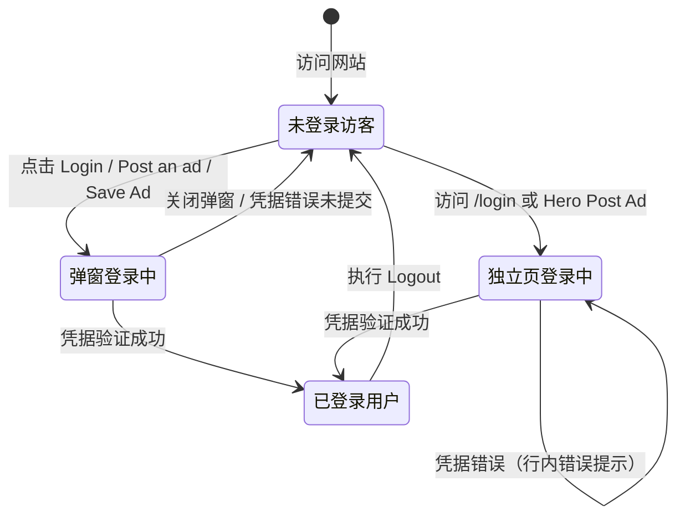

# 登录业务域 - 业务全景

## 1. 业务定位

登录业务域是 Gumtree Unicorn 的核心认证入口，为访客提供两种不同交互形态的登录方式，实现从匿名访客到已登录用户的身份转换。

**业务价值**：
- 为访客提供无需离页的弹窗登录体验，降低转化摩擦
- 为需要完整账号功能的用户提供独立登录页，登录成功后直达广告管理中心
- 通过社交登录（Google、Facebook、Apple）降低注册/登录门槛

**目标用户**：
- **未登录访客**：需要登录以发帖、收藏商品或访问账户功能
- **存量用户**：通过邮箱/密码或社交账号回归登录

## 2. 业务范围

### 2.1 功能覆盖

| 功能模块 | 说明 | 核心能力 |
|---------|------|---------|
| 弹窗登录 | 首页 Modal 叠加层 | 不离页登录；4 种登录方式；弹窗内 Forgot password 切换 |
| 独立登录页 | my 子域全页面 | REGISTER Tab；行内错误校验；成功后跳转 manage/ads |
| 邮箱/密码登录 | 两种入口均支持 | 密码可见性切换；错误文案（两种入口不同） |
| 社交登录 | 弹窗：Apple+Google+Facebook；独立页：Google+Facebook | 第三方 OAuth，新标签页/弹窗打开 |
| Forgot password | 弹窗：内部视图切换；独立页：跳转 /forgotten-password | 发送密码重置邮件 |
| Cookie 合规 | OneTrust 横幅（独立登录页首访出现） | Accept all / Reject all / Manage options |
| 注册入口 | 弹窗：Sign up 按钮；独立页：REGISTER Tab → /create-account | 跳转注册流程 |

### 2.2 地域覆盖
- **Unicorn 站（UK 测试站）**：弹窗入口 `www.unicorn.gumtree.io`；独立登录页 `my.unicorn.gumtree.io/login`

### 2.3 用户角色

| 角色 | 权限 | 说明 |
|-----|------|------|
| 未登录访客 | 可访问两种登录入口 | 登录本身不区分买家/卖家角色 |
| 已登录用户 | 访问 /login 重定向 | 不需要再次登录（⚠️ 推断） |

## 3. 业务流程全景图

```mermaid
graph TB
    subgraph 弹窗登录入口
        T1[首页顶栏 Login] --> M[登录弹窗 Modal]
        T2[顶栏 Post an ad 未登录] --> M
        T3[Save Ad 未登录] --> M
        M --> MS1{选择方式}
        MS1 -->|Apple / Google / Facebook| MS_SSO[社交 OAuth]
        MS1 -->|Continue with email| MS_Email[邮箱/密码表单\nContinue 按钮 disabled 校验]
        MS_Email -->|凭据正确| MS_OK[弹窗关闭\n停留首页\n顶栏→已登录态]
        MS_Email -->|凭据错误| MS_Err[顶部红色 Banner]
        MS1 -->|Forgot password?| MS_Forgot[弹窗内切换视图]
        MS1 -->|Sign up| MS_Register[注册视图]
    end

    subgraph 独立登录页入口
        P1[直接访问 /login] --> LP[独立登录页]
        P2[Hero Post Ad 未登录 + cb 参数] --> LP
        LP --> LS1{选择方式}
        LS1 -->|Google / Facebook| LS_SSO[社交 OAuth]
        LS1 -->|REGISTER Tab| LS_Reg[/create-account 注册页]
        LS1 -->|邮箱表单| LS_Email[邮箱/密码表单\nLogin 按钮始终 enabled]
        LS_Email -->|空/格式错误| LS_FE[行内错误文案]
        LS_Email -->|凭据错误| LS_AE[字段下方行内错误]
        LS_Email -->|凭据正确| LS_OK[跳转 manage/ads\n已登录态]
        LS1 -->|Forgot your password?| LS_Forgot[跳转 /forgotten-password]
    end

    MS_SSO --> LoggedIn([已登录用户])
    LS_SSO --> LoggedIn
    MS_OK --> LoggedIn
    LS_OK --> LoggedIn
```

## 4. 核心业务流程概览

### 4.1 弹窗登录流程
**业务目标**：访客在首页不离页完成登录，降低页面切换摩擦，登录后即时使用首页功能。

**核心步骤**：
1. 点击首页顶栏 Login（或 Post an ad / Save Ad）触发 Modal 弹窗
2. 选择登录方式（社交登录或邮箱登录）
3. 邮箱登录：填写 Email + Password，两者均填后 Continue 按钮激活
4. 凭据正确 → 弹窗关闭，停留首页，顶栏切换为已登录态
5. 凭据错误 → 弹窗顶部红色 Banner 提示，不关闭弹窗

**关键观测点**：
- ✅ 弹窗标题「Log in」，展示 4 种登录方式（含 Apple）
- ✅ Continue 按钮：仅 Email + Password 均填写后激活（disabled 校验）
- ✅ 错误文案：「Incorrect email address or password. Check your details and try again.」（顶部 Banner）
- ✅ ESC / X 按钮关闭弹窗，URL 不变
- ✅ Forgot password? 在弹窗内切换视图（不跳新页）

**详细流程文档**：[弹窗登录业务流程.md](./弹窗登录业务流程.md)

---

### 4.2 独立登录页流程
**业务目标**：访客通过独立登录页完成登录，登录成功后跳转广告管理页，进入完整账户操作界面。

**核心步骤**：
1. 访问 `my.unicorn.gumtree.io/login`（直接访问或由 Hero Post Ad 跳转）
2. 首次访问处理 OneTrust Cookie 横幅
3. 选择登录方式（社交登录、邮箱表单）
4. 邮箱登录：Login 按钮始终可点，空/非法格式提交显示行内错误
5. 凭据正确 → 跳转 `manage/ads`；凭据错误 → 字段下方行内错误

**关键观测点**：
- ✅ 页面标题「Login | My Gumtree - Gumtree」，有 REGISTER Tab（无 Apple 社交登录）
- ✅ Login 按钮始终 enabled（与弹窗 disabled 校验不同）
- ✅ 错误文案：「Your username or password is incorrect」（Email + Password 字段各一条）
- ✅ 成功登录跳转 `manage/ads`，显示「Hi [姓名]!」

**详细流程文档**：[独立登录页业务流程.md](./独立登录页业务流程.md)

---

## 5. 页面拓扑关系

### 5.1 页面入口矩阵

| 页面 | 入口1 | 入口2 | 入口3 |
|-----|------|------|------|
| 登录弹窗（Modal） | 首页顶栏 Login | 首页顶栏 Post an ad（未登录） | Save Ad（未登录） |
| 独立登录页 /login | 直接访问 URL | Hero Post Ad（未登录）+ cb 参数 | - |
| 忘记密码弹窗视图 | 弹窗内 Forgot password? | - | - |
| 忘记密码独立页 /forgotten-password | 独立页 Forgot your password? | - | - |
| 注册页 /create-account | 独立页 REGISTER Tab | - | - |
| 注册弹窗视图 | 弹窗内 Sign up 按钮 | - | - |
| manage/ads | 独立页成功登录后跳转 | 已登录访问 /login 重定向（⚠️ 推断） | - |

### 5.2 页面跳转流程图

```mermaid
graph LR
    Home[首页] -->|Login / Post an ad / Save Ad 未登录| Modal[登录弹窗]
    Home -->|Hero Post Ad 未登录| IndLogin[独立登录页 /login]
    Modal -->|Forgot password?| ForgotModal[弹窗内: Forgot 视图]
    Modal -->|Sign up| SignupModal[弹窗内: 注册视图]
    Modal -->|登录成功| Home
    IndLogin -->|Forgot your password?| ForgotPage[/forgotten-password]
    IndLogin -->|REGISTER Tab| RegisterPage[/create-account]
    IndLogin -->|登录成功| ManageAds[manage/ads]
    IndLogin -->|已登录重定向| ManageAds
```

### 5.3 页面关系详解

#### 首页 → 登录弹窗
- **入口**：顶栏 Login / 顶栏 Post an ad（未登录）/ Save Ad（未登录）
- **目标**：Modal 叠加层（不离页）
- **特点**：弹窗内可切换 Forgot password / Sign up 视图；ESC/X 关闭
- **权限**：未登录用户触发

#### 首页 → 独立登录页
- **入口**：Hero「Post Ad」（未登录）
- **目标**：`https://my.unicorn.gumtree.io/login`
- **参数**：`cb=https%3A%2F%2Fwww.unicorn.gumtree.io%2Fpostad%2Fcategory`
- **特点**：整页跳转，跨子域（www → my）

#### 独立登录页 → manage/ads
- **入口**：邮箱/社交登录成功
- **目标**：`https://my.unicorn.gumtree.io/manage/ads`
- **特点**：显示欢迎文案（Hi [姓名]!），顶栏已登录态

#### 弹窗 vs 独立页 Forgot password
- **弹窗**：点击 Forgot password? → 弹窗内视图切换（不离页）
- **独立页**：点击 Forgot your password? → 跳转 `/forgotten-password` 独立页

## 6. 业务数据流转

### 6.1 登录状态流转



### 6.2 用户操作与数据变化

| 操作 | 数据变化 | 前台展示变化 | 涉及页面 |
|-----|---------|------------|---------|
| 弹窗登录成功 | 用户会话建立 | 弹窗关闭，顶栏切换已登录态（Messages/Menu） | 首页 |
| 独立页登录成功 | 用户会话建立 | 跳转 manage/ads，显示欢迎文案 | my 子域 |
| 弹窗输入错误账密 | 无 | 弹窗顶部红色 Banner 显示错误文案 | 弹窗 |
| 独立页输入错误账密 | 无 | Email + Password 字段下方各显行内错误 | /login |
| 关闭弹窗 | 无 | 弹窗消失，回到首页未登录态 | 首页 |
| 点击 Forgot（弹窗） | 无 | 弹窗内切换至 Forgot password 视图 | 弹窗 |
| 点击 Forgot（独立页） | 无 | 跳转 /forgotten-password 独立页 | my 子域 |

### 6.3 关键业务数据

#### 登录表单字段
| 字段 | 类型 | 必填 | 说明 |
|-----|------|-----|------|
| Email | String | 是 | 邮箱格式（含 @ 及域名） |
| Password | String | 是 | 登录密码（非空） |

#### 错误文案对照
| 场景 | 弹窗文案 | 独立页文案 |
|-----|---------|----------|
| 错误账密 | 「Incorrect email address or password. Check your details and try again.」 | 「Your username or password is incorrect」 |
| 空邮箱 | 按钮 disabled（无文案） | 「Please enter a valid email address.」 |
| 空密码 | 按钮 disabled（无文案） | 「Please enter your password」 |

## 7. 关键业务规则索引

### 7.1 表单校验规则
- [登录规则.md - 3.2 校验规则](../../../业务规则库/buyer/登录模块/登录规则.md#32-校验规则)

### 7.2 两种入口差异规则
- [登录规则.md - 3.4 业务约束](../../../业务规则库/buyer/登录模块/登录规则.md#34-业务约束)

### 7.3 错误处理规则
- [登录规则.md - 4. 错误处理](../../../业务规则库/buyer/登录模块/登录规则.md#4-错误处理)

### 7.4 触发入口规则（首页侧）
- [首页访问与浏览规则.md - 3.3 权限规则](../../../业务规则库/buyer/首页模块/首页访问与浏览规则.md#33-权限规则)

## 8. 业务FAQ

### Q1: 弹窗登录和独立登录页有什么本质区别？
**A**: 弹窗登录不离开首页（Modal 叠加），成功后停留首页；独立登录页是 my 子域全页面，成功后跳转 manage/ads。错误提示方式也不同（Banner vs 行内文案）。

### Q2: 为什么弹窗有 Apple 登录，独立页没有？
**A**: 实测确认弹窗提供 Continue with Apple，独立页仅有 Google 和 Facebook。可能是两套登录实现的功能差异，需产品确认是否对齐。

### Q3: 弹窗的 Continue 按钮为什么一开始是灰色的？
**A**: 弹窗实现了前端 disabled 校验——Email 和 Password 均有值后按钮才激活，防止空提交。而独立页的 Login 按钮始终 enabled，依赖提交后的行内错误提示。

### Q4: 错误账密时，两种入口的提示文案为什么不同？
**A**: 弹窗显示顶部红色 Banner「Incorrect email address or password...」；独立页在 Email 和 Password 字段下方各显示「Your username or password is incorrect」。这是两套实现的差异，建议产品统一文案。

### Q5: Forgot password 的两种方式有什么区别？
**A**: 弹窗中点击 Forgot password? 在弹窗内切换视图（不离页）；独立页点击 Forgot your password? 跳转至 `/forgotten-password` 独立页。

### Q6: 登录成功后，弹窗和独立页跳转目标分别是哪里？
**A**: 弹窗成功后停留首页（弹窗关闭，顶栏变已登录态）；独立页成功后跳转 `my.unicorn.gumtree.io/manage/ads`（显示「Hi [姓名]!」）。

### Q7: Cookie 横幅在独立登录页和主站首页表现一样吗？
**A**: 不同。独立登录页（my 子域）首访会出现 OneTrust 横幅（实测 ✅）；主站首页测试中未出现（可能已有同意记录或地区策略），两个子域 Cookie 策略独立。

### Q8: 登录浮层弹窗的关闭方式有哪些？
**A**: ESC 键、点击右上角 ✕ 按钮均可关闭，关闭后弹窗重置为初始态（选择登录方式页），上次填写内容清空。

### Q9: 已登录用户直接访问 /login 会发生什么？
**A**: 推断会自动重定向至 manage/ads（行业惯例），但尚未在 Unicorn 站实测，需补充验证。

### Q10: Register 入口有几个？
**A**: 两个——弹窗内「Don't have an account? Sign up」按钮（跳转目标待实测）；独立页顶部「REGISTER」Tab（链接 /create-account，实测确认）。

## 9. 业务指标（可选）

### 9.1 核心指标
- 待补充（登录成功率、社交登录占比等需接入埋点数据）

### 9.2 漏斗指标
- **弹窗登录漏斗**：触发弹窗 → 选择邮箱登录 → 填写表单 → 提交 → 成功
- **独立页登录漏斗**：访问 /login → 处理 Cookie → 填写表单 → 提交 → 成功

## 10. 已知问题与风险

### 10.1 产品待确认问题
1. **弹窗 Apple 登录缺失（独立页）**：独立登录页无 Apple 登录，与弹窗功能不对等，是否需要对齐？
2. **错误文案不一致**：两种入口的账密错误提示文案不同，是否需要统一？
3. **弹窗登录成功行为**（TC014）：弹窗登录成功后弹窗关闭且停留首页为推断，需实测确认
4. **弹窗 Sign up 跳转目标**（TC015）：点击 Sign up 是弹窗内切换还是跳注册页，待实测
5. **已登录访问 /login 重定向**（TC025）：重定向目标待验证

### 10.2 技术风险
- 两套登录实现（弹窗 vs 独立页）维护成本高，规则变更需同步两处
- 弹窗和独立页跨子域（www vs my）可能导致 Cookie/Session 同步问题
- 社交登录（Google/Facebook）依赖第三方 OAuth，授权页行为不受控

### 10.3 测试过程中发现的问题
- **TC034**：Password 字段 type 属性（password → text）Show 切换行为仅从视觉推断，未检查 DOM 属性
- **TC032**：独立登录页 Reject all / Manage options Cookie 操作后的具体行为未详细测试

## 11. 变更历史

| 日期 | 版本 | 变更内容 | 变更人 |
|-----|------|---------|--------|
| 2026-04-16 | v1.0 | 初始版本，基于 unicorn-login-测试用例-20260413.md（34条用例）归档 | Arin Yang |
