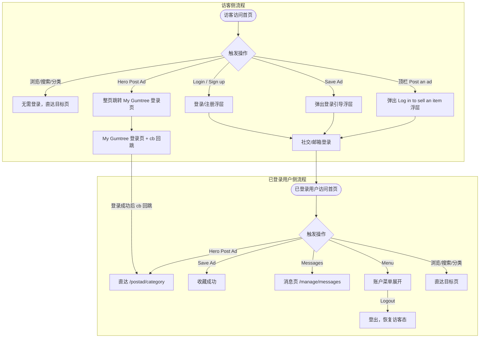
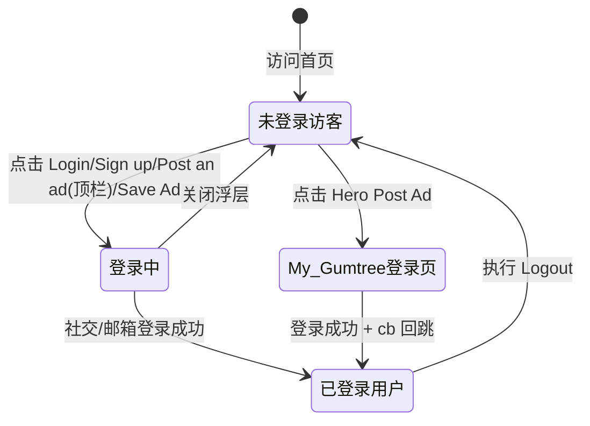

# 首页业务域 - 业务全景

## 1. 业务定位

首页业务域是 Gumtree UK Unicorn 站的核心流量入口，为访客和已登录用户提供商品浏览、关键词搜索、分类导航及发帖/注册引导等服务。

**业务价值**：
- 为访客提供无需登录即可浏览和搜索商品的能力，降低访问门槛
- 为未登录用户提供明确的发帖/注册引导路径，驱动用户转化
- 为已登录用户提供快速发帖、收藏和账户管理的统一入口

**目标用户**：
- **访客（未登录）**：可浏览、搜索、查看分类；发帖/收藏时触发登录引导
- **已登录用户**：完整功能访问，包括直接发帖、收藏商品、账户管理

## 2. 业务范围

### 2.1 功能覆盖

| 功能模块 | 说明 | 核心能力 |
|---------|------|---------|
| 顶栏导航 | 根据登录状态展示不同操作入口 | 权限分级显示；双路径发帖引导 |
| Hero 区 | 首屏核心展示区 | 品牌主文案、统计数字、Post Ad 入口 |
| 主搜索 | 全站关键词搜索 | 无需登录；默认地区 United Kingdom |
| 热门分类 | Discover popular categories | UTM 追踪；导航至分类结果页 |
| Good Finds 列表 | 精选商品展示 | 含价格、地区、时间、Save Ad；登录拦截收藏 |
| 卖车推广区 | Looking to sell your car? | Enter reg 输入框 + Sell now |
| 页脚 | 合规链接与应用下载 | Terms of Use、Privacy Notice、Cookies Policy |
| Top Locations | 地区导航 | 快速进入 London、Manchester 等地区结果页 |
| 登录/注册浮层 | 认证引导 | 社交登录（Apple/Google/Facebook）+ 邮箱登录；Terms of use 合规 |
| Cookie 横幅 | OneTrust 合规 | Accept all / Reject non-essential / Manage options |

### 2.2 地域覆盖
- **Unicorn 站（UK 测试站）**：`www.unicorn.gumtree.io`，对应正式站 Gumtree UK

### 2.3 用户角色

| 角色 | 权限 | 说明 |
|-----|------|------|
| 访客（未登录） | 浏览、搜索、分类导航 | 发帖/收藏时触发登录引导浮层或跳转 |
| 已登录用户 | 完整功能 | 直接发帖、收藏、账户菜单 |
| 已登录 Pro 用户 | 含 Manage my Job Ads | 可访问 recruiters.gumtree.com |

## 3. 业务流程全景图



## 4. 核心业务流程概览

### 4.1 首页访问与浏览流程
**业务目标**：用户访问首页后，根据登录状态完成浏览、搜索、分类导航及发帖/收藏操作，实现流量入口到业务转化。

**核心步骤**：
1. 访问首页，加载 Hero、热门分类、Good Finds 列表
2. 系统根据登录状态渲染顶栏（访客态 vs 已登录态）
3. 用户选择操作：浏览列表、关键词搜索、点击热门分类
4. 未登录用户触发发帖/收藏时，系统弹出登录引导（浮层或整页跳转）
5. 已登录用户可直接发帖、收藏、进入账户菜单

**关键观测点**：
- ✅ 页面标题「Gumtree | Free classified ads from the #1 classifieds site in the UK」
- ✅ H1「Free local classifieds」，H2「One place for all your Ads」
- ✅ 未登录顶栏：Post an ad、Sign up、Login（无 Messages/Menu）
- ✅ 已登录顶栏：Post an ad、Messages、Menu（无 Login/Sign up）
- ✅ 顶栏「Post an ad」（未登录）→ 弹出浮层，URL 不变
- ✅ Hero「Post Ad」（未登录）→ 整页跳转，URL 含 cb 参数
- ✅ 「Save Ad」（未登录）→ 弹出登录浮层
- ✅ 主搜索无需登录即可使用

**详细流程文档**：[首页访问与浏览业务流程.md](./首页访问与浏览业务流程.md)

---

## 5. 页面拓扑关系

### 5.1 页面入口矩阵

| 页面 | 入口1 | 入口2 | 入口3 | 入口4 |
|-----|------|------|------|------|
| 首页 | 直接访问 URL | Logo 点击（子页返回） | 浏览器后退 | - |
| 搜索结果页 | 首页主搜索框 | - | - | - |
| 分类页 | 热门分类卡片（含 UTM） | 主导航分类链接 | - | - |
| My Gumtree 登录页 | Hero「Post Ad」（未登录） | - | - | - |
| 发帖类目页 /postad/category | Hero「Post Ad」（已登录） | My Gumtree 登录后 cb 回跳 | - | - |
| 登录/注册浮层 | 顶栏「Login」 | 顶栏「Sign up」 | 顶栏「Post an ad」（未登录） | 「Save Ad」（未登录） |
| /termsofuse | Sign up 浮层 Terms of use 链接 | 页脚 Terms of Use | - | - |
| 消息页 /manage/messages | 已登录顶栏「Messages」 | 已登录 Menu「Messages」 | - | - |
| recruiters.gumtree.com | 已登录 Menu「Manage my Job Ads」 | - | - | - |

### 5.2 页面跳转流程图

```mermaid
graph LR
    Home[首页] -->|主搜索| Search[搜索结果页]
    Home -->|热门分类/主导航| Category[分类页]
    Home -->|Hero Post Ad 未登录| MyGT[My Gumtree 登录页]
    Home -->|Hero Post Ad 已登录| PostAd[发帖类目页]
    Home <-->|Logo 点击| SubPage[子页面]
    MyGT -->|cb 回跳| PostAd
    Home -->|Login/Sign up/Post an ad未登录/Save Ad未登录| Modal[登录注册浮层]
    Modal -->|Terms of use| Terms[/termsofuse]
    Home -->|Messages 已登录| Messages[消息页]
    Home -->|Menu Manage my Job Ads| JobAds[recruiters.gumtree.com]
```

### 5.3 页面关系详解

#### 首页 → My Gumtree 登录页
- **入口**：Hero 区「Post Ad」按钮（未登录状态）
- **目标**：`https://my.unicorn.gumtree.io/login`
- **参数**：`cb=https%3A%2F%2Fwww.unicorn.gumtree.io%2Fpostad%2Fcategory`
- **权限**：仅未登录用户触发；已登录用户直达 `/postad/category`
- **特点**：整页跳转（非浮层），跨子域（www → my）

#### 首页 → 发帖类目页（已登录）
- **入口**：Hero 区「Post Ad」按钮（已登录状态）
- **目标**：`https://www.unicorn.gumtree.io/postad/category`
- **权限**：仅已登录用户直达；未登录用户跳转 My Gumtree 登录页

#### 首页 → 搜索结果页
- **入口**：主搜索框输入关键词并提交
- **目标**：搜索结果页
- **参数**：`q=<关键词>`、`search_location=United%20Kingdom`
- **权限**：无需登录

#### 首页 → 分类页
- **入口**：热门分类卡片 / 主导航分类链接
- **目标**：对应分类结果页
- **参数**（热门分类）：`utm_source=featured_categories`、`utm_campaign=<分类>`、`search_location=United%20Kingdom`
- **权限**：无需登录

#### 首页 → 登录/注册浮层
- **入口**：顶栏「Login」、顶栏「Sign up」、顶栏「Post an ad」（未登录）、「Save Ad」（未登录）
- **目标**：模态浮层（不离开首页）
- **特点**：四种登录方式（Apple/Google/Facebook/email）；Sign up 含 Terms of use 合规链接

## 6. 业务数据流转

### 6.1 用户登录状态流转



### 6.2 用户操作与数据变化

| 操作 | 数据变化 | 前台展示变化 | 涉及页面 |
|-----|---------|------------|---------|
| 登录成功 | 用户会话建立 | 顶栏从访客态切换为已登录态（Messages/Menu 出现） | 首页顶栏 |
| 点击 Hero Post Ad（未登录） | 无 | 整页跳转至 My Gumtree 登录页 | 首页 → My Gumtree |
| 点击顶栏 Post an ad（未登录） | 无 | 弹出「Log in to sell an item」浮层，URL 不变 | 首页浮层 |
| 点击 Save Ad（未登录） | 无 | 弹出登录引导浮层，URL 不变 | 首页浮层 |
| 点击 Save Ad（已登录） | 收藏记录新增 | Save Ad 按钮状态变更（⚠️ 推断） | 首页 Good Finds 区 |
| 主搜索提交 | 无 | 跳转搜索结果页，URL 含 q 和 search_location | 首页 → 搜索结果页 |
| 点击热门分类 | 无 | 跳转分类页，URL 含 UTM 参数 | 首页 → 分类页 |
| Logout | 用户会话销毁 | 顶栏恢复访客态（Login/Sign up 出现） | 首页顶栏 |

### 6.3 关键业务数据

#### 搜索参数
| 字段 | 类型 | 必填 | 说明 |
|-----|------|-----|------|
| q | String | 否 | 搜索关键词 |
| search_location | String | 否 | 默认 United%20Kingdom |

#### 发帖回跳参数
| 字段 | 类型 | 必填 | 说明 |
|-----|------|-----|------|
| cb | String（URL 编码） | 是（未登录发帖时） | 登录成功后回跳目标 URL |

#### 热门分类 UTM 参数
| 字段 | 类型 | 必填 | 说明 |
|-----|------|-----|------|
| utm_source | String | 是 | 固定值 featured_categories |
| utm_campaign | String | 是 | 分类标识（如 cars） |
| search_location | String | 否 | 默认 United%20Kingdom |

## 7. 关键业务规则索引

### 7.1 权限与访问控制
- [首页访问与浏览规则.md - 3.3 权限规则](../../../业务规则库/buyer/首页模块/首页访问与浏览规则.md#33-权限规则)

### 7.2 发帖引导双路径
- [首页访问与浏览规则.md - 3.4 业务约束](../../../业务规则库/buyer/首页模块/首页访问与浏览规则.md#34-业务约束)

### 7.3 登录表单校验
- [首页访问与浏览规则.md - 4. 错误处理](../../../业务规则库/buyer/首页模块/首页访问与浏览规则.md#4-错误处理)

### 7.4 合规（Sign up 条款 / Cookie 横幅）
- [首页访问与浏览规则.md - 3.4 业务约束](../../../业务规则库/buyer/首页模块/首页访问与浏览规则.md#34-业务约束)

## 8. 业务FAQ

### Q1: 未登录用户点击顶栏「Post an ad」和 Hero「Post Ad」有什么区别？
**A**: 顶栏「Post an ad」弹出「Log in to sell an item」浮层，用户留在首页；Hero「Post Ad」整页跳转至 `my.unicorn.gumtree.io/login` 并携带 `cb` 回跳参数，登录成功后自动跳回发帖类目页。

### Q2: 未登录用户可以搜索商品吗？
**A**: 可以。主搜索功能无需登录，提交后直接进入搜索结果页，URL 默认携带 `search_location=United%20Kingdom`。

### Q3: 未登录用户点击「Save Ad」会发生什么？
**A**: 弹出登录引导浮层（含社交登录和邮箱登录选项），不执行收藏操作，当前 URL 不变。

### Q4: 热门分类点击的 URL 与主导航点击有何不同？
**A**: 热门分类卡片点击携带 UTM 追踪参数（`utm_source=featured_categories`、`utm_campaign=<分类>`），主导航点击不带 UTM。两者落地页内容一致。

### Q5: Sign up 浮层的合规要求是什么？
**A**: 底部必须展示「By Signing up you agree to the Terms of use and Privacy notice」，其中 Terms of use 为可点击链接，点击后在新标签页打开 `/termsofuse`。

### Q6: Cookie 横幅在什么情况下会出现？
**A**: 在全新浏览器配置（无站点 Cookie）下访问首页时，可能出现 OneTrust 横幅「We Care About Your Privacy」，提供 Accept all / Reject non-essential / Manage options 选项。已保存同意记录的会话不会出现。

### Q7: 登录浮层支持哪些登录方式？
**A**: 支持 Continue with Apple、Continue with Google、Continue with Facebook、Continue with email 四种方式，均有 Close 关闭按钮。

### Q8: 已登录用户 Menu 包含哪些项目？
**A**: Manage my Ads、My Orders、Messages、Favourites、My Alerts、My Details、Manage my Job Ads（外链到 recruiters.gumtree.com）、Help & Contact、Logout。

### Q9: 登录后 Hero「Post Ad」跳转至哪里？
**A**: 已登录用户点击 Hero「Post Ad」直达 `https://www.unicorn.gumtree.io/postad/category`，页面标题「Post an ad | Gumtree.com」。

### Q10: Logout 后用户界面会如何变化？
**A**: 顶栏恢复访客态，显示 Post an ad、Sign up、Login，不显示 Messages、Menu，行为与 TC002 未登录状态一致。

## 9. 业务指标（可选）

### 9.1 核心指标
- **首页 DAU**：600K（首页 Hero 展示值，待与实际埋点数据对齐）
- **日新增广告**：30K（首页 Hero 展示值）

### 9.2 漏斗指标
- **访客发帖转化漏斗**：访问首页 → 点击 Post Ad → 触发登录引导 → 完成登录 → 发帖成功
- **访客注册转化漏斗**：访问首页 → 点击 Sign up → 完成注册

## 10. 已知问题与风险

### 10.1 产品待确认问题
1. **Cookie 横幅触发条件**：Unicorn 测试站本次未出现 OneTrust 横幅，需确认是已保存同意状态还是地区策略关闭（TC011）
2. **空关键词搜索行为**：搜索框为空时点击搜索按钮的预期行为未定义（TC015）
3. **特殊字符搜索**：输入 `%`、`*` 或超长字符串时的处理逻辑未确认（TC016）
4. **已登录 Save Ad 成功态**：收藏后按钮状态变更的具体 UI 展示未实测（TC037）

### 10.2 技术风险
- Hero「Post Ad」（未登录）跨子域跳转（`www` → `my`）可能受 Cookie SameSite 策略影响
- UTM 参数若丢失会影响流量来源统计，需监控热门分类入口 UTM 完整性

### 10.3 测试过程中发现的问题
- Save Ad 浮层无障碍快照中标题节点无文本（TC006 ⚠️），可能影响屏幕阅读器用户
- 登录浮层 Continue 按钮 disabled 态、错误密码提示仅为 Gaga 站推断，需在 Unicorn 站实测确认（TC012、TC013）

## 11. 变更历史

| 日期 | 版本 | 变更内容 | 变更人 |
|-----|------|---------|--------|
| 2026-04-16 | v1.0 | 初始版本，基于 unicorn-homepage-测试用例-20260410.md（39条用例）归档 | Arin Yang |
