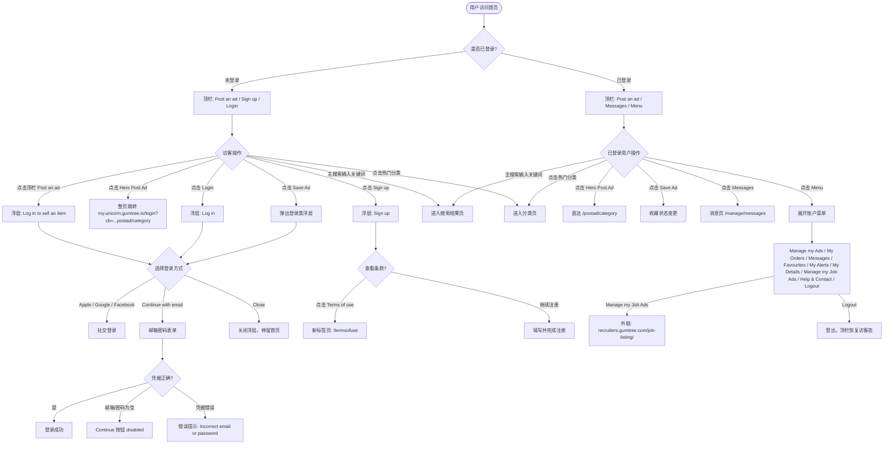

# 首页访问与浏览业务流程

> **业务目标**：访客或已登录用户通过首页完成浏览、搜索、分类导航、发帖引导和收藏等核心操作，达成从流量入口到业务转化的第一步。

---

## 1. 完整流程图

---

## 2. 详细步骤与观测点

### 步骤1：首页加载
**页面位置**：https://www.unicorn.gumtree.io/

**操作**：
1. 打开首页 URL

**观测点**：
- ✅ 页面标题「Gumtree | Free classified ads from the #1 classifieds site in the UK」
- ✅ H1「Free local classifieds」
- ✅ H2「One place for all your Ads」
- ✅ Hero 区展示「600K DAILY ACTIVE USERS」、「30K DAILY NEW ADS」
- ⚠️ 全新会话/无 Cookie 时，可能出现 OneTrust Cookie 横幅：「We Care About Your Privacy」+ Accept all / Reject non-essential / Manage options（本次测试未出现，待补测）

**验证方法**：
- 断言 `document.title` 包含「Gumtree」和「free classified ads」
- 断言 H1 文本为「Free local classifieds」
- 断言 Hero 统计数字文案存在

**关联规则**：[首页访问与浏览规则.md - 3.4 业务约束](../../../业务规则库/buyer/首页模块/首页访问与浏览规则.md#34-业务约束)

---

### 步骤2：顶栏权限识别（未登录）
**页面位置**：首页顶栏

**操作**：
1. 清除 Cookie 或使用无痕模式访问首页
2. 查看顶栏右侧区域

**观测点**：
- ✅ 可见「Post an ad」、「Sign up」、「Login」
- ✅ 不可见「Messages」、「Menu」
- ✅ 与已登录态顶栏形成明确区别

**验证方法**：
- 断言存在「Post an ad」、「Sign up」、「Login」元素
- 断言不存在「Messages」、「Menu」元素

**关联规则**：[首页访问与浏览规则.md - 3.3 权限规则](../../../业务规则库/buyer/首页模块/首页访问与浏览规则.md#33-权限规则)

---

### 步骤3：未登录发帖引导 — 顶栏路径
**页面位置**：首页顶栏

**操作**：
1. 点击顶栏「Post an ad」

**观测点**：
- ✅ 不离开首页（URL 不变，仍为首页地址）
- ✅ 弹出浮层，标题「Log in to sell an item」
- ✅ 浮层提供 Continue with Apple / Google / Facebook / Continue with email
- ✅ 浮层提供 Close 关闭按钮
- ✅ 与 Hero「Post Ad」整页跳转行为不同

**验证方法**：
- 点击后断言当前 URL 仍为首页
- 断言浮层标题文本为「Log in to sell an item」
- 断言四种登录方式按钮可见

**关联规则**：[首页访问与浏览规则.md - 3.4 业务约束](../../../业务规则库/buyer/首页模块/首页访问与浏览规则.md#34-业务约束)

---

### 步骤4：未登录发帖引导 — Hero 路径
**页面位置**：首页 Hero 区

**操作**：
1. 点击 Hero 区域「Post Ad」按钮

**观测点**：
- ✅ 整页跳转至 `https://my.unicorn.gumtree.io/login`
- ✅ Query 参数 `cb` 包含 `https://www.unicorn.gumtree.io/postad/category`（URL 编码形式：`postad%2Fcategory`）
- ✅ 落地页标题「Login | My Gumtree - Gumtree」
- ✅ 与顶栏「Post an ad」浮层拦截行为明确不同

**验证方法**：
- 断言跳转后 URL 含 `my.unicorn.gumtree.io/login`
- 断言 URL query 参数 `cb` 存在且包含 `postad%2Fcategory`
- 断言落地页标题

**关联规则**：[首页访问与浏览规则.md - 3.4 业务约束](../../../业务规则库/buyer/首页模块/首页访问与浏览规则.md#34-业务约束)

---

### 步骤5：登录浮层交互
**页面位置**：首页登录浮层

**操作**：
1. 点击顶栏「Login」按钮
2. 查看浮层内容及表单行为

**观测点**：
- ✅ 浮层二级标题「Log in」
- ✅ 文案「Don't have an account?」+ 「Sign up」按钮
- ✅ 提供 Continue with Apple / Google / Facebook / Continue with email 四种方式
- ✅ 提供 Close 关闭按钮
- ❌ 邮箱/密码为空时，Continue 按钮为 disabled（⚠️ 推断，Gaga 站实测一致）
- ❌ 输入错误凭据后显示「Incorrect email address or password. Check your details and try again.」（⚠️ 推断）
- ⚠️ 「Forgot password?」入口指向找回密码流程（未实测）

**验证方法**：
- 断言浮层标题为「Log in」
- 选择「Continue with email」后，表单为空时断言 Continue 按钮 disabled
- 输入错误账密后断言错误提示文案

**关联规则**：[首页访问与浏览规则.md - 4. 错误处理](../../../业务规则库/buyer/首页模块/首页访问与浏览规则.md#4-错误处理)

---

### 步骤6：注册浮层与合规校验
**页面位置**：首页注册浮层

**操作**：
1. 点击「Sign up」打开注册浮层
2. 查看底部条款链接
3. 点击「Terms of use」

**观测点**：
- ✅ 浮层标题「Sign up」
- ✅ 文案「Already got an account?」+ 「Log in」
- ✅ 底部含「By Signing up you agree to the Terms of use and Privacy notice」
- ✅ Terms of use 链接点击后在新标签页打开 `https://www.unicorn.gumtree.io/termsofuse`

**验证方法**：
- 断言浮层标题为「Sign up」
- 断言条款文案可见
- 点击 Terms of use 后断言新标签页 URL 为 `/termsofuse`

**关联规则**：[首页访问与浏览规则.md - 3.4 业务约束](../../../业务规则库/buyer/首页模块/首页访问与浏览规则.md#34-业务约束)

---

### 步骤7：未登录收藏拦截（Save Ad）
**页面位置**：Good Finds 列表区

**操作**：
1. 点击任意商品卡片上的「Save Ad」按钮

**观测点**：
- ✅ 仍在首页 URL，不跳转
- ✅ 弹出登录类浮层（含「Don't have an account? Sign up」、「Continue with email」等）
- ✅ 未执行收藏操作

**验证方法**：
- 点击后断言当前 URL 不变
- 断言登录类浮层出现

**关联规则**：[首页访问与浏览规则.md - 3.3 权限规则](../../../业务规则库/buyer/首页模块/首页访问与浏览规则.md#33-权限规则)

---

### 步骤8：主搜索（未登录可用）
**页面位置**：首页搜索框

**操作**：
1. 在「Type search query」输入关键词（如 `bike`）
2. 点击搜索按钮

**观测点**：
- ✅ 无需登录，直接进入搜索结果页
- ✅ 结果页 URL 含 `q=bike`、`search_location=United%20Kingdom`
- ✅ 结果页标题格式：「[关键词] | [分类] For Sale - Gumtree」（如「Bike | Other Bikes For Sale - Gumtree」）
- ⚠️ 空关键词搜索行为待确认（未实测）
- ⚠️ 特殊字符（%、*）或超长字符串搜索行为待确认（未实测）

**验证方法**：
- 输入关键词并提交，断言跳转 URL 含 `q=` 和 `search_location`
- 断言结果页标题符合格式

**关联规则**：[首页访问与浏览规则.md - 3.3 权限规则](../../../业务规则库/buyer/首页模块/首页访问与浏览规则.md#33-权限规则)

---

### 步骤9：热门分类导航
**页面位置**：首页「Discover popular categories」区块

**操作**：
1. 点击任意分类卡片（如「Cars & Vehicles」）

**观测点**：
- ✅ URL 携带 `utm_source=featured_categories`、`utm_campaign=<分类>`、`search_location=United%20Kingdom`
- ✅ Cars & Vehicles 落地页标题：「Used Cars for Sale Across the UK | Gumtree」
- ✅ 热门分类与主导航点击同一分类，落地页结果一致
- ⚠️ 其他分类（Home & Garden、Tradespeople、Baby & Kids、Fashion、Sports & Leisure、Computers、Properties）落地页 URL 推断（未单独实测）

**验证方法**：
- 点击后断言 URL 含 `utm_source=featured_categories`
- 断言落地页标题

**关联规则**：[首页访问与浏览规则.md - 3.4 业务约束](../../../业务规则库/buyer/首页模块/首页访问与浏览规则.md#34-业务约束)

---

### 步骤10：Good Finds 列表内容结构
**页面位置**：首页「Discover more Good Finds」区块

**操作**：
1. 查看商品卡片字段
2. 核查区块标题与地区标签

**观测点**：
- ✅ 卡片包含：图片、标题、£ 价格、地区、发布时间、「Save Ad」按钮
- ✅ 部分卡片含「SPOTLIGHT」标签
- ✅ 部分卡片含「Delivery available」标签
- ⚠️ 区块标题「Discover more Good Finds」，地区「United Kingdom」（推断）

**验证方法**：
- 断言卡片关键字段（价格、地区、Save Ad 按钮）存在

**关联规则**：[首页访问与浏览规则.md - 3.4 业务约束](../../../业务规则库/buyer/首页模块/首页访问与浏览规则.md#34-业务约束)

---

### 步骤11：已登录顶栏与账户菜单
**页面位置**：首页顶栏（已登录态）

**操作**：
1. 使用有效账号登录后访问首页
2. 查看顶栏
3. 点击「Menu」

**观测点**：
- ✅ 顶栏显示「Messages」（链接 `/manage/messages`）、「Menu」
- ✅ 不显示「Login」、「Sign up」
- ✅ Menu 展开后含：Manage my Ads、My Orders、Messages、Favourites、My Alerts、My Details、Manage my Job Ads、Help & Contact、Logout
- ✅ Manage my Job Ads 外链指向 `https://recruiters.gumtree.com/job-listing/`
- ✅ 点击 Hero「Post Ad」直达 `https://www.unicorn.gumtree.io/postad/category`，标题「Post an ad | Gumtree.com」
- ⚠️ Logout 后顶栏恢复访客态（Login、Sign up）（推断，与步骤2一致）

**验证方法**：
- 断言顶栏存在 Messages、Menu 元素
- 断言不存在 Login、Sign up 元素
- 展开 Menu 断言各菜单项存在

**关联规则**：[首页访问与浏览规则.md - 3.3 权限规则](../../../业务规则库/buyer/首页模块/首页访问与浏览规则.md#33-权限规则)

---

## 3. 流程完整性验证清单

- [ ] 首页标题「Gumtree | Free classified ads from the #1 classifieds site in the UK」正确
- [ ] H1「Free local classifieds」存在
- [ ] H2「One place for all your Ads」存在
- [ ] Hero 区统计数字「600K DAILY ACTIVE USERS」、「30K DAILY NEW ADS」展示正确
- [ ] 未登录顶栏显示 Post an ad、Sign up、Login，不显示 Messages、Menu
- [ ] 点击顶栏「Post an ad」（未登录）弹出「Log in to sell an item」浮层，URL 不变
- [ ] 点击 Hero「Post Ad」（未登录）整页跳转至 my.unicorn.gumtree.io/login，URL 含 cb 参数
- [ ] 点击「Login」弹出「Log in」浮层，含 Apple/Google/Facebook/email 四种登录方式
- [ ] 点击「Sign up」浮层含 Terms of use 链接，点击新标签页打开 /termsofuse
- [ ] 点击「Save Ad」（未登录）弹出登录类浮层，URL 不变
- [ ] 未登录主搜索可正常进入结果页，URL 含 q 和 search_location 参数
- [ ] 热门分类点击 URL 含 utm_source=featured_categories 参数
- [ ] Cars & Vehicles 落地页标题「Used Cars for Sale Across the UK | Gumtree」
- [ ] 已登录顶栏显示 Messages、Menu，不显示 Login、Sign up
- [ ] 已登录 Hero「Post Ad」直达 /postad/category
- [ ] Menu 包含 Manage my Job Ads 且链接指向 recruiters.gumtree.com
- [ ] 退出登录后顶栏恢复访客态（Login、Sign up）
- [ ] Cookie 横幅（OneTrust）在全新会话下出现（待补测）
- [ ] 空关键词搜索行为（待补测）
- [ ] 已登录 Save Ad 收藏成功态（待补测）

---

## 4. 关联文档

- [首页业务全景](./首页业务全景.md)
- [首页访问与浏览规则.md](../../../业务规则库/buyer/首页模块/首页访问与浏览规则.md)

---

## 5. 变更历史

| 日期 | 版本 | 变更内容 | 变更人 |
|-----|------|---------|--------|
| 2026-04-16 | v1.0 | 初始版本，基于 unicorn-homepage-测试用例-20260410.md（39条用例）归档 | Arin Yang |
