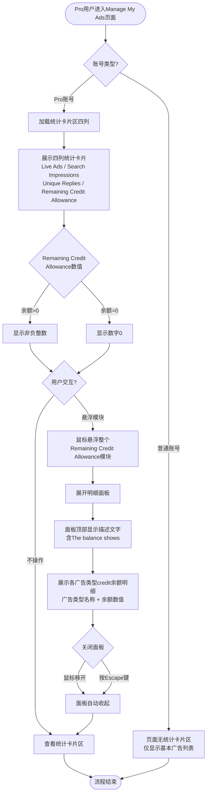

# Remaining Credit Allowance 查看业务流程

> **业务目标**: 让 Pro Account 卖家能够在 Manage My Ads 页面便捷查看账号剩余 credit 余额总量，并通过悬浮交互查看各广告类型的 credit 余额明细，帮助卖家合理规划广告投放预算

---

## 1. 完整流程图

---

## 2. 详细步骤与观测点

### 步骤1：进入 Manage My Ads 页面（权限验证）
**页面位置**: `/manage/ads`

**操作**:
1. 使用 Pro Account 登录系统
2. 导航至 `/manage/ads` 页面
3. 等待页面完整加载

**观测点**:
- ✅ Pro 账号页面顶部显示统计卡片区（含四列）
- ✅ 统计卡片区展示：Live Ads / Search Impressions / Unique Replies / Remaining Credit Allowance
- ❌ 普通账号页面不显示任何统计卡片区（页面布局与 Pro 账号完全不同，仅显示基本广告管理列表）
- ❌ 普通账号页面中 "Remaining Credit Allowance" 标签不可见
- ❌ 普通账号页面中 "Search Impressions" 标签不可见

**验证方法**:
- 验证 Pro 账号统计区可见：`expect(page.getByText('Remaining Credit Allowance')).toBeVisible()`
- 验证四列标签存在：逐一断言 'Live Ads'、'Search Impressions'、'Unique Replies'、'Remaining Credit Allowance' 可见
- 验证普通账号（负向）：使用普通账号登录，断言 `page.getByText('Remaining Credit Allowance')` 不可见
- 验证普通账号（负向）：断言 `page.getByText('The balance shows')` 不存在于页面

**关联规则**: [Remaining Credit Allowance规则.md - 3.3 权限规则](../../业务规则库/商业表现看板模块/Remaining%20Credit%20Allowance规则.md#33-权限规则)

---

### 步骤2：查看 Remaining Credit Allowance 统计卡片标签与数值
**页面位置**: `/manage/ads` - 统计卡片区第四列

**操作**:
1. 定位统计区 "Remaining Credit Allowance" 卡片
2. 观察标签文字与数值显示

**观测点**:
- ✅ 标签文字精确包含 "Remaining Credit Allowance"，无拼写错误
- ✅ 统计区数值为**非负整数**（≥ 0），格式为整数
- ❌ 数值不出现负数、小数、"-"、"N/A"、空白等异常格式
- ✅ 统计区四列按顺序展示（列序：Live Ads → Search Impressions → Unique Replies → Remaining Credit Allowance）

**验证方法**:
- 验证标签可见：`expect(page.getByText('Remaining Credit Allowance')).toBeVisible()`
- 验证标签文字精确匹配：`expect(element).toContainText('Remaining Credit Allowance')`
- 验证数值格式：提取数值字符串，使用正则 `/^\d+$/` 验证为非负整数
- 验证四列完整性：断言四个标签均在统计区内可见

**关联规则**: [Remaining Credit Allowance规则.md - 3.1 输入规则](../../业务规则库/商业表现看板模块/Remaining%20Credit%20Allowance规则.md#31-输入规则统计区数据展示)

---

### 步骤3：悬浮模块展开明细面板
**页面位置**: `/manage/ads` - Remaining Credit Allowance 统计卡片

**操作**:
1. 确认 "Remaining Credit Allowance" 模块可见且明细面板处于收起状态
2. 将鼠标悬浮（hover）在整个 Remaining Credit Allowance 模块上
3. 等待明细面板展开

**观测点**:
- ✅ 悬浮后明细面板展开（无需点击）
- ✅ 面板包含描述文字，含关键词 **"The balance shows"**
- ✅ 面板展示至少一行广告类型数据（广告类型名称 + 对应余额数值）
- ✅ 数据行格式：左侧为广告类型名称，右侧为余额数值
- ⚠️ 面板触发方式为悬浮（与 Figma 设计的点击 ⓘ 图标触发不同，ⓘ 图标已从 UI 中移除）

**验证方法**:
- 触发悬浮：`page.locator('[data-testid="remaining-credit-allowance"]').hover()`
- 验证面板可见：`expect(page.getByText('The balance shows')).toBeVisible()`
- 验证明细行存在：断言面板中包含至少一个广告类型 + 余额数据行

**关联规则**: [Remaining Credit Allowance规则.md - 3.4 业务约束](../../业务规则库/商业表现看板模块/Remaining%20Credit%20Allowance规则.md#34-业务约束)

---

### 步骤4：验证明细面板内容正确性
**页面位置**: `/manage/ads` - Remaining Credit Allowance 明细面板（悬浮展开状态）

**操作**:
1. 保持鼠标悬浮在模块上，明细面板处于展开状态
2. 观察面板内容结构与数据

**观测点**:
- ✅ 面板顶部显示描述文字，包含 **"The balance shows"**
- ✅ 面板包含至少一行广告类型数据
- ✅ 每行数据格式：左侧为广告类型名称，右侧为余额数值
- ✅ 面板中总值（Remaining Credit Allowance）与统计卡片区显示的数值一致
- ⚠️ 各细分广告类型的余额数值与总值无严格数学关系（细分值可大于或小于总值），属正常业务逻辑
- ⚠️ 面板内容为动态 credit 分配明细，具体行数和内容因账号而异（实测账号存在 28 行数据）

**验证方法**:
- 验证描述文字：`expect(page.getByText('The balance shows')).toBeVisible()`
- 验证数值一致性：读取统计卡片区数值 N，验证面板中包含相同数值 N
- 验证数值格式：明细中各余额数值符合非负整数格式

**关联规则**: [Remaining Credit Allowance规则.md - 3.2 校验规则](../../业务规则库/商业表现看板模块/Remaining%20Credit%20Allowance规则.md#32-校验规则)

---

### 步骤5：鼠标移开后明细面板自动收起
**页面位置**: `/manage/ads` - Remaining Credit Allowance 明细面板

**操作**:
1. 确认明细面板处于展开状态
2. 将鼠标移至页面其他安全区域（远离面板，如页面顶部或安全坐标）
3. 观察面板收起行为

**观测点**:
- ✅ 鼠标移开后明细面板自动关闭/消失
- ✅ 页面恢复正常状态，不影响其他元素
- ❌ 不触发任何意外导航（如跳转至首页或其他页面）
- ⚠️ 关闭操作使用 `Escape` 键或 `page.mouse.move()` 移至安全坐标，禁止使用点击操作（防止误触链接导致页面跳转）

**验证方法**:
- 关闭面板（推荐方式1）：按 `Escape` 键后验证面板不可见
- 关闭面板（推荐方式2）：`page.mouse.move(0, 0)` 移至安全坐标后验证面板不可见
- 验证无意外导航：关闭面板后断言 URL 仍为 `/manage/ads`
- 验证面板收起：`expect(page.getByText('The balance shows')).not.toBeVisible()`

**关联规则**: [Remaining Credit Allowance规则.md - 3.4 业务约束](../../业务规则库/商业表现看板模块/Remaining%20Credit%20Allowance规则.md#34-业务约束)

---

### 步骤6：数据刷新提示信息验证
**页面位置**: `/manage/ads` - 统计数据区域底部

**操作**:
1. 定位统计数据区域底部的刷新提示信息
2. 查看提示文字内容

**观测点**:
- ✅ 显示数据刷新提示文字，包含关键词 **"refresh"**
- ✅ 实际文案：`"We refresh the data daily"`
- ✅ 提示信息在统计区下方可见
- ⚠️ 文案与原 Figma 设计不同（原为 `"We update the data every morning at 8 a.m., but sometimes it may be delayed."`，且无 ⓘ 图标前缀）
- ⚠️ 待确认：`"We refresh the data daily"` 以哪个时区为准

**验证方法**:
- 验证刷新提示可见：`expect(page.getByText('refresh')).toBeVisible()`
- 验证精确文案：`expect(page.getByText('We refresh the data daily')).toBeVisible()`

**关联规则**: [Remaining Credit Allowance规则.md - 3.2 校验规则](../../业务规则库/商业表现看板模块/Remaining%20Credit%20Allowance规则.md#32-校验规则)

---

### 步骤7：页面刷新后数据一致性（人工验证）
**页面位置**: `/manage/ads`

**操作**:
1. 记录页面上 "Remaining Credit Allowance" 显示的数值（设为 N）
2. 刷新浏览器（F5 / Cmd+R）
3. 页面重新加载后，再次查看 "Remaining Credit Allowance" 数值

**观测点**:
- ✅ 刷新后数值与刷新前相同（= N）
- ✅ 不出现数据闪烁或短暂显示错误值
- ✅ 页面加载期间统计区有适当的 loading 状态（骨架屏或 spinner）
- ⚠️ 若在数据更新时间点前后刷新，数据可能因数据源更新而变化，属正常现象

**验证方法**:
- 此用例依赖数据一致性，受数据更新时机影响，建议人工执行
- 人工记录刷新前数值，刷新后对比验证

**关联规则**: [Remaining Credit Allowance规则.md - 3.4 业务约束](../../业务规则库/商业表现看板模块/Remaining%20Credit%20Allowance规则.md#34-业务约束)

---

## 3. 流程完整性验证清单

- [ ] Pro 账号进入 `/manage/ads` 后统计卡片区可见
- [ ] 统计卡片区展示四列：Live Ads / Search Impressions / Unique Replies / Remaining Credit Allowance
- [ ] "Remaining Credit Allowance" 标签文字精确展示，无拼写错误
- [ ] 统计区数值为非负整数（≥ 0），不出现负数、小数、"-"、"N/A"
- [ ] 悬浮 Remaining Credit Allowance 模块后明细面板展开（无需点击）
- [ ] 明细面板顶部含描述文字 "The balance shows"
- [ ] 明细面板中至少包含一行广告类型 + 余额数据
- [ ] 明细面板中数值与统计卡片区数值一致
- [ ] 鼠标移开后明细面板自动收起
- [ ] 面板收起后不触发意外导航，URL 保持 `/manage/ads`
- [ ] 统计区下方显示数据刷新提示，文案含 "refresh"
- [ ] 精确文案为 "We refresh the data daily"
- [ ] 普通账号 Manage My Ads 页面不显示 "Remaining Credit Allowance" 标签
- [ ] 普通账号页面不显示 "Search Impressions" 标签
- [ ] 普通账号页面 "The balance shows" 文字不存在

---

## 4. 关联文档

- [商业表现看板业务全景](./商业表现看板业务全景.md)
- [Remaining Credit Allowance规则.md](../../业务规则库/商业表现看板模块/Remaining%20Credit%20Allowance规则.md)
- [商业表现看板规则.md](../../业务规则库/商业表现看板模块/商业表现看板规则.md)

---

## 5. 变更历史

| 日期 | 版本 | 变更内容 | 变更人 |
|-----|------|---------|--------|
| 2026-04-15 | v1.0 | 基于 TC_total_replies.md（12条测试用例）提取业务流程，涵盖权限验证、统计卡片展示、悬浮交互、明细面板内容、面板收起、数据刷新提示、数据一致性等7个关键步骤 | AI Agent |
