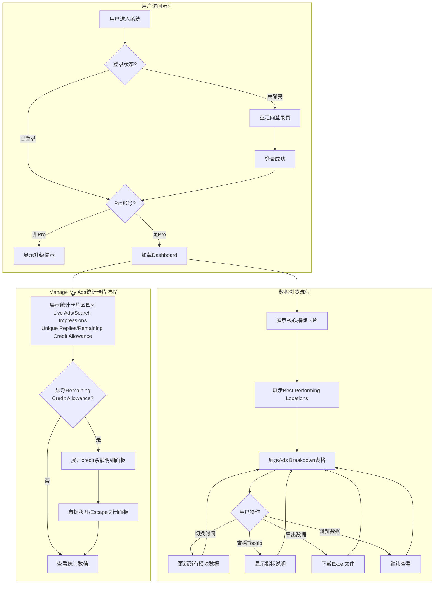
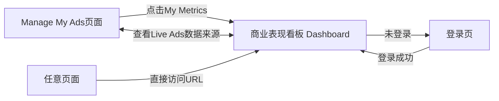
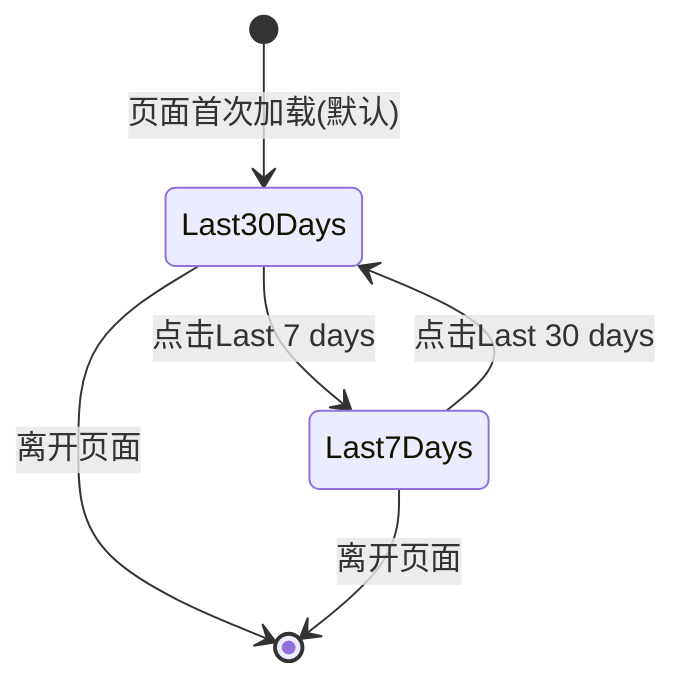

# 商业表现看板业务域 - 业务全景

## 1. 业务定位

商业表现看板业务域是 Gumtree 的核心数据产品之一,为 Pro Account 卖家提供广告表现数据的可视化分析和商业收益洞察服务。

**业务价值**:
- 为 Pro 卖家提供商业收益表现监控能力,帮助了解广告效果并优化广告标题、价格、图片等要素
- 为平台运营提供用户行为数据,指导产品迭代和功能优化
- 通过数据驱动决策,提升广告转化率和平台交易效率

**目标用户**:
- **Pro Account 卖家**: 付费用户,需要通过数据分析了解商业收益表现并优化广告投放策略
- **平台运营人员**: 通过用户数据分析产品使用情况和改进方向

## 2. 业务范围

### 2.1 功能覆盖
| 功能模块 | 说明 | 核心能力 |
|---------|------|---------|
| 核心指标看板 | 展示广告表现的关键指标 | Search Views, Ad Views, Unique Replies, New Ads, Reposted Ads, Conversion Rates |
| 时间筛选器 | 支持按时间范围筛选数据 | Last 7 days, Last 30 days |
| 地理位置分析 | 展示买家回复的地理分布 | Best Performing Locations 降序列表 |
| 广告明细表 | 展示每条广告的详细指标 | Ads Breakdown 表格(可排序、可导出) |
| 数据导出 | 支持导出广告明细数据 | 生成 Excel 文件(.xlsx) |
| 埋点分析 | 记录用户行为用于产品优化 | dashboard_view, time_range_change, download_click 等事件 |
| Remaining Credit Allowance | Manage My Ads 页面 Pro 专属统计卡片，展示账号剩余 credit 余额及各广告类型明细 | 统计卡片展示总余额；鼠标悬浮触发明细面板，展示各广告类型 credit 余额 |

### 2.2 地域覆盖
- **UK 站点**: 支持所有UK地区的广告数据统计和地理位置分析

### 2.3 用户角色
| 角色 | 权限 | 说明 |
|-----|------|------|
| Pro Account 卖家 | 查看自己账号的广告数据、切换时间范围、导出数据 | 付费用户,核心使用群体 |
| 非Pro账号 | 无权访问 | 显示升级提示 |
| 未登录用户 | 无权访问 | 重定向至登录页 |
| 多账号UID用户 | 切换查看不同账号数据 | 通过 Account Switcher 切换 |

## 3. 业务流程全景图

## 4. 核心业务流程概览

### 4.1 Dashboard 访问与权限验证流程
**业务目标**: 确保仅 Pro Account 用户能访问商业表现看板 Dashboard,保护数据隐私并引导非Pro用户升级

**核心步骤**:
1. 用户从侧边栏点击"My Metrics"或直接访问 URL
2. 系统验证用户登录状态(未登录则重定向)
3. 系统验证用户是否为 Pro Account
4. Pro用户正常加载页面,非Pro用户显示升级提示
5. 触发 `dashboard_view` 埋点事件

**关键观测点**:
- ✅ 侧边栏"My Metrics"仅对Pro用户显示
- ✅ "My Metrics"标签显示"New"角标
- ✅ Pro用户成功进入并看到完整Dashboard
- ✅ 非Pro用户看到升级提示文案
- ✅ 未登录用户被重定向至登录页

**详细流程文档**: [商业表现看板访问与浏览业务流程.md](./商业表现看板访问与浏览业务流程.md)

---

### 4.2 时间范围筛选与数据联动流程
**业务目标**: 让卖家能够灵活切换不同时间维度查看广告表现,通过数据对比发现趋势和优化方向

**核心步骤**:
1. 页面默认加载"Last 30 days"时间范围数据
2. 用户点击"Last 7 days"或"Last 30 days"按钮
3. 系统触发 `dashboard_time_range_change` 埋点事件
4. 核心指标卡片、Best Performing Locations、Ads Breakdown 表格数据联动刷新
5. 时间范围选择持久化,刷新页面后保持

**关键观测点**:
- ✅ 默认"Last 30 days"按钮高亮激活
- ✅ 切换后按钮状态正确切换
- ✅ 三个模块数据同步更新,无延迟或不一致
- ✅ Last 30 days 数据 ≥ Last 7 days 数据
- ✅ 快速切换无竞态问题

**详细流程文档**: [商业表现看板访问与浏览业务流程.md](./商业表现看板访问与浏览业务流程.md)

---

### 4.3 核心指标计算与展示流程
**业务目标**: 通过清晰的指标卡片让卖家快速了解广告的曝光、点击、回复情况及转化效率

**核心步骤**:
1. 系统统计所选时间范围内的 Search Views, Ad Views, Unique Replies
2. 计算 Search Views to Click Conversion (Ad Views / Search Views)
3. 计算 Ad Views to Reply Conversion (Unique Replies / Ad Views)
4. 统计 New Ads 和 Reposted Ads 数量
5. 展示所有指标卡片,无数据时显示"-"

**关键观测点**:
- ✅ 所有指标卡片正常展示
- ✅ 转化率计算正确,保留1位小数
- ✅ 除零情况显示"-"或"0%",不报错
- ✅ Tooltip 信息图标可点击,显示指标说明

**详细流程文档**: [商业表现看板访问与浏览业务流程.md](./商业表现看板访问与浏览业务流程.md)

---

### 4.4 地理位置分析流程
**业务目标**: 帮助卖家了解买家的地理分布,优化广告投放地区或物流策略

**核心步骤**:
1. 系统统计买家回复时的地理位置信息
2. 按 Unique Replies 数量降序排列
3. 仅展示UK境内地区,海外数据不显示
4. 位置未知的回复汇总为"Other"
5. 无数据时显示空状态提示

**关键观测点**:
- ✅ 显示说明文字: "Locations show where buyer enquiries came from."
- ✅ 数据按降序排列(第一行 ≥ 第二行)
- ✅ 列表可滚动查看所有地区
- ✅ 空状态文案: "No data available yet. Try polishing your ad to attract more replies."

**详细流程文档**: [商业表现看板访问与浏览业务流程.md](./商业表现看板访问与浏览业务流程.md)

---

### 4.5 广告明细分析与导出流程
**业务目标**: 让卖家能够查看每条广告的详细表现数据,并支持导出用于深度分析

**核心步骤**:
1. 系统加载所选时间范围内 Live 的所有广告
2. 按 Search Views 降序排列展示
3. 显示每条广告的 Listing 信息、各项指标、地理位置、付费功能使用情况
4. 用户点击 Export 按钮
5. 系统生成 xlsx 文件,触发浏览器下载
6. 触发 `dashboard_download_click` 埋点事件

**关键观测点**:
- ✅ 表头列顺序正确: Listing | Search Views | Ad Views | Unique Replies | Location | Features Used
- ✅ 数据按 Search Views 降序排列
- ✅ 广告标题超长时截断,悬停显示完整标题
- ✅ Location 显示 L2 级地区
- ✅ Features Used 正确显示"Bump Up +X", "Top Ad +X", "None"
- ✅ 有数据时 Export 按钮可用,无数据时禁用
- ✅ 导出文件名格式: `live_ads_breakdown_last_X_days_YYYY-MM-DD`
- ✅ 导出数据与页面数据完全一致

**详细流程文档**: [商业表现看板访问与浏览业务流程.md](./商业表现看板访问与浏览业务流程.md)

---

### 4.6 Remaining Credit Allowance 查看流程
**业务目标**: 让 Pro Account 卖家在 Manage My Ads 页面便捷查看剩余 credit 余额，并通过悬浮交互获取各广告类型的 credit 余额明细，帮助合理规划广告投放预算

**核心步骤**:
1. Pro 卖家进入 `/manage/ads` 页面，统计卡片区展示四列（含 Remaining Credit Allowance）
2. 查看 Remaining Credit Allowance 卡片显示的余额总量（非负整数）
3. 鼠标悬浮整个 Remaining Credit Allowance 模块触发明细面板
4. 查看面板中各广告类型的 credit 余额明细（含 "The balance shows" 描述文字）
5. 鼠标移开或按 Escape 键，面板自动收起
6. 普通账号不显示任何统计卡片区

**关键观测点**:
- ✅ Pro 账号统计区四列标签全部可见（Live Ads / Search Impressions / Unique Replies / Remaining Credit Allowance）
- ✅ 余额数值为非负整数，不出现负数、小数、"-"、"N/A"
- ✅ 悬浮后明细面板展开，含 "The balance shows" 描述文字
- ✅ 明细面板中数值与统计卡片区数值一致
- ✅ 鼠标移开后面板自动收起，不触发意外导航
- ✅ 数据刷新提示文案为 "We refresh the data daily"
- ❌ 普通账号页面不显示 "Remaining Credit Allowance" 和 "Search Impressions" 标签

**详细流程文档**: [Remaining Credit Allowance查看业务流程.md](./Remaining%20Credit%20Allowance查看业务流程.md)

---

## 5. 页面拓扑关系

### 5.1 页面入口矩阵
| 页面 | 入口1 | 入口2 | 入口3 |
|-----|------|------|------|
| 商业表现看板 Dashboard | 左侧导航栏"My Metrics"链接 | 直接访问 `/performance-metrics` URL | - |
| 登录页 | 未登录时自动重定向 | Session 过期时跳转 | - |
| Manage My Ads | 直接访问 `/manage/ads` URL | 登录后默认跳转 | - |

### 5.2 页面跳转流程图

### 5.3 页面关系详解

#### Manage My Ads → 商业表现看板 Dashboard
- **入口**: 左侧导航栏"My Metrics"链接(带"New"角标)
- **目标**: `/performance-metrics` 页面
- **参数**: 无需传参
- **权限**: 仅 Pro Account 用户可见入口
- **流程**: 点击后直接跳转,侧边栏"My Metrics"项处于选中状态
- **数据关联**: Live Ads 数量与 Manage My Ads 页面的 Active 广告数必须一致

#### 任意页面 → 商业表现看板 Dashboard
- **入口**: 直接在浏览器输入 `/performance-metrics` URL
- **目标**: `/performance-metrics` 页面
- **参数**: 无
- **权限**: 需要 Pro Account 且已登录
- **流程**: 未登录时重定向至登录页,非Pro时显示升级提示

#### 商业表现看板 Dashboard → 登录页
- **入口**: 未登录或 Session 过期时自动触发
- **目标**: 登录页面
- **参数**: 记录来源 URL,登录成功后返回
- **权限**: 无
- **流程**: 自动重定向,登录成功后返回 `/performance-metrics`

#### Manage My Ads → Remaining Credit Allowance 明细面板
- **入口**: 鼠标悬浮统计卡片区 Remaining Credit Allowance 模块（仅 Pro 账号）
- **目标**: 同页面内展开 credit 余额明细面板（非页面跳转）
- **参数**: 无
- **权限**: 仅 Pro Account 可触发
- **流程**: 悬浮触发展开 → 鼠标移开或 Escape 键收起；禁止使用点击操作关闭（防止误触链接）
- **数据关联**: 面板中总余额数值与统计卡片区 Remaining Credit Allowance 数值必须一致

## 6. 业务数据流转

### 6.1 时间范围选择状态流转

### 6.2 用户操作与数据变化

| 操作 | 数据变化 | 前台展示变化 | 涉及页面 |
|-----|---------|------------|---------|
| 点击"My Metrics"链接 | 无 | 跳转至 `/performance-metrics`,加载默认数据 | Manage My Ads → 商业表现看板 |
| 切换时间范围(Last 7 days) | 时间筛选参数变更 | 所有指标卡片、Locations、Ads Breakdown 数据刷新 | 商业表现看板 |
| 切换时间范围(Last 30 days) | 时间筛选参数变更 | 所有模块数据刷新 | 商业表现看板 |
| 点击 Tooltip 信息图标 | 无 | 展开 Tooltip 显示指标说明 | 商业表现看板 |
| 点击 Export 按钮 | 触发导出任务 | 下载 xlsx 文件 | 商业表现看板 |
| 发布新广告 | 广告数据库新增记录 | Live Ads 数量增加,Ads Breakdown 新增一行(下次刷新后) | Manage My Ads (影响商业表现看板数据源) |
| 买家回复广告 | 消息表新增记录 | Unique Replies 增加(下次刷新后) | 消息模块 (影响商业表现看板数据源) |
| 悬浮 Remaining Credit Allowance 模块 | 无（仅展示，不修改数据） | 展开 credit 余额明细面板，显示各广告类型余额 | Manage My Ads |
| 鼠标移开 Remaining Credit Allowance 模块 | 无 | 明细面板自动收起 | Manage My Ads |

### 6.3 关键业务数据

#### Remaining Credit Allowance 统计数据
| 字段 | 类型 | 必填 | 说明 |
|-----|------|-----|------|
| remaining_credit_allowance | Integer | 是 | 账号剩余 credit 总量，非负整数（≥ 0）；不受时间筛选器影响，为实时数据 |
| credit_type_name | String | 是 | 广告类型名称（明细面板中展示） |
| credit_type_balance | Integer | 是 | 该广告类型的 credit 余额；与总量无严格数学关系（可大于或小于总值） |

#### 商业表现看板 Performance Metrics 指标数据
| 字段 | 类型 | 必填 | 说明 |
|-----|------|-----|------|
| time_range | String | 是 | 时间范围("last_7_days", "last_30_days") |
| search_views | Integer | 是 | 搜索展示量(可为0) |
| ad_views | Integer | 是 | 广告浏览量(可为0) |
| unique_replies | Integer | 是 | 去重回复量(可为0) |
| new_ads | Integer | 是 | 新发布广告数(可为0) |
| reposted_ads | Integer | 是 | 重发广告数(可为0) |
| live_ads | Integer | 是 | 当前在线广告数(实时,不受时间范围影响) |
| search_to_click_conversion | Float | 否 | 搜索转化率(%) |
| ad_to_reply_conversion | Float | 否 | 回复转化率(%) |

#### Best Performing Locations 数据
| 字段 | 类型 | 必填 | 说明 |
|-----|------|-----|------|
| location | String | 是 | 地区名称(L2级,如"Birmingham") |
| unique_replies | Integer | 是 | 该地区的去重回复量 |

#### Ads Breakdown 数据
| 字段 | 类型 | 必填 | 说明 |
|-----|------|-----|------|
| listing_title | String | 是 | 广告标题 |
| ad_id | String | 是 | Listing ID |
| search_views | Integer | 否 | 该广告的搜索展示量 |
| ad_views | Integer | 否 | 该广告的浏览量 |
| unique_replies | Integer | 否 | 该广告的去重回复量 |
| location | String | 否 | 广告的 L2 地区 |
| features_used | String | 否 | 付费功能使用情况("Bump Up +X", "Top Ad +X", "None") |

## 7. 关键业务规则索引

### 7.1 权限与访问控制
- [商业表现看板规则.md - 3.1 权限规则](../../业务规则库/商业表现看板模块/商业表现看板规则.md#31-权限规则)

### 7.2 时间筛选器
- [商业表现看板规则.md - 3.2 时间筛选规则](../../业务规则库/商业表现看板模块/商业表现看板规则.md#32-时间筛选规则)

### 7.3 核心指标计算
- [商业表现看板规则.md - 3.3 核心指标计算规则](../../业务规则库/商业表现看板模块/商业表现看板规则.md#33-核心指标计算规则)

### 7.4 地理位置分析
- [商业表现看板规则.md - 3.4 Best Performing Locations规则](../../业务规则库/商业表现看板模块/商业表现看板规则.md#34-best-performing-locations-规则)

### 7.5 广告明细表格
- [商业表现看板规则.md - 3.5 Ads Breakdown表格规则](../../业务规则库/商业表现看板模块/商业表现看板规则.md#35-ads-breakdown-表格规则)

### 7.6 数据导出
- [商业表现看板规则.md - 3.6 数据导出规则](../../业务规则库/商业表现看板模块/商业表现看板规则.md#36-数据导出规则)

### 7.7 空状态处理
- [商业表现看板规则.md - 3.7 空状态规则](../../业务规则库/商业表现看板模块/商业表现看板规则.md#37-空状态规则)

### 7.8 Remaining Credit Allowance
- [Remaining Credit Allowance规则.md - 3.1 输入规则](../../业务规则库/商业表现看板模块/Remaining%20Credit%20Allowance规则.md#31-输入规则统计区数据展示)
- [Remaining Credit Allowance规则.md - 3.2 校验规则](../../业务规则库/商业表现看板模块/Remaining%20Credit%20Allowance规则.md#32-校验规则)
- [Remaining Credit Allowance规则.md - 3.3 权限规则](../../业务规则库/商业表现看板模块/Remaining%20Credit%20Allowance规则.md#33-权限规则)
- [Remaining Credit Allowance规则.md - 3.4 业务约束](../../业务规则库/商业表现看板模块/Remaining%20Credit%20Allowance规则.md#34-业务约束)
- [Remaining Credit Allowance规则.md - 3.5 设计实现差异](../../业务规则库/商业表现看板模块/Remaining%20Credit%20Allowance规则.md#35-设计实现差异与-figma-的已确认差异)

## 8. 业务 FAQ

### Q1: 商业表现看板 Dashboard 与 Manage My Ads 页面的 Phase 1 KPI 卡片有什么区别?
**A**: Phase 1 在 Manage My Ads 顶部有3个 KPI 汇总卡片(Last 7 days),Phase 2 提供独立的商业表现看板页面,支持切换时间范围(Last 7/30 days)且提供更详细的地理位置和广告明细分析。两处对应指标的数值必须保持一致。

### Q2: Unique Replies 的"去重"是如何定义的?
**A**: 同一 user + 同一 ad,3天内只计1次回复。即使同一买家对同一广告在3天内发送多条消息,也只计为1次 Unique Reply。

### Q3: Live Ads 数量为什么不受时间筛选器影响?
**A**: Live Ads 表示当前 Active 状态的广告总数,是实时数据,反映账号当前的广告在线情况,因此不受历史时间范围筛选影响。

### Q4: Ads Breakdown 表格中显示哪些广告?
**A**: 显示所选时间范围内任何时段 Live(Active)的广告。即使广告现在已下架,只要在所选时间范围内曾经 Active,也会出现在表格中。

### Q5: 为什么有些指标显示"-"而不是"0"?
**A**: "-"表示该指标在所选时间范围内无数据或不适用,与"0"(有数据但数值为0)区分开来,提供更清晰的语义。

### Q6: 转化率什么时候显示"-"?
**A**: 当分母为0时(如 Search Views = 0),显示"-"或"0%",避免除零错误。这是一种边界处理策略。

### Q7: Best Performing Locations 为什么只显示UK地区?
**A**: 因为 Gumtree UK 站点主要服务英国本地市场,海外买家占比极低且不是目标用户群,因此只统计UK境内地区的回复分布。

### Q8: Export 导出的文件与页面数据必须一致吗?
**A**: 是的,导出文件的数据必须与页面 Ads Breakdown 表格显示的数据完全一致,包括数值、排序、时间范围。这是核心的数据一致性要求。

### Q9: 为什么广告标题不能点击跳转?
**A**: 当前版本的 Ads Breakdown 仅提供数据查看功能,不提供快速跳转至广告详情页的交互。这是一个潜在的优化点。

### Q10: 页面提示"数据可能延迟"是什么意思?
**A**: 性能指标数据每天更新一次(非实时),因此用户看到的数据可能与当前实际数据有一定延迟。页面底部固定展示提示: "We update the data everyday, but sometimes it may be delayed."

### Q11: Remaining Credit Allowance 明细面板如何触发？
**A**: 将鼠标悬浮（hover）在 Manage My Ads 页面统计卡片区的 Remaining Credit Allowance 整个模块上即可触发明细面板展开，无需点击。这与 Figma 设计（点击 ⓘ 图标触发）不同，实际实现已移除 ⓘ 图标。

### Q12: Remaining Credit Allowance 细分余额的总和等于总值吗？
**A**: 不一定。各广告类型的 credit 余额细分值与 "Remaining Credit Allowance" 总值之间**无严格数学关系**，细分值可以大于或小于总值，这属于正常的业务逻辑（credit 分配机制）。

### Q13: 普通账号能看到 Remaining Credit Allowance 吗？
**A**: 不能。普通账号与 Pro 账号在 Manage My Ads 页面使用完全不同的页面布局。普通账号页面**完全不显示**统计卡片区（无 Live Ads、Search Impressions、Unique Replies、Remaining Credit Allowance 四列），仅展示基本的广告管理列表。

## 9. 业务指标

### 9.1 核心指标
- **Dashboard 访问量**: Pro用户访问商业表现看板的次数
- **时间范围切换率**: 用户切换时间范围的频次
- **数据导出率**: 点击 Export 的用户占比
- **空状态触发率**: 无数据用户占比(用于评估新用户体验)

### 9.2 漏斗指标
- **Dashboard 访问漏斗**: 所有Pro用户 → 访问Dashboard → 切换时间范围 → 导出数据
- **转化优化漏斗**: Search Views → Ad Views → Unique Replies (通过转化率监控各环节效率)

## 10. 已知问题与风险

### 10.1 产品待确认问题
1. **[D1] 默认时间范围差异** - PRD 要求默认"Last 30 days",实际页面疑似"Last 7 days"激活,需与产品确认最终需求
2. **[D2] Live Ads 卡片缺失** - PRD 要求独立指标卡片,实际仅在页眉显示文字,需确认是否实现
3. **[D3] 列名差异** - PRD 使用"Impressions",页面实际为"Search Views",需统一术语
4. **[D4] 趋势徽章未实现** - PRD 要求显示涨跌趋势徽章(如"+12%"),未实现,需确认是否规划
5. **[D5] 地理位置热力图缺失** - 仅列表展示,无热力图可视化,需确认是否规划
6. **[D6] 趋势图未显示** - PRD 要求时间序列趋势图,未实现,需确认是否规划
7. **[D7] 自定义日期范围未实现** - 仅支持 Last 7/30 days,是否支持自定义日期区间待确认
8. **[D10] Export 文件格式约定** - PRD 存在 CSV vs XLSX 矛盾,需澄清最终格式
9. **[RCA-01] 数据刷新时区待确认** - `"We refresh the data daily"` 以哪个时区为准？是否根据用户时区动态显示？
10. **[RCA-02] 零额度边界值场景待验证** - 余额为零时的展示行为（TC008）需专用零额度 Pro 测试账号，当前已跳过

### 10.2 技术风险
- **并发竞态风险**: 用户快速切换时间范围可能导致 API 响应顺序错乱,需前端做请求取消或序列化处理
- **大数据量性能风险**: 账号广告数量超过1000条时,Ads Breakdown 表格渲染和导出性能可能下降
- **浏览器兼容性风险**: 不同浏览器对 Tooltip、下载文件名的支持可能有差异

### 10.3 测试过程中发现的问题
- **测试账号数据缺失**: 当前测试账号(cahibey466@gamintor.com)无历史数据,导致大部分测试用例(79%)无法自动化验证
- **自动化覆盖率低**: 62条用例中仅13条(21%)可自动化,主要受限于数据依赖和边界场景
- **埋点验证困难**: 埋点事件需要后台工具配合验证,UI自动化无法覆盖

## 11. 变更历史

| 日期 | 版本 | 变更内容 | 变更人 |
|-----|------|---------|--------|
| 2026-03-25 | v1.0 | 基于 TC_performance_metrics_phase2.md (62条用例)提取业务全景,涵盖业务定位、流程全景、页面拓扑、数据流转、规则索引、FAQ 等11个章节 | AI Agent |
| 2026-04-15 | v1.1 | 基于 TC_total_replies.md (12条用例)新增 Remaining Credit Allowance 模块内容；更新功能覆盖表、业务流程全景图、核心流程概览（新增4.6章）、页面拓扑（补充Manage My Ads及明细面板关系）、数据流转（补充悬浮操作及credit数据表）、规则索引（新增7.8章）、FAQ（新增Q11-Q13）、已知问题（新增RCA-01/02） | AI Agent |
