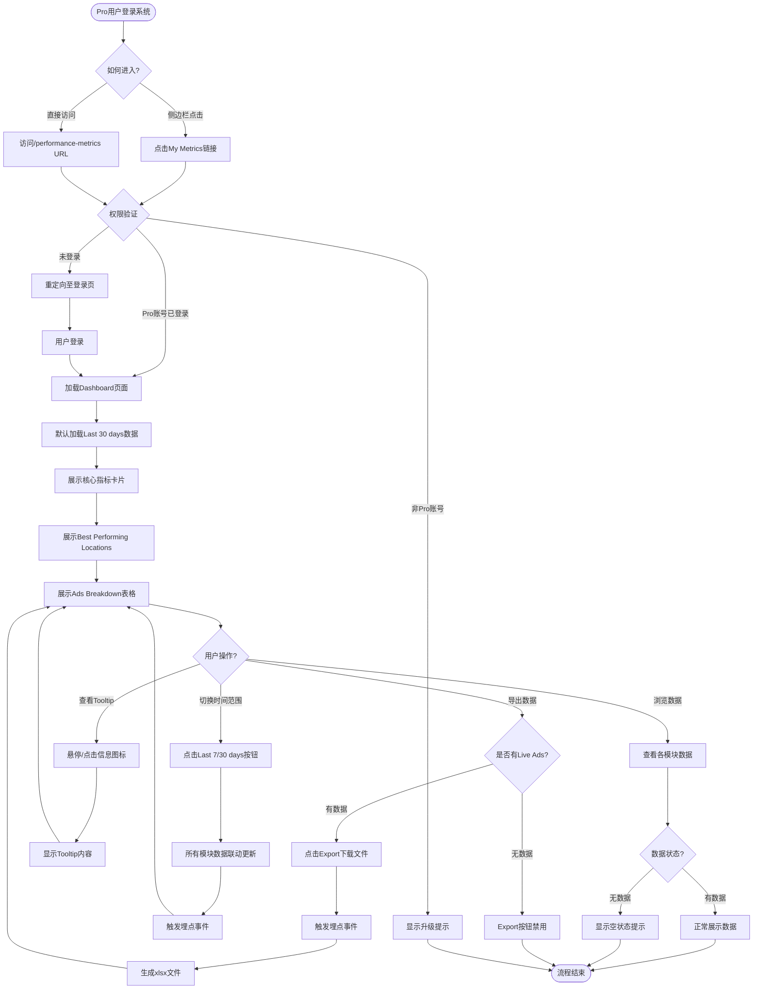

# 商业表现看板访问与浏览业务流程

> **业务目标**: 让 Pro Account 卖家能够便捷地访问商业表现看板,通过可视化指标和灵活的时间筛选查看广告表现数据,了解商业收益情况并优化投放策略

---

## 1. 完整流程图

---

## 2. 详细步骤与观测点

### 步骤1: 进入商业表现看板页面
**页面位置**: `/manage/ads` → `/performance-metrics`

**操作**:
1. 用户在 `/manage/ads` 页面查看左侧导航栏
2. 找到"My Metrics"链接(带"New"角标)
3. 点击"My Metrics"链接

**观测点**:
- ✅ 左侧导航栏显示"My Metrics"选项(仅Pro用户可见)
- ✅ "My Metrics"标签旁显示"New"角标
- ✅ 点击后跳转至 `/performance-metrics` 页面
- ✅ 侧边栏"My Metrics"项处于选中状态
- ❌ 非Pro用户的侧边栏不显示"My Metrics"入口

**验证方法**:
- 验证导航栏元素存在性: `page.locator('nav').getByText('My Metrics')`
- 验证"New"角标: `page.locator('[data-testid="new-badge"]')`
- 验证URL跳转: `expect(page).toHaveURL('/performance-metrics')`
- 验证选中状态: `expect(page.locator('nav [aria-current="page"]')).toHaveText('My Metrics')`

**关联规则**: [商业表现看板规则.md - 1. 功能概述](../../业务规则库/商业表现看板模块/商业表现看板规则.md#1-功能概述)

---

### 步骤2: 权限验证与页面加载
**页面位置**: `/performance-metrics`

**操作**:
1. 系统验证用户登录状态
2. 系统验证用户是否为 Pro Account
3. 验证通过后加载页面内容

**观测点**:
- ✅ Pro用户直接访问 URL 正常展示 Dashboard
- ✅ 页面正常加载,无报错
- ✅ 显示页眉欢迎语: "Hello, xxx! You currently have X Live Ads."
- ❌ 未登录用户自动重定向至登录页
- ❌ 非Pro用户显示提示: "This account does not currently support the dashboard feature. Please upgrade to a Pro account."
- ⚠️ 单账号UID时 Account Switcher 隐藏(待确认是否显示)

**验证方法**:
- 验证页面加载成功: `expect(page.locator('h1')).toBeVisible()`
- 验证欢迎语展示: `expect(page.locator('[data-testid="welcome-message"]')).toContain('Live Ads')`
- 验证权限拦截(负向): 使用非Pro账号访问,验证提示文案

**关联规则**: [商业表现看板规则.md - 3.1 权限规则](../../业务规则库/商业表现看板模块/商业表现看板规则.md#31-权限规则)

---

### 步骤3: 默认加载时间范围数据
**页面位置**: `/performance-metrics`

**操作**:
1. 系统默认选择"Last 30 days"时间范围
2. 加载所选时间范围内的所有指标数据
3. 触发 `dashboard_view` 埋点事件

**观测点**:
- ✅ "Last 30 days"按钮处于高亮/激活状态
- ✅ "Last 7 days"按钮处于非激活状态
- ✅ 所有指标数据基于最近30天加载
- ⚠️ PRD差距D1: 实际页面可能默认激活"Last 7 days"(待确认)

**验证方法**:
- 验证按钮激活状态: `expect(page.locator('[data-testid="time-range-30"]')).toHaveClass(/active/)`
- 验证非激活状态: `expect(page.locator('[data-testid="time-range-7"]')).not.toHaveClass(/active/)`

**关联规则**: [商业表现看板规则.md - 3.2 时间筛选规则](../../业务规则库/商业表现看板模块/商业表现看板规则.md#32-时间筛选规则)

---

### 步骤4: 展示核心指标卡片区
**页面位置**: `/performance-metrics` - 顶部指标卡片区

**操作**:
1. 系统加载并计算各项核心指标
2. 按顺序展示指标卡片

**观测点**:
- ✅ 显示"Search Views"卡片,数值为非负整数或"-"
- ✅ 显示"Ad Views"卡片,数值为非负整数或"-"
- ✅ 显示"Unique Replies"卡片,数值为非负整数或"-"
- ✅ 显示"New Ads"卡片,数值为非负整数或"-"
- ✅ 显示"Reposted Ads"卡片,数值为非负整数或"-"
- ✅ 显示"Search Views to Click Conversion"转化率,格式为百分比或"-"
- ✅ 显示"Ad Views to Reply Conversion"转化率,格式为百分比或"-"
- ✅ 无数据时所有指标显示"-"(连字符),不显示"0"、"null"或空白

**验证方法**:
- 验证卡片存在: `expect(page.locator('[data-testid="metric-search-views"]')).toBeVisible()`
- 验证空状态显示: `expect(page.locator('[data-testid="metric-search-views"]')).toHaveText('-')`
- 验证转化率格式: 正则匹配 `/\d+\.\d+%/` 或 `-`

**关联规则**: [商业表现看板规则.md - 3.3 核心指标计算规则](../../业务规则库/商业表现看板模块/商业表现看板规则.md#33-核心指标计算规则)

---

### 步骤5: 展示 Best Performing Locations
**页面位置**: `/performance-metrics` - Best Performing Locations 区域

**操作**:
1. 系统统计买家回复的地理位置分布
2. 按 Unique Replies 降序排列
3. 仅展示UK境内地区

**观测点**:
- ✅ 显示说明文字: "Locations show where buyer enquiries came from."
- ✅ 表头显示: Location | Unique Replies
- ✅ 数据按 Unique Replies 降序排列
- ✅ 仅显示UK地区,不含海外
- ✅ 列表内可滚动查看所有地区
- ✅ 未知位置显示为"Other"
- ✅ 无数据时显示空状态: "No data available yet. Try polishing your ad to attract more replies."

**验证方法**:
- 验证说明文字: `expect(page.locator('[data-testid="locations-description"]')).toContain('enquiries')`
- 验证空状态文案: `expect(page.locator('[data-testid="locations-empty"]')).toHaveText('No data available yet. Try polishing your ad to attract more replies.')`
- 验证表头结构: `page.locator('thead').getByText('Location')` 和 `getByText('Unique Replies')`

**关联规则**: [商业表现看板规则.md - 3.4 Best Performing Locations规则](../../业务规则库/商业表现看板模块/商业表现看板规则.md#34-best-performing-locations-规则)

---

### 步骤6: 展示 Ads Breakdown 表格
**页面位置**: `/performance-metrics` - Ads Breakdown 区域

**操作**:
1. 系统加载所选时间范围内 Live 的所有广告
2. 按 Search Views 降序排列
3. 展示每条广告的详细指标

**观测点**:
- ✅ 表头列顺序正确: Listing | Search Views | Ad Views | Unique Replies | Location | Features Used
- ✅ 列名无拼写错误
- ✅ 数据按 Search Views 降序排列(第一行 ≥ 第二行 ≥ 第三行)
- ✅ Listing 列显示广告标题和 Listing ID
- ✅ 标题超长时截断显示"...",悬停显示完整标题
- ✅ 广告标题不可点击(非链接样式)
- ✅ Location 显示广告的 L2 地区
- ✅ Features Used 正确显示付费功能: "Bump Up +X", "Top Ad +X", "None"
- ✅ 数据缺失时单元格显示"—"(长破折号)
- ✅ 无 Live Ads 时显示空状态: "No data available yet. Create a listing to unlock insights."

**验证方法**:
- 验证表头结构: `page.locator('thead th').allTextContents()` 比对顺序
- 验证空状态文案: `expect(page.locator('[data-testid="ads-breakdown-empty"]')).toHaveText('No data available yet. Create a listing to unlock insights.')`
- 验证列存在: `expect(page.locator('thead')).toContainText(['Listing', 'Search Views', 'Ad Views', 'Unique Replies', 'Location', 'Features Used'])`

**关联规则**: [商业表现看板规则.md - 3.5 Ads Breakdown表格规则](../../业务规则库/商业表现看板模块/商业表现看板规则.md#35-ads-breakdown-表格规则)

---

### 步骤7: 切换时间范围
**页面位置**: `/performance-metrics` - 时间筛选器区域

**操作**:
1. 用户点击"Last 7 days"或"Last 30 days"按钮
2. 系统触发 `dashboard_time_range_change` 埋点事件
3. 系统重新加载所有模块的数据

**观测点**:
- ✅ 点击的按钮高亮激活
- ✅ 另一个按钮恢复普通状态
- ✅ 核心指标卡片数据刷新
- ✅ Best Performing Locations 数据刷新
- ✅ Ads Breakdown 表格数据刷新
- ✅ 页面无需手动刷新即完成更新
- ✅ Last 30 days 各指标值 ≥ Last 7 days 对应值
- ✅ 来回切换后数值稳定,不出现异常闪烁或累加
- ❌ 快速连续切换不出现数据混合展示(竞态处理)

**验证方法**:
- 验证按钮状态切换: 点击前后比对 `aria-pressed` 或 `class` 属性
- 验证数据刷新: 记录切换前后的指标值,确认发生变化
- 验证联动更新: 三个模块的数据时间戳应一致

**关联规则**: [商业表现看板规则.md - 3.2 时间筛选规则](../../业务规则库/商业表现看板模块/商业表现看板规则.md#32-时间筛选规则)

---

### 步骤8: 查看 Tooltip 说明
**页面位置**: `/performance-metrics` - 指标卡片区

**操作**:
1. 用户点击或悬停指标卡片的信息图标(ⓘ)
2. 系统展开 Tooltip 显示说明文字
3. 用户点击外部区域关闭 Tooltip

**观测点**:
- ✅ Search Views Tooltip: "How many times your ad showed up when people were searching."
- ✅ Ad Views Tooltip: "How many times your ad was opened to view the full details."
- ✅ Search Views to Click Conversion Tooltip: 显示转化率含义及优化建议
- ✅ Ad Views to Reply Conversion Tooltip: 显示转化率含义及优化建议
- ✅ 点击外部区域 Tooltip 关闭

**验证方法**:
- 验证 Tooltip 展开: `page.locator('[data-testid="info-icon"]').click()` 后验证 Tooltip 可见
- 验证文案内容: `expect(tooltip).toContain('your ad showed up')`
- 验证关闭交互: 点击外部后验证 Tooltip 不可见

**关联规则**: [商业表现看板规则.md - 3.8 Tooltip内容规则](../../业务规则库/商业表现看板模块/商业表现看板规则.md#38-tooltip-内容规则)

---

### 步骤9: 导出 Ads Breakdown 数据
**页面位置**: `/performance-metrics` - Ads Breakdown 区域

**操作**:
1. 用户查看 Ads Breakdown 右上角的"Export"按钮
2. 检查按钮状态(有数据时可用,无数据时禁用)
3. 点击"Export"按钮
4. 系统触发 `dashboard_download_click` 埋点事件
5. 系统生成 xlsx 文件并触发浏览器下载

**观测点**:
- ✅ 有 Live Ads 时 Export 按钮处于可点击状态
- ✅ 无 Live Ads 时 Export 按钮禁用(灰色或半透明)
- ✅ 点击后触发文件下载
- ✅ 文件格式为 .xlsx (Excel)
- ✅ 文件名格式: `live_ads_breakdown_last_7_days_YYYY-MM-DD` 或 `last_30_days`
- ✅ 文件列与页面表格列一致: Listing Title, Ad ID, Search Views, Ad Views, Unique Replies, Location, Features Used
- ✅ 文件数据与页面显示数据完全一致
- ✅ 数据量大时显示 loading 状态

**验证方法**:
- 验证按钮禁用状态: `expect(page.locator('[data-testid="export-button"]')).toBeDisabled()`
- 验证文件下载: 监听 `download` 事件,验证文件名格式
- 验证数据一致性: 需要后续手动比对文件内容与页面数据

**关联规则**: [商业表现看板规则.md - 3.6 数据导出规则](../../业务规则库/商业表现看板模块/商业表现看板规则.md#36-数据导出规则)

---

### 步骤10: 空状态处理
**页面位置**: `/performance-metrics` - 各模块

**操作**:
1. 系统检测所选时间范围内的数据状态
2. 无数据时展示对应的空状态提示

**观测点**:
- ✅ 指标卡片无数据时显示"-"(连字符)
- ✅ Best Performing Locations 无数据时显示: "No data available yet. Try polishing your ad to attract more replies."
- ✅ Ads Breakdown 无数据时显示: "No data available yet. Create a listing to unlock insights."
- ✅ 页面底部显示固定提示: "We update the data everyday, but sometimes it may be delayed."
- ✅ 空状态触发 `dashboard_empty_state_view` 埋点事件

**验证方法**:
- 验证空状态文案: `expect(page.locator('[data-testid="ads-breakdown-empty"]')).toHaveText('No data available yet. Create a listing to unlock insights.')`
- 验证指标显示"-": `expect(page.locator('[data-testid="metric-value"]')).toHaveText('-')`
- 验证延迟提示: `expect(page.getByText('We update the data everyday')).toBeVisible()`

**关联规则**: [商业表现看板规则.md - 3.7 空状态规则](../../业务规则库/商业表现看板模块/商业表现看板规则.md#37-空状态规则)

---

### 步骤11: 移动端与多浏览器兼容性
**页面位置**: `/performance-metrics`

**操作**:
1. 在移动端浏览器(或模拟移动端视口 375px)访问页面
2. 在不同浏览器(Chrome/Safari/Firefox)访问页面

**观测点**:
- ✅ 移动端页面响应式布局正常
- ✅ 各指标卡片不重叠,可读性好
- ✅ Ads Breakdown 表格可横向滚动
- ✅ 无内容溢出或遮挡
- ✅ Chrome/Safari/Firefox 三个浏览器下展示一致
- ✅ 无布局错乱或功能失效

**验证方法**:
- 设置移动端视口: `page.setViewportSize({ width: 375, height: 667 })`
- 验证响应式布局: 检查元素堆叠方式和滚动条
- 跨浏览器测试: 在 Playwright 配置中启用多浏览器项目

**关联规则**: [商业表现看板规则.md - 3.9 数据一致性约束](../../业务规则库/商业表现看板模块/商业表现看板规则.md#39-数据一致性约束)

---

## 3. 流程完整性验证清单

- [ ] Pro用户能从侧边栏成功进入 My Metrics 页面
- [ ] "My Metrics"标签显示"New"角标
- [ ] 未登录用户被重定向至登录页
- [ ] 非Pro用户无法访问且显示升级提示
- [ ] 页面默认加载"Last 30 days"时间范围(或确认实际默认值)
- [ ] 切换时间范围后所有模块(核心指标、Locations、Ads Breakdown)数据联动更新
- [ ] 时间范围按钮激活状态正确切换
- [ ] 核心指标卡片数值计算正确(Search Views, Ad Views, Unique Replies, New Ads, Reposted Ads)
- [ ] 转化率计算正确(Search Views to Click, Ad Views to Reply)
- [ ] 转化率除零处理正确(显示"-"或"0%")
- [ ] Best Performing Locations 按 Unique Replies 降序排列
- [ ] Ads Breakdown 表格按 Search Views 降序排列
- [ ] Ads Breakdown 表头列顺序正确
- [ ] Export 按钮状态正确(有数据可用,无数据禁用)
- [ ] 点击 Export 触发文件下载,文件名格式正确
- [ ] 导出文件数据与页面数据一致
- [ ] 所有空状态提示文案正确显示
- [ ] Tooltip 内容正确展示
- [ ] 页眉 Live Ads 数量与 Manage My Ads 页面一致
- [ ] 移动端响应式布局正常
- [ ] 多浏览器兼容性正常
- [ ] 快速切换时间范围无竞态问题
- [ ] Session 过期后正确跳转
- [ ] 网络异常时显示友好错误提示
- [ ] 所有埋点事件正确触发

---

## 4. 关联文档

- [商业表现看板业务全景](./商业表现看板业务全景.md)
- [商业表现看板规则.md](../../业务规则库/商业表现看板模块/商业表现看板规则.md)

---

## 5. 变更历史

| 日期 | 版本 | 变更内容 | 变更人 |
|-----|------|---------|--------|
| 2026-03-25 | v1.0 | 基于 TC_performance_metrics_phase2.md (62条用例)提取业务流程,涵盖页面访问、时间筛选、核心指标、Locations、Ads Breakdown、数据导出、空状态等11个关键步骤 | AI Agent |
