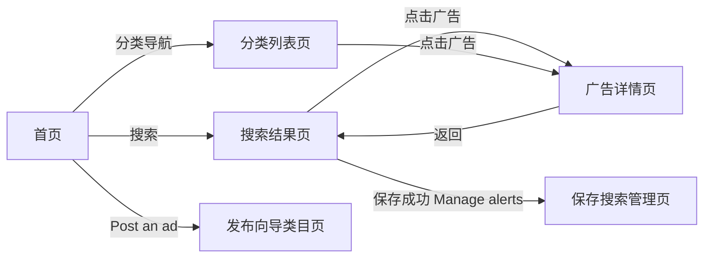
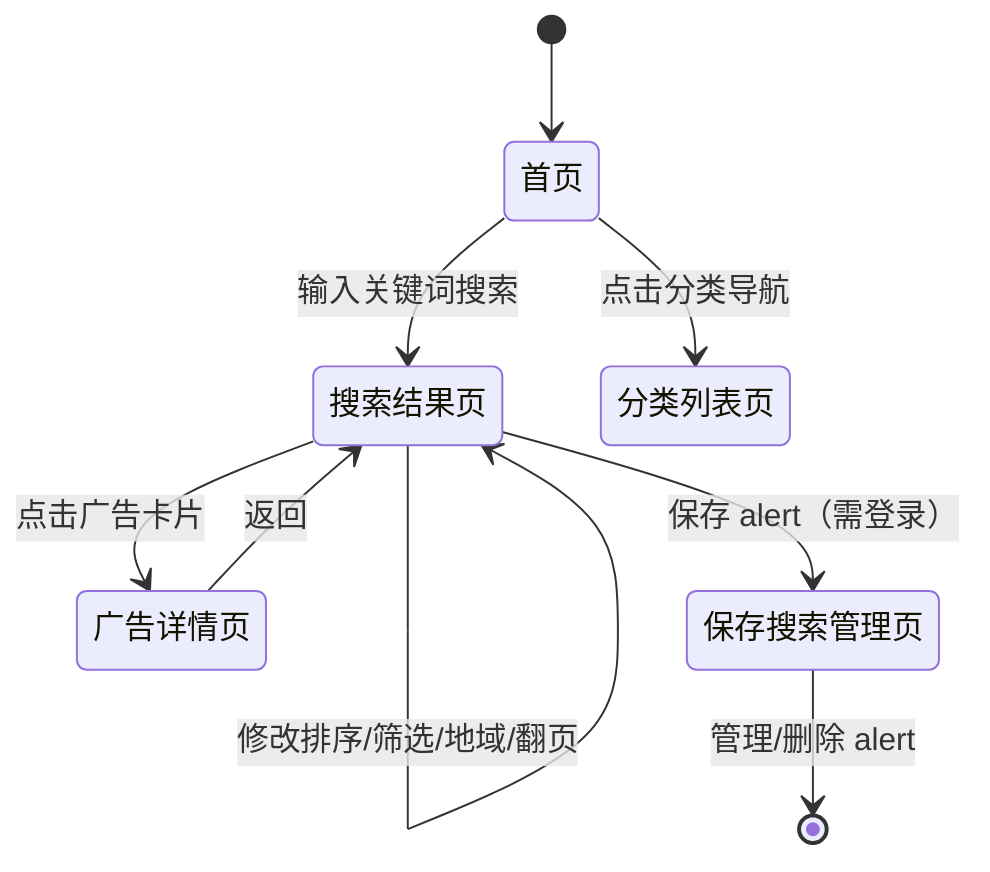

# 搜索业务域 - 业务全景

## 1. 业务定位

搜索业务域是 Gumtree UK 的核心业务之一，为买家和游客提供高效的广告检索与发现能力。

**业务价值**：
- 为**买家**提供快速精准的广告检索能力，支持关键词、地域、分类、价格等多维度组合筛选
- 为**卖家**通过 Post an ad 类目联想功能快速完成发布分类选择
- 为**登录用户**提供搜索 alert 订阅，将潜在买家与新广告精准匹配

**目标用户**：
- **游客（未登录）**：浏览、搜索、筛选、排序、地域过滤广告
- **注册用户（已登录）**：在游客权限基础上，额外支持保存搜索 alert、Post an ad 类目联想

## 2. 业务范围

### 2.1 功能覆盖
| 功能模块 | 说明 | 核心能力 |
|---------|------|---------|
| 搜索框交互 | 首页/结果页顶部搜索框 | 关键词输入、联想词（≥2字符触发）、历史记录、拼写纠正 |
| 搜索结果页（SRP） | 广告列表展示 | 分页（每页约25条）、广告卡片、Nearby 扩展 |
| 排序 | 结果列表排序 | 相关性（默认）、时间、价格升序/降序、距离 |
| 价格筛选 | 价格区间过滤 | min/max 价格输入，点击 Search 生效 |
| 属性筛选 | 多维度结果过滤 | 车辆品牌（Make）、配送方式（Delivery Available）|
| 地域过滤 | 地理位置限定 | 城市名、完整邮编、Outcode、全英（United Kingdom）|
| Nearby 扩展 | 局部搜索补充 | 结果 < 100 条时自动展示周边扩展结果 |
| 保存搜索（需登录）| 搜索 alert 订阅管理 | 保存、查看、删除（/my-account/saved-searches）|
| 分类导航（BRP）| 首页快速入口 | 点击/hover 分类进入对应列表页 |
| 发布类目联想（需登录）| Post an ad 流程 | 输入 ≥3 字符触发 5 条 Suggested categories |

### 2.2 地域覆盖
- **Gumtree UK**：全英范围（United Kingdom），支持城市名/完整邮编/Outcode 精细定位

### 2.3 用户角色
| 角色 | 权限 | 说明 |
|-----|------|------|
| 游客 | 搜索、筛选、排序、地域过滤、浏览结果、翻页 | 无需登录，100% 功能可用 |
| 注册用户 | 游客全部权限 + 保存搜索 alert + 发布类目联想 | 需登录 |

## 3. 业务流程全景图

```mermaid
graph TB
    subgraph 游客侧搜索流程
        A1[首页搜索框] --> A2{输入关键词}
        A2 -->|≥2字符| A3[联想词下拉]
        A2 -->|点击不输入| A4[历史记录下拉]
        A3 --> A5[触发搜索]
        A4 --> A5
        A5 --> A6[搜索结果页 SRP]
        A6 --> A7[排序/筛选/地域过滤]
        A7 --> A6
        A6 --> A8[广告详情页]
    end

    subgraph 登录用户额外流程
        B1[保存搜索 Alert] --> B2[Your alert is set]
        B2 --> B3[/my-account/saved-searches]
        B4[Post an ad] --> B5[类目输入框]
        B5 -->|≥3字符| B6[Suggested categories 5条]
        B5 -->|≤2字符| B7[不触发联想]
    end

    subgraph 分类导航流程
        C1[首页分类导航栏] -->|点击| C2[分类列表页 BRP]
        C1 -->|hover+点击子分类| C3[子分类列表页]
    end

    A6 --> B1
    A1 --> B4
    A1 --> C1
```

## 4. 核心业务流程概览

### 4.1 核心搜索流程
**业务目标**：用户通过关键词在全英或指定地域内快速找到目标广告

**核心步骤**：
1. 用户访问首页，点击搜索框
2. 输入关键词（≥2字符触发联想词）
3. 点击搜索按钮 / Enter / 选择联想词触发搜索
4. 进入搜索结果页，浏览广告列表
5. 按需排序（时间/价格/距离）
6. 按需筛选（价格区间/品牌/配送/地域）
7. 点击广告卡片进入详情页

**关键观测点**：
- ✅ URL 参数完整（q、search_category、search_location、keyword_correction 等）
- ✅ H1 格式：`XXX ads for [词] in [分类]`
- ✅ 搜索框保留关键词
- ✅ 联想词正确展示（≤10条，关键词粗体高亮，含分类标注）
- ✅ 排序验证从第 6 条起（跳过 Featured 置顶广告）
- ❌ 无结果时展示空状态页 + 建议文字 + Save alert 按钮
- ❌ 拼写错误时展示纠正建议（`Search instead for`）

**详细流程文档**：[搜索业务流程.md](./搜索业务流程.md)

---

### 4.2 地域过滤流程
**业务目标**：用户限定地理范围内的广告搜索

**核心步骤**：
1. 在搜索框旁或结果页左侧 Location 输入框输入位置
2. 可选：设置距离范围（Choose distance 下拉）
3. 点击 Search 或 Update 生效
4. 查看过滤后的结果

**关键观测点**：
- ✅ 支持城市名（London）、完整邮编（TW91EL）、Outcode（TW9）、United Kingdom
- ✅ 局部搜索结果 < 100 条时自动展示 Nearby 扩展区域
- ✅ 恢复全英后 distance 参数变为 `0.0001`

**详细流程文档**：[搜索业务流程.md - 步骤6](./搜索业务流程.md)

---

### 4.3 保存搜索 Alert 流程
**业务目标**：登录用户订阅特定搜索条件的新广告通知

**核心步骤**：
1. 登录账号
2. 执行搜索（有结果或无结果页均可）
3. 点击 `Save search alert` 按钮
4. 查看弹出的保存成功提示
5. 可跳转管理页 `/my-account/saved-searches` 管理/删除 alert

**关键观测点**：
- ✅ 保存成功提示：`Your alert is set`
- ✅ 提示框含 `Manage alerts` 链接
- ✅ 管理页显示 alert 列表，支持删除

**详细流程文档**：[搜索业务流程.md - 步骤8](./搜索业务流程.md)

---

### 4.4 发布类目联想流程
**业务目标**：登录卖家在发布广告时，通过关键词快速选择正确的发布类目

**核心步骤**：
1. 登录账号
2. 点击首页 `Post an ad` / `Sell`，进入 `/postad/category`
3. 在 `Tell us what category you are posting in` 下方输入框输入关键词（≥3字符）
4. 等待 Suggested categories 出现（恰好 5 条）
5. 点击 Select 选择目标类目
6. 用例结束后登出

**关键观测点**：
- ✅ 输入 ≥3 字符触发，恰好展示 5 条
- ✅ 每条含类目名 + 路径（` > ` 分隔）+ Select 按钮
- ❌ 输入 ≤2 字符不触发 Suggested categories

**详细流程文档**：[搜索业务流程.md - 步骤10](./搜索业务流程.md)

---

## 5. 页面拓扑关系

### 5.1 页面入口矩阵
| 页面 | 入口1 | 入口2 | 入口3 |
|-----|------|------|------|
| 搜索结果页（SRP） | 首页搜索框搜索 | 结果页搜索框重搜 | 分类导航栏点击 |
| 广告详情页 | 搜索结果页点击广告卡片 | - | - |
| 分类列表页（BRP）| 首页分类导航栏点击 | 首页 hover 分类 → 点击子分类 | - |
| 保存搜索管理页 | 保存成功弹窗 `Manage alerts` | 直接访问 `/my-account/saved-searches` | - |
| 发布向导类目页 | 首页 `Post an ad` | 首页 `Sell` | - |

### 5.2 页面跳转流程图



### 5.3 页面关系详解

#### 首页 → 搜索结果页（SRP）
- **入口**：顶部搜索框输入关键词后点击搜索按钮/Enter/联想词，或点击历史记录
- **目标**：展示匹配关键词的广告列表
- **参数**：q、search_category、search_location、keyword_correction、search_term_populated_by 等
- **权限**：游客/登录用户均可

#### 首页 → 分类列表页（BRP）
- **入口**：首页搜索栏下方分类导航栏，点击 `For Sale` 等分类
- **目标**：按分类浏览广告列表
- **参数**：无搜索参数，URL 为固定路径（如 `/for-sale`、`/for-sale/clothing`）
- **权限**：游客/登录用户均可

#### 搜索结果页 → 广告详情页
- **入口**：点击任意广告卡片
- **目标**：查看广告完整信息（标题、价格、位置、描述）
- **参数**：URL 格式 `/p/[分类]/[标题]/[广告ID]`
- **权限**：游客/登录用户均可

#### 搜索结果页 → 保存搜索管理页
- **入口**：点击 `Save search alert` → 弹窗中 `Manage alerts` 链接
- **目标**：管理已保存的搜索 alert
- **参数**：URL `/my-account/saved-searches`
- **权限**：**仅登录用户**

## 6. 业务数据流转

### 6.1 搜索状态流转



### 6.2 用户操作与数据变化
| 操作 | 数据变化 | 前台展示变化 | 涉及页面 |
|-----|---------|------------|---------|
| 输入关键词搜索 | 无持久化 | 跳转 SRP，URL 更新，H1 更新 | 首页 → SRP |
| 切换排序 | 无持久化 | SRP 广告列表重排 | SRP |
| 设置价格筛选 | 无持久化 | SRP 广告列表过滤 | SRP |
| 设置地域过滤 | 无持久化 | SRP 广告列表过滤，Nearby 区域可能出现 | SRP |
| 保存搜索 alert | 新增 SavedSearch 记录 | 弹出 `Your alert is set`，管理页 alert 数量+1 | SRP → 管理页 |
| 删除搜索 alert | 删除 SavedSearch 记录 | 管理页 alert 数量-1，无 alert 时显示空状态 | 管理页 |
| Clear All 历史 | 删除本地历史记录 | 历史记录下拉消失，再次点击不展示 | 首页 |

### 6.3 关键业务数据
#### 搜索请求参数
| 字段 | 类型 | 必填 | 说明 |
|-----|------|-----|------|
| q | String | 否 | 搜索关键词，maxLength=50 |
| search_category | String | 否 | 搜索分类，默认 all |
| search_location | String | 否 | 搜索位置，默认 United Kingdom |
| search_term_populated_by | Enum | 是 | input/suggested/history/unchanged |
| keyword_correction | String | 否 | 默认 suggest |
| sort | Enum | 否 | date/price_lowest_first/price_highest_first/distance |
| min_price | Number | 否 | 价格筛选下限 |
| max_price | Number | 否 | 价格筛选上限 |
| distance | Number | 否 | 距离范围，0.0001 为全英 |
| page | Number | 否 | 分页，默认 1 |
| support_shipping | Boolean | 否 | true = 仅展示支持配送的广告 |
| vehicle_make | String | 否 | 车辆品牌筛选 |

## 7. 关键业务规则索引

### 7.1 搜索框与联想词
- [搜索功能规则.md - 3.1 输入规则](../../业务规则库/搜索模块/搜索功能规则.md#31-输入规则)
- [搜索功能规则.md - 3.2 联想词规则](../../业务规则库/搜索模块/搜索功能规则.md#32-联想词规则)
- [搜索功能规则.md - 3.3 历史记录规则](../../业务规则库/搜索模块/搜索功能规则.md#33-历史记录规则)

### 7.2 排序与筛选
- [搜索功能规则.md - 3.5 排序规则](../../业务规则库/搜索模块/搜索功能规则.md#35-排序规则)
- [搜索功能规则.md - 3.6 筛选规则](../../业务规则库/搜索模块/搜索功能规则.md#36-筛选规则)

### 7.3 地域与 Nearby
- [搜索功能规则.md - 3.7 地域规则](../../业务规则库/搜索模块/搜索功能规则.md#37-地域规则)
- [搜索功能规则.md - 3.8 Nearby 扩展结果规则](../../业务规则库/搜索模块/搜索功能规则.md#38-nearby-扩展结果规则)

### 7.4 保存搜索与类目联想
- [搜索功能规则.md - 3.9 保存搜索 Alert 规则](../../业务规则库/搜索模块/搜索功能规则.md#39-保存搜索-alert-规则)
- [搜索功能规则.md - 3.10 发布类目联想规则](../../业务规则库/搜索模块/搜索功能规则.md#310-发布类目联想规则post-an-ad)

### 7.5 分类导航
- [搜索功能规则.md - 3.11 分类导航规则](../../业务规则库/搜索模块/搜索功能规则.md#311-分类导航规则brp)

## 8. 业务FAQ

### Q1: 搜索框最多可以输入多少个字符？
**A**：最多 50 个字符（maxLength=50），超出部分自动截断，不显示错误提示。

### Q2: 联想词需要输入几个字符才会触发？
**A**：至少 **2 个字符**。输入单个字符不触发联想词下拉。

### Q3: 搜索框为空直接点击搜索会怎样？
**A**：页面正常跳转，URL 中无 `q` 参数，H1 显示全部广告数量（`XXX ads All Classifieds`）。

### Q4: 输入拼写错误的词会怎样？
**A**：联想词阶段显示模糊匹配结果（不显示原词）；搜索后结果页 H1 显示 `0 ads for [错误词]`，并出现 `Search instead for` 纠正建议按钮。纠正建议**仅在搜索后**出现，输入时不出现。

### Q5: 排序时为什么从第 6 条广告验证而不是第 1 条？
**A**：结果列表前 5 条为 Featured 置顶广告，不遵循排序规则，因此验证时需跳过前 5 条，从第 6 条起进行比较。

### Q6: Nearby 扩展区域什么情况下会出现？
**A**：当用户进行局部搜索（非全英范围）且结果数量 **少于 100 条**时，系统自动在结果列表末尾展示 `Results from outside your search` 扩展区域。

### Q7: 保存搜索 alert 需要登录吗？
**A**：**是**，仅限登录用户。未登录用户点击 `Save search alert` 后会被引导登录。

### Q8: 搜索无结果时还可以保存搜索 alert 吗？
**A**：**可以**，空状态页（0 结果）底部仍会显示 `Save search alert` 按钮，用户可以订阅当新广告出现时的通知。

### Q9: Post an ad 类目联想需要输入几个字符才触发？
**A**：至少 **3 个字符**。输入 2 个字符（如 `dr`）不会触发 Suggested categories 列表。

### Q10: 地域筛选恢复全英后，URL 中 distance 参数变成什么？
**A**：恢复全英后，distance 参数变为 `0.0001`，代表 Choose distance（全英范围，无距离限制）。

## 9. 业务指标（可选）

### 9.1 核心指标
- **用例覆盖率**：37 条（100% 可自动化）
- **P0 用例**：4 条（TC001、TC002、TC004、TC014）
- **P1 用例**：22 条
- **P2 用例**：11 条

### 9.2 测试环境
- **实测环境**：zoidberg（`https://www.zoidberg.gumtree.io`）
- **探测方式**：Playwright MCP / 有界面脚本实测

## 10. 已知问题与风险

### 10.1 产品待确认问题
1. 特殊字符（`<>"'%*?`）被作为通配符处理，H1 不显示搜索词本身——此行为是否为预期产品设计？
2. 纯空格搜索（URL 中 `q=%20%20%20%20%20`）返回全部广告——是否需要前端做空格校验？
3. Post an ad 类目联想触发阈值（≥3字符 vs ≥2字符）——是否与搜索框联想词（≥2字符）不一致为预期？

### 10.2 技术风险
- Nearby 扩展区域的触发阈值（100条）依赖后端返回，不同环境数据量不同，可能导致测试结果不稳定
- 排序验证依赖前 5 条为 Featured 置顶广告的假设，若 Featured 广告数量变化可能影响验证逻辑

### 10.3 测试过程中发现的问题
- 分组9（TC036/TC037）需要登录账号（`sean.shao@gumtree.com`），密码不写入文档，与代码/安全配置一致
- 各用例执行后需登出，避免会话影响后续用例

## 11. 变更历史

| 日期 | 版本 | 变更内容 | 变更人 |
|-----|------|---------|--------|
| 2026-03-16 | v1.0 | 初始版本，基于 Playwright MCP 实测（37条用例，zoidberg 环境） | Sean Shao |
