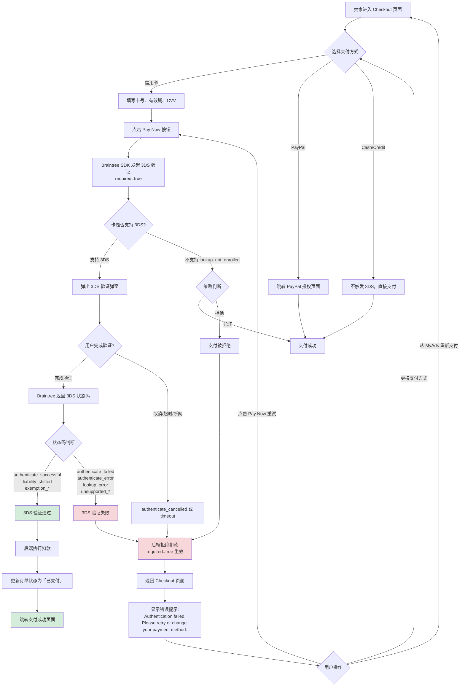

# 3DS 认证支付业务流程

> **文档版本**: v1.0  
> **最后更新**: 2026-03-24  
> **业务目标**: 确保在线信用卡支付安全性，通过 3D Secure 2.0 协议验证持卡人身份，防止欺诈交易，符合 PCI DSS 合规要求

---

## 1. 完整流程图

> **业务目标**：卖家使用信用卡支付广告费用时，系统强制执行 3DS 身份验证，验证通过后完成扣款；验证失败则拒绝支付，保障资金安全。



---

## 2. 详细步骤与观测点

### 步骤 1：卖家进入 Checkout 页面

**页面位置**: `/checkout`

**操作流程**:
1. 卖家从以下入口进入 Checkout：
   - Post Ad 流程点击「Pay Now」
   - MyAds 页面点击广告旁「Pay」按钮
   - Repost / Restore / Edit 触发的支付流程

**✅ 正向观测点**:
- Checkout 页面正确加载，显示订单商品信息（广告标题、类目、金额）
- 支付方式选项可见：信用卡 / PayPal / Cash / Credit Package
- 订单总金额正确显示
- 如有 Auto-Renew 选项，复选框正确展示

**验证方法**:
```python
# Playwright 示例
expect(page.locator("text=Total Amount")).to_be_visible()
expect(page.locator("input[type='radio'][value='credit_card']")).to_be_visible()
```

**关联规则**: [3DS认证支付规则.md](../../业务规则库/支付模块/3DS认证支付规则.md) § 1.3 入口位置

---

### 步骤 2：选择信用卡支付并填写卡片信息

**页面位置**: Checkout 页面支付区域

**操作流程**:
1. 点击「Credit Card」支付方式
2. 输入卡号（16 位）
3. 输入有效期（MM/YY 格式）
4. 输入 CVV（3 位或 4 位）
5. 填写账单地址（如需要）

**✅ 正向观测点**:
- 卡号输入框实时格式化（每 4 位插入空格）
- 有效期输入框限制为 MM/YY 格式
- CVV 输入框为密码类型，限制长度
- 卡片类型自动识别（Visa / Mastercard / Amex 图标显示）

**❌ 负向观测点**:
- 输入无效卡号后，显示「Invalid card number」错误提示
- 输入过期日期后，显示「Expired card」错误提示

**验证方法**:
```python
page.fill("#card-number", "4111111111111111")  # Visa 测试卡
page.fill("#expiry-date", "12/28")
page.fill("#cvv", "123")
assert page.locator("img[alt='Visa']").is_visible()
```

**关联规则**: [3DS认证支付规则.md](../../业务规则库/支付模块/3DS认证支付规则.md) § 3.1 3DS 触发规则

---

### 步骤 3：点击「Pay Now」触发 3DS 验证

**页面位置**: Checkout 页面底部

**操作流程**:
1. 确认订单信息无误
2. 点击「Pay Now」或「Confirm Payment」按钮
3. 按钮变为 loading 状态，禁用防止重复点击

**✅ 正向观测点**:
- 按钮文字变为「Processing...」或显示加载动画
- 按钮禁用（`disabled` 属性为 true）
- 短时间内（1-3 秒）3DS 弹窗弹出

**❌ 负向观测点（TC021）**:
- 快速连续点击 3 次「Pay Now」，只触发一次 3DS 验证流程
- 不产生重复订单

**验证方法**:
```python
pay_button = page.locator("button:has-text('Pay Now')")
pay_button.click()
assert pay_button.is_disabled()
page.wait_for_timeout(2000)
assert page.locator("iframe[title*='3D Secure']").is_visible()  # 3DS iframe
```

**关联规则**: [3DS认证支付规则.md](../../业务规则库/支付模块/3DS认证支付规则.md) § 3.5 重试与防重复提交规则

---

### 步骤 4：3DS 验证弹窗弹出

**页面位置**: Braintree 3DS iframe 弹窗（第三方）

**操作流程**:
1. Braintree SDK 在页面中插入 3DS 验证 iframe
2. 弹窗显示发卡行提供的验证界面
3. 用户看到验证码输入框 / Face ID 提示 / 指纹验证提示（取决于银行）

**✅ 正向观测点**:
- 3DS 弹窗正确弹出，覆盖在 Checkout 页面上方
- 弹窗标题包含「3D Secure Verification」或发卡行名称
- 弹窗内显示验证说明（如「Enter the code sent to your phone」）

**⚠️ 待确认观测点（R1）**:
- 部分浏览器可能拦截弹窗，需检查浏览器是否显示「弹窗被拦截」提示

**验证方法**:
```python
# 3DS iframe 出现
iframe = page.frame_locator("iframe[title*='3D Secure']")
expect(iframe.locator("text=Verification")).to_be_visible(timeout=10000)
```

**关联规则**: [3DS认证支付规则.md](../../业务规则库/支付模块/3DS认证支付规则.md) § 2.1 主流程

---

### 步骤 5：用户完成 3DS 验证

**页面位置**: 3DS 验证弹窗内

**操作流程**:
1. **场景 A（沙箱通过）**: 输入沙箱测试验证码（如「1234」），点击「Submit」
2. **场景 B（沙箱失败）**: 输入错误验证码，或点击「Cancel」按钮
3. **场景 C（超时）**: 长时间不操作（5-10 分钟）
4. **场景 D（断网）**: 验证过程中断开网络连接

**✅ 正向观测点（场景 A - 验证通过）**:
- 弹窗关闭，返回 Checkout 页面
- 页面显示「Processing payment...」加载状态
- 3-5 秒后跳转至支付成功页面
- 支付成功页面显示订单号、支付金额、交易时间

**❌ 负向观测点（场景 B - 验证失败）**:
- 弹窗关闭，返回 Checkout 页面
- 页面顶部显示红色错误提示：`"Authentication failed. Please retry or change your payment method."`
- 订单商品信息和支付金额保留，用户无需重新填写
- 卡号字段根据产品设计保留或清空，CVV 字段清空

**❌ 负向观测点（场景 C - 超时）**:
- 弹窗自动关闭或显示「Timeout」提示
- 返回 Checkout 页面，显示错误提示（同场景 B）
- 账户未被扣款

**❌ 负向观测点（场景 D - 断网）**:
- 弹窗显示网络错误提示
- 恢复网络后，返回 Checkout 页面，显示错误提示
- 账户未被扣款，无「已扣款但订单未完成」的异常状态

**验证方法**:
```python
# 场景 A - 验证通过
iframe = page.frame_locator("iframe[title*='3D Secure']")
iframe.locator("#verification-code").fill("1234")  # 沙箱测试码
iframe.locator("button:has-text('Submit')").click()
page.wait_for_url("**/payment-success**", timeout=15000)
assert "Payment Successful" in page.inner_text("h1")

# 场景 B - 验证失败
iframe.locator("button:has-text('Cancel')").click()
error_msg = page.locator("text=Authentication failed")
expect(error_msg).to_be_visible(timeout=5000)
```

**关联规则**: [3DS认证支付规则.md](../../业务规则库/支付模块/3DS认证支付规则.md) § 3.2 3DS 状态码规则

---

### 步骤 6：后端处理 3DS 状态码

**执行主体**: 支付后端服务

**操作流程**:
1. Braintree SDK 返回 3DS 状态码（如 `authenticate_successful`）
2. 后端根据状态码判断是否允许扣款
3. **新逻辑（`required=true`）**: 只有验证通过的状态码才执行扣款，失败/错误类状态码一律拒绝

**✅ 正向观测点（验证通过）**:
- 后端日志记录：`3DS_STATUS=authenticate_successful, ACTION=charge_approved`
- 数据库订单表 `status` 字段更新为 `paid`
- 数据库订单表 `payment_method` 字段记录为 `credit_card_3ds`
- Braintree 后台显示该笔交易状态为 `settled`

**❌ 负向观测点（验证失败）**:
- 后端日志记录：`3DS_STATUS=authenticate_failed, ACTION=charge_rejected, REASON=required_true`
- 数据库订单表 `status` 字段保持为 `pending`
- 数据库订单表 `failure_reason` 字段记录为 `Authentication_Required`
- Braintree 后台**无该笔交易记录**（未执行扣款）

**⚠️ 待确认观测点（Q1）**:
- `lookup_not_enrolled` 状态下的行为：后端日志记录的 `ACTION` 字段是 `charge_approved` 还是 `charge_rejected`？

**验证方法**:
```bash
# 后台日志查询（示例）
grep "3DS_STATUS=authenticate_failed" /var/log/payment-service.log | tail -5

# 数据库查询（示例）
SELECT order_id, status, failure_reason FROM orders WHERE order_id='12345';
```

**关联规则**: [3DS认证支付规则.md](../../业务规则库/支付模块/3DS认证支付规则.md) § 3.2 3DS 状态码规则

---

### 步骤 7：支付成功页面展示（验证通过场景）

**页面位置**: `/payment-success` 或 `/order-confirmation`

**操作流程**:
1. 后端扣款成功后，返回支付成功响应
2. 前端跳转至支付成功页面
3. 页面显示订单详情和支付信息

**✅ 正向观测点**:
- 页面标题显示「Payment Successful」或「订单已支付」
- 显示订单号（Order ID）
- 显示支付金额和支付时间
- 显示支付方式（Credit Card - **** 1111）
- 显示广告标题和类目
- 提供「View My Ads」或「Back to Home」按钮

**验证方法**:
```python
expect(page.locator("h1:has-text('Payment Successful')")).to_be_visible()
expect(page.locator("text=Order ID:")).to_be_visible()
expect(page.locator("text=Amount:")).to_be_visible()
```

**关联规则**: [3DS认证支付规则.md](../../业务规则库/支付模块/3DS认证支付规则.md) § 2.1 主流程

---

### 步骤 8：错误提示与重试流程（验证失败场景）

**页面位置**: Checkout 页面

**操作流程**:
1. 3DS 验证失败后，返回 Checkout 页面
2. 页面顶部显示红色错误 Banner
3. 用户可选择重试或更换支付方式

**✅ 正向观测点（错误提示展示）**:
- 错误提示文案精确匹配：`"Authentication failed. Please retry or change your payment method."`
- 错误提示在用户可见区域内（无需滚动）
- 错误提示样式为红色或对应设计规范（如红色 Banner 或内联错误图标）
- 错误提示在 Web Desktop、Web Mobile、App iOS、App Android 上文案完全一致

**✅ 正向观测点（表单数据保留 - TC008）**:
- 订单商品信息保留（广告标题、金额）
- 支付金额保留
- 卡号字段根据产品设计保留（屏蔽号码，如 **** 1111）
- CVV 字段清空（安全要求）
- 有效期字段保留
- 账单地址保留

**✅ 正向观测点（重试功能 - TC009）**:
- 点击「Pay Now」按钮，3DS 弹窗再次弹出
- 使用 3DS 通过测试卡重新验证后，支付成功
- 整个重试流程顺畅，无异常报错

**✅ 正向观测点（更换支付方式 - TC010）**:
- 点击「Change payment method」或直接选择其他支付方式
- 切换到 PayPal / Cash / Credit Package 后，可正常完成支付
- 不产生重复订单

**验证方法**:
```python
# 错误提示验证
error_banner = page.locator("text=Authentication failed. Please retry or change your payment method.")
expect(error_banner).to_be_visible()

# 表单数据保留验证
assert page.locator("#card-number").input_value() == "**** 1111"  # 屏蔽号码
assert page.locator("#cvv").input_value() == ""  # CVV 已清空

# 重试验证
page.click("button:has-text('Pay Now')")
page.wait_for_timeout(2000)
assert page.locator("iframe[title*='3D Secure']").is_visible()
```

**关联规则**: [3DS认证支付规则.md](../../业务规则库/支付模块/3DS认证支付规则.md) § 4.1 错误提示文案、§ 3.5 重试规则、§ 3.6 表单数据保留规则

---

## 3. 流程完整性验证清单

### 3.1 核心路径验证

- [ ] **P0** - 3DS 验证通过，支付成功（TC001、TC002）
- [ ] **P0** - 3DS 验证失败，支付被拒绝，不扣款（TC003、TC005）
- [ ] **P0** - 用户取消 3DS 弹窗，支付被拒绝，不扣款（TC004）
- [ ] **P0** - 错误提示文案精确匹配（TC006、TC007）
- [ ] **P0** - 灰度 L1 类目全量遍历，行为一致（TC040）
- [ ] **P0** - 认证成功类状态码支付成功（TC041）
- [ ] **P0** - 认证失败类状态码支付被拒绝（TC043）

### 3.2 异常与边界验证

- [ ] **P1** - 3DS 失败后表单数据保留（TC008）
- [ ] **P1** - 3DS 失败后点击重试成功（TC009）
- [ ] **P1** - 3DS 失败后更换支付方式成功（TC010）
- [ ] **P1** - Auto-renew 场景 3DS 通过后续费成功（TC012）
- [ ] **P1** - Auto-renew 场景 3DS 失败后续费被拒绝（TC013）
- [ ] **P1** - 无需 3DS 的信用卡仍能正常支付（TC022）
- [ ] **P1** - PayPal / Cash / Credit / 组合支付不触发 3DS（TC026-TC030）
- [ ] **P2** - 3DS 弹窗期间断网，支付不被执行（TC020）
- [ ] **P2** - 快速连续点击支付按钮，防重复提交（TC021）
- [ ] **P2** - 3DS 验证超时，支付不被执行（TC025）

### 3.3 终端兼容性验证

- [ ] **P1** - App iOS 3DS 验证通过支付成功（TC014）
- [ ] **P1** - App Android 3DS 验证通过支付成功（TC015）
- [ ] **P1** - App iOS 3DS 验证失败错误提示正确（TC016）
- [ ] **P1** - App Android 3DS 验证失败错误提示正确（TC017）

### 3.4 灰度与状态码验证

- [ ] **P1** - 灰度品类内卖家触发 3DS 强制验证（TC018）
- [ ] **P1** - 灰度品类外卖家旧逻辑不受影响（TC019）
- [ ] **P1** - 豁免/绕过类状态码支付成功（TC042）
- [ ] **P1** - 系统/查询错误类状态码支付被拒绝（TC044）
- [ ] **P1** - 不支持类状态码支付被拒绝（TC045）
- [ ] **P1** - `lookup_not_enrolled` 状态支付行为确认（TC046）
- [ ] **P1** - `challenge_required` 状态用户完成挑战后支付成功（TC047）

---

## 4. 关联文档

- [3DS 认证支付规则](../../业务规则库/支付模块/3DS认证支付规则.md) - 详细业务规则
- [支付业务全景](支付业务全景.md) - 支付模块整体架构
- [测试用例文档](../../test_cases/payment/TC_3ds_auth_bug_fix.md) - 47 条完整测试用例

---

## 5. 变更历史

| 日期 | 版本 | 变更内容 | 变更人 |
|------|------|---------|--------|
| 2026-03-24 | v1.0 | 初始版本：从 TC_3ds_auth_bug_fix.md 提取业务流程，建立流程文档 | QA Team |
