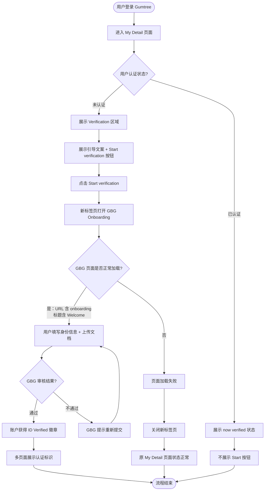

# GBG 身份验证业务流程

> **业务目标**：允许 Gumtree 用户通过 GBG 第三方平台完成 ID 和 Business Verification，获得 "ID Verified" 认证徽章，在广告中展示以提升可信度并从竞争对手中脱颖而出

---

## 1. 完整流程图

---

## 2. 详细步骤与观测点

### 步骤1：My Detail 页面 Verification 区域展示（未认证账户）
**页面位置**：My Detail 页面（`/manage-account`）

**操作**：
1. 使用未认证消费者账户（unverified_account）登录
2. 导航到 My Detail 页面
3. 查看 Verification 区域

**观测点**：
- ✅ 页面 URL 包含 `/manage-account`
- ✅ "My Details" 标签处于选中状态（`aria-selected="true"`）
- ✅ "Verification" heading 可见
- ✅ Verification 区域描述文案长度 > 20 字符（非空且有意义）
- ✅ "Start verification" 按钮可见且可点击（`to_be_enabled`）
- ❌ 如果 URL 不含 `/manage-account` 则页面加载失败
- ❌ 如果 Verification heading 不可见则区域未渲染

**验证方法**：
- 断言 `page.url` 包含 `/manage-account`
- 使用 `page.locator("[role='tab']").filter(has_text="My Details")` 检查 tab 选中状态
- 使用 `page.get_by_role("heading", name="Verification")` 检查 heading
- 使用 `page.get_by_role("button", name="Start verification")` 检查按钮可见性和可点击性

**关联规则**：[GBG身份验证规则.md - 3.3 权限规则](../../业务规则库/认证模块/GBG身份验证规则.md#33-权限规则)

---

### 步骤2：点击 Start verification 进入 GBG 认证流程
**页面位置**：My Detail（`/manage-account`）→ GBG Onboarding（`onboarding.gumtree.com`）

**操作**：
1. 点击 "Start verification" 按钮
2. 等待新标签页打开
3. 验证 GBG 页面信息

**观测点**：
- ✅ 新标签页打开
- ✅ GBG 页面 URL 包含 `onboarding`（不区分大小写）
- ✅ GBG 页面标题包含 "Welcome"（不区分大小写）
- ❌ URL 不含 `onboarding` 则跳转目标错误
- ❌ 标题不含 "Welcome" 则 GBG 页面加载异常

**验证方法**：
- 使用 `page.context.expect_page()` 捕获新标签页
- 对新页面 URL 进行 `"onboarding" in gbg_url.lower()` 断言
- 对新页面标题进行 `"welcome" in gbg_title.lower()` 断言

**关联规则**：[GBG身份验证规则.md - 3.2 校验规则](../../业务规则库/认证模块/GBG身份验证规则.md#32-校验规则)

---

### 步骤3：关闭 GBG 页面后原页面状态验证
**页面位置**：My Detail 页面（`/manage-account`）

**操作**：
1. 关闭 GBG 新标签页
2. 验证原 My Detail 页面状态

**观测点**：
- ✅ 原页面 URL 仍为 `/manage-account`
- ✅ "Verification" heading 仍可见
- ❌ URL 变化或 heading 不可见则原页面状态异常

**验证方法**：
- 关闭 `gbg_page` 后断言 `page.url` 包含 `/manage-account`
- 使用 `page.get_by_role("heading", name="Verification")` 确认可见

**关联规则**：[GBG身份验证规则.md - 2.2 异常流程](../../业务规则库/认证模块/GBG身份验证规则.md#22-异常流程)

---

### 步骤4：My Detail 页面已认证状态展示
**页面位置**：My Detail 页面（`/manage-account`）

**操作**：
1. 使用已认证 Pro 账户（verified_account）登录
2. 导航到 My Detail 页面
3. 查看 Verification 区域

**观测点**：
- ✅ 页面 URL 包含 `/manage-account`
- ✅ "Verification" heading 可见
- ✅ "now verified" 文案可见
- ✅ "verification badge will show on your Ads" 文案可见
- ✅ "Start verification" 按钮不可见（`not_to_be_visible`）
- ❌ "Start verification" 按钮仍可见则已认证状态展示异常

**验证方法**：
- 使用 `page.get_by_text("now verified")` 检查状态文案
- 使用 `page.get_by_text("verification badge will show on your Ads")` 检查 badge 说明
- 使用 `expect(start_btn).not_to_be_visible()` 检查 Start 按钮不可见

**关联规则**：[GBG身份验证规则.md - 3.3 权限规则](../../业务规则库/认证模块/GBG身份验证规则.md#33-权限规则)

---

### 步骤5：VIP 页面展示 ID Verified 及卖家信息
**页面位置**：VIP 广告详情页（`/p/{ad-slug}/{ad-id}`）

**操作**：
1. 从 My Ads 点击第一条广告进入 VIP 页
2. 查看广告标题、面包屑、Overview 区域、卖家卡片

**观测点**：
- ✅ 页面 URL 包含 `/p/`
- ✅ 广告标题（H1）可见且不为空
- ✅ 面包屑导航含 "Home" 链接（`main` 区域内）
- ✅ "Overview" heading 可见
- ✅ "ID Verified" 文本标识可见
- ✅ "Operates in {地区}" 可见（正则 `Operates in .+`）
- ✅ "Posting since/for {年限}" 可见（正则 `Posting (since|for) .+`）
- ✅ 卖家名称链接 `a[href*='/sellerads/']` 可见且不为空

**验证方法**：
- 使用 `page.locator("h1").first` 检查广告标题
- 使用 `page.locator("main").get_by_role("link", name="Home")` 检查面包屑
- 使用 `page.get_by_text("ID Verified")` 检查认证标识
- 使用正则匹配 `Operates in .+` 和 `Posting (since|for) .+`

**关联规则**：[GBG身份验证规则.md - 3.4 业务约束](../../业务规则库/认证模块/GBG身份验证规则.md#34-业务约束)

---

### 步骤6：SRP 搜索结果展示 ID Verified
**页面位置**：SRP 搜索结果页（`/search?...`）

**操作**：
1. 从 My Ads 获取第一条广告名称
2. 在首页搜索广告名
3. 在搜索结果中定位目标广告卡片

**观测点**：
- ✅ 页面 URL 包含 `/search` 或 `/p/`
- ✅ 目标广告卡片（`article`）包含广告名文本
- ✅ 广告卡片展示 "ID Verified" 标识
- ✅ 广告卡片展示 "Operates in {地区}"（正则 `Operates in .+`）
- ✅ 广告卡片展示服务分类标签（如 Training、Services、Dog Training、Computer Services）
- ❌ 搜索结果中未找到含 "ID Verified" 的目标广告卡片

**验证方法**：
- 使用 `page.locator("article").filter(has_text=ad_name).filter(has_text="ID Verified")` 定位卡片
- 使用正则匹配 `(Training|Services|Dog Training|Computer Services)` 检查分类标签

**关联规则**：[GBG身份验证规则.md - 3.4 业务约束](../../业务规则库/认证模块/GBG身份验证规则.md#34-业务约束)

---

## 3. 流程完整性验证清单

- [ ] My Detail URL 包含 `/manage-account`
- [ ] "My Details" 标签 `aria-selected="true"`
- [ ] "Verification" heading 可见
- [ ] Verification 描述文案非空（长度 > 20）
- [ ] "Start verification" 按钮可见且可点击（未认证）
- [ ] 点击后新标签页打开 GBG Onboarding（URL 含 `onboarding`）
- [ ] GBG 页面标题含 "Welcome"
- [ ] 关闭 GBG 标签后原页面 URL 和 heading 正常
- [ ] 已认证账户展示 "now verified" 文案
- [ ] 已认证账户展示 "verification badge will show on your Ads"
- [ ] 已认证账户不展示 "Start verification" 按钮
- [ ] VIP 页面广告标题（H1）可见
- [ ] VIP 页面 "ID Verified" 标识可见
- [ ] VIP 页面 "Operates in {地区}" 可见
- [ ] VIP 页面 "Posting since/for {年限}" 可见
- [ ] SRP 广告卡片展示 "ID Verified" 标识
- [ ] SRP 广告卡片展示 "Operates in {地区}"
- [ ] SRP 广告卡片展示服务分类标签

---

## 4. 关联文档

- [认证业务全景](./认证业务全景.md)
- [GBG身份验证规则.md](../../业务规则库/认证模块/GBG身份验证规则.md)

---

## 5. 变更历史

| 日期 | 版本 | 变更内容 | 变更人 |
|------|------|----------|--------|
| 2026-04-15 | v1.0 | 初始版本，从 Web UI 测试用例提取（test_gbg_verification.py，5个用例） | 知识库管理器 |
