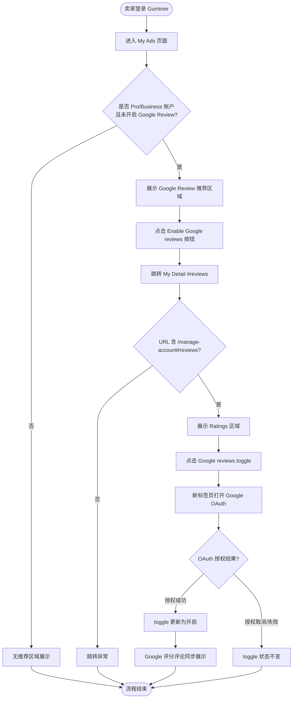

# Google Review 认证业务流程

> **业务目标**：允许 Pro/Business 卖家通过 Google OAuth 授权开启 Google Review，将 Google 评分和评论同步展示到 Gumtree 平台，提升卖家可信度和买家交易信心

---

## 1. 完整流程图

---

## 2. 详细步骤与观测点

### 步骤1：My Ads 页面 Google Review 推荐区域展示
**页面位置**：My Ads 页面（`/manage/ads`）

**操作**：
1. 登录认证账户（certification_account）
2. 导航到 My Ads 页面
3. 查看 Google Review 推荐区域

**观测点**：
- ✅ 推荐区域标题 "Show Google ratings & reviews on your profile" 可见
- ✅ 推荐描述文案 "Let others see your ratings and reviews to build buyer confidence." 可见
- ✅ "Enable Google reviews" 按钮可见
- ❌ 如果非 Pro/Business 账户，推荐区域不展示
- ❌ 如果已开启 Google Review，推荐区域不展示

**验证方法**：
- 使用 `page.get_by_role("heading")` 检查推荐标题可见性
- 使用 `page.get_by_text()` 检查描述文案可见性
- 使用 `page.get_by_role("button", name="Enable Google reviews")` 检查按钮可见性

**关联规则**：[Google Review认证规则.md - 3.3 权限规则](../../业务规则库/认证模块/Google Review认证规则.md#33-权限规则)

---

### 步骤2：点击 Enable 按钮跳转至 My Detail Ratings 区域
**页面位置**：My Ads → My Detail（`/manage-account#reviews`）

**操作**：
1. 点击 "Enable Google reviews" 按钮
2. 等待页面跳转

**观测点**：
- ✅ URL 包含 `/manage-account`
- ✅ URL 包含 `#reviews` 锚点
- ✅ Ratings heading 可见
- ✅ "Google reviews" 标签文本可见
- ✅ Google reviews toggle 可见（`#reviews label`）
- ✅ 说明文案 "Enable Google ratings and reviews on my profile and all my Ads." 可见
- ❌ URL 不含 `/manage-account` 则跳转失败
- ❌ URL 不含 `#reviews` 则锚点定位失败

**验证方法**：
- 断言 `page.url` 包含 `/manage-account` 和 `#reviews`
- 使用 `page.get_by_role("heading", name="Ratings")` 检查 heading
- 使用 `page.locator("#reviews label")` 检查 toggle

**关联规则**：[Google Review认证规则.md - 2.1 主流程](../../业务规则库/认证模块/Google Review认证规则.md#21-主流程)

---

### 步骤3：点击 toggle 触发 Google OAuth 授权
**页面位置**：My Detail（`/manage-account#reviews`）→ Google OAuth（`accounts.google.com`）

**操作**：
1. 点击 Google reviews toggle
2. 等待新标签页打开

**观测点**：
- ✅ 新标签页打开且 URL 包含 `accounts.google.com`
- ❌ 新标签页未打开或 URL 不含 `accounts.google.com` 则 OAuth 跳转失败
- ⚠️ OAuth 授权取消/失败后 toggle 状态是否保持不变（待测试确认）

**验证方法**：
- 使用 `page.context.expect_page()` 捕获新标签页
- 断言新标签页 URL 包含 `accounts.google.com`
- 验证后关闭新标签页

**关联规则**：[Google Review认证规则.md - 3.2 校验规则](../../业务规则库/认证模块/Google Review认证规则.md#32-校验规则)

---

### 步骤4：VIP 页面展示 Google Review 评分与评论
**页面位置**：VIP 广告详情页（`/p/{ad-slug}/{ad-id}`）

**操作**：
1. 使用已开启 Google Review 的展示账户（display_account）登录
2. 从 My Ads 点击第一条广告进入 VIP 页
3. 查看卖家卡片和 Reviews 区域

**观测点**：
- ✅ 页面 URL 包含 `/p/`
- ✅ 卖家卡片展示评分值（格式 `X.X`，如 4.5）
- ✅ 卖家卡片展示评论数（格式 `(N reviews)`）
- ✅ Reviews 标题可见且含评论数（格式 `Reviews (N)`）
- ✅ 展示 "provided by our partner, Google" 合作声明
- ✅ 展示评分详情 "out of 5"
- ✅ 展示至少一条评论（含评论日期，格式 `DD Month YYYY`）
- ✅ 展示 "Powered by Google" 品牌标识

**验证方法**：
- 定位卖家卡片：含 `a[href*='/sellerads/']` 且含 `reviews)` 文本的 div
- 使用正则 `^\d+\.\d$` 匹配评分值
- 使用正则 `\(\d+ reviews?\)` 匹配评论数
- 使用正则 `\d{1,2}\s+\w+\s+\d{4}` 匹配评论日期

**关联规则**：[Google Review认证规则.md - 3.4 业务约束](../../业务规则库/认证模块/Google Review认证规则.md#34-业务约束)

---

### 步骤5：BRP → VIP 用户旅程验证
**页面位置**：BRP 卖家档案页（`/sellerads/{seller-name}`）→ VIP 广告详情页

**操作**：
1. 从 VIP 页获取卖家档案链接（`/sellerads/`）
2. 导航到 BRP 页面并验证广告列表
3. 从 BRP 点击广告卡片进入 VIP 页（模拟买家发现路径）
4. 验证 VIP 页展示 Google Review 评分

**观测点**：
- ✅ VIP 页卖家卡片含 `a[href*='/sellerads/']` 链接
- ✅ BRP 页面 URL 包含 `/sellerads/`
- ✅ BRP 页面含有广告卡片（`article` 元素，count > 0）
- ✅ 从 BRP 点击广告卡片可进入 VIP 页（URL 含 `/p/`）
- ✅ VIP 页卖家卡片展示评分值（格式 `X.X`）
- ✅ VIP 页卖家卡片展示评论数（格式 `(N reviews)`）
- ⚠️ staging 环境 BRP/SRP listing 卡片不渲染 Google Review 评分区块（仅 VIP 层可见）

**验证方法**：
- 使用 `page.context.expect_page()` 捕获 BRP 卡片点击后的新标签页（`target="_blank"`）
- 在新标签页中验证评分和评论数

**关联规则**：[Google Review认证规则.md - 3.4 业务约束](../../业务规则库/认证模块/Google Review认证规则.md#34-业务约束)

---

## 3. 流程完整性验证清单

- [ ] My Ads 推荐区域标题 "Show Google ratings & reviews on your profile" 可见
- [ ] My Ads 推荐描述文案 "Let others see your ratings..." 可见
- [ ] "Enable Google reviews" 按钮可见且可点击
- [ ] 点击 Enable 后跳转 URL 含 `/manage-account#reviews`
- [ ] My Detail Ratings heading 可见
- [ ] "Google reviews" 标签文本可见
- [ ] Google reviews toggle 可见
- [ ] 说明文案 "Enable Google ratings and reviews on my profile and all my Ads." 可见
- [ ] 点击 toggle 后新标签页打开 `accounts.google.com`
- [ ] VIP 卖家卡片展示评分值（格式 `X.X`）
- [ ] VIP 卖家卡片展示评论数（格式 `(N reviews)`）
- [ ] VIP Reviews 标题含评论数（格式 `Reviews (N)`）
- [ ] VIP 展示 "provided by our partner, Google"
- [ ] VIP 展示评论日期（格式 `DD Month YYYY`）
- [ ] VIP 展示 "Powered by Google" 品牌标识

---

## 4. 关联文档

- [认证业务全景](./认证业务全景.md)
- [Google Review认证规则.md](../../业务规则库/认证模块/Google Review认证规则.md)

---

## 5. 变更历史

| 日期 | 版本 | 变更内容 | 变更人 |
|------|------|----------|--------|
| 2026-04-15 | v1.0 | 初始版本，从 Web UI 测试用例提取（test_google_review.py，4个用例） | 知识库管理器 |
