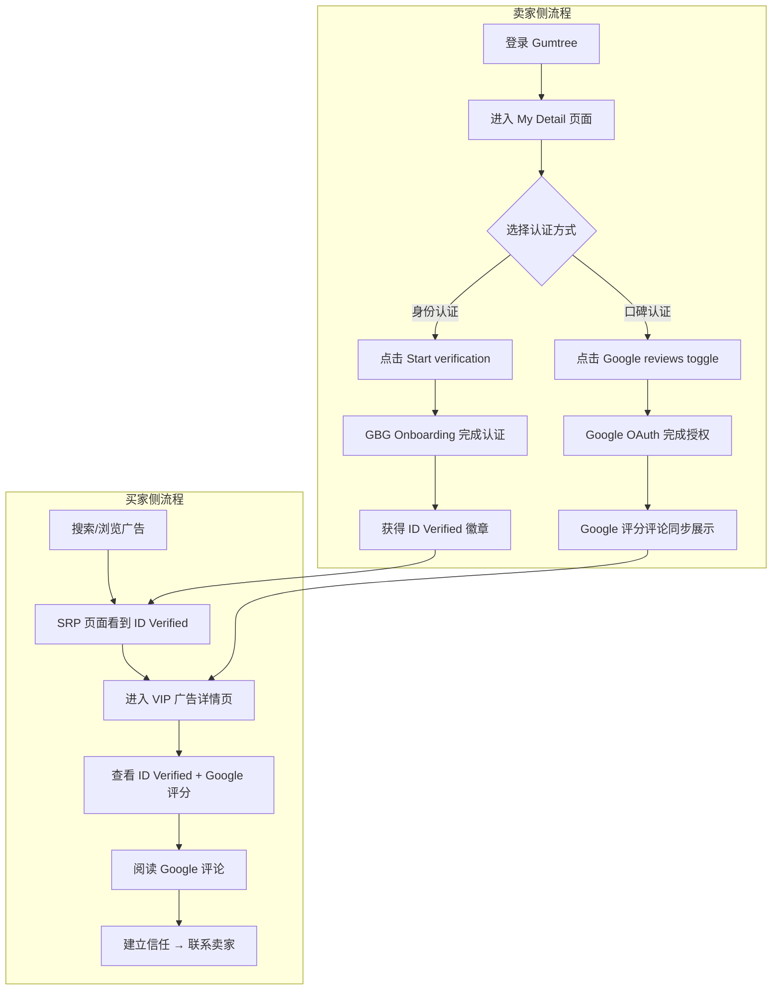
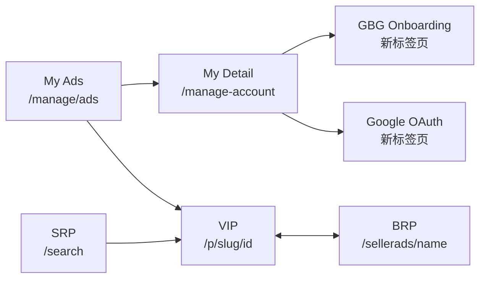
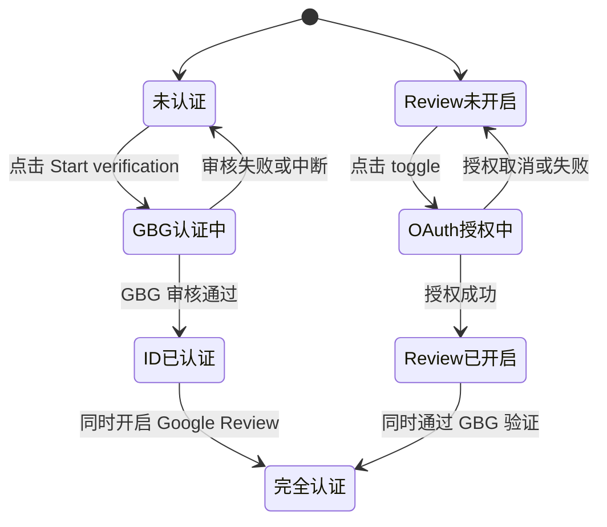

# 认证业务域 - 业务全景

## 1. 业务定位
认证业务域是 Gumtree 的核心业务之一，为卖家提供身份认证和口碑认证服务，帮助买家建立交易信心。

**业务价值**：
- 为卖家提供 "ID Verified" 徽章和 Google 评分展示，从竞争对手中脱颖而出
- 为买家提供卖家可信度参考依据（身份认证状态、Google 评分和评论）
- 为平台提供信任基础设施，提升整体交易安全性和用户满意度

**目标用户**：
- **Pro/Business 卖家**：可使用全部认证功能（GBG 身份验证 + Google Review）
- **普通消费者账户**：可使用 GBG 身份验证
- **买家/游客**：可浏览卖家的认证信息和评价

## 2. 业务范围

### 2.1 分类覆盖
| 分类 | 说明 | 子分类 |
|------|------|--------|
| 身份认证 | 通过 GBG 第三方平台完成 ID 和 Business Verification | ID Verification、Business Verification |
| 口碑认证 | 通过 Google OAuth 授权同步 Google Business Profile 评分和评论 | Google 评分同步、Google 评论展示 |

### 2.2 地域覆盖
- **Gumtree UK**：全站覆盖（staging/production）

### 2.3 用户角色
| 角色 | 权限 | 说明 |
|------|------|------|
| Pro/Business 卖家（未认证） | 发起 GBG 验证、开启 Google Review | 可使用全部认证功能 |
| Pro/Business 卖家（已认证） | 查看已认证状态、展示评分评论 | 广告展示 ID Verified 徽章和 Google 评分 |
| 普通消费者（未认证） | 发起 GBG 验证 | Google Review 功能不可见 |
| 买家/游客（未登录） | 查看卖家认证信息 | 可在 VIP/SRP 页面看到 ID Verified 和评分 |

## 3. 业务流程全景图

## 4. 核心业务流程概览

### 4.1 GBG 身份验证流程
**业务目标**：允许用户通过 GBG 第三方平台完成 ID 和 Business Verification，获得 "ID Verified" 认证徽章

**核心步骤**：
1. 未认证用户登录并进入 My Detail 页面
2. 在 Verification 区域看到引导文案和 "Start verification" 按钮
3. 点击按钮后新标签页打开 GBG Onboarding 页面
4. 在 GBG 平台完成身份信息填写和文档上传
5. 认证通过后 "ID Verified" 徽章展示在 My Detail、VIP、SRP 页面

**关键观测点**：
- ✅ Verification heading 和 "Start verification" 按钮可见
- ✅ GBG Onboarding URL 含 `onboarding`，标题含 "Welcome"
- ✅ 已认证账户展示 "now verified" 状态
- ✅ VIP 和 SRP 页面展示 "ID Verified" 标识
- ✅ 已认证账户不展示 "Start verification" 按钮

**详细流程文档**：[GBG身份验证业务流程](./GBG身份验证业务流程.md)

---

### 4.2 Google Review 认证流程
**业务目标**：允许 Pro/Business 卖家通过 Google OAuth 授权，将 Google 评分和评论同步展示到 Gumtree 平台

**核心步骤**：
1. Pro/Business 卖家在 My Ads 看到 Google Review 推荐区域
2. 点击 "Enable Google reviews" 跳转到 My Detail Ratings 区域
3. 点击 Google reviews toggle 触发 Google OAuth 授权
4. 在 Google 页面完成授权
5. 评分和评论在 VIP 页面卖家卡片和 Reviews 区域展示

**关键观测点**：
- ✅ My Ads 推荐区域标题和 Enable 按钮可见
- ✅ My Detail Ratings 区域 toggle 可见
- ✅ OAuth 新标签页 URL 含 `accounts.google.com`
- ✅ VIP 卖家卡片展示评分值（`X.X`）和评论数（`(N reviews)`）
- ✅ VIP Reviews 区域展示 "Powered by Google" 品牌标识

**详细流程文档**：[Google Review认证业务流程](./Google Review认证业务流程.md)

---

## 5. 页面拓扑关系

### 5.1 页面入口矩阵
| 页面 | My Ads 入口 | My Detail 入口 | VIP 入口 | SRP 入口 |
|------|------------|---------------|---------|---------|
| My Detail Verification | ❌ | Verification 区域 "Start verification" | ❌ | ❌ |
| My Detail Ratings | "Enable Google reviews" 按钮 | Ratings 区域 toggle | ❌ | ❌ |
| GBG Onboarding | ❌ | Start verification → 新标签页 | ❌ | ❌ |
| Google OAuth | ❌ | Toggle → 新标签页 | ❌ | ❌ |
| VIP 广告详情 | 点击广告卡片 | ❌ | - | 点击广告卡片 |
| BRP 卖家档案 | ❌ | ❌ | 卖家名称链接 | ❌ |

### 5.2 页面跳转流程图

### 5.3 页面关系详解

#### My Ads → My Detail Ratings
- **入口**："Enable Google reviews" 按钮
- **目标**：My Detail 页面 Ratings 区域（`#reviews` 锚点）
- **参数**：URL 含 `/manage-account#reviews`

#### My Detail → GBG Onboarding
- **入口**："Start verification" 按钮
- **目标**：GBG 第三方认证页面（新标签页）
- **参数**：URL 含 `onboarding`

#### My Detail → Google OAuth
- **入口**：Google reviews toggle
- **目标**：Google OAuth 授权页面（新标签页）
- **参数**：URL 含 `accounts.google.com`

#### VIP ↔ BRP
- **入口**：VIP 卖家卡片中的卖家名称链接（`a[href*='/sellerads/']`）
- **目标**：BRP 卖家档案页，点击广告卡片可返回 VIP
- **参数**：URL 含 `/sellerads/`

## 6. 业务数据流转

### 6.1 认证状态流转

### 6.2 用户操作与数据变化

| 操作 | 数据变化 | 前台展示变化 | 涉及页面 |
|------|---------|------------|---------|
| 点击 Start verification | 跳转 GBG 平台 | 新标签页打开 GBG Onboarding | My Detail |
| GBG 认证通过 | 账户获得 ID Verified 状态 | "now verified" 文案 + 徽章展示 | My Detail, VIP, SRP |
| 点击 Google reviews toggle | 跳转 Google OAuth | 新标签页打开 accounts.google.com | My Detail |
| Google OAuth 授权成功 | Google 评分评论数据同步 | 评分值、评论数、评论列表展示 | My Detail, VIP |
| 买家搜索卖家广告 | 无 | SRP 广告卡片展示 "ID Verified" | SRP |
| 买家查看广告详情 | 无 | VIP 展示 ID Verified + Google 评分评论 | VIP |

### 6.3 关键业务数据

#### 认证状态信息
| 字段 | 类型 | 必填 | 说明 |
|------|------|------|------|
| is_id_verified | Boolean | 否 | 是否通过 GBG 身份验证 |
| is_google_review_enabled | Boolean | 否 | 是否开启 Google Review |
| google_rating | Float | 否 | Google 评分值（格式 X.X，满分 5.0） |
| google_review_count | Integer | 否 | Google 评论数 |

#### 展示元素信息
| 字段 | 类型 | 必填 | 说明 |
|------|------|------|------|
| id_verified_badge | String | 否 | "ID Verified" 文本标识 |
| operates_in | String | 否 | 运营地区（格式 "Operates in {地区}"） |
| posting_since | String | 否 | 注册年限（格式 "Posting since/for {年限}"） |
| review_date | String | 否 | 评论日期（格式 "DD Month YYYY"） |
| powered_by | String | 否 | "Powered by Google" 品牌标识 |

## 7. 关键业务规则索引

### 7.1 GBG 身份验证相关
- [GBG身份验证规则.md](../../业务规则库/认证模块/GBG身份验证规则.md)

### 7.2 Google Review 认证相关
- [Google Review认证规则.md](../../业务规则库/认证模块/Google Review认证规则.md)

## 8. 业务FAQ

### Q1: Pro/Business 账户和普通消费者账户在认证功能上有什么区别？
**A**: Pro/Business 账户可以使用 GBG 身份验证和 Google Review 两项功能；普通消费者账户只能使用 GBG 身份验证，Google Review 功能入口不可见。

### Q2: Google Review 的评分和评论数据来源是什么？
**A**: 数据来源于卖家的 Google Business Profile，通过 Google OAuth 2.0 授权后同步到 Gumtree 平台。

### Q3: GBG 认证中断（关闭浏览器标签页）后会怎样？
**A**: 原 My Detail 页面状态保持不变，URL 仍为 `/manage-account`，Verification heading 仍可见，认证状态不变，用户可重新发起认证。

### Q4: 已认证的卖家在哪些页面能看到认证标识？
**A**: ID Verified 展示在 My Detail（Verification 区域）、VIP（Overview 区域）、SRP（广告卡片）；Google Review 展示在 My Detail（Ratings 区域）、VIP（卖家卡片 + Reviews 区域）。

### Q5: staging 环境和 production 环境在认证展示上有什么区别？
**A**: staging 环境的 BRP/SRP listing 卡片不渲染 Google Review 评分区块，仅 VIP 层可见。ID Verified 在 staging 环境的 SRP 正常展示。

### Q6: Google OAuth 授权取消后会发生什么？
**A**: toggle 状态不变（保持未开启），无错误提示，用户可再次点击 toggle 重新发起授权。

### Q7: 买家/未登录游客能看到卖家的认证信息吗？
**A**: 可以。ID Verified 徽章和 Google 评分评论在 VIP 和 SRP 页面对所有用户可见，不需要登录。

### Q8: GBG 认证和 Google Review 可以同时使用吗？
**A**: 可以。两项认证相互独立，Pro/Business 卖家可同时完成 GBG 身份验证和开启 Google Review，在广告中同时展示 ID Verified 和 Google 评分。

## 9. 业务指标（可选）

待补充。

## 10. 已知问题与风险

### 10.1 产品待确认问题
1. GBG 认证结果从 GBG 回传到 Gumtree 的具体回调机制待产品侧确认
2. Google Review 数据同步的频率和延迟待确认

### 10.2 技术风险
- GBG Onboarding 和 Google OAuth 为第三方服务，可用性不在 Gumtree 控制范围内
- GBG Onboarding 页面标题包含 "Welcome"（用于验证跳转成功），标题格式可能随 GBG 平台更新变化

### 10.3 测试过程中发现的问题
- staging 环境 BRP/SRP listing 卡片不渲染 Google Review 评分区块（仅 VIP 层可见）
- SRP 测试依赖精确搜索匹配广告名，模糊搜索可能导致无法定位目标广告卡片

## 11. 变更历史
| 日期 | 版本 | 变更内容 | 变更人 |
|------|------|----------|--------|
| 2026-04-15 | v1.0 | 初始版本，整合 GBG 身份验证和 Google Review 两个子模块 | 知识库管理器 |
