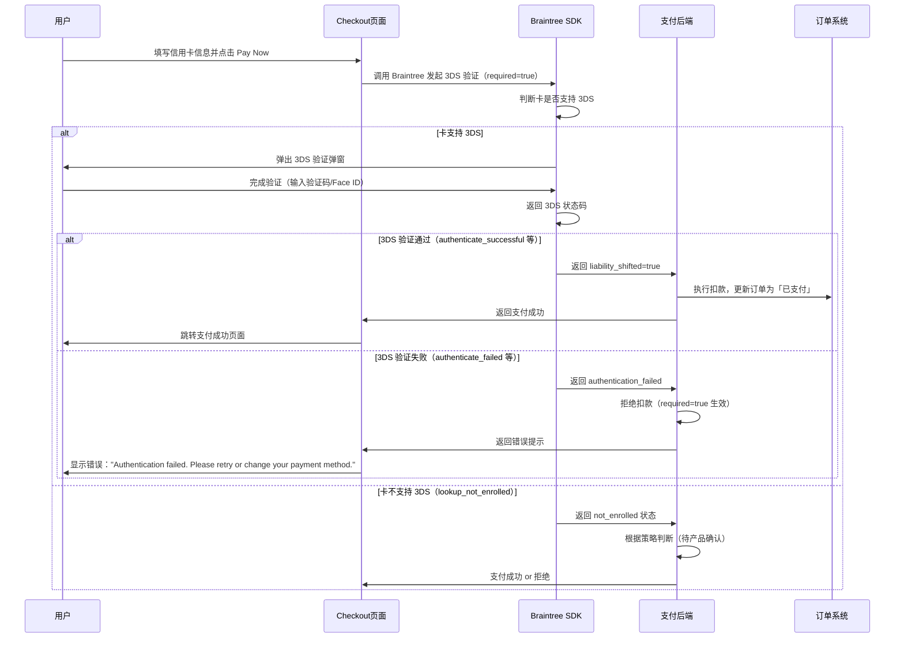

# 3DS 认证支付规则

> **文档版本**: v1.0  
> **最后更新**: 2026-03-24  
> **维护团队**: QA Team  
> **关联需求**: Fix payment bug - 3Ds Authentication bug Fixed

---

## 1. 功能概述

### 1.1 功能描述
3D Secure (3DS) 是一种在线支付安全认证协议，用于在信用卡支付过程中对持卡人身份进行验证。本功能集成 Braintree 支付网关的 3DS 2.0 认证流程，确保支付安全性并符合 PCI DSS 合规要求。

**核心修复点**：将 Braintree 3DS 参数 `required` 从 `false` 修改为 `true`，强制执行 3DS 验证失败时的支付拒绝逻辑，修复原有漏洞（3DS 失败仍扣款）。

### 1.2 用户角色
- **卖家（Seller）** - Pro 账号和 Non-Pro 账号均需通过 3DS 验证完成支付
- **系统（System）** - 自动续费（Auto-renew）场景下的支付主体

### 1.3 入口位置
- **Checkout 页面** - `/checkout`（主要支付入口）
- **My Ads 页面** - 支付失败后重新发起支付入口
- **Post Ad 流程** - Pay、Repost、Restore、Edit 触发的支付
- **Auto-renew 后台任务** - 系统定时触发的自动续费

### 1.4 依赖模块
- **Braintree SDK** - 提供 3DS 2.0 验证弹窗和状态返回
- **支付网关后端** - 处理支付请求、3DS 状态判断、扣款执行
- **订单系统** - 记录支付状态、失败原因、Auto-renew 订单历史

---

## 2. 核心流程

### 2.1 主流程：信用卡 3DS 验证支付



### 2.2 异常流程

#### 2.2.1 用户主动取消 3DS 弹窗
```
1. 用户点击「Pay Now」
2. 3DS 弹窗弹出
3. 用户点击弹窗「关闭」或按 Esc 键
4. Braintree 返回 authenticate_cancelled 状态
5. 后端拒绝扣款，返回 Checkout 页面
6. 显示错误提示："Authentication failed. Please retry or change your payment method."
```

#### 2.2.2 3DS 验证超时
```
1. 用户点击「Pay Now」
2. 3DS 弹窗弹出
3. 用户长时间未操作（5-10 分钟）
4. Braintree 返回 timeout 或 authenticate_error
5. 后端拒绝扣款，返回 Checkout 页面
6. 显示错误提示
```

#### 2.2.3 网络异常
```
1. 用户点击「Pay Now」，3DS 弹窗弹出
2. 用户在验证过程中断网
3. Braintree 返回 network_error 或 timeout
4. 后端拒绝扣款，不产生「已扣款但订单未完成」的异常状态
5. 用户恢复网络后可重新发起支付
```

---

## 3. 业务规则

### 3.1 3DS 触发规则

| 支付方式 | 是否触发 3DS | 说明 |
|---------|-------------|------|
| 信用卡（支持 3DS） | ✅ 是 | 所有支持 3DS 2.0 的信用卡强制验证 |
| 信用卡（不支持 3DS） | ❌ 否 | 如 Mastercard `5555555555554444` 不触发验证，直接支付 |
| PayPal | ❌ 否 | PayPal 有独立的认证流程，不走 3DS |
| Cash（现金） | ❌ 否 | 不涉及在线支付验证 |
| Credit Package | ❌ 否 | 平台积分，不涉及银行卡验证 |
| 组合支付（现金+Credit） | ❌ 否 | 仅当包含信用卡时触发 3DS |

### 3.2 3DS 状态码规则（24 个状态码分类）

#### ✅ 验证通过 → 允许支付

| 状态码 | 说明 | 支付行为 |
|--------|------|---------|
| `authenticate_successful` | 3DS 完整认证通过 | 支付成功 |
| `authenticate_attempt_successful` | 尝试认证，责任已转移至发卡行 | 支付成功 |
| `liability_shifted` | 欺诈责任已转移至发卡行 | 支付成功 |
| `lookup_bypassed` | 被商户规则绕过 3DS | 支付成功 |
| `data_only_successful` | 仅数据认证（无挑战） | 支付成功 |
| `exemption_low_value_successful` | 低价值交易豁免 | 支付成功 |
| `exemption_tra_successful` | 交易风险分析豁免 | 支付成功 |
| `skipped_due_to_rule` | 因规则跳过 3DS | 支付成功 |

#### ❌ 验证失败/错误 → 拒绝支付（`required=true` 核心修复点）

| 状态码 | 说明 | 支付行为 | 修复前行为 |
|--------|------|---------|-----------|
| `authenticate_failed` | 认证明确失败 | ❌ 支付被拒绝，不扣款 | ⚠️ 旧逻辑可能放行扣款（漏洞） |
| `authenticate_error` | 认证过程发生错误 | ❌ 支付被拒绝 | ⚠️ 旧逻辑可能放行 |
| `authenticate_unable_to_authenticate` | 无法完成认证 | ❌ 支付被拒绝 | ⚠️ 旧逻辑可能放行 |
| `authenticate_rejected` | 认证被明确拒绝 | ❌ 支付被拒绝 | ⚠️ 旧逻辑可能放行 |
| `authenticate_frictionless_failed` | 无感知认证失败 | ❌ 支付被拒绝 | ⚠️ 旧逻辑可能放行 |
| `authenticate_failed_acs_error` | ACS 服务器错误导致认证失败 | ❌ 支付被拒绝 | ⚠️ 旧逻辑可能放行 |
| `lookup_card_error` | 查询卡信息时出错 | ❌ 支付被拒绝 | ⚠️ 旧逻辑可能放行 |
| `lookup_server_error` | 查询服务器错误 | ❌ 支付被拒绝 | ⚠️ 旧逻辑可能放行 |
| `lookup_error` | 通用查询错误 | ❌ 支付被拒绝 | ⚠️ 旧逻辑可能放行 |
| `lookup_failed_acs_error` | ACS 错误导致查询失败 | ❌ 支付被拒绝 | ⚠️ 旧逻辑可能放行 |
| `mpi_server_error` | MPI 服务器错误 | ❌ 支付被拒绝 | ⚠️ 旧逻辑可能放行 |
| `unsupported_card` | 卡类型不支持 3DS | ❌ 支付被拒绝 | ⚠️ 旧逻辑可能放行 |
| `unsupported_account_type` | 账号类型不支持 3DS | ❌ 支付被拒绝 | ⚠️ 旧逻辑可能放行 |
| `unsupported_three_d_secure_version` | 3DS 版本不支持 | ❌ 支付被拒绝 | ⚠️ 旧逻辑可能放行 |
| `authentication_unavailable` | 3DS 服务不可用 | ❌ 支付被拒绝 | ⚠️ 旧逻辑可能放行 |

#### ⚠️ 边界状态 → 行为需确认

| 状态码 | 说明 | 支付行为 | 备注 |
|--------|------|---------|------|
| `lookup_not_enrolled` | 卡未注册 3DS | ⚠️ 待产品确认 | 需明确 `required=true` 下是否允许未注册卡支付 |
| `challenge_required` | 需要用户完成挑战 | 触发 3DS 弹窗，用户完成后支付成功；取消则拒绝 | |

### 3.3 灰度策略规则

| 灰度维度 | 规则 | 说明 |
|---------|------|------|
| 首批上线类目 | L1 类目：Motor、For Sale、Services 等（待产品提供完整清单） | 仅灰度类目内的广告支付触发新逻辑 |
| 未灰度类目 | 保持旧逻辑 | 灰度外类目不受本次修复影响 |
| 灰度隔离验证 | 灰度内卖家 3DS 失败拒绝支付；灰度外卖家行为不变 | 防止全量上线风险 |

### 3.4 Auto-renew 自动续费规则

| 场景 | 规则 | 说明 |
|------|------|------|
| 自动续费触发 3DS 验证 | 系统到达续费时间，自动发起支付，触发 3DS 验证 | 用户可能需要介入完成验证（取决于银行） |
| 3DS 验证通过 | 续费成功，订阅保持活跃 | 扣款正常 |
| 3DS 验证失败 | 续费失败，**不扣款** | 订单状态标记为失败，失败原因记录为 `Authentication_Required` |
| 历史失败订单修复 | 系统对历史 `Authentication_Required` 失败订单进行修复处理 | 不产生重复扣款，修复逻辑由产品/开发定义 |

### 3.5 重试与防重复提交规则

| 场景 | 规则 |
|------|------|
| 用户点击重试 | 3DS 失败后，用户无需重新填写表单，直接点击「Pay Now」再次触发 3DS |
| 更换支付方式 | 3DS 失败后，用户可切换至其他支付方式（PayPal、现金、Credit）完成支付 |
| 防重复提交 | 点击「Pay Now」后，按钮变为 loading/禁用状态，防止短时间内多次点击产生重复订单 |
| 从 MyAds 重新支付 | 用户可从 MyAds 页面找到支付失败的广告，点击「Pay」按钮重新发起支付 |

### 3.6 表单数据保留规则

| 场景 | 规则 |
|------|------|
| 3DS 失败后返回 Checkout | 订单商品信息、支付金额保留；卡号字段根据产品设计决定（屏蔽号码可保留，CVV 应清空） |
| 用户体验 | 用户无需重新填写所有信息即可重试 |

---

## 4. 错误处理

### 4.1 错误提示文案

| 场景 | 错误提示（英文） | 展示位置 | 样式 |
|------|-----------------|---------|------|
| 3DS 验证失败 | `Authentication failed. Please retry or change your payment method.` | Checkout 页面顶部 Banner 或支付区域内联提示 | 红色错误样式，用户可见区域内（无需滚动） |
| 3DS 验证超时 | `Authentication failed. Please retry or change your payment method.` | 同上 | 同上 |
| 用户取消 3DS | `Authentication failed. Please retry or change your payment method.` | 同上 | 同上 |
| 系统错误 | `Payment failed due to system error. Please try again later.` | 同上 | 同上 |

### 4.2 终端一致性要求

| 终端 | 错误提示文案 | UI 布局要求 |
|------|-------------|-----------|
| Web Desktop | 完整显示错误文案 | Banner 或内联提示，用户可见区域内 |
| Web Mobile | 完整显示错误文案 | 移动端布局下提示完整可见，无截断 |
| App iOS | 完整显示错误文案 | 原生 UI 错误提示，与 Web 端视觉规范一致 |
| App Android | 完整显示错误文案 | 原生 UI 错误提示，与 Web 端视觉规范一致 |

### 4.3 错误码映射（后端日志）

| Braintree 状态码 | 系统内部错误码 | 订单失败原因 |
|-----------------|--------------|-------------|
| `authenticate_failed` | `3DS_AUTH_FAILED` | `Authentication_Required` |
| `authenticate_error` | `3DS_AUTH_ERROR` | `Authentication_Required` |
| `authenticate_unable_to_authenticate` | `3DS_UNABLE_AUTH` | `Authentication_Required` |
| `lookup_card_error` | `3DS_CARD_ERROR` | `Authentication_Required` |
| `unsupported_card` | `3DS_UNSUPPORTED` | `Authentication_Required` |
| `mpi_server_error` | `3DS_SERVER_ERROR` | `System_Error` |

---

## 5. 已知问题

### 5.1 产品待确认问题

| 问题编号 | 问题描述 | 影响范围 | 状态 |
|---------|---------|---------|------|
| Q1 | `lookup_not_enrolled`（卡未注册 3DS）状态下，`required=true` 是否允许支付？ | TC046 | ⚠️ 待产品确认 |
| Q2 | Auto-renew 场景下，历史失败订单修复逻辑的具体触发方式（手动 vs. 自动）？ | TC011 | ⚠️ 待开发确认 |
| Q3 | 灰度 L1 类目的完整清单（Motor / For Sale / Services / Property / Jobs / ...）？ | TC040 | ⚠️ 待产品提供 |
| Q4 | 11100card 测试卡号在测试环境中的具体卡号？ | TC027 | ⚠️ 待测试环境确认 |

### 5.2 技术风险

| 风险编号 | 风险描述 | 缓解措施 | 状态 |
|---------|---------|---------|------|
| R1 | Braintree 3DS 弹窗在部分浏览器/设备上可能被拦截（弹窗拦截器） | 前端引导用户允许弹窗，或使用内嵌 iframe 方式 | ⚠️ 需前端评估 |
| R2 | 3DS 验证过程中断网可能导致订单状态不一致 | 增强网络异常处理逻辑，TC020 已覆盖验证 | ✅ 已测试覆盖 |
| R3 | App 端 WebView 环境中 3DS 弹窗可能无法正常展示 | App 端使用原生浏览器打开 3DS 验证，或内嵌 WebView 配置正确 | ⚠️ 需 App 开发评估 |

### 5.3 测试过程中发现的问题

| 问题编号 | 问题描述 | Jira 链接 | 状态 |
|---------|---------|-----------|------|
| BUG-001 | 【待测试后补充】 | - | - |

---

## 6. 变更历史

| 日期 | 版本 | 变更内容 | 变更人 |
|------|------|---------|--------|
| 2026-03-24 | v1.0 | 初始版本：从 TC_3ds_auth_bug_fix.md 提取业务规则，建立规则文档 | QA Team |

---

## 关联文档

- [3DS 认证支付业务流程](../../业务知识图谱/支付业务域/3DS认证支付业务流程.md)
- [支付业务全景](../../业务知识图谱/支付业务域/支付业务全景.md)
- [测试用例文档](../../test_cases/payment/TC_3ds_auth_bug_fix.md)

---

## 参考资料

- Braintree 3D Secure 2.0 文档：https://developer.paypal.com/braintree/docs/guides/3d-secure/overview
- Braintree 测试卡号参考：https://developer.paypal.com/braintree/docs/guides/3d-secure/testing-go-live/ruby
- PCI DSS 3DS 要求：https://www.pcisecuritystandards.org/
