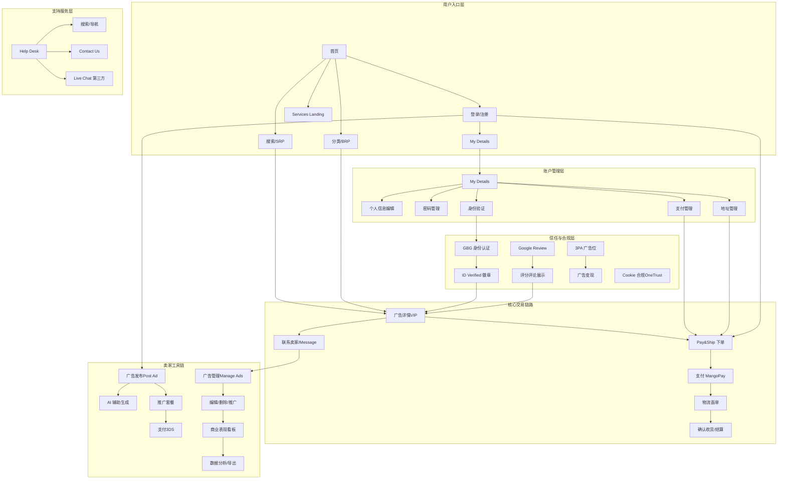

# Gumtree UK - 功能模块清单

> 本文档是 Gumtree UK 平台的功能模块全景索引，汇总所有已覆盖业务域的功能范围、优先级与文档链接。

---

## 产品定位

Gumtree UK 是英国领先的本地分类信息平台，连接买卖双方、服务提供方与求购者，覆盖二手商品、汽车、房产、服务、招聘等核心类目。平台以**免费发布广告**为核心竞争力，通过推广套餐、Pay&Ship 到家交易、Pro 商业工具实现商业变现。

---

## 核心业务模块

| 业务域 | 模块名 | 核心功能 | 用户角色 | 优先级 | 文档链接 |
|--------|--------|---------|---------|--------|---------|
| Buyer | 首页模块 | 搜索入口、分类导航、商品浏览、发帖引导、登录注册浮层 | 访客、已登录用户 | P0 | [首页业务全景](../业务知识图谱/buyer/首页业务域/首页业务全景.md) |
| Buyer | 登录模块 | 弹窗登录、独立登录页、社交登录（Apple/Google/Facebook）、忘记密码 | 未登录访客 | P0 | [登录业务全景](../业务知识图谱/buyer/登录业务域/登录业务全景.md) |
| Buyer | 注册模块 | 弹窗注册、独立注册页、邮箱注册、社交注册、密码强度校验 | 新访客 | P0 | [注册业务全景](../业务知识图谱/buyer/注册业务域/注册业务全景.md) |
| Buyer | 搜索模块 | 关键词搜索、联想词、历史记录、排序、价格/地域/属性筛选、Nearby 扩展、保存 Alert | 游客、注册用户 | P0 | [搜索业务全景](../业务知识图谱/搜索业务域/搜索业务全景.md) |
| Buyer | BRP 筛选模块 | App 端多维属性筛选（Category 下钻、价格区间、多选/单选属性）、0 结果保存搜索 | 访客、已登录买家 | P1 | [BRP筛选业务全景](../业务知识图谱/buyer/BRP筛选业务域/BRP筛选业务全景.md) |
| Buyer | 收藏模块 | 广告收藏/取消收藏、Favourites 列表、未登录拦截、Search Alerts 管理 | 已登录买家 | P1 | [收藏业务全景](../业务知识图谱/buyer/收藏业务域/收藏业务全景.md) |
| Buyer | My Details 模块 | 个人信息管理、联系信息编辑、密码修改、支付地址管理、评价管理、身份验证入口、营销偏好、CV上传 | 已登录用户 | P0 | [My Details业务全景](../业务知识图谱/buyer/My%20Details业务域/My%20Details业务全景.md) |
| Seller | 广告发布模块 | 类目选择、表单填写、AI 辅助生成（iOS）、照片上传、推广套餐选择、草稿自动保存 | 登录用户（卖家） | P0 | [Seller业务全景](../业务知识图谱/Seller业务域/Seller业务全景.md) |
| Seller | 广告管理模块 | Active/Expired/Sold 广告列表、查看/编辑/删除/推广广告、广告状态管理 | 登录用户（卖家） | P0 | [Seller业务全景](../业务知识图谱/Seller业务域/Seller业务全景.md) |
| Seller | 推广功能模块 | Featured 置顶（3/7/14天）、Urgent 急售标签（7天）、Spotlight 首页展示（7天）、支付 | 登录用户（卖家） | P1 | [Seller业务全景](../业务知识图谱/Seller业务域/Seller业务全景.md) |
| 交易 | Pay&Ship 模块 | 在线支付（MangoPay/Google Pay/Apple Pay）、物流面单创建、物流状态追踪、确认收货、资金结算 | 买家、卖家（需 KYC） | P0 | [Pay&Ship业务全景](../业务知识图谱/Pay&Ship业务域/Pay&Ship业务全景.md) |
| 通信 | Message 模块 | 会话列表（30条/页）、文字/图片/视频消息、Make an Offer 议价、拉黑/举报/删除、未读消息同步 | 买家、卖家 | P0 | [Message业务全景](../业务知识图谱/Message业务域/Message业务全景.md) |
| 信任体系 | 认证模块 | GBG 身份验证（ID Verified 徽章）、Google Review 口碑认证（OAuth 同步评分/评论） | Pro/Business 卖家、普通卖家 | P1 | [认证业务全景](../业务知识图谱/认证业务域/认证业务全景.md) |
| 商业数据 | 商业表现看板 | 核心指标看板（Search Views/Ad Views 等）、时间筛选、地理位置分析、广告明细表、数据导出 | Pro Account 卖家 | P1 | [商业表现看板业务全景](../业务知识图谱/商业表现看板业务域/商业表现看板业务全景.md) |
| 商业数据 | Remaining Credit Allowance | Pro 账号 Manage My Ads 页面 credit 余额统计卡片，hover 展示各广告类型明细 | Pro Account 卖家 | P2 | [商业表现看板业务全景](../业务知识图谱/商业表现看板业务域/商业表现看板业务全景.md) |
| 广告变现 | 3PA 广告模块 | 主页 4 个广告位、BRP 12 个广告位、Bing/Google AFS 文本广告、懒加载、追踪统计 | 网站访客（被动）、广告主 | P1 | [3PA广告业务全景](../业务知识图谱/3PA广告业务域/3PA广告业务全景.md) |
| 服务类目 | Services 模块 | Service Landing 页、服务 SRP/BRP、Gumtree/Bark 广告分层策略、VIP 商家主页、Request a quote | 访客、服务买家 | P1 | [Services业务全景](../业务知识图谱/Services业务域/Services业务全景.md) |
| 支付基础设施 | 3DS 认证支付 | 3D Secure OTP 验证、支付超时处理、支付状态追踪 | 买家（推广/Pay&Ship 支付场景） | P0 | [3DS认证支付业务流程](../业务知识图谱/支付业务域/3DS认证支付业务流程.md) |
| 支持服务 | Help Desk 模块 | 搜索帮助文章、导航树浏览、文章详情查看、Contact Us、Live Chat | 访客（未登录） | P1 | [Help Desk业务全景](../业务知识图谱/Help%20Desk业务域/Help%20Desk业务全景.md) |

---

## 功能模块关系图

---

## 支撑功能模块

| 模块名 | 说明 | 覆盖范围 |
|--------|------|---------|
| Cookie 合规（OneTrust） | 隐私横幅、Accept/Reject/Manage 三种操作，影响 3PA 广告加载 | 全站（首页、独立登录页、各子域） |
| Session 管理 | 跨页面、跨子域（www / my 子域）登录态保持 | 全站 |
| 搜索 Alert 订阅 | 用户保存搜索条件，新广告出现时邮件通知 | 搜索结果页、BRP |
| Cars 类目落地页 | 汽车专属分类浏览入口，含独立筛选逻辑 | Cars BRP/SRP |
| Bark 集成（Services SRP） | Services 搜索结果中混入 Bark 第三方服务广告，Gumtree 广告优先 | Services SRP/BRP |
| Account Switcher | Pro 多账号 UID 切换，商业表现看板中查看不同账号数据 | 商业表现看板 |

---

## 平台覆盖范围

| 维度 | 说明 |
|------|------|
| 地域 | Gumtree UK（英国全境），货币 £ |
| Web 端 | www.gumtree.com / my.gumtree.com / www.unicorn.gumtree.io（测试） |
| App 端 | Android（com.gumtree.android）/ iOS（com.gumtreeuk2.iphone） |
| 测试环境 | prod / staging / zoidberg / bixi / gaga / unicorn / taro |
| 第三方依赖 | MangoPay（支付）、Evri（物流）、GBG（身份认证）、Google Ads / Bing（广告变现）、Bark（服务类广告）、Google OAuth（Review 认证） |

---

## 变更历史

| 日期 | 版本 | 变更内容 | 变更人 |
|------|------|---------|--------|
| 2026-04-17 | v1.0 | 初始版本，基于知识库现有业务域（buyer、Seller、Pay&Ship、Message、认证、搜索、商业表现看板、3PA广告、Services）自动归纳生成 | AI Agent |
| 2026-04-22 | v1.1 | 新增 My Details 模块（Buyer 业务域），包含个人信息管理、密码修改、支付地址管理等核心功能；更新功能模块关系图，增加账户管理层 | AI Agent |
| 2026-04-22 | v1.2 | 新增 Help Desk 模块（支持服务业务域），包含搜索、导航树、文章详情、Contact Us、Live Chat 等核心功能；更新功能模块关系图，增加支持服务层 | QA Agent |
