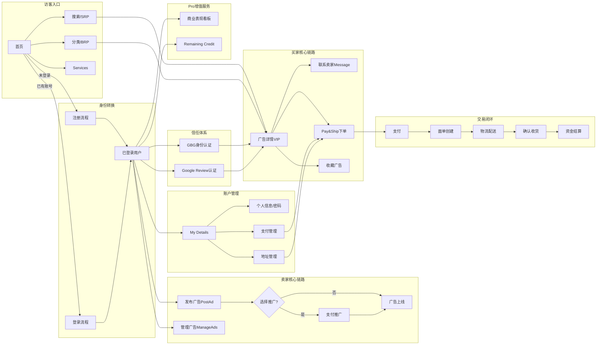
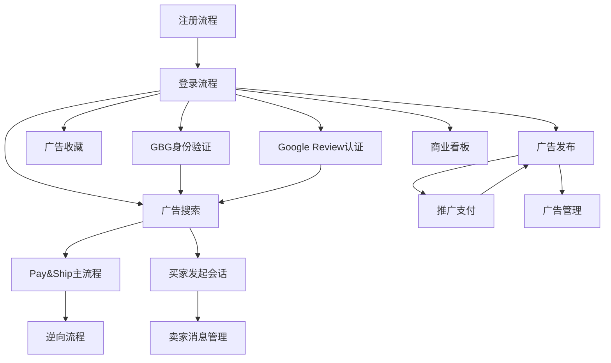

# Gumtree UK - 核心业务流程总览

> 本文档汇总 Gumtree UK 平台所有核心业务流程的概览描述，每个流程指向对应的详细文档。

---

## 全平台业务流程总览图

---

## 一、Buyer 业务域

### 流程 1：首页访问与浏览
- **业务目标**：为访客提供商品浏览、搜索入口和发帖/注册引导，实现访客分流与转化
- **关键步骤**：访问首页 → 处理 Cookie 合规 → 浏览顶栏/Hero 区/Good Finds → 触发搜索或分类导航 → 未登录时发帖/收藏触发登录引导浮层
- **涉及角色**：访客、已登录用户、已登录 Pro 用户
- **详细文档**：[首页访问与浏览业务流程](../业务知识图谱/buyer/首页业务域/首页访问与浏览业务流程.md)

---

### 流程 2：注册流程（弹窗 & 独立注册页）
- **业务目标**：将新访客转化为注册用户，解锁发帖、收藏、消息等核心功能
- **关键步骤**：
  - **弹窗路径**：点击首页 Sign up / 登录弹窗内 Sign up → 弹窗注册表单（4字段 + 密码实时 Checklist）→ 注册成功
  - **独立页路径**：访问 `/create-account` → 处理 Cookie 横幅 → 填写表单 → Register → 注册成功
- **涉及角色**：新访客
- **详细文档**：[注册业务全景](../业务知识图谱/buyer/注册业务域/注册业务全景.md)

---

### 流程 3：登录流程（弹窗 & 独立登录页）
- **业务目标**：让存量用户快速完成身份验证，重新获得平台核心功能访问权限
- **关键步骤**：
  - **弹窗路径**：点击顶栏 Login / Post an Ad / Save Ad → 弹窗 → 选择登录方式 → 登录成功（停留首页）
  - **独立页路径**：访问 `my.*/login` → 处理 Cookie 横幅 → 填写表单 → 登录成功（跳转 manage/ads）
- **涉及角色**：未登录存量用户
- **关键规则**：弹窗 Continue 按钮 disabled 校验（需 Email + Password 均填写）；独立页 Login 始终 enabled；两种入口错误文案不一致
- **详细文档**：[弹窗登录业务流程](../业务知识图谱/buyer/登录业务域/弹窗登录业务流程.md) | [独立登录页业务流程](../业务知识图谱/buyer/登录业务域/独立登录页业务流程.md)

---

### 流程 4：广告搜索与发现
- **业务目标**：用户通过关键词在全英或指定地域内快速找到目标广告
- **关键步骤**：首页搜索框输入关键词（≥2字符触发联想词） → 触发搜索 → SRP 展示结果 → 排序/筛选/地域过滤 → 点击广告进入详情
- **涉及角色**：游客、注册用户
- **关键规则**：排序从第 6 条验证（跳过前 5 条 Featured 置顶）；局部搜索结果 < 100 条自动展示 Nearby 扩展
- **详细文档**：[搜索业务流程](../业务知识图谱/搜索业务域/搜索业务流程.md)

---

### 流程 5：保存搜索 Alert
- **业务目标**：登录用户订阅特定搜索条件的新广告通知，持续追踪感兴趣的商品
- **关键步骤**：执行搜索 → 点击 Save search alert → 出现保存成功提示"Your alert is set" → 可跳转 `/my-account/saved-searches` 管理/删除
- **涉及角色**：注册用户（需登录）
- **详细文档**：[搜索业务流程](../业务知识图谱/搜索业务域/搜索业务流程.md)

---

### 流程 6：BRP 精准筛选（App 端）
- **业务目标**：买家在浏览结果页通过多维属性组合筛选，快速精准定位目标广告
- **关键步骤**：进入 BRP → 点击 Filter chip → Category 下钻 → 设置价格区间 → 多选/单选属性 → Show Results 跳回 BRP
- **涉及角色**：访客、已登录买家
- **关键规则**：多选属性 < 5 项全选，≥ 5 项选 5 个；Min > Max 仍允许提交；0 结果时展示 Save search 按钮
- **详细文档**：[MobilePhones筛选业务流程](../业务知识图谱/buyer/BRP筛选业务域/MobilePhones筛选业务流程.md) | [Dogs筛选业务流程](../业务知识图谱/buyer/BRP筛选业务域/Dogs筛选业务流程.md)

---

### 流程 7：广告收藏（App 端）
- **业务目标**：买家将感兴趣的广告保存到 Favourites 列表，跨会话持续追踪
- **关键步骤**：点击首页/详情页爱心图标 → 收藏成功 → 进入 Saved Tab 查看 Favourites 列表 → 可取消收藏
- **涉及角色**：已登录买家；未登录访客触发登录引导
- **详细文档**：[收藏广告业务流程](../业务知识图谱/buyer/收藏业务域/收藏广告业务流程.md)

---

### 流程 8：My Details 账户管理
- **业务目标**：为已登录用户提供统一的账户信息管理中心，支持个人信息、支付地址、密码、营销偏好等核心设置的查看和编辑
- **关键步骤**：
  1. 登录后访问 `/manage-account` → 页面展示个人信息卡片
  2. **联系信息编辑**：点击 Edit contact details → 弹出对话框 → 修改姓名/电话 → 验证通过后保存
  3. **密码修改**：点击 Edit password → 填写当前密码和新密码 → 三字段填写完整后 Continue 激活 → 提交更新
  4. **支付管理**：点击 Manage payment → 跳转支付管理页 `/manage-payment` → 添加/编辑支付方式 → Back 返回
  5. **地址管理**：点击 Manage address → 跳转地址管理页 `/manage-postage` → 管理配送地址 → Back 返回
  6. **身份验证**：点击 Start verification → 新标签页打开外部验证服务
  7. **营销偏好**：切换复选框 → 状态立即保存
- **涉及角色**：已登录用户（买家/卖家通用）
- **关键规则**：未登录访问自动跳转登录页（callback 参数）；First name/Last name 仅允许字母；密码 Continue 按钮 disabled 校验（三字段均填写后激活）
- **详细文档**：[My Details管理业务流程](../业务知识图谱/buyer/My%20Details业务域/My%20Details管理业务流程.md)

---

## 二、Seller 业务域

### 流程 9：广告发布
- **业务目标**：帮助卖家快速创建并发布 For Sale 类目广告，提供 AI 辅助和手动填写两种方式
- **关键步骤**：
  1. 登录 → 进入 Post Ad 入口页，系统检测草稿
  2. 选择类目（搜索或浏览 4 级类目树）
  3. 上传照片触发 AI 识别，自动生成标题和描述（iOS）
  4. 填写 Price/Location/Condition 等必填字段
  5. 可选择推广套餐（Featured/Urgent/Spotlight）
  6. 点击"Post my Ad"提交 → 若有推广跳转支付页 → 发布成功
- **涉及角色**：登录用户（卖家）
- **关键规则**：AI 生成超时 30 秒显示降级提示；草稿自动保存（30秒间隔）；类目选择后 URL 含正确 categoryId
- **详细文档**：[广告发布业务流程](../业务知识图谱/Seller业务域/广告发布业务流程.md)

---

### 流程 10：广告管理（Manage my Ads）
- **业务目标**：为卖家提供便捷的广告管理工具，支持查看、编辑、删除、推广已发布广告
- **关键步骤**：导航到 Manage Ads → 点击 Active ads 标签 → 鼠标悬停显示"三个点"操作按钮 → 选择操作（View/Edit/Delete/Promote）→ 执行对应流程
- **涉及角色**：登录用户（卖家）
- **关键规则**：删除需二次确认弹窗；编辑页面预填充原内容；Category 字段不可编辑
- **详细文档**：[Seller业务全景](../业务知识图谱/Seller业务域/Seller业务全景.md)

---

### 流程 11：推广支付
- **业务目标**：卖家通过支付推广套餐提升广告曝光和排名，增加成交机会
- **关键步骤**：选择推广套餐（Featured/Urgent/Spotlight，可多选）→ Featured 选天数（3/7/14）→ 点击 Continue → 处理自动续费确认弹窗 → 支付页点击"Pay Now" → 可能触发 3D Secure OTP 验证 → 支付成功 → 推广生效
- **涉及角色**：登录用户（卖家）
- **关键规则**：OTP 测试输入"1234"；OTP iframe 加载等待 10 秒；并非所有支付都触发 3D Secure
- **详细文档**：[3DS认证支付业务流程](../业务知识图谱/支付业务域/3DS认证支付业务流程.md)

---

## 三、Pay&Ship 业务域

## 三、交易业务域

### 流程 12：Pay&Ship 到家正向流程（主流程）
- **业务目标**：为买卖双方提供完整的"下单支付 → 面单创建 → 物流配送 → 签收确认"到家配送交易体验
- **关键步骤**：
  1. 卖家创建启用配送的广告（指定 parcel_size）
  2. 买家搜索商品 → 进入 VIP → 点击"Buy now" → 选择 Home delivery
  3. 买家填写收货地址 → 点击"Confirm & Pay"完成支付（获取 8 位订单号）
  4. 卖家创建面单（Create label → Continue），面单创建后不可取消
  5. 物流揽收（AC）→ 在途（IT）→ 配送中（AT）→ 签收（DE）
  6. 买家点击"I'm happy with my item"确认收货 → 订单 Completed
  7. 系统 24 小时后向卖家打款（Payout）
- **涉及角色**：买家（需注册 + 支付卡）、卖家（需 KYC 认证 + MangoPay 钱包）
- **详细文档**：[Pay&Ship到家正向流程业务流程](../业务知识图谱/Pay&Ship业务域/Pay&Ship到家正向流程业务流程.md)

---

### 流程 13：Pay&Ship 逆向流程（取消/退款/客诉）
- **业务目标**：处理买家上报问题、双方取消订单、客诉退款等异常场景
- **关键步骤**：物流签收后 48 小时内买家上报问题 → 创建 Salesforce 客诉工单 → 客服审核退款；或双方在面单创建前取消订单（5 分钟超时自动取消 / 7 天未发货自动取消）
- **涉及角色**：买家、卖家、客服
- **关键规则**：面单创建后不可取消；Disputed 状态超 28 天自动关闭；物流 IT/AT 状态不影响订单状态
- **详细文档**：[PayShip逆向流程业务流程](../业务知识图谱/Pay&Ship业务域/PayShip逆向流程业务流程.md)

---

## 四、Message 业务域

## 四、通信业务域

### 流程 14：买家发起会话与沟通
- **业务目标**：买家通过广告详情页主动发起与卖家的会话，完成咨询沟通与议价
- **关键步骤**：点击 VIP 页"Contact seller" → 触发登录引导（未登录）→ 进入消息中心 → 发送文字/图片/视频消息 → 可发起 Make an Offer 出价（For Sale 类目预设折扣）
- **涉及角色**：买家（需登录）、卖家
- **关键规则**：同一广告只能有一条会话；图片最多 5 张；视频 ≤ 5MB；Buyer 发送 5 条消息后弹出评价提示
- **详细文档**：[消息中心业务流程](../业务知识图谱/Message业务域/消息中心业务流程.md)

---

### 流程 15：卖家消息管理
- **业务目标**：卖家统一管理买家消息，跟进意向买家，回复咨询，主动出价
- **关键步骤**：进入消息中心 → 查看会话列表（最多 30 条/页，懒加载）→ 点击会话 → 回复消息 → 可发起反向出价（Motors 类目自定义金额）→ 可删除/拉黑/举报买家
- **涉及角色**：卖家（需登录）
- **关键规则**：拉黑为单向静默（不通知对方）；删除会话为单边删除；未读徽章三端同步
- **详细文档**：[消息中心业务流程](../业务知识图谱/Message业务域/消息中心业务流程.md)

---

## 五、认证业务域

## 五、信任体系业务域

### 流程 16：GBG 身份验证
- **业务目标**：用户通过 GBG 第三方平台完成 ID/Business Verification，获得"ID Verified"认证徽章，提升买家信任
- **关键步骤**：登录 → My Detail 页面 → 点击"Start verification" → 新标签页打开 GBG Onboarding → 完成认证 → ID Verified 徽章展示在 My Detail/VIP/SRP
- **涉及角色**：Pro/Business 卖家、普通消费者账户
- **详细文档**：[GBG身份验证业务流程](../业务知识图谱/认证业务域/GBG身份验证业务流程.md)

---

### 流程 17：Google Review 口碑认证
- **业务目标**：Pro/Business 卖家通过 Google OAuth 将 Google Business Profile 评分和评论同步到 Gumtree 广告
- **关键步骤**：My Ads 页看到 Google Review 推荐区域 → 点击"Enable Google reviews" → 跳转 My Detail Ratings 区域 → 点击 toggle → Google OAuth 授权 → 评分评论在 VIP 展示
- **涉及角色**：Pro/Business 卖家（仅限）
- **详细文档**：[Google Review认证业务流程](../业务知识图谱/认证业务域/Google%20Review认证业务流程.md)

---

## 六、商业表现看板业务域

## 六、商业数据业务域

### 流程 18：商业数据看板访问与浏览
- **业务目标**：Pro 卖家查看广告表现数据，分析商业收益并优化广告投放策略
- **关键步骤**：登录 Pro 账号 → 进入商业表现看板 → 查看核心指标（Search Views/Ad Views/Unique Replies 等）→ 切换时间范围（Last 7/30 days）→ 查看地理位置分析 → 查看广告明细表 → 可导出 Excel
- **涉及角色**：Pro Account 卖家（仅限）
- **关键规则**：非 Pro 账号显示升级提示；未登录重定向登录页；多账号 UID 支持 Account Switcher
- **详细文档**：[商业表现看板访问与浏览业务流程](../业务知识图谱/商业表现看板业务域/商业表现看板访问与浏览业务流程.md)

---

### 流程 19：Remaining Credit Allowance 查看
- **业务目标**：Pro 卖家在 Manage My Ads 页快速了解账号剩余 credit 余额及各广告类型明细
- **关键步骤**：进入 Manage My Ads → 查看统计卡片总余额 → 鼠标悬浮触发明细面板，展示各广告类型 credit 余额
- **涉及角色**：Pro Account 卖家（仅限）
- **详细文档**：[Remaining Credit Allowance查看业务流程](../业务知识图谱/商业表现看板业务域/Remaining%20Credit%20Allowance查看业务流程.md)

---

## 七、3PA 广告业务域

## 七、广告变现业务域

### 流程 20：主页广告位验证
- **业务目标**：验证主页 4 个第三方展示广告位的正常加载与渲染，确保广告变现链路正常
- **关键步骤**：访问主页 → 接受 Cookie → Google Ads SDK 加载 → 4 个广告位容器创建 → 广告内容异步注入 → 验证 iframe 渲染与尺寸
- **涉及角色**：网站访客（被动）、广告系统
- **详细文档**：[主页广告位验证业务流程](../业务知识图谱/3PA广告业务域/主页广告位验证业务流程.md)

---

### 流程 21：BRP 页面广告位验证
- **业务目标**：验证 BRP 页面 12 个广告位（含 Bing/Google AFS 文本广告）的正常加载与懒加载机制
- **关键步骤**：访问 BRP 页面 → 滚动触发懒加载 → Bing 文本广告（主）/ Google AFS（备用）加载 → 验证 article 结构与 100% 加载率
- **涉及角色**：网站访客（被动）、广告系统
- **详细文档**：[BRP页面广告位验证业务流程](../业务知识图谱/3PA广告业务域/BRP页面广告位验证业务流程.md)

---

## 八、Services 业务域

## 八、服务类目业务域

### 流程 22：GT 类广告 Services-Web 浏览
- **业务目标**：访客在 Gumtree Services Web 端找到所需本地服务，完成询价或进店
- **关键步骤**：访问 `/business-services` Landing 页 → 搜索服务/点击类目 → 进入 Services SRP/BRP → 浏览 Gumtree 优先 + Bark 补充的广告卡片 → 点击"Request a quote"或进入 VIP 商家主页
- **涉及角色**：访客
- **详细文档**：[GT类广告Services-Web业务流程](../业务知识图谱/Services业务域/GT类广告Services-Web业务流程.md)

---

### 流程 23：Bark 集成 SRP 浏览
- **业务目标**：在 Gumtree 自有广告耗尽后，通过 Bark 第三方广告补充结果，维持 SRP 结果页的丰富度
- **关键步骤**：搜索服务 → SRP 先展示 Gumtree 广告 → Gumtree 广告耗尽后展示 Bark 广告 → 识别 Bark CTA（Request a quote from Bark）→ 点击 Bark 卡片跳转 Bark 页面
- **涉及角色**：访客
- **关键规则**：Gumtree 广告优先级高于 Bark；Bark 广告以 Bark CTA 识别
- **详细文档**：[Bark集成SRP浏览业务流程](../业务知识图谱/Services业务域/Bark集成SRP浏览业务流程.md)

---

## 业务流程依赖关系

---

## 变更历史

| 日期 | 版本 | 变更内容 | 变更人 |
|------|------|---------|--------|
| 2026-04-17 | v1.0 | 初始版本，基于知识库现有 22 个业务流程自动归纳生成（buyer、Seller、Pay&Ship、Message、认证、搜索、商业表现看板、3PA广告、Services） | AI Agent |
| 2026-04-22 | v1.1 | 新增流程 8：My Details 账户管理（个人信息、密码、支付地址管理）；更新业务流程总览图，增加账户管理层；后续流程编号顺延至 23 个流程 | AI Agent |
