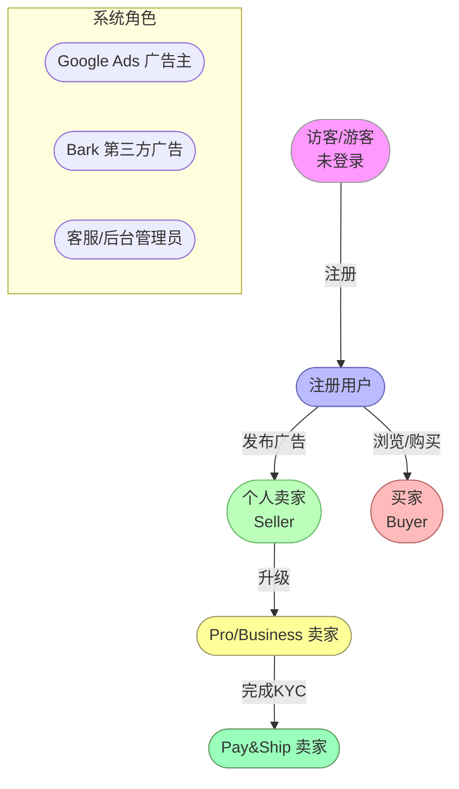
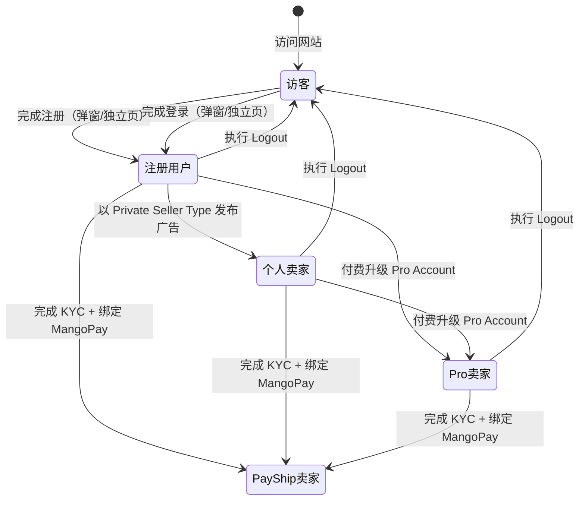

# Gumtree UK - 用户角色与权限体系

> 本文档定义 Gumtree UK 平台所有用户角色、权限范围及角色转换路径，供产品、测试、开发团队统一参考。

---

## 角色总览图

---

## 前台用户角色

### 角色 1：访客（游客/未登录用户）

**角色定义**：未注册或未登录即访问平台的用户，是平台最大的流量群体。

**适用场景**：首次访问、浏览商品、搜索广告、查看分类

| 功能模块 | 权限 | 说明 |
|---------|------|------|
| 首页访问与浏览 | ✅ 完全访问 | 浏览热门分类、Good Finds 商品列表 |
| 搜索与筛选 | ✅ 完全访问 | 关键词搜索、排序、价格/地域/属性筛选、BRP 筛选 |
| 广告详情页（VIP） | ✅ 完全访问 | 查看广告完整信息、卖家认证信息 |
| Services 浏览 | ✅ 完全访问 | Landing 页、SRP/BRP、VIP 商家主页 |
| 3PA 广告 | ✅ 被动接收 | 接受 Cookie 后可见第三方广告 |
| BRP 筛选（App）| ✅ 完全访问 | 无需登录即可使用全部筛选功能 |
| 注册 | ✅ 可操作 | 通过弹窗或独立注册页创建账号 |
| 登录 | ✅ 可操作 | 通过弹窗或独立登录页登录 |
| 收藏广告 | ❌ 触发登录引导 | 点击 Saved Tab 或爱心图标时触发 |
| 广告发布（Post Ad）| ❌ 触发登录引导 | 跳转独立登录页或弹窗 |
| 消息/沟通 | ❌ 触发登录引导 | 点击 Contact seller 后引导登录 |
| 保存搜索 Alert | ❌ 触发登录引导 | 需登录才可订阅 |
| Pay&Ship 下单 | ❌ 需登录 | 点击 Buy now 后触发登录流程 |
| 商业表现看板 | ❌ 无权限 | 重定向至登录页 |

---

### 角色 2：注册用户（已登录买家）

**角色定义**：完成注册并登录的用户，具备完整的买家功能权限，也可兼任卖家。

**适用场景**：收藏、搜索 Alert、发起消息、Pay&Ship 购买

| 功能模块 | 权限 | 说明 |
|---------|------|------|
| 访客所有权限 | ✅ 继承 | |
| 收藏广告 | ✅ 完全访问 | 收藏/取消收藏、Favourites 列表管理 |
| 消息中心（买家） | ✅ 完全访问 | 发起会话、发送消息、Make an Offer、拉黑/举报 |
| 保存搜索 Alert | ✅ 完全访问 | 订阅、管理、删除 |
| Pay&Ship 下单（买家）| ✅ 完全访问 | 需添加支付卡；选择配送方式、填写地址、支付 |
| 广告发布（Post Ad）| ✅ 完全访问 | 发布 For Sale 类目广告，最多 20 张照片 |
| 广告管理（Manage Ads）| ✅ 完全访问 | 查看/编辑/删除/推广自己的广告 |
| 推广套餐 | ✅ 可购买 | Featured/Urgent/Spotlight |
| Spotlight 推广 | ⚠️ 待确认 | 可能需满足条件（新用户/低信誉可能被锁定）|
| GBG 身份验证 | ✅ 可发起 | 通过 GBG 平台完成 ID 认证 |
| Google Review 认证 | ❌ 无权限 | 仅限 Pro/Business 卖家 |
| 商业表现看板 | ❌ 无权限 | 显示升级至 Pro 提示 |
| Remaining Credit Allowance | ❌ 无权限 | 仅 Pro 账号可见 |

---

### 角色 3：个人卖家（Private Seller）

**角色定义**：注册用户以 `Seller Type = Private` 发布广告，是注册用户角色的子集，无需额外升级。

**核心特征**：占平台卖家约 70%，主要出售二手物品

| 功能模块 | 权限 | 说明 |
|---------|------|------|
| 注册用户所有权限 | ✅ 继承 | |
| AI 辅助发布（iOS）| ✅ 可使用 | Genesis Phase 1，仅限 iOS 移动端 |
| 草稿自动保存 | ✅ 可使用 | 30 秒间隔自动保存 |
| Pay&Ship 卖家（发面单）| ⚠️ 需 KYC 认证 | 需完成 KYC 并绑定 MangoPay 钱包 + 银行账户 |
| Google Review 认证 | ❌ 无权限 | 仅 Pro/Business 可见 |
| 商业表现看板 | ❌ 无权限 | 显示升级提示 |

---

### 角色 4：Pro/Business 卖家

**角色定义**：通过付费升级为 Pro 账号的卖家，或以 `Seller Type = Business` 注册的商家，具备全量功能权限。

**核心特征**：占平台卖家约 25%，频繁发布商品，注重数据分析

| 功能模块 | 权限 | 说明 |
|---------|------|------|
| 个人卖家所有权限 | ✅ 继承 | |
| Google Review 认证 | ✅ 完全访问 | 通过 Google OAuth 同步 Google Business Profile 评分评论 |
| 商业表现看板 | ✅ 完全访问 | 核心指标、时间筛选、地理位置分析、广告明细导出 |
| Remaining Credit Allowance | ✅ 完全访问 | Manage My Ads 页查看 credit 余额及明细 |
| Account Switcher | ✅ 可使用 | 多账号 UID 切换，查看不同账号的商业数据 |
| Manage Job Ads | ✅ 可访问 | 跳转 recruiters.gumtree.com |

---

### 角色 5：Pay&Ship 卖家（已 KYC 认证）

**角色定义**：完成 KYC 认证并绑定 MangoPay 钱包和银行账户的卖家，可使用 Pay&Ship 功能。

**核心特征**：需额外完成 KYC 流程，支持在线收款和物流面单创建

| 功能模块 | 权限 | 说明 |
|---------|------|------|
| 个人/Pro 卖家权限 | ✅ 继承 | |
| 创建配送广告 | ✅ 完全访问 | 通过 API 指定 parcel_size |
| 物流面单创建 | ✅ 完全访问 | 创建后不可取消 |
| 查看 Sold 订单 | ✅ 完全访问 | My Orders（Sold Tab） |
| MangoPay Payout | ✅ 自动 | 买家确认收货 24 小时后自动打款 |

---

## 系统/外部角色

| 角色 | 类型 | 说明 |
|------|------|------|
| Google Ads 广告主 | 系统外部角色 | 向主页和 BRP 广告位注入第三方展示广告 |
| Bing Ads | 系统外部角色 | BRP 页面文本广告（Bing 优先，Google AFS 备用） |
| Bark | 系统外部角色 | Services SRP 中 Gumtree 广告耗尽后的补充广告来源 |
| GBG | 系统外部角色 | 身份认证第三方服务，提供 ID/Business Verification |
| Google OAuth | 系统外部角色 | Google Review 认证授权服务 |
| MangoPay | 系统外部角色 | Pay&Ship 支付处理和资金结算 |
| Evri | 系统外部角色 | Pay&Ship 物流配送服务，提供面单和追踪 |
| 客服/后台管理员 | 内部角色 | 审核广告、处理客诉工单（Salesforce）、管理用户违规 |

---

## 权限矩阵

| 功能 | 访客 | 注册用户 | 个人卖家 | Pro卖家 | Pay&Ship卖家 |
|------|------|---------|---------|---------|------------|
| 首页浏览 | ✅ | ✅ | ✅ | ✅ | ✅ |
| 搜索/SRP | ✅ | ✅ | ✅ | ✅ | ✅ |
| BRP 筛选（App）| ✅ | ✅ | ✅ | ✅ | ✅ |
| 查看广告详情 VIP | ✅ | ✅ | ✅ | ✅ | ✅ |
| 注册账号 | ✅ | - | - | - | - |
| 登录 | ✅ | ✅ | ✅ | ✅ | ✅ |
| 收藏广告 | ❌ | ✅ | ✅ | ✅ | ✅ |
| 保存搜索 Alert | ❌ | ✅ | ✅ | ✅ | ✅ |
| 发起消息/沟通 | ❌ | ✅ | ✅ | ✅ | ✅ |
| Pay&Ship 下单（买家）| ❌ | ✅ | ✅ | ✅ | ✅ |
| 广告发布（Post Ad）| ❌ | ✅ | ✅ | ✅ | ✅ |
| 广告管理（Manage Ads）| ❌ | ✅ | ✅ | ✅ | ✅ |
| 推广套餐购买 | ❌ | ✅ | ✅ | ✅ | ✅ |
| AI 辅助发布（iOS）| ❌ | ✅ | ✅ | ✅ | ✅ |
| GBG 身份验证 | ❌ | ✅ | ✅ | ✅ | ✅ |
| Pay&Ship 卖家（面单）| ❌ | ❌ | ⚠️需KYC | ⚠️需KYC | ✅ |
| Google Review 认证 | ❌ | ❌ | ❌ | ✅ | ✅(若Pro) |
| 商业表现看板 | ❌ | ❌ | ❌ | ✅ | ✅(若Pro) |
| Remaining Credit | ❌ | ❌ | ❌ | ✅ | ✅(若Pro) |
| Account Switcher | ❌ | ❌ | ❌ | ✅ | ✅(若Pro) |
| Manage Job Ads | ❌ | ❌ | ❌ | ✅ | ✅(若Pro) |

> 说明：✅ = 有权限；❌ = 无权限；⚠️ = 有条件的权限；- = 不适用

---

## 角色转换路径

---

## 关键权限规则说明

### 1. 未登录触发登录引导的场景
以下操作对访客会触发登录引导（弹窗或跳转独立登录页）：
- 首页顶栏点击 Login / Post an Ad / Save Ad → **触发弹窗**
- 首页 Hero 区 Post Ad（未登录）→ **跳转独立登录页（携带 cb 参数）**
- 首页广告卡片收藏爱心图标（未登录）→ **触发弹窗**
- App Saved Tab（未登录）→ **触发登录引导页**
- VIP 页 Contact seller（未登录）→ **触发登录流程**
- SRP 保存搜索 Alert（未登录）→ **触发登录引导**
- VIP 点击 Buy now（未登录）→ **触发登录流程**

### 2. Pay&Ship 卖家 KYC 要求
- 必须完成 GBG KYC 认证（非普通 ID Verified，是 MangoPay KYC）
- 必须绑定 MangoPay 钱包
- 必须绑定银行账户（用于接收 Payout）
- 广告价格范围限制：£1 - £250

### 3. Pro 卖家专属功能入口
- 商业表现看板：非 Pro 账号进入时显示升级提示
- Remaining Credit：仅 Manage My Ads 页面对 Pro 账号可见
- Google Review toggle：仅 Pro/Business 账号的 My Detail 页面可见

### 4. 认证展示权限（无需登录可见）
以下认证信息对**所有用户（包括访客）**可见：
- VIP 广告详情页：ID Verified 徽章、Google 评分评论
- SRP 搜索结果页：ID Verified 标识
- BRP 卖家结果页（SRP）：ID Verified

---

## 测试账号规划建议

| 账号类型 | 建议用途 | 关键权限 |
|---------|---------|---------|
| 未登录访客 | 验证访客拦截逻辑、Cookie 合规 | 无 |
| 普通注册账号（买家）| 验证登录、收藏、消息、搜索 Alert | 基础登录态 |
| 个人卖家账号 | 验证广告发布、管理、推广支付 | Seller 权限 |
| Pro 卖家账号 | 验证商业看板、Google Review、Remaining Credit | Pro 专属功能 |
| KYC 已认证卖家账号 | 验证 Pay&Ship 卖家侧（面单创建、物流）| Pay&Ship 卖家 |
| Pay&Ship 买家账号 | 验证 Pay&Ship 买家侧（下单、确认收货）| 支付卡绑定 |
| GBG 已认证账号 | 验证 ID Verified 展示（VIP/SRP）| ID Verified 状态 |

---

## 变更历史

| 日期 | 版本 | 变更内容 | 变更人 |
|------|------|---------|--------|
| 2026-04-17 | v1.0 | 初始版本，基于知识库现有业务域整理归纳，覆盖 5 类前台角色 + 多类系统外部角色 | AI Agent |
