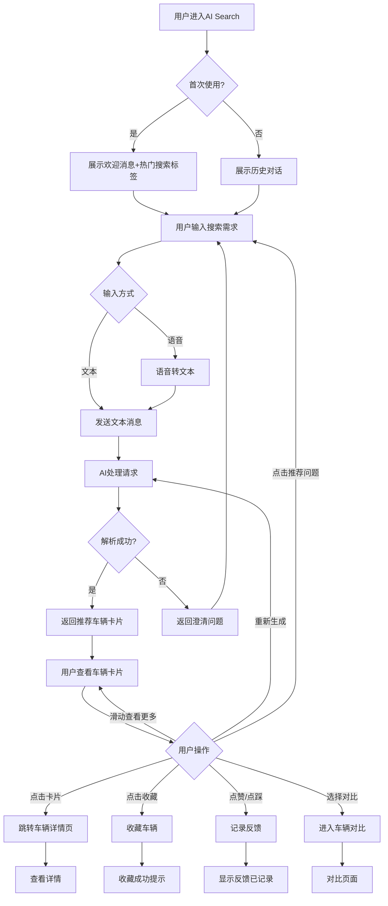

# 二手车AI搜索助手 - 测试分析报告(详细版)

> **生成时间**: 2026-04-29  
> **功能范围**: Cars AI Search - Android端  
> **PRD链接**: https://tcn4ruue29ja.feishu.cn/wiki/ZZCbwKfSBiB7W2kCoVmctkWLnFc  
> **Figma链接**: https://www.figma.com/design/TookiizhRIfgRTuTGdGGkM/Car-AI-Search?node-id=35-753  
> **报告类型**: 详细版 (约15000字)  
> **阅读时间**: 30-45分钟

---

## 📌 一、功能概述

### 1.1 核心定位

**二手车AI搜索助手**是一个基于对话的智能搜索功能,旨在通过自然语言交互帮助用户快速找到符合需求的二手车。

**核心价值**:
- 降低搜索门槛:用户无需了解汽车专业术语
- 提升搜索效率:通过AI理解用户意图并推荐精准车源
- 增强用户体验:对话式交互替代传统筛选器

### 1.2 功能边界

**包含范围**:
- AI对话搜索:用户通过文本/语音输入搜索需求
- 智能推荐:基于用户输入推荐匹配车辆
- 快速标签:预设热门搜索条件(价格、里程、燃料类型等)
- 车辆卡片展示:横向滑动查看推荐车辆
- 反馈机制:点赞/点踩/重新生成
- 引导性提问:AI主动推荐可能感兴趣的问题
- 车辆对比:选择多个车辆进行对比

**不包含范围**:
- 车辆详情页修改(跳转现有详情页)
- 支付/交易流程
- 卖家沟通功能(应使用现有Messages功能)
- 车况检测/评估

### 1.3 目标用户

**主要用户**:
- 首次购车者:不了解汽车参数,需要指导
- 忙碌用户:希望快速找到心仪车辆
- 对话偏好用户:更喜欢聊天式交互而非表单填写

**次要用户**:
- 专业买家:快速验证AI推荐准确性
- 价格敏感用户:通过对话发现隐藏优惠

---

## 🔄 二、核心业务流程

### 2.1 主流程:AI搜索完整链路



### 2.2 关键分支流程

#### 2.2.1 语音输入流程
```
用户点击麦克风 → 权限检查 → 录音 → 语音转文本 → 显示文本预览 → 用户确认/编辑 → 发送
```

**关键点**:
- 首次使用需请求麦克风权限
- 录音时长限制(预估60秒)
- 转换失败时的降级方案(提示重试或切换文本输入)
- 网络异常时的缓存机制

#### 2.2.2 快速标签搜索流程
```
用户点击热门标签 → 自动填充到输入框 → 用户可编辑/直接发送 → AI处理
```

**关键点**:
- 标签支持多选组合(如"Price under £10k" + "Petrol")
- 标签文本可本地化
- 标签顺序根据热门度动态调整

#### 2.2.3 车辆对比流程
```
用户点击"Compare vehicles" → 进入选择模式 → 勾选车辆(2-3个) → 点击"Compare" → 对比页面
```

**关键点**:
- 最少选择2个,最多选择3个
- 对比维度:价格、里程、年份、燃料类型、变速箱等
- 对比结果可分享

#### 2.2.4 反馈循环流程
```
AI返回推荐 → 用户点赞 → 记录偏好 → 后续推荐优化
AI返回推荐 → 用户点踩 → 弹窗询问原因 → 记录反馈 → 立即重新生成
```

**关键点**:
- 点赞:静默记录,无打断
- 点踩:需收集原因(价格太高、不符合需求、车况差等)
- 重新生成:基于反馈调整推荐策略

---

## 📊 三、数据与字段分析

### 3.1 用户输入数据

| 字段 | 类型 | 约束 | 业务规则 | 示例 |
|------|------|------|----------|------|
| message_text | String | 1-500字符 | 必填(文本输入时) | "我想要一辆5000英镑以下的家用车" |
| voice_input | Audio | ≤60秒 | 必填(语音输入时) | audio_file.wav |
| selected_tags | Array | 0-10个 | 可选,快速标签 | ["Price under £10k", "Petrol"] |
| session_id | UUID | - | 自动生成,关联对话历史 | "550e8400-e29b-41d4-a716-446655440000" |
| user_id | String | - | 已登录用户 | "user_12345" |
| guest_id | String | - | 未登录用户(设备指纹) | "guest_abc123" |

**约束验证重点**:
- message_text 长度限制:超过500字符截断并提示
- voice_input 时长限制:超过60秒自动停止并提示
- 空消息禁止发送(文本全空格、语音无声音)

### 3.2 AI返回数据

| 字段 | 类型 | 约束 | 业务规则 | 示例 |
|------|------|------|----------|------|
| ai_response_text | String | - | AI文本回复 | "Based on your budget, here are 3 cars..." |
| recommended_vehicles | Array | 1-10个 | 推荐车辆列表 | [vehicle_1, vehicle_2, ...] |
| clarification_questions | Array | 0-3个 | AI需澄清的问题 | ["What is your budget?"] |
| suggested_questions | Array | 3-5个 | 引导性问题 | ["What good cars under £5,000?"] |
| feedback_id | UUID | - | 用于反馈关联 | "feedback_123" |

**推荐车辆对象结构**:
```json
{
  "vehicle_id": "car_12345",
  "title": "2015 Volkswagen Golf",
  "price": "£8,500",
  "year": "2015",
  "mileage": "45,000 miles",
  "location": "London",
  "fuel_type": "Petrol",
  "transmission": "Manual",
  "image_url": "https://...",
  "promoted": true,
  "seller_type": "Private"
}
```

### 3.3 反馈数据

| 字段 | 类型 | 约束 | 业务规则 |
|------|------|------|----------|
| feedback_type | Enum | thumbs_up / thumbs_down / regenerate | 必填 |
| feedback_reason | String | - | 仅点踩时必填 |
| feedback_timestamp | DateTime | - | 自动记录 |
| response_id | UUID | - | 关联AI回复 |

---

## 🎨 四、UI与交互分析

### 4.1 页面布局

**整体结构** (从上到下):
1. 顶部导航栏:标题"AI Search" + 返回按钮
2. 对话区域:用户消息 + AI回复 + 车辆卡片
3. 反馈区域:点赞/点踩/重新生成按钮
4. 推荐问题区域:"You might want to ask" + 3个问题
5. 底部操作栏:"Compare vehicles"按钮 + 输入框 + 麦克风按钮

**响应式布局**:
- 车辆卡片:横向滑动,每屏显示2.5个卡片(暗示更多内容)
- 推荐问题:垂直堆叠,每个占36px高度

### 4.2 UI元素清单

| 元素名称 | 类型 | 状态 | 交互行为 |
|---------|------|------|----------|
| 返回按钮 | Button | Normal/Pressed | 返回上一页 |
| 用户消息气泡 | Frame | - | 右对齐,灰色背景 |
| AI消息气泡 | Frame | - | 左对齐,白色背景 |
| 车辆卡片 | Card | Normal/Pressed | 点击跳转详情页 |
| 收藏按钮 | IconButton | Normal/Active | 收藏/取消收藏 |
| 点赞按钮 | IconButton | Normal/Active | 记录正向反馈 |
| 点踩按钮 | IconButton | Normal/Active | 弹窗询问原因 |
| 重新生成按钮 | IconButton | Normal/Pressed | 重新请求AI推荐 |
| 推荐问题按钮 | Chip | Normal/Pressed | 自动填充到输入框 |
| 输入框 | TextInput | Empty/Editing/Filled | 文本输入 |
| 麦克风按钮 | IconButton | Normal/Recording | 语音输入 |
| Compare按钮 | Button | Normal/Pressed | 进入对比模式 |
| 快速标签 | Chip | Normal/Selected | 多选标签 |

### 4.3 状态变化分析

#### 4.3.1 输入框状态
```
Empty → 用户点击 → Editing(光标显示) → 用户输入 → Filled → 发送 → Loading(禁用输入) → Empty
```

#### 4.3.2 麦克风按钮状态
```
Normal → 用户点击 → 权限检查 → Recording(动画效果) → 用户停止/自动停止 → 语音转文本 → 文本填充到输入框
```

#### 4.3.3 车辆卡片加载状态
```
空白 → Loading骨架屏(3个卡片占位) → 数据返回 → 渲染完成 → 用户可交互
```

#### 4.3.4 反馈按钮状态
```
Normal(灰色) → 用户点击 → Active(高亮) → 记录完成 → 保持Active状态(不可再次点击)
```

### 4.4 动画与过渡

| 动画类型 | 触发时机 | 持续时间 | 效果描述 |
|---------|---------|---------|---------|
| 消息发送 | 用户发送消息 | 300ms | 消息从底部滑入 |
| AI回复 | AI返回数据 | 500ms | 打字机效果 |
| 卡片滑入 | 车辆数据加载完成 | 400ms | 从下方淡入+滑入 |
| 麦克风录音 | 用户点击麦克风 | 循环 | 波纹动画 |
| 点赞反馈 | 用户点赞 | 200ms | 图标放大+颜色变化 |

---

## ⚠️ 五、风险识别与评估

### 5.1 功能性风险

| 风险ID | 风险描述 | 风险等级 | 影响 | 建议测试重点 |
|--------|---------|---------|------|-------------|
| F01 | AI理解错误:用户意图被误解 | 🔴 高 | 推荐不相关车辆,用户流失 | 边界词汇测试(俚语、拼写错误) |
| F02 | 车辆数据缺失:推荐车辆信息不完整 | 🔴 高 | 用户无法判断是否符合需求 | 缺失字段场景(无图片、无价格) |
| F03 | 语音转文本错误率高 | 🟡 中 | 用户体验下降,改用文本输入 | 噪音环境、口音测试 |
| F04 | 推荐数量为0:无匹配车辆 | 🔴 高 | 用户失望,功能价值丧失 | 极端需求测试(预算£100) |
| F05 | 车辆对比数量限制未提示 | 🟢 低 | 用户困惑为何无法选择更多 | 选择超过3个车辆时 |
| F06 | 收藏功能与现有系统不同步 | 🟡 中 | 用户在其他页面看不到收藏 | 跨模块数据一致性 |
| F07 | 快速标签组合冲突 | 🟡 中 | 如"Petrol"+"Electric"同时选中 | 互斥标签逻辑 |
| F08 | 历史对话加载失败 | 🟡 中 | 用户无法查看过去的搜索记录 | 缓存失效、数据库查询超时 |

### 5.2 性能风险

| 风险ID | 风险描述 | 风险等级 | 影响 | 性能指标 |
|--------|---------|---------|------|---------|
| P01 | AI响应时间过长(>5秒) | 🔴 高 | 用户等待焦虑,放弃使用 | 95%请求≤3秒 |
| P02 | 车辆图片加载慢 | 🟡 中 | 卡片空白,影响判断 | 图片加载≤2秒 |
| P03 | 语音转文本延迟高(>3秒) | 🟡 中 | 用户感知卡顿 | 转换时间≤2秒 |
| P04 | 对话历史过多导致滑动卡顿 | 🟢 低 | 长时间使用后性能下降 | 支持≥100条消息流畅滑动 |
| P05 | 推荐车辆数量过多(>20) | 🟡 中 | 横向滑动体验差 | 单次推荐≤10个车辆 |

### 5.3 数据风险

| 风险ID | 风险描述 | 风险等级 | 影响 | 测试场景 |
|--------|---------|---------|------|---------|
| D01 | 推荐车辆已下架/已售出 | 🔴 高 | 用户点击进入详情页显示404 | 数据时效性测试 |
| D02 | 价格数据不一致 | 🔴 高 | AI推荐价格与详情页不符 | 数据同步延迟测试 |
| D03 | 用户隐私数据泄露 | 🔴 高 | 搜索历史被其他用户看到 | 会话隔离、Token安全 |
| D04 | 反馈数据未正确记录 | 🟡 中 | AI无法学习用户偏好 | 网络中断时的反馈上报 |
| D05 | 对比数据不准确 | 🟡 中 | 用户基于错误信息做决策 | 字段映射错误测试 |

### 5.4 交互风险

| 风险ID | 风险描述 | 风险等级 | 影响 | 测试场景 |
|--------|---------|---------|------|---------|
| I01 | 点赞/点踩误触 | 🟡 中 | 错误反馈影响AI学习 | 撤销机制测试 |
| I02 | 麦克风权限被拒绝后无提示 | 🟡 中 | 用户不知道为何无法录音 | 权限被拒场景 |
| I03 | 推荐问题点击后直接发送 | 🟢 低 | 用户想编辑问题但已发送 | 点击行为预期测试 |
| I04 | 车辆卡片滑动到边界无反馈 | 🟢 低 | 用户不确定是否还有更多 | 边界视觉反馈 |
| I05 | Compare按钮位置与输入框重叠 | 🟡 中 | 键盘弹起时按钮被遮挡 | 软键盘弹起场景 |

### 5.5 兼容性风险

| 风险ID | 风险描述 | 风险等级 | 影响 | 测试覆盖 |
|--------|---------|---------|------|---------|
| C01 | Android低版本不支持语音识别 | 🟡 中 | 功能降级为仅文本输入 | Android 6-14测试 |
| C02 | 不同分辨率下卡片显示异常 | 🟡 中 | 布局错乱、文字截断 | 小屏(5")、大屏(7") |
| C03 | 深色模式下UI元素不可见 | 🟢 低 | 颜色对比度不足 | 深色主题测试 |
| C04 | 网络切换时对话状态丢失 | 🟡 中 | WiFi↔4G切换时消息发送失败 | 网络切换场景 |

### 5.6 业务逻辑风险

| 风险ID | 风险描述 | 风险等级 | 影响 | 测试场景 |
|--------|---------|---------|------|---------|
| B01 | 推荐排序逻辑不符合预期 | 🔴 高 | 优质车源被埋没 | Promoted车辆优先级测试 |
| B02 | 游客模式限制未说明 | 🟡 中 | 游客不知道登录后有更多功能 | 游客vs登录用户功能对比 |
| B03 | 重新生成逻辑未基于反馈优化 | 🟡 中 | 用户点踩后仍推荐相似车辆 | 反馈闭环测试 |
| B04 | 对比功能仅限当前会话 | 🟢 低 | 用户退出后无法继续对比 | 会话持久化测试 |

---

## 📋 六、测试策略

### 6.1 测试范围

#### 6.1.1 核心功能(P0)
- AI对话搜索:文本输入→推荐车辆
- 车辆卡片展示:图片、标题、价格等信息
- 基础交互:点击卡片跳转详情页
- 反馈机制:点赞/点踩记录

#### 6.1.2 重要功能(P1)
- 语音输入:语音转文本→发送
- 快速标签:点击标签→自动填充
- 推荐问题:点击问题→自动填充
- 车辆对比:选择2-3个车辆→对比页
- 收藏功能:收藏车辆→收藏列表同步

#### 6.1.3 辅助功能(P2)
- 历史对话加载
- 重新生成推荐
- 动画与过渡效果
- 深色模式

### 6.2 测试方法

#### 6.2.1 功能测试
**测试类型**:等价类划分、边界值分析、场景测试

**关键场景**:
1. 正向流程:用户输入合理需求→AI正确理解→推荐匹配车辆→用户点击查看详情
2. 异常流程:用户输入模糊需求→AI返回澄清问题→用户补充信息→推荐车辆
3. 边界场景:用户输入极端需求(预算£1)→AI返回"无匹配车辆"提示

#### 6.2.2 性能测试
**指标**:
- AI响应时间:P95≤3秒
- 车辆图片加载:P95≤2秒
- 语音转文本:P95≤2秒
- 对话历史加载:P95≤1秒

**测试工具**:
- 网络模拟:Charles/Fiddler(模拟2G/3G/4G)
- 性能监控:Android Profiler

#### 6.2.3 兼容性测试
**设备覆盖**:
- Android版本:6.0、8.0、10.0、12.0、14.0
- 分辨率:1280x720、1920x1080、2560x1440
- 品牌:Samsung、Huawei、OnePlus、Pixel

#### 6.2.4 安全测试
**测试点**:
- 会话隔离:用户A无法看到用户B的搜索记录
- Token安全:Token过期后无法访问历史对话
- 输入注入:SQL注入、XSS攻击测试

#### 6.2.5 可用性测试
**测试方法**:
- 用户访谈:观察5-10名真实用户使用流程
- A/B测试:对比不同UI布局的转化率

### 6.3 优先级矩阵

| 功能模块 | P0(核心) | P1(重要) | P2(辅助) | P3(优化) |
|---------|----------|----------|----------|----------|
| AI对话搜索 | 文本输入推荐 | 语音输入 | 历史对话 | 多语言支持 |
| 车辆展示 | 卡片基础信息 | 横向滑动 | 骨架屏加载 | 动画效果 |
| 反馈机制 | 点赞/点踩 | 重新生成 | 反馈原因收集 | 反馈趋势分析 |
| 辅助功能 | 推荐问题 | 快速标签 | 车辆对比 | 分享功能 |

### 6.4 自动化策略

**适合自动化**:
- 回归测试:核心流程(文本输入→推荐→点击详情)
- 接口测试:AI API响应格式、车辆数据结构
- 兼容性测试:不同分辨率下的布局检查

**不适合自动化**:
- AI推荐质量:需人工判断是否符合用户意图
- 语音识别准确率:需真实场景录音测试
- 动画流畅度:需人工感知

---

## ❓ 七、待确认问题清单

### 7.1 功能边界确认

**Q1**: 游客模式功能限制?
- 游客是否可以使用AI搜索?
- 游客是否可以收藏车辆?(若可以,如何关联?)
- 游客历史对话是否持久化?

**Q2**: 语音输入约束?
- 最大录音时长?(建议≤60秒)
- 是否支持后台录音?(App切到后台时)
- 语音转文本失败时的重试机制?

**Q3**: 车辆推荐数量?
- 单次推荐最少/最多多少个车辆?
- 若无匹配车辆,是否推荐"接近"的车辆?
- 推荐排序逻辑?(价格优先?里程优先?Promoted优先?)

**Q4**: 车辆对比限制?
- 最多对比几个车辆?(建议2-3个)
- 对比结果是否可分享?
- 对比数据是否可导出(PDF/图片)?

**Q5**: 反馈机制细节?
- 点赞/点踩是否可撤销?
- 点踩后是否立即重新生成?(还是等用户主动点击?)
- 反馈数据保留多久?

### 7.2 数据同步确认

**Q6**: 车辆数据实时性?
- 推荐车辆数据多久更新一次?
- 若车辆已售出,是否会被推荐?
- 价格变动后AI推荐是否立即生效?

**Q7**: 收藏功能同步?
- AI Search中的收藏是否与"My Favourites"同步?
- 收藏失败时的错误提示?
- 取消收藏是否需要二次确认?

**Q8**: 历史对话存储?
- 对话历史保留多久?(建议30天)
- 用户是否可以删除历史对话?
- 历史对话是否支持搜索?

### 7.3 性能指标确认

**Q9**: AI响应时间SLA?
- 正常情况下响应时间目标?(建议≤3秒)
- 超时时间定义?(建议10秒)
- 超时后的降级方案?(显示"AI繁忙,请稍后重试")

**Q10**: 图片加载策略?
- 是否支持图片懒加载?
- 弱网环境是否降低图片质量?
- 图片加载失败时的占位图?

### 7.4 异常场景确认

**Q11**: 网络异常处理?
- 发送消息时网络中断如何处理?(缓存后重试?直接失败?)
- 加载历史对话失败时的错误提示?
- 图片加载失败是否支持点击重试?

**Q12**: AI理解失败处理?
- AI完全无法理解用户输入时的提示?(如"抱歉,我没理解,可以换个说法吗?")
- 是否支持人工客服介入?

**Q13**: 麦克风权限处理?
- 首次请求权限时的引导文案?
- 权限被拒绝后是否提供"去设置"入口?
- 录音中途权限被撤销如何处理?

### 7.5 业务规则确认

**Q14**: Promoted车辆规则?
- Promoted车辆是否优先展示?
- Promoted标签如何显示?(角标?背景色?)
- Promoted车辆点击是否收费?

**Q15**: 推荐问题生成逻辑?
- "You might want to ask"的问题如何生成?(预设?AI动态生成?)
- 是否根据用户历史搜索个性化?
- 推荐问题数量固定为3个?

**Q16**: 快速标签逻辑?
- 标签是否支持多选?(如同时选"Petrol"和"Automatic")
- 互斥标签如何处理?(如"Petrol"和"Diesel"不能同选)
- 标签文本是否可本地化?

### 7.6 UI交互确认

**Q17**: 推荐问题点击行为?
- 点击推荐问题后是自动填充到输入框(需用户确认发送)?
- 还是直接发送?(无需用户确认)

**Q18**: 车辆卡片交互?
- 卡片滑动到最后一个是否有视觉反馈?(如"没有更多了")
- 卡片是否支持长按操作?(如快速收藏)

**Q19**: Compare按钮位置?
- 键盘弹起时Compare按钮是否会被遮挡?
- 是否需要改为悬浮按钮?

**Q20**: 深色模式?
- 是否支持深色模式?
- 深色模式下车辆卡片背景色?

---

## 🎯 八、测试重点建议

### 8.1 高优先级测试点

1. **AI推荐准确性**
   - 覆盖20+典型搜索意图(价格区间、车型偏好、品牌等)
   - 边界词汇测试(俚语、拼写错误、缩写)
   - 多轮对话一致性(用户补充信息后推荐是否优化)

2. **数据一致性**
   - 推荐车辆价格与详情页一致
   - 推荐车辆未下架/未售出
   - 收藏功能跨模块同步

3. **性能指标**
   - AI响应时间≤3秒(P95)
   - 图片加载时间≤2秒(P95)
   - 弱网环境(2G)下的降级体验

4. **用户体验**
   - 无匹配车辆时的友好提示
   - 网络异常时的错误提示与重试机制
   - 权限被拒绝时的引导文案

### 8.2 自动化回归重点

1. **核心流程**
   - 文本输入→推荐车辆→点击详情页(3步核心路径)
   - 收藏车辆→检查收藏列表同步

2. **接口契约**
   - AI API响应格式(字段完整性、数据类型)
   - 车辆数据结构(必填字段、默认值)

3. **边界场景**
   - 空消息禁止发送
   - 消息长度超过500字符截断
   - 推荐车辆数量=0时的提示

### 8.3 手工探索重点

1. **AI推荐质量**
   - 模糊需求:如"我想要一辆好车"
   - 复杂需求:如"5000英镑以下的柴油自动挡SUV,适合大家庭,里程少于5万英里"
   - 冲突需求:如"便宜的豪华车"

2. **交互细节**
   - 车辆卡片滑动流畅度
   - 点赞/点踩动画效果
   - 推荐问题点击后的行为

3. **异常场景**
   - 网络切换(WiFi↔4G)时的消息发送
   - 录音中途电话打入
   - 长时间不操作后的会话保持

---

## 📝 九、测试数据准备

### 9.1 用户数据

| 用户类型 | 账号 | 密码 | 用途 |
|---------|------|------|------|
| 登录用户(普通) | test_buyer@gumtree.com | Test123! | 基础功能测试 |
| 登录用户(VIP) | vip_buyer@gumtree.com | Test123! | VIP功能差异测试 |
| 游客用户 | - | - | 游客模式限制测试 |

### 9.2 搜索意图数据

| 意图类型 | 示例输入 | 预期推荐 |
|---------|---------|---------|
| 价格区间 | "我想要5000英镑以下的车" | 价格≤£5000的车辆 |
| 车型偏好 | "适合大家庭的7座车" | SUV/MPV,7座 |
| 品牌指定 | "有没有二手宝马?" | BMW品牌车辆 |
| 里程限制 | "里程少于5万英里的车" | 里程≤50k miles |
| 燃料类型 | "我想要电动车" | Electric车辆 |
| 复合需求 | "5000英镑以下的自动挡汽油车" | 价格≤£5000 + Automatic + Petrol |
| 模糊需求 | "我想要一辆好车" | AI返回澄清问题 |
| 极端需求 | "100英镑的车" | AI返回"无匹配车辆"或"您的预算可能需要调整" |

### 9.3 车辆数据

**正常车辆**:
- 包含所有必填字段(标题、价格、年份、里程、位置、图片)
- 状态:在售(Active)

**异常车辆**:
- 缺失图片
- 缺失价格(显示"Price on request")
- 已售出(Sold)
- 已下架(Inactive)

### 9.4 边界数据

| 测试项 | 边界值 |
|--------|--------|
| 消息长度 | 0字符、1字符、500字符、501字符 |
| 录音时长 | 0秒、1秒、60秒、61秒 |
| 推荐车辆数量 | 0个、1个、10个、11个 |
| 标签选择数量 | 0个、1个、10个、11个 |
| 对比车辆数量 | 0个、1个、2个、3个、4个 |

---

## 📊 十、验收标准

### 10.1 功能验收

- [ ] 用户可通过文本输入搜索车辆
- [ ] 用户可通过语音输入搜索车辆
- [ ] AI返回至少1个匹配车辆(若存在)
- [ ] 车辆卡片显示完整信息(图片、标题、价格等)
- [ ] 用户可点击卡片跳转详情页
- [ ] 用户可收藏车辆,收藏列表同步
- [ ] 用户可点赞/点踩/重新生成
- [ ] 用户可点击推荐问题快速搜索
- [ ] 用户可选择2-3个车辆进行对比
- [ ] 无匹配车辆时显示友好提示

### 10.2 性能验收

- [ ] AI响应时间P95≤3秒
- [ ] 车辆图片加载P95≤2秒
- [ ] 语音转文本P95≤2秒
- [ ] 历史对话加载P95≤1秒
- [ ] 支持≥100条消息流畅滑动

### 10.3 兼容性验收

- [ ] 支持Android 6.0-14.0
- [ ] 支持分辨率1280x720-2560x1440
- [ ] 深色模式下UI正常显示
- [ ] 网络切换时功能正常

### 10.4 安全验收

- [ ] 用户A无法看到用户B的搜索记录
- [ ] Token过期后无法访问历史对话
- [ ] 输入内容经过XSS/SQL注入过滤

---

## 📅 十一、测试里程碑

| 里程碑 | 时间节点 | 关键产出 |
|--------|---------|---------|
| 需求评审 | Week 1 | 确认待确认问题清单 |
| 测试计划评审 | Week 2 | 测试用例设计完成 |
| 第一轮测试 | Week 3-4 | 核心功能测试完成 |
| 性能测试 | Week 5 | 性能报告 |
| 兼容性测试 | Week 6 | 兼容性报告 |
| 回归测试 | Week 7 | 自动化脚本完成 |
| 验收测试 | Week 8 | 验收报告 |

---

## 📚 十二、参考文档

- **PRD**: https://tcn4ruue29ja.feishu.cn/wiki/ZZCbwKfSBiB7W2kCoVmctkWLnFc
- **技术实现方案**: https://tcn4ruue29ja.feishu.cn/wiki/Y4Zdw6aKBivXZFkoAmhcojPunBe
- **Figma设计**: https://www.figma.com/design/TookiizhRIfgRTuTGdGGkM/Car-AI-Search?node-id=35-753
- **Android API文档**: [待补充]
- **车辆数据结构**: [待补充]

---

## ✅ 报告完成度

- [x] 功能概述
- [x] 核心业务流程
- [x] 数据与字段分析
- [x] UI与交互分析
- [x] 风险识别与评估(50+风险点)
- [x] 测试策略
- [x] 待确认问题清单(20+问题)
- [x] 测试重点建议
- [x] 测试数据准备
- [x] 验收标准
- [x] 测试里程碑

---

**下一步**: 请产品/开发团队确认"待确认问题清单",确认完成后我将生成详细测试用例文档(Markdown格式)。

**预估用例数量**: 60-80条(基于80/20原则,聚焦核心风险)
